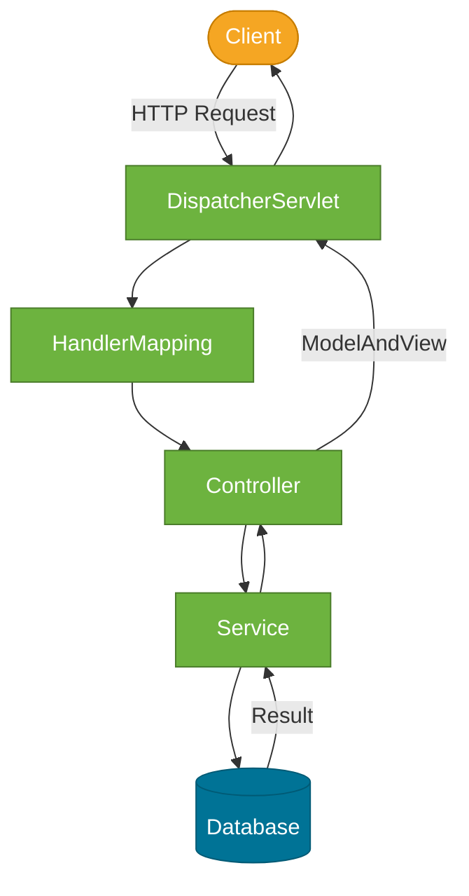
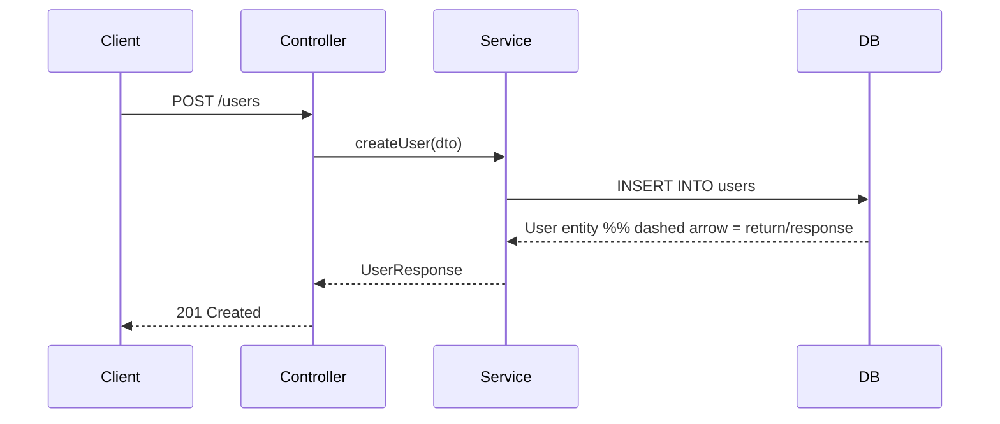

# Diagram & Visual Guidelines

Every diagram must make an abstract concept tangible. Every diagram needs a caption.

---

## Choosing the Right Diagram Type

| Use Case | Diagram Type |
|----------|-------------|
| Multi-step process or pipeline | Mermaid `flowchart TD` (top-down) |
| Component interaction / architecture | Mermaid `flowchart LR` (left-right) |
| Sequence of calls between objects/systems | Mermaid `sequenceDiagram` |
| Class hierarchy or inheritance | Mermaid `classDiagram` |
| State transitions (e.g., Thread lifecycle) | Mermaid `stateDiagram-v2` |
| Timeline / version history | Mermaid `timeline` |
| Memory layout, bit patterns, complex spatial layout | SVG |
| Conceptual mental model with annotations | SVG or Excalidraw-style |

---

## Mermaid Conventions

### Node Shapes

| Syntax | Shape | Use for |
|--------|-------|---------|
| `[text]` | Rectangle | Process step, component |
| `([text])` | Rounded rectangle | Start / end of a flow |
| `{text}` | Diamond | Decision / branch |
| `((text))` | Circle | Event, trigger, actor |
| `[[text]]` | Subroutine | Subprocess, method call |
| `>text]` | Flag / asymmetric | Note, annotation |
| `[(text)]` | Cylinder | Database, storage |

### Color Palette (use `classDef`)

Apply consistent colors so diagrams look cohesive across notes:

```mermaid
classDef springClass fill:#6db33f,color:#fff,stroke:#4a7c2a
classDef jvmClass   fill:#007396,color:#fff,stroke:#005a75
classDef userClass  fill:#f5a623,color:#fff,stroke:#c77d00
classDef errorClass fill:#e74c3c,color:#fff,stroke:#c0392b
classDef grayClass  fill:#95a5a6,color:#fff,stroke:#7f8c8d
```

- **Green** (`springClass`): Spring/application layer components
- **Blue** (`jvmClass`): JVM, runtime, infrastructure components
- **Orange** (`userClass`): External actor, client, user input
- **Red** (`errorClass`): Error path, exception, failure state
- **Gray** (`grayClass`): Neutral / secondary components

### Flowchart Example



### Sequence Diagram Conventions



Arrow types:
- `->>`: Solid arrow — request or invocation
- `-->>`: Dashed arrow — response or return value
- `-x`: Solid with X — async fire-and-forget or failure

---

## Captioning Rules

Always add a caption immediately after the closing fence:

```markdown
```mermaid
flowchart LR ...
```

*Caption: what the diagram shows — and its key takeaway for the reader.*
```

Caption format: `*<What it shows> — <key takeaway of the visual>.*`

Place the diagram **within the relevant section** (usually `## How It Works`), not at the end of the note.

---

## Breaking Down Complex Diagrams

If a concept needs more than ~12 nodes, split it into two diagrams that build on each other:

1. **Diagram 1**: High-level overview (zoom out)
2. **Diagram 2**: Zoom in on the most important path or component

Label them with a brief header:

```markdown
### Overview

```mermaid ...```

### Detail: Request Processing

```mermaid ...```
```

---

## When to Use SVG Instead of Mermaid

Use SVG when:
- The layout requires precise spatial control (JVM memory model, call stack, bit layouts)
- You need Font Awesome icons to represent component types
- Mermaid's node/edge constraints make the diagram cluttered or unclear

### SVG Guidelines

- Use Font Awesome icons: `fas fa-server`, `fas fa-database`, `fas fa-lock`, `fas fa-cogs`
- Keep SVG width ≤ 700px for mobile compatibility
- Add `aria-label` on the `<svg>` element for accessibility
- Store as inline `<svg>` in the markdown file, or as a file in `static/img/<domain>/`
- Always include a text caption below the SVG (same format as Mermaid captions)

---

## Diagram Don'ts

- Do NOT place diagrams at the very end of a note — embed them in the relevant section
- Do NOT create a diagram without a caption
- Do NOT use external rendering tools (Visio, Lucidchart, Miro) — only Mermaid/SVG
- Do NOT create a single massive diagram — break into 2–3 smaller ones
- Do NOT use color as the only differentiator — also use shape or label differences for accessibility

---

## Common Mermaid mistakes & fixes

When writing Mermaid blocks authors occasionally hit parser errors caused by unescaped special characters or chained arrows. Add these quick fixes to the guidelines and follow them in examples:

- Problem: labels containing parentheses, angle brackets, slashes, commas, or colons break the parser.
  - Fix: wrap node labels in double quotes. Example:

  Before:
  ```mermaid
  flowchart LR
    A[SocketChannel] --> B[ByteBuffer]
    B --> C[flip()] --> D[write to channel]
  ```

  After (fix):
  ```mermaid
  flowchart LR
    A["SocketChannel"] --> B["ByteBuffer"]
    B --> C["flip()"]
    C --> D["write to channel"]
  ```

- Problem: chaining arrows on a single line (e.g., `B --> C --> D`) can confuse the parser or create ambiguous node text.
  - Fix: split into separate statements as shown above.

- Problem: complex inline messages in `sequenceDiagram` that include arrow-like text or multiple actions on one line cause parse errors.
  - Fix: split the step into multiple simple lines and avoid embedding `->`/`->>` text in the message. Example:

  Before:
  ```mermaid
  sequenceDiagram
    Sel->>S: selectedKeys -> accept -> configureNonBlocking
  ```

  After (fix):
  ```mermaid
  sequenceDiagram
    Sel->>S: selectedKeys
    S->>S: accept() / configureNonBlocking()
  ```

- Problem: unescaped angle brackets like `<` or `>` inside labels (e.g., `Stream<String>`) break YAML/mermaid mix.
  - Fix: quote the label or replace angle brackets with a readable form: `"Stream<String> lines"` or `Stream&lt;String&gt; lines`.

These changes prevent common YAML/mermaid parser errors and make diagrams robust across the docs site. If a diagram still fails after these edits, run a local quick render with a Mermaid linter or paste the block into the Docusaurus dev server page to inspect build logs.
