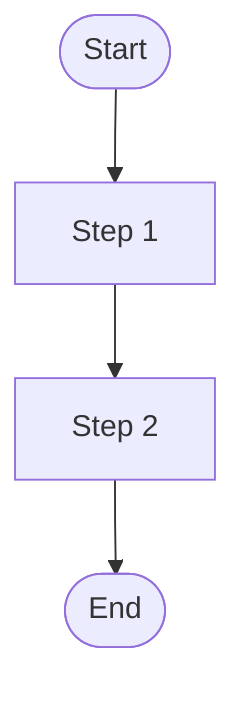

# Note Template

Use this as the base structure for every new topic note. Replace every `<placeholder>` with real content. Remove the HTML comments before saving.

```markdown
---
id: <kebab-case-id>
title: <Human-Readable Title>
description: <One sentence for search results and the overview page.>
sidebar_position: <integer>
tags:
  - java
  - <framework-tag>          # spring-boot | spring-framework | jvm | etc. — optional
  - <difficulty>             # beginner | intermediate | advanced — pick exactly one
  - <note-type>              # concept | tool | pattern | config — pick exactly one
  - <topic-tag-1>            # 2–4 specific topic tags
  - <topic-tag-2>
last_updated: YYYY-MM-DD
sources:
  - https://...
---

# <Title>

> <One-sentence tagline — the elevator pitch for this concept.>

## What Problem Does It Solve?

<!-- 2–4 sentences. Describe the concrete developer pain point that existed BEFORE this concept. Start from frustration. -->

## What Is It?

<!-- Clear definition in plain language. Use an analogy if the concept is abstract. -->

<!-- Optional Analogy section: -->
<!-- ## Analogy
Think of X like [...]. Just as [...], Y [...]. -->

## How It Works

<!-- Step-by-step explanation. Number the steps for processes. Always include at least one Mermaid diagram. -->



<!-- Caption: *diagram description — key takeaway.* -->

## Code Examples

<!-- Self-contained, runnable snippets. Show minimal Spring Boot setup if needed. -->
<!-- Annotate non-obvious lines with: someCall(); // ← explains why -->

```java
// Example: <what this shows>
public class Example {
    // ...
}
```

## Best Practices

<!-- Actionable do/don't bullets. -->

- **Do**: ...
- **Do**: ...
- **Don't**: ...
- **Don't**: ...

<!-- Alternative: Trade-offs section for tools/patterns with significant trade-offs: -->
<!-- ## Trade-offs & When To Use / Avoid
| | Pros | Cons |
|--|------|------|
| Use when | ... | ... | -->

## Common Pitfalls

<!-- What developers frequently get wrong, especially after a gap. -->

- **Pitfall 1**: ...
- **Pitfall 2**: ...

## Interview Questions

### Beginner

**Q:** What is `<topic>`?
**A:** ...

**Q:** When would you use `<topic>`?
**A:** ...

### Intermediate

**Q:** How does `<topic>` work internally?
**A:** ...

**Q:** What is the difference between `<topic>` and `<related topic>`?
**A:** ...

### Advanced

**Q:** How does `<topic>` behave under concurrent access?
**A:** ...

**Follow-up:** ...
**A:** ...

## Further Reading

- [Title](URL) — one-line description

## Related Notes

- [Note Title](../domain/note-id.md) — explain why this note is related
- [Note Title](../domain/note-id.md) — explain why
```
