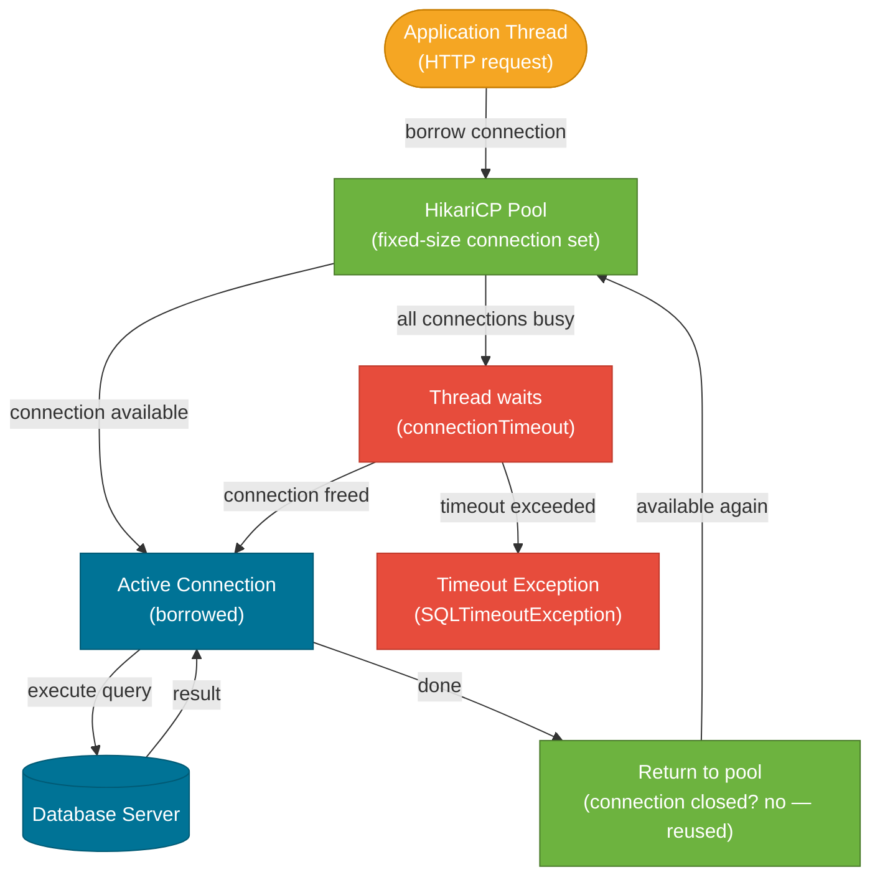
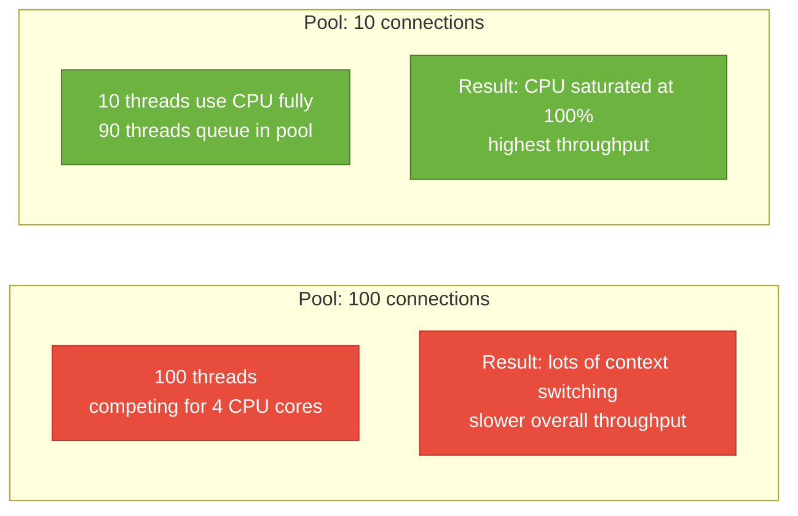

# Connection Pooling & HikariCP

> A connection pool maintains a set of ready-to-use database connections so that application threads don't pay the expensive setup cost of a new TCP connection and authentication handshake on every request.

## What Problem Does It Solve?

Establishing a database connection is not free. It involves:
1. A **TCP three-way handshake** to the database server
2. **TLS negotiation** if encryption is enabled
3. **Authentication** (username, password, OAuth token)
4. **Session setup** — allocating memory on the database server for the connection

This process typically takes **5–50 ms**. In a web application serving 500 requests per second, creating a new connection per request would spend all its time just connecting, leaving no time for actual queries.

A connection pool solves this by creating connections **once at startup** and reusing them across requests. Requests borrow a connection, run their queries, and return it to the pool — all in microseconds.

## HikariCP

HikariCP ("Hikari" = light in Japanese) is Spring Boot's **default connection pool** since Spring Boot 2.0. It is consistently the fastest JVM connection pool in benchmarks, with a minimal codebase (~130 KB jar) and zero external dependencies.

Spring Boot auto-configures HikariCP when `spring-boot-starter-data-jpa` or `spring-boot-starter-jdbc` is on the classpath and the `HikariCP` library is available (it is, transitively).

## How It Works



*Caption: HikariCP lifecycle — threads borrow connections, execute queries, then return the connection to the pool where it is kept alive and reused. If all connections are busy, the thread waits up to `connectionTimeout` ms before failing.*

### Connection Validation

HikariCP validates connections before handing them to application code. If the underlying TCP connection has been silently dropped by the database or a firewall, HikariCP detects this and replaces the stale connection transparently. It uses:

- **Connection test query** — a lightweight SQL query (e.g., `SELECT 1`) if `connectionTestQuery` is configured
- **JDBC `isValid()`** — the preferred method; faster and doesn't require a round trip in modern drivers

## Configuration in Spring Boot

### The Essential Properties

```yaml
# application.yml
spring:
  datasource:
    url: jdbc:postgresql://localhost:5432/mydb
    username: myuser
    password: ${DB_PASSWORD}          # ← inject from environment variable, never hardcode
    driver-class-name: org.postgresql.Driver

    hikari:
      # Pool size
      maximum-pool-size: 10           # ← max number of connections in the pool
      minimum-idle: 5                 # ← min idle connections to maintain
      
      # Timeouts
      connection-timeout: 30000       # ← max ms to wait for a connection (30s)
      idle-timeout: 600000            # ← ms before an idle connection is evicted (10min)
      max-lifetime: 1800000           # ← max connection lifetime in pool (30min)
      
      # Diagnostics
      pool-name: MyApp-HikariPool     # ← visible in JMX/metrics
      
      # Validation
      connection-test-query: SELECT 1 # ← only needed if driver doesn't support isValid()
      keepalive-time: 60000           # ← send keepalive every 60s on idle connections
```

:::tip Never hardcode database passwords
Use environment variables (`${DB_PASSWORD}`), Spring Cloud Config, HashiCorp Vault, or Kubernetes Secrets. Hardcoded credentials in `application.yml` committed to source control is a critical security vulnerability.
:::

### Programmatic Configuration

```java
@Configuration
public class DataSourceConfig {

    @Bean
    @ConfigurationProperties("spring.datasource.hikari")
    public HikariConfig hikariConfig() {
        return new HikariConfig();    // ← values bound from spring.datasource.hikari.*
    }

    @Bean
    public DataSource dataSource(HikariConfig config) {
        return new HikariDataSource(config);
    }
}
```

### Multiple DataSources

```java
@Configuration
public class MultiDataSourceConfig {

    @Primary
    @Bean(name = "primaryDataSource")
    @ConfigurationProperties("spring.datasource.primary.hikari")
    public DataSource primaryDataSource() {
        return DataSourceBuilder.create().type(HikariDataSource.class).build();
    }

    @Bean(name = "readReplicaDataSource")
    @ConfigurationProperties("spring.datasource.read-replica.hikari")
    public DataSource readReplicaDataSource() {
        return DataSourceBuilder.create().type(HikariDataSource.class).build();
    }
}
```

## Choosing the Right Pool Size

The most common mistake is setting `maximum-pool-size` too large. This is counter-intuitive — more connections is not always better.

**The formula (from HikariCP's own wiki):**
```
pool size = Tn × Cm
```

Where:
- `Tn` = number of concurrent threads that will execute SQL
- `Cm` = a small multiplier for pipeline depth (usually 1–2)

**For a typical app running on 4 CPU cores:**
```
pool size = (core_count × 2) + effective_spindle_count
         = (4 × 2) + 1  = 9  (round to 10)
```

**Why not just set it to 100?**

The database server has limited CPU cores. If 100 threads are all running queries simultaneously, they compete for CPU and context-switch, which is slower than 10 threads finishing quickly and the next batch starting. A smaller pool with waiting threads actually has **higher throughput** than a larger pool with competing threads.



*Caption: Counter-intuitively, a smaller connection pool often has better throughput than a large one — too many concurrent connections cause database-side CPU contention.*

## Monitoring with Actuator

Spring Boot Actuator exposes HikariCP metrics through Micrometer:

```yaml
management:
  endpoints:
    web:
      exposure:
        include: health, metrics
  metrics:
    tags:
      application: my-app
```

Key metrics to monitor:
```
hikaricp_connections_active    # currently in-use connections
hikaricp_connections_idle      # waiting in pool
hikaricp_connections_pending   # threads waiting to acquire a connection
hikaricp_connections_timeout_total  # ⚠ requests that timed out waiting for a connection
hikaricp_connections_acquire_seconds_max  # slowest connection acquisition time
```

A rising `hikaricp_connections_pending` or `hikaricp_connections_timeout_total` signals that the pool is too small for the current load.

```java
// You can also inspect pool stats programmatically
@Autowired
private DataSource dataSource;

public String poolStats() {
    HikariPoolMXBean pool = ((HikariDataSource) dataSource).getHikariPoolMXBean();
    return String.format("Active: %d, Idle: %d, Waiting: %d, Total: %d",
        pool.getActiveConnections(),
        pool.getIdleConnections(),
        pool.getThreadsAwaitingConnection(),
        pool.getTotalConnections()
    );
}
```

## Trade-offs & When To Use / Avoid

| | Pros | Cons |
|--|------|------|
| **HikariCP (default)** | Fastest, minimal overhead, auto-configured by Spring Boot | Less configuration options than older pools (no statement cache) |
| **Large pool size** | Fewer wait times for threads | Database-side contention; may exhaust `max_connections` on DB server |
| **Small pool size** | Better per-query throughput; less DB load | Threads queue for connections under burst load |
| **`minimum-idle = 0`** | No idle connections at rest (saves DB resources) | Burst load triggers connection creation latency |

## Common Pitfalls

**1. Connection leak — not returning connections**

```java
// WRONG: if an exception occurs, the connection is never returned
Connection conn = dataSource.getConnection();
PreparedStatement ps = conn.prepareStatement("SELECT ...");
ResultSet rs = ps.executeQuery();
// ... exception thrown before close() ...

// CORRECT: always use try-with-resources
try (Connection conn = dataSource.getConnection();
     PreparedStatement ps = conn.prepareStatement("SELECT ...");
     ResultSet rs = ps.executeQuery()) {
    // process rs
}  // ← auto-closes in reverse order
```

HikariCP has a `leakDetectionThreshold` property — connections not returned within the threshold are logged as leaks:
```yaml
hikari:
  leak-detection-threshold: 2000  # ← log connections held > 2 seconds (for dev/testing)
```

**2. Pool exhaustion from long-running transactions**

A transaction holds a connection for its entire duration. If many transactions run for seconds (e.g., calling an external API inside `@Transactional`), the pool exhausts quickly.

```java
// WRONG: HTTP call inside transaction holds connection for the entire duration
@Transactional
public void processOrder(Long orderId) {
    Order order = orderRepo.findById(orderId).get();
    externalPaymentApi.charge(order);   // ← might take 3s — holds DB connection!
    order.setStatus("PAID");
}

// CORRECT: do the external call before or after the transaction
public void processOrder(Long orderId) {
    PaymentResult result = externalPaymentApi.charge(orderId);   // ← outside transaction
    savePaymentResult(orderId, result);  // ← short transaction for just the DB write
}

@Transactional
private void savePaymentResult(Long orderId, PaymentResult result) { ... }
```

**3. Setting maximum-pool-size too large**

If your app has `maximum-pool-size = 100` and your PostgreSQL server has `max_connections = 100`, and you deploy 5 instances, you'll need 500 connections but the database only allows 100. Use a PgBouncer or similar connection pooler at the database tier when running many app instances.

**4. Ignoring `max-lifetime`**

Database firewalls and AWS RDS often close idle connections after a few minutes without warning. Set `max-lifetime` below the firewall timeout (e.g., `max-lifetime: 1800000` = 30 minutes for typical DB timeouts of ~60 minutes) to ensure HikariCP proactively replaces connections before they go stale.

## Interview Questions

### Beginner

**Q: What is connection pooling and why is it important?**  
**A:** Connection pooling maintains a set of pre-established database connections that application threads reuse instead of creating a new connection for every request. Creating a connection involves TCP setup, TLS handshake, and authentication — typically 5–50 ms — which is prohibitive at high request rates. Pooling amortizes this cost so each request gets a connection in microseconds.

**Q: What is Spring Boot's default connection pool?**  
**A:** HikariCP, since Spring Boot 2.0. It's auto-configured when you add `spring-boot-starter-data-jpa` or `spring-boot-starter-jdbc`. You configure it via `spring.datasource.hikari.*` properties in `application.yml`.

### Intermediate

**Q: How do you choose the right `maximum-pool-size`?**  
**A:** The HikariCP wiki formula is: `pool_size = (core_count × 2) + effective_spindle_count`. For most apps on a 4-core machine with SSD storage, a pool of 9–10 is optimal. Setting it too large causes database-side CPU contention — multiple threads compete for limited database cores, increasing context switching and reducing throughput compared to a smaller pool with queuing.

**Q: What happens when all connections in the pool are busy?**  
**A:** The requesting thread blocks and waits for up to `connectionTimeout` milliseconds (default 30 seconds). If a connection is not returned within that time, HikariCP throws a `SQLTimeoutException` (surfaced as a Spring `DataAccessException`). Monitor `hikaricp_connections_pending` — a consistently non-zero value means your pool is undersized for your load.

**Q: What is a connection leak and how do you detect it?**  
**A:** A connection leak occurs when application code borrows a connection from the pool but never returns it (typically due to an exception path that bypasses `close()`). Over time, all connections leak and new requests hang indefinitely. Use `try-with-resources` to guarantee return. Enable `leakDetectionThreshold` in HikariCP to log connections held longer than a configured duration — useful for debugging in development.

### Advanced

**Q: How would you configure HikariCP for a microservice deployed as 10 Kubernetes pods?**  
**A:** Multiply: `total_connections = max_pool_size × pod_count`. If PostgreSQL has `max_connections = 200`, and you have 10 pods, each pod's pool should be at most 20. Consider deploying PgBouncer as a sidecar or shared proxy to aggregate connections at the database tier, allowing each pod to have a reasonable pool while staying within the database's connection limit. Set `max-lifetime` below the DB's idle timeout and enable keepalives to prevent stale connections from firewalls.

## Further Reading

- [HikariCP GitHub](https://github.com/brettwooldridge/HikariCP) — README covers every configuration property and the performance philosophy
- [HikariCP Pool Sizing guide](https://github.com/brettwooldridge/HikariCP/wiki/About-Pool-Sizing) — the authoritative "less is more" argument with math
- [Spring Boot DataSource docs](https://docs.spring.io/spring-boot/docs/current/reference/html/data.html#data.sql.datasource) — official Spring Boot auto-configuration documentation

## Related Notes

- [Transactions & ACID](./transactions-acid.md) — transactions hold pool connections for their duration; long transactions exhaust pools.
- [SQL Fundamentals](./sql-fundamentals.md) — every query runs over a pooled connection; understanding query duration impacts pool sizing.
- [Schema Migration](./schema-migration.md) — Flyway runs DDL migrations over a DataSource; the same pool (or a separate one) is used.
