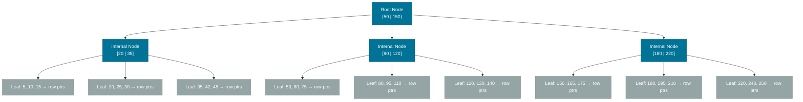
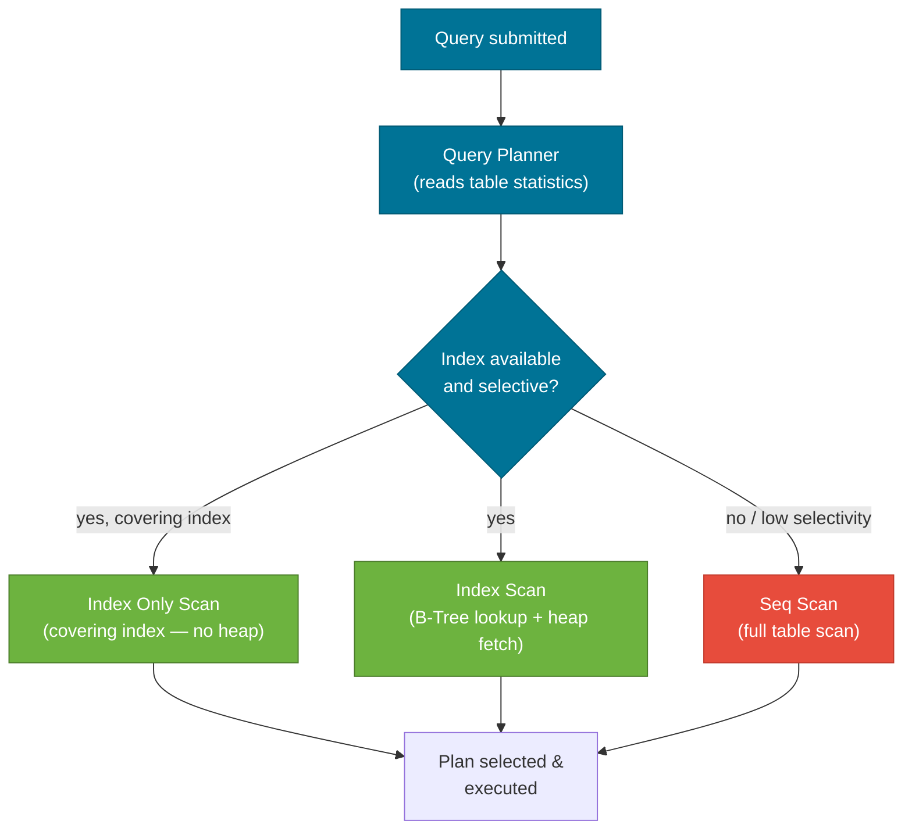

# Indexes & Query Performance

> A database index is a separate data structure that lets the query engine find rows quickly — the difference between a full table scan and a near-instant lookup can be 1000× or more on large tables.

## What Problem Does It Solve?

Without an index, a query like `SELECT * FROM orders WHERE user_id = 42` forces the database to examine **every row in the table** — a full table scan. For a table with 10 million orders, that's millions of disk reads. An index transforms this into a tree traversal: O(log n) instead of O(n).

The flip side is that every index has a **write cost**: every `INSERT`, `UPDATE`, or `DELETE` must update all relevant indexes. Good indexing is about choosing the right trade-off for your read/write ratio.

## What Is a Database Index?

An index is a sorted, auxiliary data structure on one or more columns that maps values to row locations (heap pointers or primary key values). The database engine consults the index **during query planning** to decide whether scanning the index is faster than a full table scan.

### B-Tree Index (the default)

The overwhelming majority of indexes are B-Trees (Balanced Trees). Every value in the indexed column is stored in sorted order in a balanced multi-level tree:



*Caption: B-Tree index structure — each lookup descends from root → internal nodes → leaf nodes in O(log n) steps. Leaf nodes contain actual row pointers (or primary key values in InnoDB/PostgreSQL).*

**B-Tree indexes support:**
- Equality: `WHERE id = 42`
- Range: `WHERE created_at BETWEEN '2024-01-01' AND '2024-12-31'`
- Prefix matching: `WHERE name LIKE 'Jo%'` (but NOT `LIKE '%Jo%'`)
- Sorting: `ORDER BY indexed_column` can avoid a sort step

## How Indexes Are Used

### Single-Column Index

```sql
-- Create an index on orders(user_id)
CREATE INDEX idx_orders_user_id ON orders(user_id);

-- This query now uses the index instead of a full scan
SELECT * FROM orders WHERE user_id = 42;
```

### Composite (Multi-Column) Index

A composite index covers multiple columns in a **defined order**. The left-prefix rule governs which queries can use it:

```sql
CREATE INDEX idx_orders_user_status ON orders(user_id, status);
```

| Query | Uses index? | Reason |
|-------|-------------|--------|
| `WHERE user_id = 1` | ✅ Yes | Leftmost column |
| `WHERE user_id = 1 AND status = 'PAID'` | ✅ Yes (full) | Both columns |
| `WHERE status = 'PAID'` | ❌ No | `user_id` is skipped |
| `WHERE user_id = 1 ORDER BY status` | ✅ Yes | Index covers ORDER BY |

:::tip Column order in composite indexes matters
Put the **most selective column first** when queries primarily filter on one column, or **group the equality columns first, then range columns** (e.g., `(user_id, created_at)` for `WHERE user_id = ? AND created_at > ?`).
:::

### Covering Index

A **covering index** includes all columns the query needs, so the database can answer the query entirely from the index without touching the main table (heap) at all:

```sql
-- Query needs: user_id (filter), total_amount (output), status (output)
CREATE INDEX idx_orders_covering ON orders(user_id, status, total_amount);

-- This query is answered entirely from the index (no heap access)
SELECT status, total_amount FROM orders WHERE user_id = 42;
```

## Reading EXPLAIN Plans

`EXPLAIN` (and `EXPLAIN ANALYZE`) shows how the database will execute a query. Learning to read it is essential for query performance work:

```sql
EXPLAIN ANALYZE
SELECT o.id, o.total_amount
FROM orders o
WHERE o.user_id = 42
  AND o.status = 'PAID'
ORDER BY o.created_at DESC;
```

**PostgreSQL EXPLAIN output (simplified):**
```
Sort  (cost=42.15..42.18 rows=12 width=16) (actual time=0.312..0.315 rows=8)
  Sort Key: created_at DESC
  →  Index Scan using idx_orders_user_status on orders
       Index Cond: ((user_id = 42) AND (status = 'PAID'))
       Rows Removed by Filter: 3
Planning Time: 0.5 ms
Execution Time: 0.8 ms
```

**Key terms to understand:**

| Term | Meaning | Warning signal |
|------|---------|----------------|
| `Seq Scan` | Full table scan | ⚠️ On large tables — missing index |
| `Index Scan` | Walks B-Tree + heap | Normal for filtered queries |
| `Index Only Scan` | Index covers all columns | ✅ Best case — no heap access |
| `Nested Loop` | Join using loops | ⚠️ On large unsorted sets |
| `Hash Join` | Build hash table | ✅ Good for large equi-joins |
| `Sort` | Explicit sort step | ⚠️ Might be avoidable with an index |
| `cost=A..B` | Estimated cost units (I/O + CPU) | Higher = more expensive |
| `rows=N` | Estimated row count | Large mismatch = stale statistics |



*Caption: How the query planner decides between index and sequential scans — selectivity (how many rows an index filters out) is the key driver.*

## Indexes in Spring Boot / JPA

JPA and Spring Data let you declare indexes in entity mappings:

```java
@Entity
@Table(
    name = "orders",
    indexes = {
        @Index(name = "idx_orders_user_id",
               columnList = "user_id"),                        // ← single column
        @Index(name = "idx_orders_user_status",
               columnList = "user_id, status"),                // ← composite
        @Index(name = "idx_orders_email_unique",
               columnList = "email", unique = true)            // ← unique constraint
    }
)
public class Order {
    @Id
    @GeneratedValue(strategy = GenerationType.IDENTITY)
    private Long id;

    @Column(name = "user_id", nullable = false)
    private Long userId;

    @Column(nullable = false)
    private String status;

    @Column(name = "created_at")
    private LocalDateTime createdAt;
}
```

:::warning JPA index annotations create indexes, not constraints
`@Index` tells JPA to issue a `CREATE INDEX` DDL statement. For a uniqueness constraint the database enforces at write time, use `@Column(unique = true)` or `@UniqueConstraint` in `@Table`.
:::

In production, manage indexes through Flyway or Liquibase migrations rather than relying on JPA DDL auto-generation (`spring.jpa.hibernate.ddl-auto=validate` in production):

```sql
-- V3__add_order_indexes.sql (Flyway migration)
CREATE INDEX idx_orders_user_id      ON orders(user_id);
CREATE INDEX idx_orders_user_status  ON orders(user_id, status);
CREATE INDEX idx_orders_created_at   ON orders(created_at DESC);  -- ← descending for ORDER BY DESC
```

## Trade-offs & When To Use / Avoid

| | Pros | Cons |
|--|------|------|
| **B-Tree index** | Fast equality, range, and sort | Write amplification on heavy INSERT/UPDATE/DELETE |
| **Composite index** | Can cover multiple filter columns | Wasted if columns after a skipped column; larger index size |
| **Unique index** | Enforces data integrity + improves lookups | Inserts that violate uniqueness throw exceptions |
| **Covering index** | Eliminates heap access (Index Only Scan) | Must include all SELECT columns; index grows wider |
| **Partial index** | Smaller, faster for filtered subsets | Only helps queries matching the `WHERE` predicate |

**When to add an index:**
- Columns frequently in `WHERE`, `JOIN ON`, or `ORDER BY`
- Foreign key columns (many databases don't add these automatically!)
- High-cardinality columns (many distinct values) — low-cardinality columns like `boolean` rarely benefit

**When NOT to add an index:**
- Very small tables (< 1,000 rows) — full scan is often faster
- Columns with very low cardinality (e.g., `status` with 2 values on a non-selective query)
- Write-heavy tables where the write amplification cost exceeds read benefits
- `LIKE '%pattern%'` queries — B-Trees can't use these; use full-text search instead

## Common Pitfalls

**1. Missing index on foreign key columns**

Most databases (including PostgreSQL) do **not** automatically create indexes on foreign key columns. If you have `orders.user_id` as a FK referencing `users.id`, add an index manually. This is one of the most common performance oversights.

```sql
-- Easy to forget, massively impactful
CREATE INDEX idx_orders_user_id ON orders(user_id);
```

**2. Implicit type conversion breaks indexes**

```sql
-- user_id is a BIGINT column — this works
WHERE user_id = 42;

-- string '42' forces a cast; may skip the index depending on database
WHERE user_id = '42';
```

**3. Function on indexed column prevents index use**

```sql
-- WRONG: function on column prevents index use
WHERE UPPER(email) = 'USER@EXAMPLE.COM';

-- CORRECT: index the expression, or store in lowercase
CREATE INDEX idx_users_email_lower ON users(LOWER(email));
WHERE LOWER(email) = 'user@example.com';
```

**4. Using LIKE '%prefix' instead of 'prefix%'**

```sql
-- WRONG: leading wildcard requires full index scan
WHERE name LIKE '%smith';

-- CORRECT: trailing wildcard uses B-Tree index prefix lookup
WHERE name LIKE 'Smith%';
```

**5. Too many indexes (over-indexing)**

Every index adds write overhead. Tables that receive thousands of inserts/second can be significantly slowed by 8–10 broad indexes. Audit and drop unused indexes regularly.

**6. Ignoring stale optimizer statistics**

The query planner uses statistics about row counts and value distributions. After large bulk loads, run `ANALYZE` (PostgreSQL) / `ANALYZE TABLE` (MySQL) to refresh statistics; otherwise the planner may choose wrong plans.

## Interview Questions

### Beginner

**Q: What is a database index and why do you use it?**  
**A:** An index is a separate sorted data structure on one or more columns that lets the database find matching rows without scanning every row in the table. You add indexes to columns that appear in `WHERE` clauses, `JOIN ON` conditions, or `ORDER BY` — especially on large tables — to turn O(n) full scans into O(log n) tree lookups.

**Q: What is the difference between a primary key index and a regular index?**  
**A:** A primary key is implicitly a unique, non-null index used as the row's canonical identifier. In InnoDB (MySQL) the table is physically organized by primary key (clustered index). Regular secondary indexes store the B-Tree separately and reference the primary key to look up the full row.

### Intermediate

**Q: What is a composite index and what is the left-prefix rule?**  
**A:** A composite index covers multiple columns in order, e.g., `(user_id, status)`. The left-prefix rule means the index is only usable if the query's filter includes the **leftmost column(s)** in sequence. A query on `status` alone cannot use `(user_id, status)` because it would skip the first column and the data is not sorted by `status` independently.

**Q: What is a covering index?**  
**A:** A covering index includes all columns a query reads (both filter and output columns), allowing the database to answer the query entirely from the index without fetching the actual table rows. PostgreSQL calls this an Index Only Scan and it's the fastest possible access path.

**Q: How do you identify a slow query in a Spring Boot application?**  
**A:** Enable Spring Boot's slow query logging (`spring.jpa.properties.hibernate.generate_statistics=true` or configure the DataSource's slow query threshold). Use `EXPLAIN ANALYZE` on the flagged query to see whether it's doing a Seq Scan on a large table, which signals a missing or unused index.

### Advanced

**Q: When would the query planner choose a sequential scan over an existing index?**  
**A:** The planner compares estimated cost. If the query returns a large fraction of the table (low selectivity — e.g., `WHERE status = 'ACTIVE'` when 90% of rows are active), a sequential scan is cheaper because it reads pages sequentially (good for disk prefetch) rather than doing random I/O for many index lookups. Statistics may also mislead the planner if they're stale.

**Q: What is write amplification in the context of indexes, and how do you manage it?**  
**A:** Every index must be updated on every write (`INSERT`, `UPDATE`, `DELETE`). A table with 8 indexes requires 9 writes per logical write (1 heap + 8 index). On write-heavy tables, this amplification can saturate I/O. Mitigations: remove unused indexes, use partial indexes (smaller index over a filtered subset), and batch writes to amortize index rebuilds.

## Further Reading

- [Use The Index, Luke!](https://use-the-index-luke.com/) — the most practical free resource on SQL indexing; covers B-Trees, composite indexes, and performance patterns
- [PostgreSQL Indexes documentation](https://www.postgresql.org/docs/current/indexes.html) — authoritative reference for index types (B-Tree, Hash, GIN, GiST, BRIN)
- [Baeldung: JPA Indexes](https://www.baeldung.com/jpa-indexes) — how to declare indexes in Spring Boot JPA entities

## Related Notes

- [SQL Fundamentals](./sql-fundamentals.md) — the queries this note optimizes; understanding JOIN and WHERE is a prerequisite.
- [Transactions & ACID](./transactions-acid.md) — index updates participate in transactions; understanding locking at the index level matters for deadlock analysis.
- [Schema Migration](./schema-migration.md) — in production, `CREATE INDEX` should be in a Flyway or Liquibase migration, not generated by JPA DDL.
