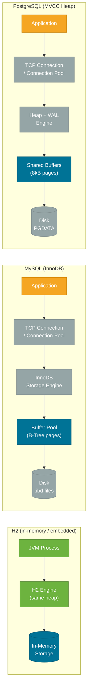
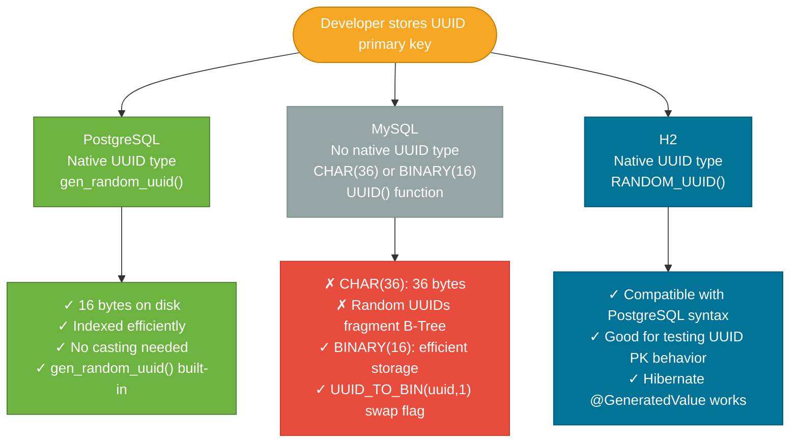
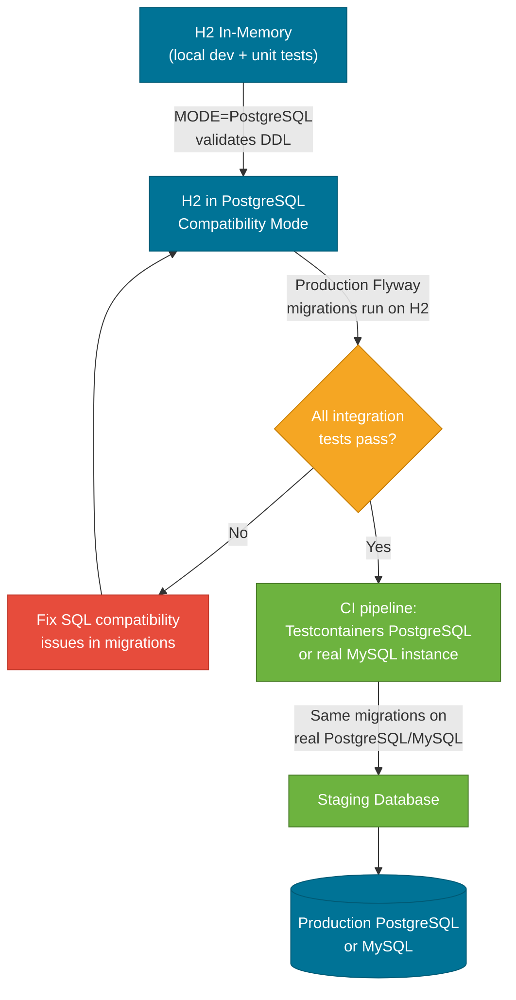

# MySQL, PostgreSQL & H2 — Database Guide

> MySQL is the world's most deployed open-source relational database; PostgreSQL is the most SQL-compliant and feature-rich; H2 is an embeddable Java database that mirrors production behavior locally — each answers a different set of problems.

## What Problem Does It Solve?

Java backend projects need to choose a relational database for three distinct stages: **local development** (fast spin-up, no Docker needed, reset on each run), **testing** (in-memory for speed, must match production DDL), and **production** (durability, SQL compliance, performance at scale). A single database technology rarely covers all three stages optimally.

H2 fills the development/test gap. MySQL and PostgreSQL are the two dominant production choices. Understanding the fundamental differences — storage engine, SQL compliance, data types, UUID behavior, and locking model — prevents nasty surprises when code that passes local tests fails in production.

---

## What Is Each Database?

### MySQL

MySQL is an open-source RDBMS originally developed by MySQL AB, now owned by Oracle. It powers the majority of LAMP stack applications and is the default database for many cloud services (Amazon Aurora MySQL, Google Cloud SQL). The dominant storage engine is **InnoDB**, which provides ACID transactions and row-level locking.

- **Architecture**: pluggable storage engine model (InnoDB is the only sensible choice for OLTP)
- **SQL compliance**: pragmatic, not strict — silently truncates overlong strings, accepts non-standard syntax
- **Default isolation level**: `REPEATABLE READ`
- **Replication**: binary-log based, master-replica; mature ecosystem for high availability

### PostgreSQL

PostgreSQL (Postgres) is a fully open-source RDBMS developed by a global community. It is the closest commercially available system to the SQL standard and is frequently chosen for data-intensive applications, analytics, and systems where correctness guarantees matter more than raw simplicity.

- **Architecture**: process-per-connection model; single storage engine (heap files + WAL)
- **SQL compliance**: very high — strict type enforcement, standard `INTERVAL`, `ARRAY`, `JSONB`, window functions, CTEs with `INSERT/UPDATE/DELETE`
- **Default isolation level**: `READ COMMITTED`
- **Replication**: physical streaming replication (WAL-based) + logical replication; excellent read replica support

### H2

H2 is a pure-Java embeddable relational database. It runs inside the JVM process, which means no external service is needed. It supports two persistence modes:

| Mode | Description | Use case |
|------|-------------|----------|
| **In-memory** | Data lives in JVM heap; wiped on shutdown | Unit and integration tests |
| **Embedded persistent** | Data stored in a local file | Local development without Docker |
| **Server mode** | H2 runs as a separate TCP server | Shared local dev environment |

H2's killer feature is **compatibility mode** — it can emulate MySQL or PostgreSQL syntax, making it possible to run production DDL on H2 without changes.

---

## How It Works

### Architectural Comparison



*Architecture comparison: H2 runs inside the JVM with no TCP overhead; MySQL and PostgreSQL are external processes accessed via connection pool.*

---

### Key Differences At a Glance

| Feature | MySQL 8+ | PostgreSQL 16+ | H2 (2.x) |
|---------|----------|----------------|-----------|
| License | GPL / Commercial | PostgreSQL License (permissive) | EPL / MPL (permissive) |
| Default isolation | REPEATABLE READ | READ COMMITTED | READ COMMITTED |
| MVCC | Yes (InnoDB undo log) | Yes (heap versioning) | Yes |
| Strict SQL mode | Optional (`STRICT_TRANS_TABLES`) | Always strict | Configurable |
| Native UUID type | No (`CHAR(36)` or `BINARY(16)`) | Yes (`UUID`) | Yes (`UUID`) |
| Native `BOOLEAN` | Alias for `TINYINT(1)` | True `BOOLEAN` | True `BOOLEAN` |
| `RETURNING` clause | No (MySQL 8 only via workaround) | Yes | Yes |
| `WITH RECURSIVE` CTE | Yes (8.0+) | Yes | Yes |
| `LISTEN/NOTIFY` | No | Yes | No |
| JSON support | `JSON` column (extracted via functions) | `JSONB` (binary, indexed) | Limited |
| Full-text search | Built-in (MyISAM/InnoDB) | `tsvector` + GIN index | Basic |
| Window functions | Yes (8.0+) | Yes (mature) | Yes |
| Partial indexes | No | Yes | Yes |
| Compatibility modes | N/A | N/A | MySQL, PostgreSQL, Oracle, MSSQLServer |

---

### UUID Handling — Where Things Differ Significantly

UUID is one of the most trip-hazard areas when switching databases. Each database handles the `UUID` type differently:



*UUID handling across databases — PostgreSQL has the best native support; MySQL requires explicit workarounds for performance.*

**PostgreSQL — best UUID support:**

```sql
-- Built-in type and generator (PostgreSQL 13+)
CREATE TABLE users (
    id UUID PRIMARY KEY DEFAULT gen_random_uuid(),
    email TEXT NOT NULL
);
```

**MySQL — two patterns:**

```sql
-- Pattern 1: CHAR(36) — human-readable but 36 bytes, B-Tree fragmentation
CREATE TABLE users (
    id CHAR(36) PRIMARY KEY DEFAULT (UUID()),   -- friendly but slow at scale
    email VARCHAR(255) NOT NULL
);

-- Pattern 2: BINARY(16) with swap flag — compact and ordered (MySQL 8+)
CREATE TABLE users (
    id BINARY(16) PRIMARY KEY DEFAULT (UUID_TO_BIN(UUID(), 1)),  -- ← swap=1 makes UUID time-ordered
    email VARCHAR(255) NOT NULL
);
-- Retrieve: SELECT BIN_TO_UUID(id, 1) FROM users;
```

**JPA / Hibernate with UUID primary key:**

```java
@Entity
public class User {

    @Id
    @GeneratedValue(strategy = GenerationType.UUID)   // ← Hibernate 6 / Spring Boot 3
    private UUID id;

    private String email;
}
```

With Hibernate 6 (Spring Boot 3+), `GenerationType.UUID` works transparently with PostgreSQL's `UUID` type, MySQL's `BINARY(16)`, and H2 — no extra configuration.

:::tip PostgreSQL over MySQL for UUID keys  
If you use UUID primary keys heavily, prefer PostgreSQL. Its native `UUID` type is 16 bytes on disk and indexed without fragmentation. For MySQL, always use `BINARY(16)` with `UUID_TO_BIN(uuid, 1)` (swap flag = 1 makes the UUID time-ordered, reducing B-Tree fragmentation by ~80%).  
:::

---

## H2 for Development — The Full Picture

### Why H2 Is Ideal for Development

1. **Zero infrastructure**: no Docker, no installed database service needed — just `spring-boot-starter-h2` on the classpath.
2. **Fast startup**: H2 in-memory starts in milliseconds — critical for rapid TDD cycles.
3. **Clean-slate per test**: each `@SpringBootTest` gets a fresh schema; no shared state between tests.
4. **H2 Console**: built-in web UI at `/h2-console` for inspecting tables during development.
5. **SQL compatibility mode**: H2 can execute MySQL or PostgreSQL DDL with minimal changes.

### Spring Boot H2 Configuration

```yaml
# application-dev.yml
spring:
  datasource:
    url: jdbc:h2:mem:devdb;DB_CLOSE_DELAY=-1;MODE=PostgreSQL;NON_KEYWORDS=VALUE  # ← PostgreSQL compat mode
    driver-class-name: org.h2.Driver
    username: sa
    password: ""
  h2:
    console:
      enabled: true         # ← Access at http://localhost:8080/h2-console
      path: /h2-console
  jpa:
    hibernate:
      ddl-auto: create-drop # ← Wipe and recreate schema on each restart
    show-sql: true
```

**Key H2 URL parameters:**

| Parameter | Effect |
|-----------|--------|
| `mem:dbname` | In-memory database (wiped on shutdown) |
| `file:./data/devdb` | Persistent file database |
| `MODE=PostgreSQL` | Accept PostgreSQL-specific syntax |
| `MODE=MySQL` | Accept MySQL-specific syntax |
| `DB_CLOSE_DELAY=-1` | Keep in-memory DB alive as long as JVM runs |
| `NON_KEYWORDS=VALUE` | Prevent `VALUE` being treated as a reserved word |

### Flyway + H2 for Integration Tests

```yaml
# src/test/resources/application.yml
spring:
  datasource:
    url: jdbc:h2:mem:testdb;MODE=PostgreSQL;NON_KEYWORDS=VALUE
    driver-class-name: org.h2.Driver
  flyway:
    enabled: true           # ← Run production Flyway migrations against H2
    locations: classpath:db/migration
  jpa:
    hibernate:
      ddl-auto: none        # ← Let Flyway manage schema, not Hibernate
```

This pattern runs your **actual production Flyway migrations** against H2, catching SQL compatibility issues before they hit production.

---

## Migration Path: H2 → Production Database

The diagram below shows the recommended path from H2 development to a production PostgreSQL or MySQL instance:



*H2 to production migration path — compatibility mode catches most syntax issues before hitting real infrastructure.*

### Why H2 → PostgreSQL Is Easier Than H2 → MySQL

H2's default behavior aligns more naturally with PostgreSQL:
- Both use `TRUE/FALSE` boolean literals (MySQL uses `1/0`)
- Both have a native `UUID` type
- H2's `MODE=PostgreSQL` covers `SERIAL`, `BIGSERIAL`, `ILIKE`, `NOW()` with timezone
- H2's `MODE=MySQL` is less comprehensive — `AUTO_INCREMENT`, backtick identifiers, and `TINYINT(1)` booleans cause occasional friction

**Bottom line**: If you start with H2 in development, plan to deploy on PostgreSQL in production — the compatibility surface is about 95%. For MySQL production targets, use Testcontainers from day one to run a real MySQL instance in CI.

### Spring Boot JDBC Driver & Datasource Configuration

```yaml
# application-postgres.yml (production profile)
spring:
  datasource:
    url: jdbc:postgresql://db-host:5432/mydb
    driver-class-name: org.postgresql.Driver
    username: ${DB_USER}
    password: ${DB_PASSWORD}
  jpa:
    database-platform: org.hibernate.dialect.PostgreSQLDialect
    hibernate:
      ddl-auto: validate      # ← In production: never create/drop; validate only
```

```yaml
# application-mysql.yml (production profile)
spring:
  datasource:
    url: jdbc:mysql://db-host:3306/mydb?serverTimezone=UTC&useSSL=true
    driver-class-name: com.mysql.cj.jdbc.Driver
    username: ${DB_USER}
    password: ${DB_PASSWORD}
  jpa:
    database-platform: org.hibernate.dialect.MySQL8Dialect
    hibernate:
      ddl-auto: validate
```

---

## Trade-offs & When To Use / Avoid

| | Pros | Cons |
|--|------|------|
| **PostgreSQL** | Native UUID, JSONB, LISTEN/NOTIFY, partial indexes, strict SQL, excellent MVCC, permissive license | More complex configuration than MySQL; process-per-connection model needs PgBouncer at scale |
| **MySQL** | Ubiquitous cloud support (Aurora, RDS, Cloud SQL), simple replication setup, large community | No native UUID, TINYINT boolean quirks, less strict SQL (silent truncation), weaker window function support before 8.0 |
| **H2** | Zero-install, JVM-embedded, fast for tests, compatibility modes | Not production-grade; compatibility mode is incomplete (~90–95%); no spatial types or JSONB |

**Choose PostgreSQL when:**
- Using UUID primary keys
- Need `JSONB` columns with GIN indexes
- Require `LISTEN/NOTIFY` for event-driven patterns
- Correctness > simplicity of operations

**Choose MySQL when:**
- Team is already invested in MySQL/Aurora ecosystem
- Using a managed service that defaults to MySQL (e.g., AWS Aurora MySQL compatible)
- The workload is OLTP-heavy with simple queries and well-understood read replicas

**Choose H2 when:**
- Local development without Docker or external services
- Running fast unit/integration tests (`@DataJpaTest` with H2 is 10–50× faster than Testcontainers)
- Spike/prototyping where you want a running app in seconds

---

## Common Pitfalls

### 1. Trusting H2 Tests Blindly

H2 compatibility mode covers ~90–95% of common SQL. Silent differences:
- `GROUP BY` handling may differ for non-aggregate columns
- Some PostgreSQL functions (`STRING_AGG`, `ARRAY_AGG`) are unavailable in H2
- H2 does not enforce column lengths by default in some modes

**Fix**: Use Testcontainers in CI to run the actual database. Reserve H2 only for fast unit tests that don't push SQL edge cases.

### 2. MySQL Silent Truncation

MySQL without `STRICT_TRANS_TABLES` silently truncates a `VARCHAR(10)` insert of 20 characters to 10 — no error, just data loss. PostgreSQL throws an error.

```sql
-- MySQL default (non-strict): silently truncates
INSERT INTO users (username) VALUES ('thisistoolong');  -- truncated to 10 chars

-- Fix: enable strict mode in MySQL URL
-- jdbc:mysql://host/db?sessionVariables=sql_mode='STRICT_TRANS_TABLES,NO_ENGINE_SUBSTITUTION'
```

### 3. H2 Keywords Clashes

H2 reserves keywords that are common column names: `VALUE`, `KEY`, `NAME`, `USER`. Table creation will fail with a parse error.

```yaml
# Fix: add NON_KEYWORDS to the H2 URL
url: jdbc:h2:mem:testdb;NON_KEYWORDS=VALUE,KEY,NAME,USER
```

### 4. UUID Primary Key Performance on MySQL

Random v4 UUIDs as primary keys on MySQL `InnoDB` cause **B-Tree fragmentation** because new rows are inserted at random positions rather than appended. At millions of rows, insert throughput drops significantly and index pages become 50–70% full.

```java
// Fix option 1: Use UUID v7 (time-ordered) — requires a library
// Fix option 2: MySQL BINARY(16) with swap flag 1 (time-ordered)
// Fix option 3: Use auto-increment Long ID + UUID as a secondary indexed column
@Entity
public class Order {
    @Id
    @GeneratedValue(strategy = GenerationType.IDENTITY)
    private Long id;                         // ← internal PK for B-Tree performance

    @Column(unique = true, nullable = false)
    private UUID publicId = UUID.randomUUID(); // ← exposed in API, has unique index
}
```

### 5. Forgetting `serverTimezone=UTC` in MySQL JDBC URL

MySQL JDBC driver defaults to the JVM timezone. Without `serverTimezone=UTC` in the connection URL, `DATETIME` and `TIMESTAMP` columns can shift by hours between environments with different TZ settings.

```yaml
# Always include in MySQL JDBC URL
url: jdbc:mysql://host:3306/mydb?serverTimezone=UTC&useSSL=true
```

---

## Best Practices

- **Default to PostgreSQL for greenfield projects** — native UUID, JSONB, strict SQL, and permissive license make it the safest long-term choice.
- **Never set `ddl-auto=create` or `create-drop` in production** — always use Flyway or Liquibase.
- **Use H2 in `MODE=PostgreSQL`** — aligns H2 behavior with production and catches more incompatibilities.
- **Add `Testcontainers` in CI** — run `@DataJpaTest` against the real database engine for at least one test suite.
- **Use parameters everywhere** — `WHERE id = :id` prevents SQL injection; never concatenate user input into queries.
- **For MySQL UUID keys**: use `BINARY(16)` with `UUID_TO_BIN(uuid, 1)` or switch to sequential ULIDs/UUIDv7.
- **Profile for `MODE=PostgreSQL`**: activate H2 only via the `dev` or `test` Spring profile — never let H2 leak into production config.
- **Set `spring.jpa.open-in-view=false`** — regardless of database, this prevents unintended lazy-loading queries outside transactions.

---

## Interview Questions

### Beginner

**Q: What is the main difference between MySQL and PostgreSQL?**  
**A:** Both are relational databases, but PostgreSQL is stricter about SQL compliance (it will error instead of silently truncating data), has a native `UUID` type, and supports `JSONB` columns. MySQL is simpler to operate and more widely available as a managed cloud service. PostgreSQL is generally preferred for new applications requiring correctness; MySQL is common in legacy and LAMP-stack applications.

**Q: Why do developers use H2 instead of a real database for tests?**  
**A:** H2 runs embedded inside the JVM — no separate process, no Docker, no setup. An in-memory H2 database starts in milliseconds and is wiped clean after each test, giving a fresh schema with no cross-test contamination. It is ~10–50× faster than spinning up a Testcontainers PostgreSQL container, making it ideal for unit and `@DataJpaTest` test suites.

**Q: What is a `BOOLEAN` in MySQL vs PostgreSQL?**  
**A:** In PostgreSQL `BOOLEAN` is a true boolean type with `TRUE/FALSE` literals. In MySQL it is an alias for `TINYINT(1)` — it stores `1` and `0`. This causes surprising behavior when you use `= true` or `= false` in JDBC/JPA code that must run on both databases.

**Q: How do you enable the H2 console in Spring Boot?**  
**A:** Set `spring.h2.console.enabled=true` in `application.properties`. The console is then available at `/h2-console`. You also need `spring.datasource.url=jdbc:h2:mem:...` and must allow the H2 console URL in Spring Security if security is configured.

### Intermediate

**Q: How does PostgreSQL store UUIDs compared to MySQL, and why does it matter for performance?**  
**A:** PostgreSQL stores `UUID` as 16 bytes natively. MySQL has no native UUID type; a common pattern is `CHAR(36)` (human-readable but 36 bytes/row) or `BINARY(16)` (compact). The bigger issue is **B-Tree fragmentation**: random v4 UUIDs insert at arbitrary positions in the B-Tree index, leaving pages 50–70% full and degrading insert throughput at scale. PostgreSQL handles this better because its MVCC heap is less sensitive to non-sequential inserts — but the real fix is to use time-ordered UUIDs (UUIDv7 or MySQL's `UUID_TO_BIN(uuid, 1)` swap flag).

**Q: What is H2 compatibility mode and what are its limits?**  
**A:** Set `MODE=PostgreSQL` (or `MODE=MySQL`) in the H2 JDBC URL to make H2 accept database-specific syntax: `SERIAL`/`BIGSERIAL` pseudo-types, `ILIKE`, `NOW()` with timezone, etc. Limits: H2 does not support `JSONB`, partial indexes, `LISTEN/NOTIFY`, or some advanced aggregate functions. Compatibility covers ~90–95% of typical OLTP DDL and DML. For anything beyond basic schemas, add Testcontainers to CI for fidelity.

**Q: What happens if you run `ddl-auto=create-drop` against a PostgreSQL production database?**  
**A:** Hibernate drops all tables it manages, recreates them from the entity model, then drops them again on shutdown. In production this means **complete data loss**. Always set `ddl-auto=validate` (check schema matches entities, fail if not) or `ddl-auto=none` in production, and let Flyway/Liquibase manage schema changes.

**Q: How do you configure Spring Boot to use H2 locally but PostgreSQL in production?**  
**A:** Use Spring profiles. Add `application-dev.yml` with H2 datasource config and `application-prod.yml` with PostgreSQL config. Activate the right profile with `SPRING_PROFILES_ACTIVE=prod` in the production environment. Never hard-code credentials — use `${DB_PASSWORD}` and inject from environment variables or Kubernetes Secrets.

**Q: Why does MySQL require `serverTimezone=UTC` in the JDBC URL?**  
**A:** The MySQL JDBC driver (`mysql-connector-j`) maps Java `LocalDateTime`/`Timestamp` to the server's timezone. Without explicit `serverTimezone=UTC`, the driver uses the JVM's default timezone. If the JVM runs in `Europe/London` (UTC+1 in summer) and the DB server is in `UTC`, timestamps shift by an hour in both directions, causing date-based queries to return wrong results.

### Advanced

**Q: How would you migrate from H2 to PostgreSQL in production with zero downtime?**  
**A:** The schema migration is already handled by Flyway — the same `V{n}__*.sql` files run against PostgreSQL. Data migration requires: (1) export H2 data via `SCRIPT TO 'dump.sql'`; (2) transform any H2-specific syntax (H2 auto-increment → PostgreSQL `SERIAL`); (3) import into PostgreSQL with `psql`. For production zero-downtime: run PostgreSQL alongside the existing database, use dual-write from the application, verify data parity, then cut over. Most teams skip H2 in production entirely — H2 is development-only; production starts on PostgreSQL from day one.

**Q: What are the architectural implications of PostgreSQL's process-per-connection model at scale?**  
**A:** PostgreSQL forks a new OS process for each client connection (vs MySQL's thread-per-connection). Each process consumes ~5–10 MB of memory. At 500 simultaneous connections, PostgreSQL uses ~2.5–5 GB just for connection overhead. The industry solution is **PgBouncer** (connection pooler in transaction-pooling mode) in front of PostgreSQL — application threads connect to PgBouncer, which multiplexes thousands of logical connections onto 20–50 actual PostgreSQL processes. Spring Boot's HikariCP pool connects to PgBouncer, not directly to PostgreSQL, at scale.

**Q: When would you choose MySQL over PostgreSQL for a new project?**  
**A:** MySQL (specifically Amazon Aurora MySQL) is the better choice when: (1) you need Aurora Serverless v2 for infrequent/bursty workloads with zero idle cost; (2) your team has deep MySQL operational expertise and existing tooling; (3) you are migrating an existing MySQL application and want minimal DDL changes. PostgreSQL is preferred otherwise. Avoid MySQL if you need `LISTEN/NOTIFY`, partial indexes, `JSONB` with GIN indexing, or `RETURNING` clauses in `INSERT/UPDATE` statements — these are PostgreSQL-specific features with no direct MySQL equivalent.

---

## Further Reading

- [PostgreSQL Documentation — Data Types](https://www.postgresql.org/docs/current/datatype.html) — authoritative coverage of UUID, JSONB, BOOLEAN, and other types
- [MySQL 8.4 Reference — UUID functions](https://dev.mysql.com/doc/refman/8.4/en/miscellaneous-functions.html#function_uuid) — official docs for `UUID()`, `UUID_TO_BIN()`, `BIN_TO_UUID()`
- [H2 Database — Compatibility Modes](https://h2database.com/html/features.html#compatibility) — full list of what each compatibility mode covers
- [Baeldung — Spring Boot with H2](https://www.baeldung.com/spring-boot-h2-database) — practical Integration with Spring Boot
- [Baeldung — Hibernate UUID as Primary Key](https://www.baeldung.com/java-hibernate-uuid-primary-key) — `@GeneratedValue(strategy = GenerationType.UUID)` in depth

---

## Related Notes

- [SQL Fundamentals](./sql-fundamentals.md) — the query language covered here is standard SQL; this note explains which database quirks affect that standard
- [Schema Migration](./schema-migration.md) — Flyway migrations that target H2 in dev and PostgreSQL/MySQL in production; the H2 MODE setting is critical for this to work
- [Connection Pooling](./connection-pooling.md) — HikariCP configuration changes between MySQL and PostgreSQL (driver class, JDBC URL format, dialect)
- [Transactions & ACID](./transactions-acid.md) — isolation level defaults differ between MySQL (REPEATABLE READ) and PostgreSQL (READ COMMITTED); `@Transactional(isolation=...)` overrides this
