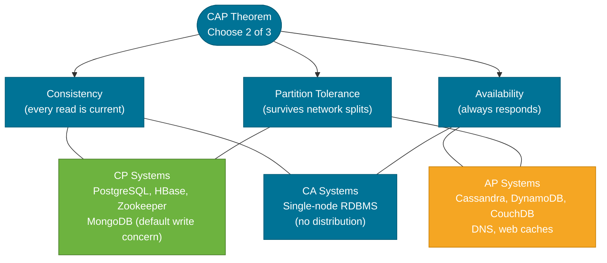
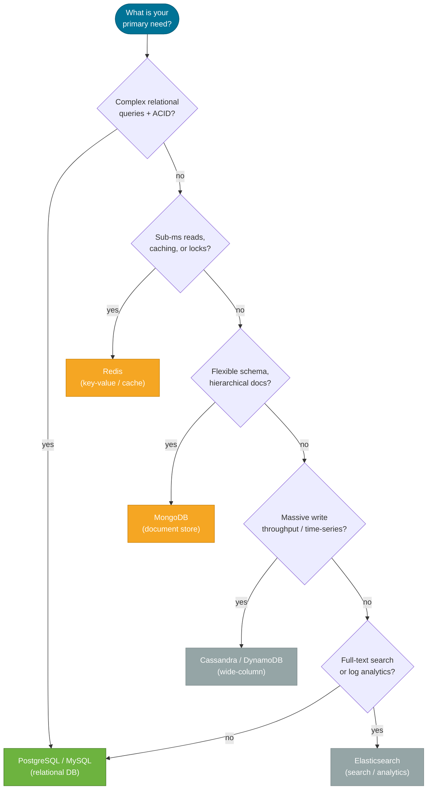

# NoSQL Trade-offs

> NoSQL databases trade away some guarantees of relational databases — strict schemas, complex joins, strong consistency — in exchange for horizontal scalability, flexible data models, and specialized read/write patterns.

## What Problem Does It Solve?

Relational databases are excellent for structured data with complex relationships and strict consistency requirements. But as systems scale, they hit walls:

- A normalized schema with 15 tables and deep foreign key chains becomes difficult to scale horizontally (sharding is painful on relational DB).
- A relational database enforcing ACID consistency across shards requires distributed transactions — complex and slow.
- Some use cases have radically different access patterns: caching (sub-millisecond reads), full-text search (relevance ranking), time-series data (high-volume append-only writes).

NoSQL databases solve these specific scaling and access-pattern problems — but only at the cost of giving up features you are used to in SQL.

## CAP Theorem

The **CAP theorem** (Brewer, 2000) states that a distributed data system can guarantee **at most two** of these three properties simultaneously:

| Property | Meaning |
|----------|---------|
| **Consistency (C)** | Every read returns the most recently written value (or an error) |
| **Availability (A)** | Every request receives a response (success or failure — but not a timeout) |
| **Partition Tolerance (P)** | The system keeps operating even when network messages between nodes are dropped |

In any real distributed system, **network partitions are unavoidable** — so you always need P. The real choice is: **CP vs AP** during a partition.



*Caption: CAP theorem — practical distributed systems choose between CP (consistent but may be unavailable during partition) and AP (always available but may return stale data). CA is only possible on a single node.*

### BASE vs ACID

NoSQL AP systems are often described as **BASE**:

| Property | Meaning |
|----------|---------|
| **Basically Available** | The system always responds, even if data is stale |
| **Soft state** | State may change over time even without new inputs (replication catching up) |
| **Eventually Consistent** | All nodes will converge to the same value — eventually |

This is deliberately contrasted with ACID. "Eventually consistent" means your reads may lag behind writes by milliseconds or seconds, but the system never permanently diverges.

## The Major NoSQL Categories

### 1. Key-Value Store — Redis

**What it is:** An in-memory key/value store where data is accessed by a single key. Redis additionally supports rich data structures (lists, sets, sorted sets, hashes).

**When to use it:**
- **Caching** — store frequently-read data (user sessions, product details, query results) to avoid hitting the primary database
- **Rate limiting** — atomically increment a counter per user/IP per time window
- **Distributed locks and leases** — `SET key value NX PX timeout`
- **Pub/Sub messaging** — lightweight event fan-out

```java
// Spring Data Redis example
@Service
public class ProductCacheService {

    private final RedisTemplate<String, Product> redisTemplate;

    public Product getProduct(Long id) {
        String key = "product:" + id;
        Product cached = redisTemplate.opsForValue().get(key);   // ← O(1) key lookup
        if (cached != null) return cached;

        Product product = productRepository.findById(id).orElseThrow();
        redisTemplate.opsForValue().set(key, product, 10, TimeUnit.MINUTES);  // ← TTL
        return product;
    }
}
```

**Trade-offs:**
- ✅ Sub-millisecond reads and writes
- ✅ Rich data structures (sorted sets for leaderboards, streams for event logs)
- ❌ Data is in memory — limited by RAM; persistence is optional and async
- ❌ Not designed for complex queries or ad-hoc filtering

---

### 2. Document Store — MongoDB

**What it is:** Stores data as JSON-like documents (BSON). Each document is a self-contained object with nested fields, arrays, and embedded sub-documents. No fixed schema per collection.

**When to use it:**
- **Variable schemas** — product catalog where different product types have different fields
- **Hierarchical data** — a blog post with embedded comments, tags, and author
- **Rapid development** — schema changes don't require `ALTER TABLE` migrations
- **High write throughput** — no joins required; write the whole document at once

```java
// Spring Data MongoDB
@Document(collection = "products")
public class Product {
    @Id
    private String id;
    private String name;
    private Map<String, Object> attributes;  // ← flexible schema — different per product type
    private List<String> tags;
    private Nested specs;

    record Nested(String color, Integer weight) {}
}

// Repository
public interface ProductRepository extends MongoRepository<Product, String> {
    List<Product> findByTagsContaining(String tag);
    List<Product> findByAttributesContainingKey(String key);
}
```

**Trade-offs:**
- ✅ Flexible schema; documents evolve without migrations
- ✅ Horizontal sharding built-in
- ✅ Rich query language including aggregation pipelines
- ❌ Joining across collections is cumbersome (`$lookup` — not as ergonomic as SQL JOIN)
- ❌ No foreign key enforcement; referential integrity is the app's responsibility
- ❌ Document size limit (16 MB in MongoDB)

---

### 3. Wide-Column Store — Cassandra

**What it is:** Stores data in rows identified by a **partition key**, with columns that can vary per row. Optimized for **high write throughput** and **time-series data** across distributed nodes.

**When to use it:**
- **IoT sensor data / time-series** — millions of writes per second, sequential reads
- **Activity feeds** — `(user_id, timestamp)` partition for all of a user's events
- **High availability requirements** — no single point of failure; any node can serve any request
- **Geographically distributed writes** — multi-datacenter replication built-in

**Key Cassandra concepts:**
- **Partition key** — determines which node(s) store the data (consistent hashing)
- **Clustering key** — determines sort order within a partition
- Queries **must use the partition key** — full table scans are extremely expensive

```sql
-- Cassandra CQL: data model drives query pattern, not the other way around
CREATE TABLE user_events (
    user_id UUID,
    occurred_at TIMESTAMP,   -- ← clustering key: sorted within partition
    event_type  TEXT,
    payload     TEXT,
    PRIMARY KEY (user_id, occurred_at)  -- ← (partition key, clustering key)
) WITH CLUSTERING ORDER BY (occurred_at DESC);

-- This is fast (uses partition key + range on clustering key)
SELECT * FROM user_events WHERE user_id = ? AND occurred_at > ?;

-- This is NOT supported efficiently
SELECT * FROM user_events WHERE event_type = 'LOGIN';  -- full scan
```

**Trade-offs:**
- ✅ Linear horizontal scaling — add nodes to increase throughput/storage
- ✅ No single point of failure; tunable consistency (ONE, QUORUM, ALL)
- ❌ Data model must be query-driven — you design tables around the queries you'll run
- ❌ No joins, no referential integrity
- ❌ Transactions are limited; only lightweight transactions (LWT) via `IF` conditions

---

### 4. Search Engine — Elasticsearch

**What it is:** A distributed search engine built on Apache Lucene. Indexes documents and provides full-text search with relevance scoring, faceting, and aggregations.

**When to use it:**
- **Full-text search** — search across product names, descriptions, and reviews with stemming and fuzzy matching
- **Log aggregation** — the "E" in ELK stack (Elasticsearch, Logstash, Kibana)
- **Complex analytics** — aggregate large datasets with filters (dashboard metrics)

**Trade-offs:**
- ✅ Powerful full-text search with relevance scoring
- ✅ Near real-time indexing and queries at large scale
- ❌ Eventually consistent — index updates are ~1 second behind writes
- ❌ Not a primary store — typically synced from a relational DB via Change Data Capture (CDC)
- ❌ Complex to operate (cluster sizing, shard management, index lifecycle)

## Choosing the Right Database



*Caption: Decision tree for database selection — start with relational (ACID + rich queries), then move to NoSQL when you have specific scaling or access-pattern requirements that justify the trade-offs.*

## Spring Data Support

Spring Data provides repository abstractions for all major NoSQL stores:

| Store | Spring Data Module | Core Annotation |
|-------|--------------------|-----------------|
| MongoDB | `spring-data-mongodb` | `@Document` |
| Redis | `spring-data-redis` | `@RedisHash` |
| Cassandra | `spring-data-cassandra` | `@Table` (CQL) |
| Elasticsearch | `spring-data-elasticsearch` | `@Document` |

```xml
<!-- pom.xml -->
<dependency>
    <groupId>org.springframework.boot</groupId>
    <artifactId>spring-boot-starter-data-mongodb</artifactId>
</dependency>
```

```yaml
# application.yml
spring:
  data:
    mongodb:
      uri: mongodb://localhost:27017/mydb
```

## Best Practices

- **Don't reach for NoSQL by default** — relational databases handle 90% of use cases well. Add NoSQL only when you have a specific, demonstrated need.
- **Polyglot persistence** is normal — use PostgreSQL as the primary store and Redis for caching; don't try to make one database do everything.
- **Design Cassandra tables around your queries** — unlike SQL where you design tables around entities and queries adapt, in Cassandra the query drives the table design.
- **Test eventual consistency** — write tests that verify your application handles stale reads gracefully.
- **Use Spring Cache abstraction** for caching — `@Cacheable` / `@CacheEvict` backed by Redis lets you swap the cache implementation without changing business code.

## Common Pitfalls

**1. Using MongoDB to avoid schema design**

MongoDB's flexible schema does not remove the need for data modeling — it just moves the responsibility from the database to the application. Without discipline, a MongoDB collection becomes an unmanageable heap of different-shaped documents.

**2. Expecting transactions across NoSQL stores**

Multi-document transactions in MongoDB exist (since 4.0) but have performance overhead and are not supported across collections with complex sharding. Cassandra has very limited transaction support. Design for eventual consistency at the application level.

**3. Over-caching with Redis**

Cache invalidation is hard. Over-caching stale data (old product prices, expired sessions) causes subtle correctness bugs. Always set a TTL (`EXPIRE key seconds`), and evict proactively on write: `@CacheEvict(value = "products", key = "#id")`.

**4. Elasticsearch as a primary database**

Elasticsearch does not provide strong durability guarantees by default, and replication is asynchronous. It is designed to be a **secondary index** of data stored durably in a primary database. Use CDC (Debezium) or event-driven sync to keep them in sync.

**5. Ignoring Cassandra's `allow filtering`**

When you add `ALLOW FILTERING` to a Cassandra query, you're asking it to scan all partitions. On a large cluster, this is catastrophically slow. Never use `ALLOW FILTERING` in production.

## Interview Questions

### Beginner

**Q: What is the CAP theorem?**  
**A:** It states that a distributed system can guarantee at most two of: Consistency (every read returns the latest write), Availability (every request gets a response), and Partition Tolerance (system works despite network failures). Since any distributed system must tolerate network partitions, the real trade-off is CP (consistent but may be unavailable during a partition) versus AP (always available but may return stale data).

**Q: When would you use Redis instead of a relational database?**  
**A:** Redis is the right choice for caching (sub-millisecond reads of frequently accessed data), session storage, rate limiting, and distributed locks. It's not suitable as a primary data store for complex relational data because it's in-memory (limited by RAM) and doesn't support joins or complex queries.

### Intermediate

**Q: What is eventual consistency and which databases use it?**  
**A:** Eventual consistency means that if no new updates are made, all replicas will converge to the same value — eventually. It allows higher availability and lower latency than strong consistency, but reads may return stale data immediately after writes. Cassandra, DynamoDB, and CouchDB are AP systems that use eventual consistency. Redis clusters and Elasticsearch also have eventual consistency windows.

**Q: How does MongoDB differ from a relational database for schema design?**  
**A:** MongoDB stores data as flexible JSON-like documents with no enforced schema — documents in the same collection can have different fields. This allows rapid iteration and is ideal for hierarchical or variable-attribute data. However, it trades away enforced referential integrity, easy joins, and the guarantee that every row has the same structure. In relational databases, `JOIN` is efficient and natural; in MongoDB, embedding is preferred over referencing.

### Advanced

**Q: How would you design a real-time activity feed (like Twitter) using Cassandra?**  
**A:** The primary access pattern is "give me the last N events for user X", so the table is: `PRIMARY KEY (user_id, event_timestamp)` with `CLUSTERING ORDER BY (event_timestamp DESC)`. Each user's data forms one partition. To get the latest events: `SELECT ... WHERE user_id = ? LIMIT 20`. For fanout-on-write (pushing to follower feeds), write the event into each follower's partition at write time. For high-volume accounts, use a hybrid: fanout-on-read from a celebrity partition. This design exploits Cassandra's sorted clustering key for O(1) range reads.

**Q: What is CQRS and how does it relate to polyglot persistence?**  
**A:** Command Query Responsibility Segregation separates writes (commands) from reads (queries). The write side persists to a relational database (source of truth). The read side maintains denormalized projections in Redis, Elasticsearch, or MongoDB, optimized for specific query patterns. A CDC stream or event bus keeps the read stores in sync. This is polyglot persistence in practice: each store is chosen for its strengths, and the application coordinates between them.

## Further Reading

- [Werner Vogels: Eventually Consistent](https://www.allthingsdistributed.com/2008/12/eventually_consistent.html) — the original Amazon paper on eventual consistency that popularized BASE
- [MongoDB Manual](https://www.mongodb.com/docs/manual/) — official MongoDB documentation
- [Redis Documentation](https://redis.io/docs/) — comprehensive guide to Redis data structures and use cases
- [Cassandra Data Modeling guide](https://cassandra.apache.org/doc/latest/cassandra/data_modeling/) — official guide explaining query-driven design

## Related Notes

- [SQL Fundamentals](./sql-fundamentals.md) — understanding what relational databases do well is the foundation for knowing when to leave them.
- [Transactions & ACID](./transactions-acid.md) — ACID is what NoSQL trades away; knowing what you're giving up matters.
- [Connection Pooling](./connection-pooling.md) — relational databases behind NoSQL require connection management; Spring Data auto-configures pools for each DataSource.
