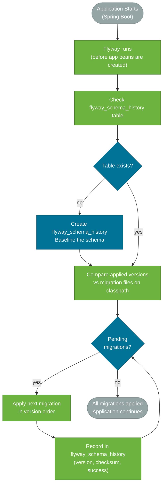

# Schema Migration with Flyway & Liquibase

> Schema migration tools version-control your database schema the same way Git version-controls your code — ensuring that every environment (local, staging, production) progresses through the same sequence of changes, reproducibly and safely.

## What Problem Does It Solve?

Without migration tools, schema changes are applied manually: a DBA runs `ALTER TABLE ...` on production, and developers run it on their local databases. Problems this creates:

- **Environment drift** — developer A applied the change, developer B did not. Tests pass for A, fail for B.
- **No history** — you cannot tell what schema version production is running, or what changed and when.
- **Unsafe rollouts** — applying a multi-step schema change without coordinating with the running application causes errors mid-deploy.
- **Broken CI/CD** — automated tests fail in CI because the test database is out of sync with the code.

Migration tools solve this by storing schema changes as versioned files alongside your code. At startup the tool compares the database's current version against the repo's migration files and applies any missing ones in order.

## Flyway

Flyway is the simpler of the two tools. Migrations are plain SQL scripts (or optionally Java classes) named with a strict versioning convention.

### Migration Naming Convention

```
V{version}__{description}.sql

V1__create_users_table.sql
V2__add_email_index.sql
V3__add_orders_table.sql
V4__add_order_status_column.sql
```

- `V` prefix = versioned migration (runs once)
- `R` prefix = repeatable migration (re-runs whenever the checksum changes — useful for views and stored procedures)
- Two underscores `__` separate version from description
- Versions are compared **lexicographically** — `V1`, `V2`, `V10` (note: `V10` after `V9`, not after `V1`)

### How Flyway Works



*Caption: Flyway startup sequence — runs before the application context finishes loading, ensuring the database schema matches the codebase before any JPA entities or repositories are used.*

### Setup in Spring Boot

```xml
<!-- pom.xml -->
<dependency>
    <groupId>org.flywaydb</groupId>
    <artifactId>flyway-core</artifactId>
    <!-- version managed by Spring Boot BOM -->
</dependency>
<!-- For MySQL/MariaDB, add the database-specific module too -->
<dependency>
    <groupId>org.flywaydb</groupId>
    <artifactId>flyway-mysql</artifactId>
</dependency>
```

```yaml
# application.yml
spring:
  flyway:
    enabled: true
    locations: classpath:db/migration        # ← where to find migration files
    baseline-on-migrate: false               # ← set true only for existing databases
    validate-on-migrate: true                # ← abort if a migration file was modified
    out-of-order: false                      # ← reject migrations with a lower version than the latest
```

### Migration File Examples

```
src/main/resources/db/migration/
  V1__create_users_table.sql
  V2__create_orders_table.sql
  V3__add_orders_indexes.sql
  V4__add_user_phone_column.sql
```

```sql
-- V1__create_users_table.sql
CREATE TABLE users (
    id         BIGSERIAL PRIMARY KEY,
    email      VARCHAR(255) NOT NULL UNIQUE,
    name       VARCHAR(255) NOT NULL,
    active     BOOLEAN NOT NULL DEFAULT TRUE,
    created_at TIMESTAMP    NOT NULL DEFAULT NOW()
);

-- V2__create_orders_table.sql
CREATE TABLE orders (
    id           BIGSERIAL PRIMARY KEY,
    user_id      BIGINT       NOT NULL REFERENCES users(id),
    status       VARCHAR(50)  NOT NULL DEFAULT 'PENDING',
    total_amount NUMERIC(12,2) NOT NULL,
    created_at   TIMESTAMP    NOT NULL DEFAULT NOW()
);

-- V3__add_orders_indexes.sql
CREATE INDEX idx_orders_user_id ON orders(user_id);
CREATE INDEX idx_orders_status  ON orders(status, created_at DESC);

-- V4__add_user_phone_column.sql
ALTER TABLE users ADD COLUMN phone VARCHAR(30);  -- ← nullable: backward compatible
```

:::tip Make schema changes backward compatible
Add nullable columns (safe), add tables (safe), add indexes (take an exclusive lock briefly). Avoid dropping columns until the code that references them has been deployed and removed — drop in a later migration.
:::

### Java-Based Migration (for data migrations)

```java
// db/migration/V5__backfill_user_status.java
@Component
public class V5__backfill_user_status extends BaseJavaMigration {

    @Override
    public void migrate(Context context) throws Exception {
        try (Statement st = context.getConnection().createStatement()) {
            // Data migration: set a default value for existing rows
            st.execute("""
                UPDATE users
                SET status = 'LEGACY'
                WHERE status IS NULL
                  AND created_at < '2024-01-01'
            """);
        }
    }
}
```

## Liquibase

Liquibase uses **changelogs** (XML, YAML, JSON, or SQL) and **changesets** instead of plain versioned SQL files. Each changeset is identified by an `id` and `author` pair rather than a filename version.

### Core Concepts

| Concept | Description |
|---------|-------------|
| **Changelog** | The master file listing all changesets |
| **Changeset** | A single atomic change (CREATE TABLE, ADD COLUMN, etc.) |
| **Preconditions** | Guards that skip or fail a changeset if a condition is not met |
| **Rollback** | Optional reverse instruction for each changeset |

### Setup in Spring Boot

```xml
<dependency>
    <groupId>org.liquibase</groupId>
    <artifactId>liquibase-core</artifactId>
</dependency>
```

```yaml
spring:
  liquibase:
    change-log: classpath:db/changelog/db.changelog-master.yaml
    enabled: true
```

### Changelog Format (YAML)

```yaml
# db/changelog/db.changelog-master.yaml
databaseChangeLog:
  - include:
      file: db/changelog/changes/001-create-users.yaml
  - include:
      file: db/changelog/changes/002-create-orders.yaml
  - include:
      file: db/changelog/changes/003-add-indexes.yaml
```

```yaml
# db/changelog/changes/001-create-users.yaml
databaseChangeLog:
  - changeSet:
      id: 001-create-users
      author: gajanan
      comment: Create the users table
      changes:
        - createTable:
            tableName: users
            columns:
              - column:
                  name: id
                  type: BIGINT
                  autoIncrement: true
                  constraints:
                    primaryKey: true
              - column:
                  name: email
                  type: VARCHAR(255)
                  constraints:
                    nullable: false
                    unique: true
              - column:
                  name: name
                  type: VARCHAR(255)
                  constraints:
                    nullable: false
              - column:
                  name: active
                  type: BOOLEAN
                  defaultValueBoolean: true
      rollback:                           # ← explicit rollback instruction
        - dropTable:
            tableName: users
```

### Liquibase with Raw SQL

Liquibase also supports raw SQL changesets when database-specific syntax is needed:

```yaml
- changeSet:
    id: 003-add-indexes
    author: gajanan
    changes:
      - sql:
          sql: CREATE INDEX idx_orders_user_id ON orders(user_id)
          splitStatements: false
    rollback:
      - sql:
          sql: DROP INDEX idx_orders_user_id
```

## Flyway vs Liquibase Comparison

| Feature | Flyway | Liquibase |
|---------|--------|-----------|
| **Migration format** | SQL scripts (or Java) | XML/YAML/JSON/SQL changesets |
| **Simplicity** | ✅ Simpler — just SQL files | More complex setup and concepts |
| **Rollback** | ❌ No automatic rollback (pro edition only) | ✅ Built-in rollback support |
| **Database portability** | Limited — SQL is DB-specific | ✅ Abstract syntax generates DB-specific SQL |
| **Checksum on modify** | ✅ Fails if modified migration is detected | ✅ Same |
| **Spring Boot autoconfigure** | ✅ Zero-config from `classpath:db/migration` | ✅ Zero-config from changelog location |
| **Team familiarity** | Higher (SQL is universal) | Lower (YAML/XML syntax to learn) |
| **Best for** | Teams comfortable with raw SQL and simpler needs | Teams needing rollback support or DB portability |

**Rule of thumb:** Start with Flyway. Switch to Liquibase if you need rollback scripting or plan to support multiple database vendors.

## Multi-Environment Strategy

```yaml
# application-dev.yml — H2 in-memory for tests
spring:
  datasource:
    url: jdbc:h2:mem:testdb;DB_CLOSE_DELAY=-1
  flyway:
    baseline-on-migrate: false

# application-prod.yml — PostgreSQL
spring:
  datasource:
    url: jdbc:postgresql://${DB_HOST}:5432/${DB_NAME}
  flyway:
    baseline-on-migrate: false   # ← set true only when adopting Flyway on existing DB
    validate-on-migrate: true    # ← abort on tampered migrations in prod
    out-of-order: false          # ← reject out-of-sequence migrations in prod
```

:::warning Never modify a migration file after it has been applied to any environment
Flyway and Liquibase both track file checksums. If you modify a migration that already ran on a developer's machine or staging, the tool will abort startup with a `MigrationChecksumMismatch` error. Always create a new versioned file for corrections.
:::

## Testing with Migrations

```java
// Integration test: Flyway runs migrations on H2 in-memory database
@SpringBootTest
@TestPropertySource(properties = {
    "spring.datasource.url=jdbc:h2:mem:testdb;DB_CLOSE_DELAY=-1",
    "spring.datasource.driver-class-name=org.h2.Driver",
    "spring.flyway.enabled=true"
})
class OrderRepositoryTest {

    @Autowired
    private OrderRepository orderRepository;

    @Test
    void shouldSaveAndFindOrder() {
        // Schema was already applied by Flyway before this test runs
        Order saved = orderRepository.save(new Order(...));
        assertThat(orderRepository.findById(saved.getId())).isPresent();
    }
}
```

## Best Practices

- **One concern per migration file** — don't combine table creation and data backfills in one script. Smaller, focused migrations are easier to debug and revert.
- **Make migrations backward compatible** — new columns should be nullable initially so both old and new app versions can run during a rolling deploy.
- **Never delete or modify applied migrations** — create a new migration to correct mistakes instead.
- **Use descriptive names** — `V7__add_product_description_text_search_index.sql` is better than `V7__update.sql`.
- **Include indexes in early migrations** — don't wait to add them; missing FK indexes are a common performance problem.
- **Test migrations in CI** — run your full migration sequence against a fresh database in every CI build to catch errors before production.
- **Separate DDL from DML** — schema changes and data migrations are different risk profiles; keep them in separate files.

## Common Pitfalls

**1. Modifying an already-applied migration**

If you edit `V3__add_orders_table.sql` after it has been applied anywhere, all other environments will fail on next startup with a checksum mismatch. Fix: create `V3_1__fix_orders_table.sql` (or for Liquibase, a new changeset).

**2. Blocking DDL in production**

`ALTER TABLE ... ADD COLUMN NOT NULL DEFAULT 'x'` on a table with millions of rows creates an exclusive lock that blocks all reads and writes while the column is backfilled. Use the expand-contract pattern:
1. Migration 1: `ADD COLUMN phone VARCHAR(30)` (nullable — no lock)
2. Deploy app with backfill logic
3. Migration 2: Backfill existing rows in batches
4. Migration 3: `ALTER COLUMN phone SET NOT NULL` only after all rows are filled

**3. Running Flyway with `ddl-auto=create` or `update`**

```yaml
# WRONG in any environment except throw-away test runs
spring.jpa.hibernate.ddl-auto: create

# CORRECT for production and staging
spring.jpa.hibernate.ddl-auto: validate   # ← JPA validates schema matches entities but doesn't change it
```

`hibernate.ddl-auto` and Flyway should not both be managing schema. Use Flyway for schema changes and set `ddl-auto=validate` or `none` in production.

**4. Not planning for rollback**

Flyway has no built-in rollback (in the open-source version). Plan for rollback at the application level: ensure your migration is backward compatible so you can roll the app back without rolling back the migration. Database rollbacks of `ALTER TABLE` on large tables are themselves expensive.

## Interview Questions

### Beginner

**Q: What is a database migration tool and why do you use one?**  
**A:** A migration tool (Flyway or Liquibase) tracks and applies schema changes as versioned files, ensuring every environment runs the same sequence of changes. Without it, schema changes are manual and error-prone, leading to environment drift and broken CI builds.

**Q: What is the naming convention for Flyway migrations?**  
**A:** `V{version}__{description}.sql` — for example `V3__add_orders_table.sql`. The `V` prefix means it runs once. The double underscore separates the version number from the description. Versions are compared lexicographically, so use consistent padding (`V01`, `V02`) or numeric values that sort correctly.

### Intermediate

**Q: What happens if you modify an already-applied Flyway migration?**  
**A:** Flyway stores a checksum of each migration file in the `flyway_schema_history` table. If the file changes, the checksum no longer matches and Flyway throws a `MigrationChecksumMismatch` error on startup, aborting before any new migrations run. Fix by creating a new migration file with the correction instead.

**Q: What is the difference between Flyway and Liquibase?**  
**A:** Flyway uses plain versioned SQL files — simpler but no built-in rollback in the open-source edition and SQL is database-specific. Liquibase uses structured changelogs (YAML/XML/JSON) that can generate DB-specific SQL, and has built-in rollback support. Flyway is easier to learn; Liquibase is more powerful for teams needing rollback scripts or multi-database portability.

**Q: How should you configure `hibernate.ddl-auto` when using Flyway?**  
**A:** Set it to `validate` (JPA checks entity-to-schema mapping at startup but makes no changes) or `none`. Never use `create`, `create-drop`, or `update` alongside Flyway — Hibernate would modify the schema outside Flyway's awareness, breaking the migration history.

### Advanced

**Q: How do you safely add a NOT NULL column to a large production table?**  
**A:** Use the expand-contract pattern in separate migrations:
1. (`V10`) `ALTER TABLE ADD COLUMN phone VARCHAR(30)` — nullable, no lock
2. Deploy application that populates `phone` for new rows
3. (`V11`) Batch UPDATE to fill `phone` for existing rows (done in batches to avoid long locks)
4. (`V12`) `ALTER TABLE ALTER COLUMN phone SET NOT NULL` — only after all rows are filled
5. (`V13`) (optional) Add NOT NULL constraint once verified

**Q: How do you adopt Flyway on an existing database that already has a schema?**  
**A:** Use `baseline-on-migrate: true` and `baseline-version` (default `1`). Flyway will mark the current state as version 1 in `flyway_schema_history` without running any migrations, then proceed to apply only new migration files with version > 1. Alternatively, generate a baseline script from the existing schema using `flyway baseline` CLI.

## Further Reading

- [Flyway documentation](https://flywaydb.org/documentation/) — complete reference including naming conventions, configuration, and Flyway Maven/Gradle plugins
- [Liquibase documentation](https://docs.liquibase.com/) — official guide for changelogs, changetypes, and rollback
- [Spring Boot database initialization](https://docs.spring.io/spring-boot/docs/current/reference/html/howto.html#howto.data-initialization.migration-tool) — how Spring Boot auto-configures Flyway and Liquibase

## Related Notes

- [SQL Fundamentals](./sql-fundamentals.md) — migration files contain SQL DDL and DML; solid SQL knowledge is a prerequisite.
- [Indexes & Query Performance](./indexes-query-performance.md) — `CREATE INDEX` statements belong in migration files, not in JPA annotations for production environments.
- [Transactions & ACID](./transactions-acid.md) — DDL migrations in PostgreSQL run inside transactions; a failed migration file is fully rolled back.
- [Connection Pooling](./connection-pooling.md) — Flyway runs migrations over the same DataSource and connection pool before the application starts.
