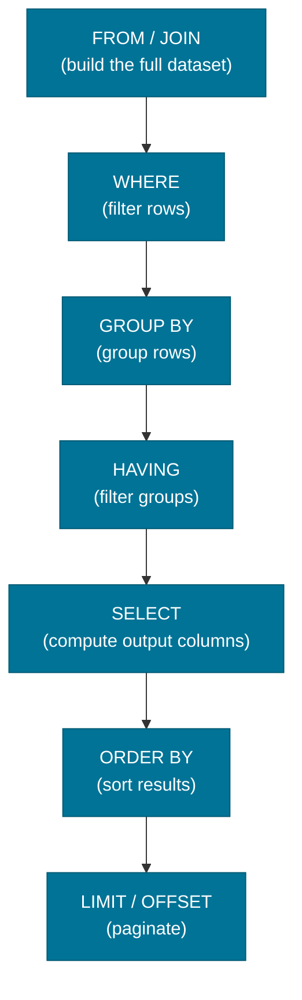
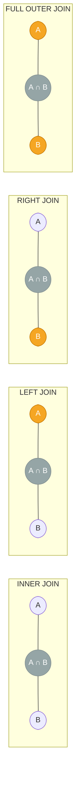

# SQL Fundamentals

> SQL (Structured Query Language) is the universal language for querying, inserting, updating, and deleting data in relational databases — and the foundation every backend engineer must know cold.

## What Problem Does It Solve?

Without a standard query language, every database would require application-specific APIs to store and retrieve data. SQL solves this by providing a **declarative, set-based language**: you describe *what data you want*, not *how to find it*. The database engine figures out the optimal execution plan. This separation lets you write readable, portable queries that work across PostgreSQL, MySQL, Oracle, and H2 (used in Spring Boot tests).

## What Is SQL?

SQL is a **declarative language** structured around four command types:

| Category | Commands | Purpose |
|----------|----------|---------|
| **DQL** (Query) | `SELECT` | Read data |
| **DML** (Manipulation) | `INSERT`, `UPDATE`, `DELETE` | Modify rows |
| **DDL** (Definition) | `CREATE`, `ALTER`, `DROP` | Manage schema |
| **TCL** (Transaction) | `COMMIT`, `ROLLBACK`, `SAVEPOINT` | Control transactions |

Most interview questions focus on DQL (read queries), which is where the real complexity lives.

## How It Works

A SQL `SELECT` query is processed in a **specific logical order** — different from the order you write it. Misunderstanding this order causes subtle bugs:



*Caption: Logical order of SQL SELECT clause processing — writing ORDER differs from evaluation order. Key insight: `WHERE` runs before `GROUP BY`, so you cannot filter on an aggregate in `WHERE`; use `HAVING` instead.*

### SELECT and Projections

```sql
-- Basic projection: pick specific columns
SELECT first_name, last_name, email
FROM users
WHERE active = true
ORDER BY last_name ASC
LIMIT 20;

-- Column aliases
SELECT order_id,
       total_amount * 1.1 AS total_with_tax   -- ← alias computed column
FROM orders;
```

### JOIN Types

A `JOIN` combines rows from two tables based on a condition. The most commonly tested join types:



*Caption: Venn diagram analogy for SQL JOINs — orange = rows included in result, gray = intersection (matching rows).*

```sql
-- INNER JOIN: only rows matching in both tables
SELECT u.name, o.order_date
FROM users u
INNER JOIN orders o ON u.id = o.user_id;   -- ← rows with no orders are excluded

-- LEFT JOIN: all users, even those without orders
SELECT u.name, o.order_date
FROM users u
LEFT JOIN orders o ON u.id = o.user_id;    -- ← o columns will be NULL for users with no orders

-- Self JOIN: compare rows within the same table
SELECT e.name AS employee, m.name AS manager
FROM employees e
LEFT JOIN employees m ON e.manager_id = m.id;  -- ← join a table to itself

-- Multiple JOINs
SELECT u.name, o.total_amount, p.name AS product
FROM users u
JOIN orders o      ON u.id = o.user_id
JOIN order_items i ON o.id = i.order_id
JOIN products p    ON i.product_id = p.id;
```

### GROUP BY and Aggregates

`GROUP BY` collapses many rows into one per group, enabling aggregate functions:

```sql
-- Count orders per user, filter to users with > 5 orders
SELECT user_id,
       COUNT(*)          AS order_count,
       SUM(total_amount) AS total_spent,
       AVG(total_amount) AS avg_order
FROM orders
WHERE status = 'COMPLETED'          -- ← filter rows BEFORE grouping
GROUP BY user_id
HAVING COUNT(*) > 5                 -- ← filter groups AFTER aggregation
ORDER BY total_spent DESC;
```

### Subqueries

A subquery is a `SELECT` nested inside another statement. Three common forms:

```sql
-- 1. Scalar subquery (returns one value)
SELECT name,
       (SELECT COUNT(*) FROM orders WHERE user_id = u.id) AS order_count
FROM users u;

-- 2. IN subquery (row membership check)
SELECT name FROM products
WHERE category_id IN (
    SELECT id FROM categories WHERE parent_id = 10
);

-- 3. Correlated subquery (references outer query — runs once per outer row)
SELECT name FROM employees e
WHERE salary > (
    SELECT AVG(salary) FROM employees WHERE department_id = e.department_id
);
```

:::tip Use JOINs over correlated subqueries for performance
Correlated subqueries execute once per outer row — O(n) database round trips. Rewriting as a `JOIN` against a derived table or CTE usually lets the optimizer use a hash join instead.
:::

### Window Functions

Window functions compute a value across a **set of rows related to the current row** — without collapsing them into groups. They're powerful for rankings, running totals, and partitioned analytics:

```sql
-- Running total of sales, partitioned by user
SELECT
    user_id,
    order_date,
    total_amount,
    SUM(total_amount) OVER (
        PARTITION BY user_id          -- ← reset sum for each user
        ORDER BY order_date           -- ← accumulate in date order
        ROWS BETWEEN UNBOUNDED PRECEDING AND CURRENT ROW
    ) AS running_total
FROM orders;

-- Rank products by price within each category
SELECT
    name,
    category_id,
    price,
    RANK()       OVER (PARTITION BY category_id ORDER BY price DESC) AS price_rank,
    ROW_NUMBER() OVER (PARTITION BY category_id ORDER BY price DESC) AS row_num,
    DENSE_RANK() OVER (PARTITION BY category_id ORDER BY price DESC) AS dense_rank
FROM products;

-- Lead/Lag to compare adjacent rows
SELECT
    order_date,
    total_amount,
    LAG(total_amount, 1)  OVER (ORDER BY order_date) AS previous_order,
    LEAD(total_amount, 1) OVER (ORDER BY order_date) AS next_order
FROM orders
WHERE user_id = 42;
```

**Difference between RANK, ROW_NUMBER, and DENSE_RANK:**

| Function | Ties | Gaps after ties |
|----------|------|-----------------|
| `ROW_NUMBER()` | Arbitrary order | No gaps |
| `RANK()` | Same rank | Gaps (1,1,3) |
| `DENSE_RANK()` | Same rank | No gaps (1,1,2) |

### CTEs (Common Table Expressions)

CTEs (`WITH` clause) name a subquery for readability and reuse:

```sql
WITH active_users AS (
    SELECT id, name FROM users WHERE active = true
),
user_order_totals AS (
    SELECT user_id, SUM(total_amount) AS lifetime_value
    FROM orders
    GROUP BY user_id
)
SELECT u.name, t.lifetime_value
FROM active_users u
JOIN user_order_totals t ON u.id = t.user_id
ORDER BY t.lifetime_value DESC;
```

## SQL in Spring Boot

Spring Boot exposes SQL through multiple layers. At the lowest level, `JdbcTemplate` gives direct SQL access without an ORM:

```java
@Repository
public class OrderRepository {

    private final JdbcTemplate jdbc;  // ← Spring auto-configures this

    public OrderRepository(JdbcTemplate jdbc) {
        this.jdbc = jdbc;
    }

    // Simple query: returns a list of mapped objects
    public List<Order> findByUserId(Long userId) {
        String sql = "SELECT id, total_amount, status FROM orders WHERE user_id = ?";
        return jdbc.query(sql,
            (rs, rowNum) -> new Order(
                rs.getLong("id"),
                rs.getBigDecimal("total_amount"),
                rs.getString("status")
            ),
            userId                  // ← positional parameter, prevents SQL injection
        );
    }

    // Named parameters (more readable for many parameters)
    public List<Order> findByStatus(String status, int limit) {
        String sql = """
            SELECT id, user_id, total_amount
            FROM orders
            WHERE status = :status
            ORDER BY created_at DESC
            LIMIT :limit
            """;
        MapSqlParameterSource params = new MapSqlParameterSource()
            .addValue("status", status)   // ← named parameters
            .addValue("limit", limit);

        NamedParameterJdbcTemplate namedJdbc = new NamedParameterJdbcTemplate(jdbc);
        return namedJdbc.query(sql, params,
            (rs, rowNum) -> new Order(rs.getLong("id"), rs.getBigDecimal("total_amount"), rs.getString("status"))
        );
    }
}
```

:::warning Always use parameterized queries
Never concatenate user input into SQL strings. Use `?` placeholders or `:namedParam` to prevent SQL injection — one of the OWASP Top 10 vulnerabilities.
:::

## Best Practices

- **Always parameterize** — never build SQL by string concatenation of user input.
- **SELECT only columns you need** — avoid `SELECT *` in production; it fetches unnecessary data and breaks if columns are reordered.
- **Prefer `EXISTS` over `IN` for subqueries** on nullable columns — `IN (NULL)` behaves unexpectedly.
- **Filter early with `WHERE`** — push predicates into the `WHERE` clause to reduce the row set before `GROUP BY`.
- **Use CTEs for readability** over deeply nested subqueries; modern optimizers treat them the same way.
- **Name join conditions explicitly** — prefer `INNER JOIN ... ON` over implicit comma joins in `FROM` for clarity.
- **Understand NULL semantics** — `NULL != NULL` in SQL; comparisons with `NULL` use `IS NULL` / `IS NOT NULL`.

## Common Pitfalls

**1. Filtering aggregates in WHERE instead of HAVING**
```sql
-- WRONG: WHERE runs before GROUP BY; COUNT(*) is not available yet
SELECT user_id, COUNT(*) FROM orders WHERE COUNT(*) > 5 GROUP BY user_id;

-- CORRECT: HAVING filters after GROUP BY
SELECT user_id, COUNT(*) FROM orders GROUP BY user_id HAVING COUNT(*) > 5;
```

**2. Mixing GROUP BY with non-aggregate columns**
```sql
-- WRONG (most databases): name is not in GROUP BY or an aggregate
SELECT name, COUNT(*) FROM orders GROUP BY user_id;

-- CORRECT
SELECT user_id, COUNT(*) FROM orders GROUP BY user_id;
```

**3. NULL in IN clauses**
```sql
-- Returns no rows if subquery returns any NULL!
SELECT * FROM users WHERE id NOT IN (SELECT user_id FROM orders);
-- Safe: use NOT EXISTS instead
SELECT * FROM users u WHERE NOT EXISTS (SELECT 1 FROM orders o WHERE o.user_id = u.id);
```

**4. LIMIT without ORDER BY**
```sql
-- WRONG: no guarantee which 10 rows you get
SELECT * FROM orders LIMIT 10;

-- CORRECT: deterministic pagination
SELECT * FROM orders ORDER BY created_at DESC, id DESC LIMIT 10;
```

**5. Implicit CROSS JOIN from forgotten ON clause**
```sql
-- WRONG: without ON, MySQL and some others silently produce a Cartesian product
SELECT * FROM users, orders WHERE users.id = orders.user_id;
-- CORRECT: always explicit JOIN ... ON
SELECT * FROM users JOIN orders ON users.id = orders.user_id;
```

## Interview Questions

### Beginner

**Q: What is the difference between WHERE and HAVING?**  
**A:** `WHERE` filters individual rows **before** grouping occurs. `HAVING` filters **groups** after `GROUP BY` has been applied. You need `HAVING` when your filter condition involves an aggregate function like `COUNT(*)` or `SUM()`.

**Q: What are the types of JOINs and when do you use each?**  
**A:** `INNER JOIN` returns only rows that have matches in both tables. `LEFT JOIN` returns all rows from the left table and matching rows from the right (NULLs where there's no match). `RIGHT JOIN` is the mirror. `FULL OUTER JOIN` returns all rows from both tables. Use `LEFT JOIN` when the second table data is optional (e.g., users without orders).

**Q: What does `GROUP BY` do?**  
**A:** It collapses all rows with the same value(s) in the specified column(s) into a single result row, allowing aggregate functions (`COUNT`, `SUM`, `AVG`, `MAX`, `MIN`) to operate per group.

### Intermediate

**Q: Explain window functions and how they differ from GROUP BY aggregates.**  
**A:** Window functions (`OVER (PARTITION BY ... ORDER BY ...)`) compute aggregates or rankings across a **window of rows related to the current row** without eliminating rows from the result set. `GROUP BY` collapses rows into one per group. So `SUM(...) OVER (PARTITION BY user_id)` gives you a running total alongside the original row data, whereas `SUM(...) GROUP BY user_id` gives you just one summary row per user.

**Q: What is a correlated subquery and why can it be slow?**  
**A:** A correlated subquery references columns from the outer query. This forces it to re-execute **once for every row in the outer result set**, making it O(n) in database round trips. For large datasets this is far slower than an equivalent `JOIN`. Rewriting with a `JOIN` or CTE lets the optimizer use hash joins or index scans instead.

**Q: What is the difference between RANK(), DENSE_RANK(), and ROW_NUMBER()?**  
**A:** All three assign a number to rows within a window. `ROW_NUMBER()` assigns a unique sequential number regardless of ties. `RANK()` gives tied rows the same number but skips the next rank (1,1,3). `DENSE_RANK()` gives tied rows the same number but never skips (1,1,2). Use `DENSE_RANK()` when you want "top N distinct ranks".

### Advanced

**Q: When would you use a CTE versus a subquery?**  
**A:** CTEs improve readability for complex multi-step queries and enable recursive queries (hierarchical data like trees). A non-recursive CTE is logically equivalent to an inline subquery — most modern optimizers treat them the same. Prefer CTEs when you need to reference the same derived table more than once, when the logic is complex enough to warrant naming, or when writing recursive queries.

**Q: How does SQL handle NULLs in aggregate functions and comparisons?**  
**A:** Aggregate functions like `COUNT(column)`, `SUM`, `AVG` **ignore NULLs** automatically. `COUNT(*)` counts all rows. In comparisons, `NULL = NULL` evaluates to `UNKNOWN` (not `TRUE`), so always use `IS NULL` / `IS NOT NULL`. This also means `column NOT IN (subquery with NULLs)` returns no rows, because `NOT IN` with a NULL resolves to `UNKNOWN`.

## Further Reading

- [PostgreSQL SQL Commands Reference](https://www.postgresql.org/docs/current/sql-commands.html) — authoritative reference for standard SQL and PostgreSQL extensions
- [Use The Index, Luke!](https://use-the-index-luke.com/sql/where-clause) — free book on SQL performance, especially joins and where-clause optimization
- [Spring JdbcTemplate docs](https://docs.spring.io/spring-framework/reference/data-access/jdbc/core.html#jdbc-JdbcTemplate) — official Spring JDBC template API guide

## Related Notes

- [Indexes & Query Performance](./indexes-query-performance.md) — writing efficient SQL is only half the story; understanding how indexes accelerate queries completes the picture.
- [Transactions & ACID](./transactions-acid.md) — SQL DML statements run within transactions; understanding ACID properties explains the guarantees your queries operate under.
- [Schema Migration](./schema-migration.md) — DDL statements (`CREATE TABLE`, `ALTER TABLE`) in production are managed through migration tools like Flyway.
