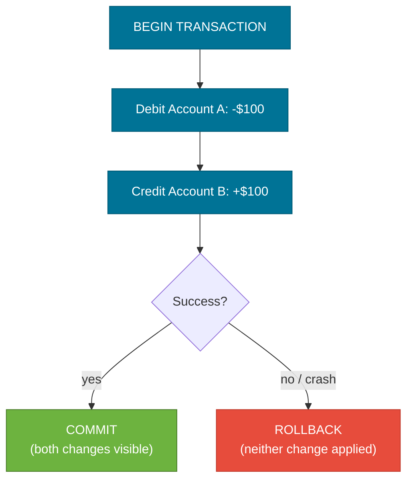
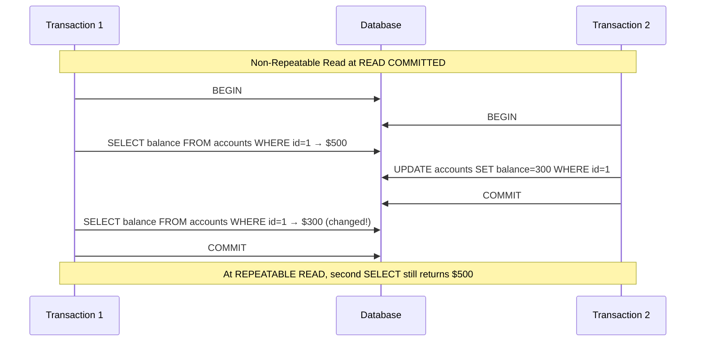
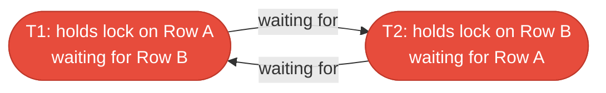

# Transactions & ACID

> A transaction is a unit of work that is treated as a single, indivisible operation — it either completes entirely or leaves the database unchanged. ACID is the set of guarantees that make this work correctly even when concurrent users and hardware failures are involved.

## What Problem Does It Solve?

Imagine a bank transfer: debit $100 from Account A, credit $100 to Account B. Without transactions, a server crash between the two operations leaves Account A debited but Account B never credited — money disappears. Concurrent reads add the second problem: one thread might read Account A's balance mid-transfer while another thread is halfway through updating it.

Transactions solve both problems:
- **Crash safety** — either both writes happen, or neither does (atomicity + durability).
- **Concurrent correctness** — concurrent transactions see consistent snapshots (isolation).

## The Four ACID Properties

### Atomicity

All operations in a transaction succeed together, or **none are applied at all**. On failure, the database rolls back every change made since the transaction started.



*Caption: Atomicity — a bank transfer treated as one atomic unit; a crash after the debit but before the credit triggers a full rollback.*

### Consistency

A transaction brings the database from one **valid state** to another valid state. Constraints (foreign keys, unique constraints, check constraints) are verified at commit time. If any constraint is violated, the transaction rolls back.

### Isolation

Concurrent transactions do not interfere with each other. Each transaction behaves as if it runs **serially** — even though multiple transactions may actually be interleaved. The actual degree of isolation is configurable through **isolation levels** (see below).

### Durability

Once a transaction is committed, its effects **survive crashes**. The database writes a commit record to a write-ahead log (WAL) on durable storage before acknowledging the commit to the client.

## Isolation Levels

Full serializability is the safest option but has the highest concurrency cost. SQL standards define four isolation levels, each preventing a different class of read anomaly:

### The Three Read Anomalies

| Anomaly | Description |
|---------|-------------|
| **Dirty Read** | Reading uncommitted changes from another in-flight transaction |
| **Non-Repeatable Read** | Reading the same row twice in one transaction and getting different values because another transaction updated and committed between the two reads |
| **Phantom Read** | A `SELECT` run twice returns different sets of rows because another transaction inserted or deleted rows and committed between the two reads |

### Isolation Level Matrix

| Isolation Level | Dirty Read | Non-Repeatable Read | Phantom Read | Typical Use |
|----------------|-----------|---------------------|--------------|-------------|
| `READ UNCOMMITTED` | Possible | Possible | Possible | Almost never used |
| `READ COMMITTED` | ✅ Prevented | Possible | Possible | Default in PostgreSQL, Oracle |
| `REPEATABLE READ` | ✅ Prevented | ✅ Prevented | Possible* | Default in MySQL InnoDB |
| `SERIALIZABLE` | ✅ Prevented | ✅ Prevented | ✅ Prevented | Financial, regulatory systems |

*MySQL InnoDB prevents phantom reads even at REPEATABLE READ through gap locks.



*Caption: Non-repeatable read anomaly — T1 reads different values for the same row within one transaction because T2 committed an update in between. REPEATABLE READ prevents this by locking the snapshot.*

## How Transaction Isolation Works Internally

Databases implement isolation without blocking every read, using either:

1. **MVCC (Multi-Version Concurrency Control)** — readers see a consistent snapshot of the data at the transaction's start time; writers create new versions of rows without locking readers. Used by PostgreSQL and MySQL InnoDB.
2. **Lock-based** — readers acquire shared locks, writers exclusive locks. Less concurrent but simpler. Used by older SQL Server configurations.

PostgreSQL uses MVCC: each row has a `xmin` (created by transaction ID) and `xmax` (deleted by transaction ID). A query sees rows where `xmin ≤ snapshot ID < xmax`.

## Deadlocks

A deadlock occurs when two transactions are each waiting for a lock the other holds, creating a cycle that can never resolve:



*Caption: Classic deadlock cycle — T1 and T2 each hold one lock and wait for the other's lock, creating a cycle the database must break by aborting one transaction.*

Databases detect deadlocks automatically and abort one of the transactions (returning an error). The application must **catch and retry** the aborted transaction.

**Prevention strategies:**
- Always acquire locks in the **same order** across transactions (e.g., always lock lower-ID rows first)
- Keep transactions short to minimize the window for lock conflicts
- Use `SELECT ... FOR UPDATE` deliberately — only when you intend to modify the row

## Transactions in Spring Boot

Spring's `@Transactional` annotation manages transactions declaratively:

```java
@Service
public class TransferService {

    @Transactional                          // ← Spring opens a transaction before this method
    public void transfer(Long fromId, Long toId, BigDecimal amount) {
        Account from = accountRepo.findById(fromId)
            .orElseThrow(() -> new EntityNotFoundException("Account " + fromId));
        Account to = accountRepo.findById(toId)
            .orElseThrow(() -> new EntityNotFoundException("Account " + toId));

        if (from.getBalance().compareTo(amount) < 0) {
            throw new InsufficientFundsException();   // ← runtime exception triggers rollback
        }

        from.debit(amount);
        to.credit(amount);
        // Spring commits here on normal return, or rolls back on unchecked exception
    }
}
```

### Setting Isolation Level

```java
@Transactional(isolation = Isolation.REPEATABLE_READ)  // ← override default
public BigDecimal calculateUserTotal(Long userId) {
    // Two reads of the same data will return consistent values
    BigDecimal orders  = orderRepo.sumByUserId(userId);
    BigDecimal credits = creditRepo.sumByUserId(userId);
    return orders.subtract(credits);
}
```

### Key @Transactional Properties

```java
@Transactional(
    isolation  = Isolation.READ_COMMITTED,        // default for most databases
    propagation = Propagation.REQUIRED,            // join existing or create new
    readOnly    = true,                            // hint to optimize — no writes
    timeout     = 30,                              // seconds before auto-rollback
    rollbackFor = { IOException.class }            // checked exceptions that trigger rollback
)
public List<Order> getRecentOrders(Long userId) { ... }
```

:::warning @Transactional only works on public methods called through the Spring proxy
Calling a `@Transactional` method from within the same class bypasses the proxy and the transaction is not applied. This is a very common Spring pitfall — always call transactional methods from a different bean.
:::

### Propagation Behaviors (the most important ones)

| Propagation | Behavior |
|-------------|----------|
| `REQUIRED` (default) | Joins existing transaction; creates a new one if none exists |
| `REQUIRES_NEW` | Always creates a new, independent transaction; suspends the existing one |
| `NESTED` | Creates a savepoint within the existing transaction; partial rollback possible |
| `SUPPORTS` | Joins existing if present; runs without transaction otherwise |
| `NOT_SUPPORTED` | Always runs without a transaction; suspends any existing one |
| `NEVER` | Throws an exception if a transaction is currently active |

```java
// Common pattern: logging/audit that must persist even if outer transaction rolls back
@Transactional(propagation = Propagation.REQUIRES_NEW)
public void logAuditEvent(AuditEvent event) {
    auditRepo.save(event);    // ← persists in its own transaction, independent of caller
}
```

## Best Practices

- **Keep transactions short** — long-running transactions hold locks, block other transactions, and increase the risk of deadlocks.
- **Use `@Transactional(readOnly = true)`** for read-only service methods — tells Hibernate to skip dirty checking and can enable read replicas.
- **Don't catch and swallow exceptions inside `@Transactional` methods** — Spring needs the exception to propagate to trigger the rollback.
- **Default isolation (`READ COMMITTED`) is correct for most use cases** — escalate to `REPEATABLE READ` only when you have a proven need.
- **Apply `@Transactional` at the service layer**, not the repository layer, so one service method can coordinate multiple repository calls in one transaction.
- **Handle `DeadlockLoserDataAccessException`** in callers — catch and retry with backoff for deadlock-prone operations.
- **Avoid distributed transactions (XA)** unless absolutely necessary — they are complex, slow, and fail in subtle ways. Prefer saga patterns for microservices.

## Common Pitfalls

**1. Transaction not applied because of self-invocation**
```java
@Service
public class OrderService {
    // WRONG: calling transactional method from same class — proxy is bypassed
    public void processAll() {
        this.processOrder(1L);  // ← no transaction applied
    }

    @Transactional
    public void processOrder(Long id) { ... }
}
```

**2. Rollback not triggered for checked exceptions**
```java
// By default, Spring only rolls back for RuntimeException (unchecked)
@Transactional
public void save(Order order) throws IOException {   // ← checked exception
    orderRepo.save(order);
    throw new IOException("disk full");              // ← transaction COMMITS, not rolls back!
}

// Fix: explicitly declare rollbackFor
@Transactional(rollbackFor = IOException.class)
public void save(Order order) throws IOException { ... }
```

**3. Reading stale data inside REPEATABLE READ**

If your transaction starts, another transaction modifies a row and commits, and your transaction tries to update that same row, you may see a `could not serialize access due to concurrent update` error at SERIALIZABLE level, or silently overwrite the newer data at REPEATABLE READ. Use optimistic locking (`@Version` in JPA) to detect this.

**4. Fetching lazy relations outside a transaction**
```java
// WRONG: transaction ended; lazy @OneToMany collection triggers LazyInitializationException
Order order = orderRepo.findById(1L).get();  // transaction ended after this call
order.getItems().size();                     // LazyInitializationException!
```

## Interview Questions

### Beginner

**Q: What does ACID stand for?**  
**A:** Atomicity (all or nothing), Consistency (constraints always valid), Isolation (concurrent transactions don't interfere), Durability (committed data survives crashes). These are the four guarantees that make relational database transactions reliable.

**Q: What is the difference between COMMIT and ROLLBACK?**  
**A:** `COMMIT` finalizes all changes made in the current transaction — they become visible to other transactions and are written durably to disk. `ROLLBACK` undoes all changes made in the current transaction, returning the database to the state it was in when the transaction started.

### Intermediate

**Q: What are the SQL isolation levels and what anomaly does each prevent?**  
**A:** `READ UNCOMMITTED` prevents nothing. `READ COMMITTED` prevents dirty reads (the default in PostgreSQL). `REPEATABLE READ` additionally prevents non-repeatable reads (same row, different values on two reads in one transaction). `SERIALIZABLE` additionally prevents phantom reads (a re-executed range query returns different rows). Each higher level trades concurrency for correctness.

**Q: What is a deadlock and how does Spring Boot handle it?**  
**A:** A deadlock is when two transactions each hold a lock while waiting for the other's lock, creating a cycle. The database detects this and aborts one transaction with an error. Spring translates this to `DeadlockLoserDataAccessException`. Applications should catch it and retry the entire transaction with a backoff strategy.

**Q: Why doesn't `@Transactional` work on private methods or self-invocations?**  
**A:** Spring implements `@Transactional` via a proxy that wraps the bean. Calls to the bean go through the proxy, which applies transactional behavior. When a method calls another method **on the same object** (`this.method()`), it bypasses the proxy entirely and the transaction advice is never applied. Fix: inject the bean into itself, use `ApplicationContext.getBean()`, or restructure into separate beans.

### Advanced

**Q: How does MVCC implement isolation without blocking reads?**  
**A:** Multi-Version Concurrency Control keeps multiple versions of each row. Each row has metadata about which transaction created and deleted it. When a read transaction starts, it gets a snapshot ID. It sees only rows whose creation transaction ID ≤ snapshot ID and whose deletion transaction ID is either null or > snapshot ID. Writers create new row versions; readers see the old version. This allows reads and writes to proceed concurrently without mutual blocking, at the cost of a vacuum/purge process to clean up old versions.

**Q: What is the difference between optimistic and pessimistic locking, and when do you choose each?**  
**A:** Pessimistic locking (`SELECT ... FOR UPDATE`) acquires a database lock immediately, blocking other writers until the transaction commits. It's correct but reduces concurrency. Optimistic locking (JPA `@Version` field) doesn't lock — it lets concurrent updates proceed, but at commit time it checks whether the version column matches. If another transaction updated in the meantime, it throws `OptimisticLockException`. Choose pessimistic for high-conflict scenarios where retries are expensive; choose optimistic for low-conflict scenarios (most reads, rare writes) to maximize throughput.

## Further Reading

- [PostgreSQL Transaction Isolation docs](https://www.postgresql.org/docs/current/transaction-iso.html) — authoritative explanation of MVCC and isolation levels in PostgreSQL
- [Spring Framework — Transaction Management](https://docs.spring.io/spring-framework/reference/data-access/transaction.html) — complete Spring transaction reference
- [Baeldung: Spring @Transactional](https://www.baeldung.com/transaction-configuration-with-jpa-and-spring) — practical examples of isolation, propagation, and pitfalls

## Related Notes

- [SQL Fundamentals](./sql-fundamentals.md) — DML statements (`INSERT`, `UPDATE`, `DELETE`) are the operations transactions wrap.
- [Indexes & Query Performance](./indexes-query-performance.md) — index updates participate in transactions and can be sources of lock contention.
- [Connection Pooling](./connection-pooling.md) — transactions borrow a connection from the pool; long transactions hold pool connections and can cause connection exhaustion.
