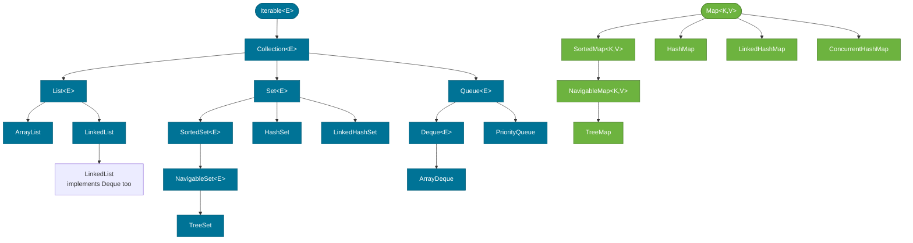
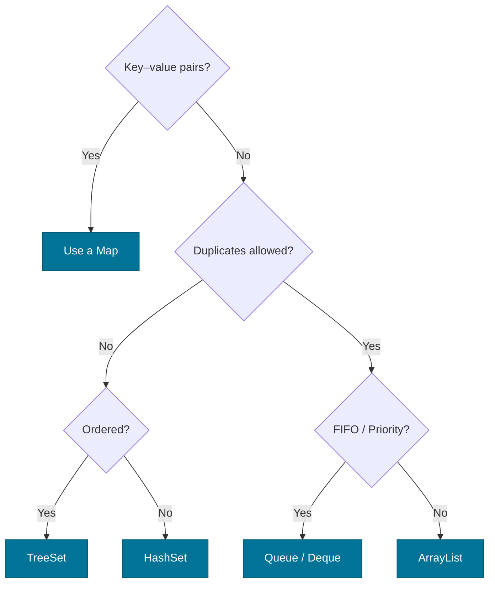

# Collections Hierarchy

> The Java Collections Framework is a unified architecture of interfaces and implementations that lets you work with groups of objects through a common API — regardless of whether the underlying data structure is an array, a linked list, a hash table, or a tree.

## What Problem Does It Solve?

Before Java 2 (JDK 1.2), collections were a mess: `Vector`, `Hashtable`, `Stack`, and raw arrays all had incompatible APIs. Adding an element to a `Vector` used `addElement()`; doing the same to a `Hashtable` meant `put()`. There was no common abstraction, so code was impossible to generalize.

The Collections Framework introduced a **consistent set of interfaces** so that any code accepting a `Collection<String>` works equally well with an `ArrayList`, `HashSet`, or `LinkedList`. This is the power of programming to an interface.

## The Interface Tree

The hierarchy splits into two trees: one rooted at `Collection`, and one rooted at `Map`.



*The two root trees: `Iterable → Collection → List/Set/Queue` on the left, and `Map` on the right. Implementations are shown at the leaves.*

## Why Map Is Separate

`Map<K,V>` stores key-value pairs, not individual elements. It does not extend `Collection` because iterating a `Map` is ambiguous — do you iterate keys? values? entries? The `Collection` contract requires a single `iterator()`, which doesn't fit. Instead, `Map` exposes three views:

- `keySet()` → a `Set<K>`
- `values()` → a `Collection<V>`
- `entrySet()` → a `Set<Map.Entry<K,V>>`

## Key Interfaces at a Glance

| Interface | Guarantees | Does NOT guarantee |
|-----------|------------|-------------------|
| `Collection<E>` | Can add/remove/iterate elements | Order, uniqueness, null policy |
| `List<E>` | Indexed access, insertion order preserved | Uniqueness |
| `Set<E>` | Uniqueness (no duplicates) | Order (unless `SortedSet`) |
| `SortedSet<E>` | Ascending element order | Constant-time access |
| `Queue<E>` | FIFO or priority ordering for head operations | Random access |
| `Deque<E>` | Double-ended — add/remove from both ends | — |
| `Map<K,V>` | Key uniqueness | Value uniqueness, order |
| `SortedMap<K,V>` | Keys in ascending order | — |

## The `Iterable` Contract

`Iterable<E>` lives in `java.lang`, not `java.util`. It has one method:

```java
Iterator<E> iterator();
```

Any class that implements `Iterable` can be used in a **for-each loop**:

```java
List<String> names = List.of("Alice", "Bob", "Charlie");
for (String name : names) {          // ← compiler rewrites to iterator() call
    System.out.println(name);
}
```

The `Collection` interface extends `Iterable` and adds `size()`, `contains()`, `add()`, `remove()`, `isEmpty()`, and `toArray()`.

## Core Contracts Every Developer Must Know

### `equals` and `hashCode`

`HashSet` and `HashMap` rely on `hashCode()` to locate the bucket and `equals()` to confirm identity. If you override one, you **must** override the other. Violating this contract causes elements to be "lost" inside sets and maps.

### `Comparable` and `Comparator`

`TreeSet` and `TreeMap` require elements/keys to be ordered. They use:
- `Comparable<T>` — the class defines its own natural ordering (e.g., `String`, `Integer`).
- `Comparator<T>` — an external ordering strategy passed to the constructor.

See [Sorting & Ordering](./sorting-and-ordering.md) for a full breakdown.

## Choosing the Right Collection



*A quick decision tree for picking the right collection type.*

## Best Practices

- **Program to the interface**, not the implementation: `List<String> list = new ArrayList<>()` not `ArrayList<String> list = new ArrayList<>()`. This lets you change implementation without touching callers.
- **Prefer `List.of`, `Set.of`, `Map.of`** (Java 9+) for read-only collections — they are null-safe, immutable, and more memory-efficient than `Arrays.asList`.
- **Override `equals`/`hashCode` together** whenever an object will be stored in a `HashSet` or as a `HashMap` key.
- **Don't use `Vector` or `Hashtable`** — they are legacy synchronized wrappers with poor performance; use `ArrayList` + external sync or `ConcurrentHashMap` instead.
- **Size before iterating** when performance matters: `list.size()` is O(1) for `ArrayList` but O(n) for some older structures.

## Common Pitfalls

- **Modifying a collection while iterating** with a for-each loop throws `ConcurrentModificationException`. Use `iterator.remove()` or stream filtering instead.
- **Confusing `Collection` and `Collections`** — `Collection` is the interface; `Collections` (plural) is a utility class with static helpers like `sort`, `shuffle`, and `unmodifiableList`.
- **Assuming `Map` is a `Collection`** — `Map` does not extend `Collection`. You cannot pass a `Map` where a `Collection` is expected.
- **`Arrays.asList()` vs `List.of()`** — `Arrays.asList` returns a fixed-size list backed by an array (you can `set`, but not `add`/`remove`). `List.of` is fully immutable.

## Interview Questions

### Beginner

**Q:** What is the root interface of the Java Collections Framework?  
**A:** `java.lang.Iterable<E>`. Below it sits `java.util.Collection<E>`, which is the root of the collection interfaces. `Map` is a separate root and does not extend `Collection`.

**Q:** Why doesn't `Map` extend `Collection`?  
**A:** `Collection` requires a single `iterator()` method that returns elements one at a time. A `Map` stores key-value pairs, and iterating keys, values, or entries are three different operations — there is no single natural element type to iterate over.

### Intermediate

**Q:** What is the difference between `Collection` and `Collections`?  
**A:** `Collection` (singular) is the root interface in `java.util` that `List`, `Set`, and `Queue` extend. `Collections` (plural) is a utility class in `java.util` containing only static methods — `sort()`, `binarySearch()`, `unmodifiableList()`, etc.

**Q:** When should you use `Set` over `List`?  
**A:** Use `Set` when uniqueness is a business requirement — e.g., a set of active session IDs. A `Set` enforces no duplicates at the data structure level, removing the need for manual checks. Use `List` when you need order, duplicates, or indexed access.

### Advanced

**Q:** Explain the role of `equals` and `hashCode` in `HashSet` and `HashMap`.  
**A:** `HashSet`/`HashMap` use `hashCode()` to find the bucket (array slot) and then `equals()` to find the exact element in that bucket's chain/tree. If two objects are equal (per `equals`) but have different hash codes, they land in different buckets and appear as separate entries — a broken contract. The JLS requires: if `a.equals(b)` then `a.hashCode() == b.hashCode()`. Violating this silently corrupts `Set` and `Map` behavior.

**Q:** What is the difference between `SortedSet` and `NavigableSet`?  
**A:** `SortedSet` (Java 2) provides basic ascending-order operations: `first()`, `last()`, `headSet()`, `tailSet()`, `subSet()`. `NavigableSet` (Java 6) extends it with richer navigation: `floor()`, `ceiling()`, `lower()`, `higher()`, `descendingSet()`, and `pollFirst()`/`pollLast()`. `TreeSet` implements `NavigableSet`.

## Further Reading

- [Java Tutorials — Collections Interfaces](https://docs.oracle.com/javase/tutorial/collections/interfaces/index.html) — Oracle's official walkthrough of every interface in the hierarchy
- [Collection Javadoc (Java 21)](https://docs.oracle.com/en/java/javase/21/docs/api/java.base/java/util/Collection.html) — authoritative API reference

## Related Notes

- [List](./list.md) — `ArrayList` vs. `LinkedList` with O-complexity analysis
- [Map](./map.md) — `HashMap` internals, buckets, and tree bins
- [Sorting & Ordering](./sorting-and-ordering.md) — `Comparable` vs. `Comparator` for `TreeSet` and `TreeMap`
