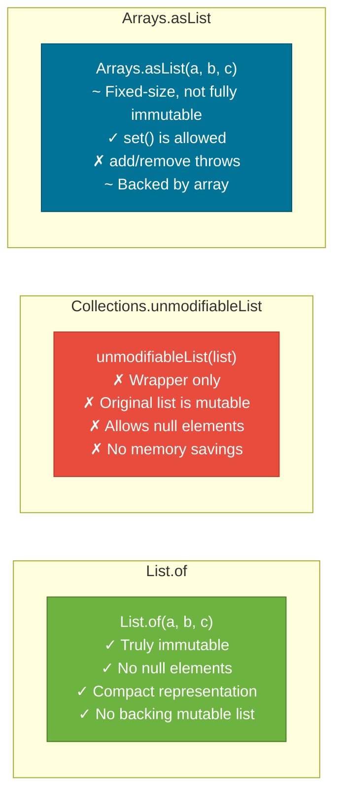

# Immutable Collections

> Immutable collections, introduced as a first-class feature in Java 9 via `List.of()`, `Set.of()`, and `Map.of()`, are collections that refuse any structural modification after creation — they throw `UnsupportedOperationException` on any mutating call and offer compact, null-free, memory-efficient storage.

## What Problem Does It Solve?

Before Java 9, creating a small immutable list required verbose ceremony:

```java
// Java 8 — four lines to create an unmodifiable three-element list
List<String> list = new ArrayList<>();
list.add("a"); list.add("b"); list.add("c");
List<String> immutable = Collections.unmodifiableList(list);
// BUT: original 'list' can still be mutated, mutating the "immutable" view too!
```

This is not truly immutable — it is a thin write-blocking wrapper around a mutable list. Callers who hold a reference to the original `list` can still add or remove elements.

Java 9 introduced **value-based factory methods** that create genuinely immutable collections in a single expression, with less memory and better null-safety.

## Java 9+ Factory Methods

```java
// List.of — immutable list, preserves insertion order
List<String> languages = List.of("Java", "Python", "Go");

// Set.of — immutable set, NO guaranteed order
Set<String> roles = Set.of("ADMIN", "USER", "GUEST");

// Map.of — up to 10 key-value pairs
Map<String, Integer> scores = Map.of(
    "Alice", 95,
    "Bob",   82
);

// Map.ofEntries — for > 10 pairs
Map<String, Integer> large = Map.ofEntries(
    Map.entry("Alice", 95),
    Map.entry("Bob",   82),
    Map.entry("Carol", 77)
);

// Map.copyOf, List.copyOf, Set.copyOf — immutable defensive copies
List<String> defensiveCopy = List.copyOf(existingList);
```

All factory methods are available since Java 9 and are the **recommended** way to create small, read-only collections.

## What "Immutable" Actually Means

These collections are **structurally immutable** — you cannot add, remove, or replace elements. However, if the elements themselves are mutable objects, their internal state can still change:

```java
List<StringBuilder> list = List.of(new StringBuilder("hello"), new StringBuilder("world"));
list.get(0).append("!"); // ← works — modifies the StringBuilder's contents
list.add(new StringBuilder("new")); // ← throws UnsupportedOperationException
```

True immutability requires both an immutable container **and** immutable elements.

## Comparison: `List.of` vs `Collections.unmodifiableList` vs `Arrays.asList`



| Feature | `List.of` | `Collections.unmodifiableList` | `Arrays.asList` |
|---------|-----------|-------------------------------|-----------------|
| Allows `add`/`remove` | No | No | No |
| Allows `set` | No | No | Yes |
| `null` elements | Not allowed | Allowed | Allowed |
| Mutation via original ref | N/A (no original) | Yes (wrapper only) | Partial (set allowed) |
| Memory efficiency | High (compact impl) | Low (wraps ArrayList) | Medium (backed by array) |
| Since | Java 9 | Java 2 | Java 1.2 |

## Null Policy

`List.of`, `Set.of`, and `Map.of` all **reject `null`** — passing `null` as an element or key/value throws `NullPointerException` at construction time. This is intentional: null elements in collections are a common source of bugs, and factory methods enforce cleaner designs.

```java
List.of("a", null, "b");   // NullPointerException — fast fail at creation
Set.of(1, null, 3);        // NullPointerException
Map.of("key", null);       // NullPointerException
```

If you need `null` in a collection, use `new ArrayList<>()` or similar mutable implementations.

## Memory Efficiency

The Java 9 factory methods have **compact, optimized implementations** selected at runtime based on the number of elements:

- `List.of()` — singleton empty list
- `List.of(e1)` — single-element specialization
- `List.of(e1, e2, ..., e10)` — internal fixed-array implementations
- `List.of(varargs)` — copies array into a fixed array

These are **much more memory-efficient** than creating an `ArrayList` with a default capacity of 10 for a list that will never change.

## Immutable Set Ordering

`Set.of` elements appear in **unpredictable iteration order** — it can vary between JVM runs for the same set. This is by design — the compact implementation randomizes bucket placement.

```java
Set<String> s = Set.of("a", "b", "c");
// Iteration order is NOT "a, b, c" — it can be anything
// If you need a consistent order, use List.of or LinkedHashSet
```

`Set.of` also detects duplicate elements at construction time:

```java
Set.of("a", "b", "a"); // IllegalArgumentException — duplicate element "a"
```

## CopyOf — Defensive Copying

`List.copyOf`, `Set.copyOf`, and `Map.copyOf` create an immutable copy of any collection:

```java
List<String> mutable = new ArrayList<>(List.of("x", "y", "z"));
List<String> safe = List.copyOf(mutable); // immutable copy
mutable.add("w");                          // modifies original
System.out.println(safe);                  // [x, y, z] — unaffected
```

Use `copyOf` at API boundaries to return immutable views of internal collections without exposing the internal mutable state.

## Best Practices

- **Default to `List.of` / `Set.of` / `Map.of`** for any collection you create and never intend to modify — it documents immutability in the type and prevents accidental mutation.
- **Use `List.copyOf` at API boundaries** — when a method accepts a `List` parameter and stores it, always make a defensive immutable copy to prevent callers from mutating your internal state.
- **Don't wrap mutable collections with `unmodifiableList` and call them immutable** — anyone holding the original reference can still mutate it. Prefer `List.copyOf` for reliable immutability.
- **Use `Map.ofEntries(Map.entry(...))` for maps with more than 10 entries** — `Map.of` is overloaded up to 10 key-value pairs; `Map.ofEntries` handles arbitrary sizes.
- **Immutable collections are thread-safe** — they can be shared across threads without synchronization because no thread can mutate them.

## Common Pitfalls

- **Confusing `unmodifiableList` with a truly immutable list** — `Collections.unmodifiableList(list)` is a view. If you pass the original `list` to another method that adds an element, your "immutable" view now reflects that addition.
- **Expecting `Set.of` to preserve insertion order** — `Set.of` has no defined iteration order. If you convert a `List` to a `Set.of` and back, you may lose the original order.
- **Passing `null` to `List.of`** — unlike `new ArrayList<>()`, `List.of` throws immediately on `null`. This is a fast-fail, not a silent bug — but it may surprise developers migrating from Java 8 code.
- **Modifying elements after `List.copyOf`** — `copyOf` is a **shallow copy**. If elements are mutable objects, they can still be mutated through the references inside the immutable list.

## Interview Questions

### Beginner

**Q:** What is the difference between `List.of()` and `new ArrayList<>()`?  
**A:** `List.of()` creates an immutable list — any call to `add`, `remove`, or `set` throws `UnsupportedOperationException`. It also rejects `null` elements. `new ArrayList<>()` creates a mutable, growable list that allows `null`. Use `List.of()` when the list is known at creation time and won't change.

**Q:** Can you call `set()` on a `List.of(...)` list?  
**A:** No. `List.of` returns a **structurally immutable** and **element-immutable** list — `set`, `add`, and `remove` all throw `UnsupportedOperationException`. This is stricter than `Arrays.asList`, which allows `set` but not `add`/`remove`.

### Intermediate

**Q:** What is the difference between `Collections.unmodifiableList` and `List.of`?  
**A:** `Collections.unmodifiableList(list)` is a **view wrapper** — it blocks writes through the wrapper, but mutations through the original `list` reference are still visible. `List.of` creates an independently immutable list with no backing mutable store. `List.of` is preferred for genuine immutability.

**Q:** Why does `Set.of` throw `IllegalArgumentException` on duplicate elements?  
**A:** `Set` semantics require uniqueness. Allowing duplicates in `Set.of` would silently drop one, which could mask a programming error. Throwing early (at construction) surfaces the bug immediately.

### Advanced

**Q:** How are `List.of` collections implemented internally for memory efficiency?  
**A:** The JDK uses multiple internal classes selected by `List.of` based on element count: a zero-element singleton, a one-element class, and a fixed-array class for 2+ elements. None of these carry the initial capacity of 10 that `ArrayList` does. For small lists (which dominate in practice), this saves significant memory and allocation cost compared to wrapping an `ArrayList`.

**Q:** Are Java 9 immutable collections safe to share between threads?  
**A:** Yes. Since no mutation is possible, there are no data races. Immutable collections can be safely published (made visible to other threads) without synchronization. This is one of their primary advantages in concurrent code — a shared `Map.of(...)` config map needs no locking.

## Further Reading

- [JEP 269: Convenience Factory Methods for Collections](https://openjdk.org/jeps/269) — the original proposal explaining the design rationale
- [List.of Javadoc (Java 21)](https://docs.oracle.com/en/java/javase/21/docs/api/java.base/java/util/List.html#of(E...))
- [Map.of Javadoc (Java 21)](https://docs.oracle.com/en/java/javase/21/docs/api/java.base/java/util/Map.html#of(K,V))

## Related Notes

- [Collections Hierarchy](./collections-hierarchy.md) — `List`, `Set`, `Map` interfaces all have factory methods
- [List](./list.md) — `Arrays.asList` vs `List.of` detailed comparison
- [Map](./map.md) — `Map.of` and `Map.copyOf` for read-only configuration maps
