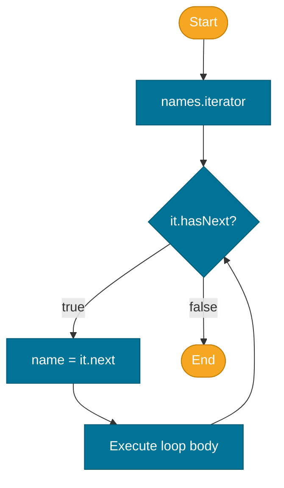

# Iterators and the for-each Loop

> An `Iterator<E>` is a cursor that traverses a collection one element at a time without exposing the underlying data structure. The enhanced for-each loop is syntactic sugar the Java compiler desugars into iterator calls.

## What Problem Does It Solve?

Before iterators, traversing a `Vector` used an integer index; traversing a linked list required following `next` pointers directly. There was no unified way to walk over any collection type. `Iterator` provides a **single traversal protocol** that works for arrays, linked lists, hash tables, and trees — callers never need to know the backing data structure.

## The `Iterable` and `Iterator` Interfaces

```java
// java.lang
public interface Iterable<E> {
    Iterator<E> iterator();
}

// java.util
public interface Iterator<E> {
    boolean hasNext();  // true if more elements remain
    E next();           // return next element and advance cursor
    default void remove() { throw new UnsupportedOperationException(); }
}
```

Any class implementing `Iterable<E>` can be used in a **for-each loop**. All [`Collection`](./collections-hierarchy.md) implementations implement `Iterable`.

## How the for-each Loop Works

The compiler transforms a for-each loop into an iterator-based while loop at compile time:

```java
// What you write
for (String name : names) {
    System.out.println(name);
}

// What the compiler generates
Iterator<String> it = names.iterator();
while (it.hasNext()) {
    String name = it.next();     // ← advances the cursor
    System.out.println(name);
}
```

This means for-each works for **any** `Iterable` — collections, custom data structures, or anything else that implements the interface.



*The for-each loop desugars to an `iterator()` call followed by `hasNext`/`next` polling.*

## ListIterator — Bidirectional Traversal

`ListIterator<E>` extends `Iterator<E>` and is specific to `List`. It supports:

- Backward traversal: `hasPrevious()`, `previous()`
- Positional info: `nextIndex()`, `previousIndex()`
- In-place replacement: `set(e)`
- In-place insertion: `add(e)` — safe mid-iteration insertion

```java
List<String> list = new ArrayList<>(List.of("A", "B", "C", "D"));
ListIterator<String> lit = list.listIterator(list.size()); // start at end
while (lit.hasPrevious()) {
    System.out.print(lit.previous() + " "); // D C B A
}
```

## ConcurrentModificationException

`ArrayList`, `HashMap`, and most non-concurrent collections use a **modCount** (modification count) field. The iterator records the `modCount` at creation time. On every call to `next()`, it checks if `modCount` has changed. If it has, the collection was modified mid-iteration and `ConcurrentModificationException` is thrown.

```java
List<String> list = new ArrayList<>(List.of("a", "b", "c"));

// WRONG — structural modification during for-each
for (String s : list) {
    if (s.equals("b")) list.remove(s); // ← throws ConcurrentModificationException
}
```

This is a **fail-fast** mechanism — it detects accidental concurrent structural changes quickly rather than silently producing wrong results.

### Safe Removal Patterns

```java
// Option 1: Iterator.remove() — always safe
Iterator<String> it = list.iterator();
while (it.hasNext()) {
    if (it.next().equals("b")) it.remove(); // ← removes via the iterator, updates modCount
}

// Option 2: removeIf (Java 8+, cleanest)
list.removeIf(s -> s.equals("b"));

// Option 3: collect to a new list (copy approach)
List<String> result = list.stream()
    .filter(s -> !s.equals("b"))
    .collect(Collectors.toList());
```

:::warning
`iterator.remove()` removes the **last element returned by `next()`**, not the element you pass in. It can only be called **once per `next()` call**.
:::

## Iterating a Map

`Map` does not extend `Iterable` directly. Iteration uses one of the three views:

```java
Map<String, Integer> scores = Map.of("Alice", 95, "Bob", 82, "Carol", 77);

// Iterate entries — preferred (single pass, access both key and value)
for (Map.Entry<String, Integer> entry : scores.entrySet()) {
    System.out.println(entry.getKey() + " → " + entry.getValue());
}

// Iterate keys only
for (String key : scores.keySet()) { ... }

// Iterate values only
for (int val : scores.values()) { ... }

// Java 8 forEach
scores.forEach((k, v) -> System.out.println(k + " → " + v));
```

## Implementing a Custom `Iterable`

```java
public class Range implements Iterable<Integer> {
    private final int start, end;

    public Range(int start, int end) {
        this.start = start;
        this.end = end;
    }

    @Override
    public Iterator<Integer> iterator() {
        return new Iterator<>() {
            int current = start;

            @Override public boolean hasNext() { return current < end; }
            @Override public Integer next() {
                if (!hasNext()) throw new NoSuchElementException();
                return current++;
            }
        };
    }
}

// Now usable in a for-each loop
for (int i : new Range(1, 5)) {
    System.out.print(i + " "); // 1 2 3 4
}
```

## Best Practices

- **Prefer `removeIf` over manual iterator removal** — it's more readable and less error-prone.
- **Use for-each by default** — it's the cleanest traversal syntax. Drop down to explicit `Iterator` only when you need `remove()`, `set()`, or backward traversal.
- **Use `entrySet()` to iterate a `Map`** — avoids a second lookup per key compared to iterating `keySet()` and calling `get(key)`.
- **Never call `next()` without checking `hasNext()`** — on an exhausted iterator it throws `NoSuchElementException`.
- **Don't add elements during iteration** via `list.add()` — use `ListIterator.add()` or build a separate list.

## Common Pitfalls

- **`ConcurrentModificationException` is not about threads** — it fires in single-threaded code when you structurally modify a collection during for-each iteration. Don't be misled by "Concurrent" in the name.
- **`iterator.remove()` on an unremovable iterator** — calling `remove()` before `next()`, or calling it twice in a row without an intervening `next()`, throws `IllegalStateException`.
- **Modifying an unmodifiable collection** — `List.of(...)` and `Collections.unmodifiableList(...)` throw `UnsupportedOperationException` from `iterator.remove()`. Check if the collection supports removal first.
- **For-each on arrays is not an `Iterator`** — `for (int x : intArray)` is compiled as an indexed `for` loop, not an iterator call. Arrays do not implement `Iterable`.

## Interview Questions

### Beginner

**Q:** What does the for-each loop compile down to?  
**A:** The compiler transforms `for (T x : collection)` into `Iterator<T> it = collection.iterator(); while (it.hasNext()) { T x = it.next(); ... }`. The collection must implement `Iterable<T>`.

**Q:** Why can't you call `list.remove()` inside a for-each loop?  
**A:** The for-each loop delegates to an internal iterator. `list.remove()` increments `modCount` but the iterator still holds the old count. On the next `it.next()` call, the iterator detects the mismatch and throws `ConcurrentModificationException`.

### Intermediate

**Q:** What is the difference between `Iterator.remove()` and `List.remove()`?  
**A:** `Iterator.remove()` removes the last element returned by `next()` and updates the iterator's internal state (syncing `modCount`) so iteration can safely continue. `List.remove()` modifies `modCount` without notifying the iterator, causing `ConcurrentModificationException` on the next iteration step.

**Q:** When would you use `ListIterator` instead of `Iterator`?  
**A:** When you need to traverse a `List` backward, replace elements in-place with `set()`, insert elements at the cursor position with `add()`, or know the current index via `nextIndex()`/`previousIndex()`.

### Advanced

**Q:** How does `modCount` prevent corruption in non-concurrent collections?  
**A:** `modCount` is an int field incremented on every structural modification. Iterators capture it (as `expectedModCount`) at creation. `next()` checks `modCount == expectedModCount` and throws `ConcurrentModificationException` if they differ. This is **best-effort** (not guaranteed by the spec) — but in practice it catches the most common mistake: modifying a collection inside a loop over it.

**Q:** How would you safely iterate and remove elements from a `HashMap`?  
**A:** Use `entrySet().iterator()` with `iterator.remove()`, or use `entrySet().removeIf(e -> ...)` (Java 8+). The `forEach` method of `Map` does not support structural removal. Java 8's `map.entrySet().removeIf(entry -> condition)` is the most concise approach.

```java
Map<String, Integer> map = new HashMap<>(Map.of("a", 1, "b", 2, "c", 3));
map.entrySet().removeIf(e -> e.getValue() < 2); // remove entries where value < 2
System.out.println(map); // {b=2, c=3}
```

## Further Reading

- [Iterator Javadoc (Java 21)](https://docs.oracle.com/en/java/javase/21/docs/api/java.base/java/util/Iterator.html)
- [Iterable Javadoc (Java 21)](https://docs.oracle.com/en/java/javase/21/docs/api/java.base/java/lang/Iterable.html)
- [Java Tutorials — The Collection Interface](https://docs.oracle.com/javase/tutorial/collections/interfaces/collection.html)

## Related Notes

- [Collections Hierarchy](./collections-hierarchy.md) — `Iterable` is the root of the collection tree
- [List](./list.md) — `ListIterator` for bidirectional traversal of `ArrayList` and `LinkedList`
- [Map](./map.md) — three views for iterating a `Map` (`keySet`, `values`, `entrySet`)
