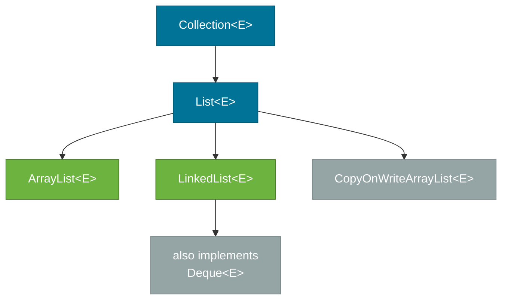
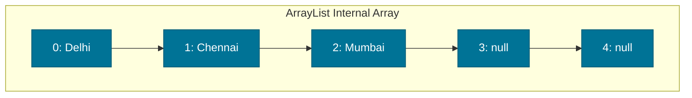
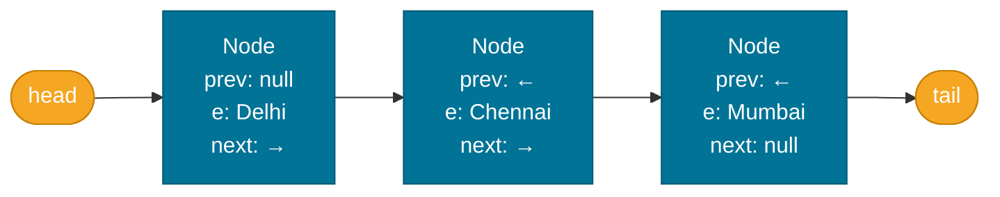

# List — ArrayList vs LinkedList

> `List<E>` is the most-used collection in Java — an ordered sequence that allows duplicates and indexed access. The two most common implementations, `ArrayList` and `LinkedList`, have fundamentally different internal structures that lead to very different performance characteristics.

## What Problem Does It Solve?

Arrays are fixed-size. Once you create `new String[10]`, you cannot grow it. Before `ArrayList`, developers had to manage dynamic arrays manually — track a count, allocate a larger array, copy elements. `List` abstracts all of that into one clean API: `add`, `get`, `remove`, `contains`, and `size`.

## The `List` Interface

`List<E>` is part of the `Collection` hierarchy:



*`List` in the collection hierarchy. `ArrayList` and `LinkedList` are the primary implementations; `CopyOnWriteArrayList` is for concurrent reads.*

`List<E>` extends [`Collection<E>`](./collections-hierarchy.md) and adds:

- **Index-based access**: `get(int index)`, `set(int index, E e)`, `add(int index, E e)`, `remove(int index)`
- **Search**: `indexOf(Object o)`, `lastIndexOf(Object o)`
- **Sub-list**: `subList(int from, int to)` — returns a view, not a copy
- **List iterator**: `listIterator()` — supports backward traversal

```java
List<String> cities = new ArrayList<>();
cities.add("Delhi");
cities.add("Mumbai");
cities.add(1, "Chennai");        // ← insert at index 1; "Mumbai" shifts right
System.out.println(cities.get(0)); // "Delhi"
System.out.println(cities);        // [Delhi, Chennai, Mumbai]
```

## ArrayList — Dynamic Array

`ArrayList` is backed by an `Object[]` array. When the array fills up, it creates a new array (typically 1.5× the current size) and copies all elements into it.



*ArrayList stores elements in a contiguous array. Null slots are pre-allocated capacity.*

### Default Capacity & Growth

```java
// Default initial capacity = 10
List<String> list = new ArrayList<>();

// Pre-size if you know the count — avoids repeated resizing
List<String> list = new ArrayList<>(1000); // ← initial capacity hint
```

### ArrayList Complexity

| Operation | Complexity | Why |
|-----------|-----------|-----|
| `get(i)` | O(1) | Direct array index |
| `add(e)` (at end) | Amortized O(1) | Append to next slot; resize is rare |
| `add(i, e)` (at index) | O(n) | All elements from `i` onward must shift right |
| `remove(i)` | O(n) | Elements after `i` shift left |
| `contains(o)` | O(n) | Linear scan |
| `size()` | O(1) | Stored field |

## LinkedList — Doubly-Linked List

`LinkedList` stores each element in a **node** object that holds the element, a pointer to the previous node, and a pointer to the next node. There is no backing array.



*LinkedList maintains explicit head and tail pointers. Each node has prev/next links.*

`LinkedList` also implements `Deque<E>`, so it can serve as a **queue** or **stack** with `addFirst`/`addLast`/`removeFirst`/`removeLast`.

### LinkedList Complexity

| Operation | Complexity | Why |
|-----------|-----------|-----|
| `get(i)` | O(n) | Must traverse from head or tail to index `i` |
| `add(e)` (at end) | O(1) | Tail pointer makes it direct |
| `add(i, e)` (at index) | O(n) | Must traverse to index first; pointer update is O(1) |
| `remove(i)` | O(n) | Must traverse to index; pointer update is O(1) |
| `removeFirst()` / `removeLast()` | O(1) | Head/tail pointers |
| `contains(o)` | O(n) | Linear scan |

## ArrayList vs LinkedList — Side-by-Side

| | `ArrayList` | `LinkedList` |
|--|-------------|--------------|
| Internal structure | Object array | Doubly-linked nodes |
| Random access `get(i)` | **O(1)** | O(n) |
| Append at end | **Amortized O(1)** | O(1) |
| Insert/remove at middle | O(n) | O(n) — traversal dominates |
| Insert/remove at head | O(n) | **O(1)** |
| Memory per element | Low — one reference per slot | Higher — node object with two extra pointers |
| Cache efficiency | **High** — contiguous memory | Low — pointer chasing across heap |
| Implements `Deque`? | No | **Yes** |

:::tip Practical Rule
Use **`ArrayList`** for almost everything — it has lower memory overhead and better cache performance. Only consider `LinkedList` when you have **many insertions/removals at the head** of a large list. In practice, `ArrayDeque` is a better choice than `LinkedList` for queue/deque use cases.
:::

## Code Examples

### Common List Operations

```java
import java.util.ArrayList;
import java.util.List;
import java.util.Collections;

List<Integer> scores = new ArrayList<>(List.of(42, 7, 99, 15, 55));

// Index-based access
int first = scores.get(0);         // 42

// Add at specific index
scores.add(2, 100);                // [42, 7, 100, 99, 15, 55]

// Remove by index vs by value
scores.remove(0);                  // removes index 0 → [7, 100, 99, 15, 55]
scores.remove(Integer.valueOf(15)); // removes value 15 → [7, 100, 99, 55]

// Sub-list view (backed by original list)
List<Integer> sub = scores.subList(1, 3); // [100, 99] — a view, not a copy
sub.clear();                              // also removes from original list!

// Sort
Collections.sort(scores);          // natural order
scores.sort((a, b) -> b - a);      // custom reverse order
```

### LinkedList as a Deque

```java
import java.util.LinkedList;
import java.util.Deque;

Deque<String> stack = new LinkedList<>();
stack.push("first");               // addFirst
stack.push("second");
System.out.println(stack.pop());   // "second" — LIFO
System.out.println(stack.peek());  // "first"  — doesn't remove

// As a queue
Deque<String> queue = new LinkedList<>();
queue.offer("first");              // addLast
queue.offer("second");
System.out.println(queue.poll());  // "first"  — FIFO
```

### Pre-sizing ArrayList for Known Capacity

```java
// Reading 10,000 records from a database? Pre-size to avoid 8+ resize+copy cycles
List<User> users = new ArrayList<>(10_000);  // ← initial capacity, not size
// users.size() is still 0; capacity is pre-allocated internally
```

## Best Practices

- **Default to `ArrayList`** — it outperforms `LinkedList` in almost all real workloads due to CPU cache locality.
- **Pre-size with `new ArrayList<>(n)`** when you know the approximate number of elements — avoids repeated array copies during growth.
- **Use `List.of(...)` for immutable lists** (Java 9+) — more memory-efficient than `Arrays.asList` and fully immutable.
- **Avoid `LinkedList` as a general List** — its O(n) `get` makes it a poor substitute for `ArrayList`.
- **Use `ArrayDeque` not `LinkedList`** for queue/stack use cases — `ArrayDeque` is faster and uses less memory.
- **Never call `list.remove(int)` when you mean `list.remove(Object)`** on a `List<Integer>` — pass `Integer.valueOf(n)` to remove by value.

## Common Pitfalls

- **`subList()` is a view** — changes to the sub-list modify the original list, and calling `add`/`remove` on the original list after taking a sub-list throws `ConcurrentModificationException`.
- **`Arrays.asList()` returns a fixed-size list** — you can call `set()` but `add()` or `remove()` throws `UnsupportedOperationException`.
- **Auto-unboxing NPE** — `list.remove(someInteger)` where `someInteger` is `null` throws `NullPointerException`. Unboxing `null` to `int` fails.
- **Iterating while modifying** — modifying an `ArrayList` inside a for-each loop throws `ConcurrentModificationException`. Use `removeIf(predicate)` or an explicit `ListIterator`.

```java
// WRONG — throws ConcurrentModificationException
for (String s : list) {
    if (s.startsWith("A")) list.remove(s);
}

// CORRECT — removeIf is safe
list.removeIf(s -> s.startsWith("A"));
```

## Interview Questions

### Beginner

**Q:** What is the difference between an array and an `ArrayList`?  
**A:** An array has a fixed size set at creation time; `ArrayList` grows dynamically by copying to a larger backing array when capacity is exceeded. `ArrayList` also provides a richer API (`contains`, `indexOf`, `remove`, etc.) and works with collections APIs.

**Q:** Can `ArrayList` store `null`?  
**A:** Yes. `ArrayList` allows multiple `null` elements. `HashSet` allows one `null`. `TreeSet` does not allow `null` at all (no ordering for `null`).

### Intermediate

**Q:** What happens internally when `ArrayList` exceeds its capacity?  
**A:** `ArrayList` allocates a new array of size `(oldCapacity * 3/2) + 1` (approximately 1.5×), copies all existing elements with `Arrays.copyOf`, and replaces the internal reference. The old array becomes eligible for garbage collection.

**Q:** Why is `LinkedList` generally slower than `ArrayList` even for insertions?  
**A:** Even though pointer updates in `LinkedList` are O(1), you first pay O(n) to traverse to the insertion point. More importantly, `LinkedList` creates a new `Node` object for every element (more GC pressure) and nodes are scattered in heap memory, causing CPU cache misses. `ArrayList` operations on a contiguous array are cache-friendly.

### Advanced

**Q:** When would you genuinely choose `LinkedList` over `ArrayList` or `ArrayDeque`?  
**A:** Almost never. The only valid case is when you hold an `Iterator` (or `ListIterator`) already positioned at the insertion point and perform many in-place insertions at that position — the pointer update is O(1) without traversal. In practice, even this can be handled by `ArrayDeque` or batch operations. Most "use LinkedList for queue" arguments are outdated; `ArrayDeque` is faster for both stack and queue operations.

**Q:** What is the time complexity of `ArrayList.contains()`?  
**A:** O(n) — it calls `equals()` on each element in sequence. For frequent membership tests, use `HashSet` (O(1) average) instead.

## Further Reading

- [ArrayList Javadoc (Java 21)](https://docs.oracle.com/en/java/javase/21/docs/api/java.base/java/util/ArrayList.html) — official API with implementation notes
- [Java Tutorials — The List Interface](https://docs.oracle.com/javase/tutorial/collections/interfaces/list.html) — Oracle tutorial covering all List operations

## Related Notes

- [Collections Hierarchy](./collections-hierarchy.md) — where `List` fits in the full interface tree
- [Queue & Deque](./queue-and-deque.md) — `ArrayDeque` as the correct replacement for `LinkedList`-as-queue
- [Immutable Collections](./immutable-collections.md) — `List.of` vs `Arrays.asList`
