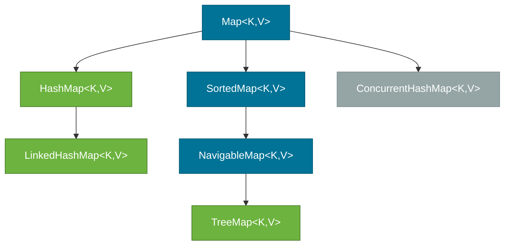
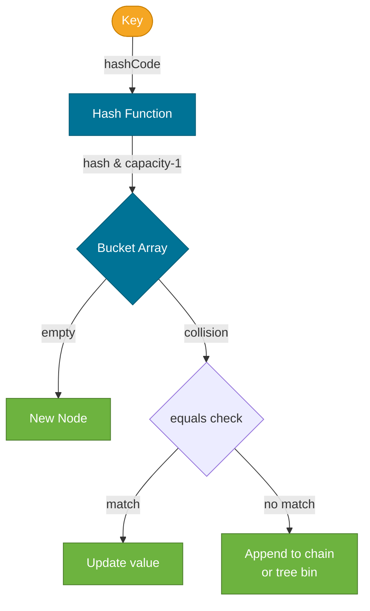
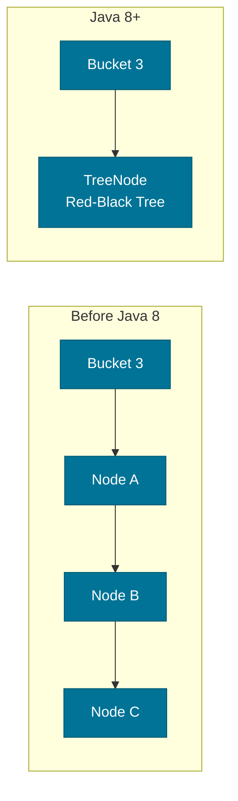
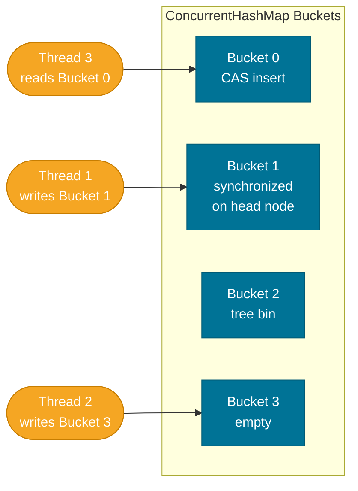

# Map — HashMap, LinkedHashMap, TreeMap, and ConcurrentHashMap

> `Map<K,V>` stores key-value pairs where keys are unique. It is the most interview-intensive collection because `HashMap`'s internal design — buckets, hash codes, tree bins — reveals deep knowledge of data structures.

## What Problem Does It Solve?

Associating a value with a lookup key is one of the most common programming tasks: user ID → user object, word → word count, config key → config value. Arrays and lists support only integer-indexed lookup. `Map` gives you O(1) average lookup by any key type, as long as the key has a proper `equals` and `hashCode`.

## The `Map` Interface

`Map<K,V>` is a separate root from `Collection`:



*`Map` hierarchy. `HashMap` and its subclass `LinkedHashMap` are most common; `TreeMap` is for sorted keys; `ConcurrentHashMap` is for multi-threaded access.*

[`Map<K,V>`](./collections-hierarchy.md) does **not** extend `Collection`. It exposes three views:

```java
Map<String, Integer> scores = new HashMap<>();
scores.put("Alice", 95);
scores.put("Bob", 82);

scores.keySet();    // Set<String>       — unique keys
scores.values();    // Collection<Integer>— values (may contain duplicates)
scores.entrySet();  // Set<Map.Entry<K,V>>— key-value pairs for iteration
```

Key API methods:

| Method | Description |
|--------|-------------|
| `put(k, v)` | Insert or replace; returns old value or `null` |
| `get(k)` | Returns value or `null` if absent |
| `getOrDefault(k, def)` | Returns value or `def` if absent |
| `containsKey(k)` | O(1) avg check |
| `remove(k)` | Remove entry; returns old value |
| `putIfAbsent(k, v)` | Put only if key is not already mapped |
| `computeIfAbsent(k, fn)` | Compute and put value if key absent |
| `merge(k, v, fn)` | Combine new value with old using a function |

## HashMap — Hash Table with Chaining

### Internal Structure

`HashMap` uses an array of **buckets** (called `table`). When you call `put(key, value)`:

1. Computes `hash = key.hashCode()` and spreads the bits: `hash ^ (hash >>> 16)`
2. Calculates bucket index: `index = hash & (capacity - 1)`
3. If the bucket is empty, inserts a new `Node`
4. If the bucket has existing nodes, walks the chain comparing with `equals`; replaces on match or appends a new node



*`put(key, value)` flow: hash → bucket index → equals check → insert or update.*

### Java 8 Tree Bins

Before Java 8, each bucket used a **linked list**. In the worst case (all keys hash to the same bucket), `get` degraded to O(n). Java 8 converts a bucket's linked list to a **Red-Black Tree** when a bucket contains ≥ 8 nodes (`TREEIFY_THRESHOLD`). This limits worst-case to O(log n).



*When a bucket exceeds 8 entries, the linked list is converted to a Red-Black Tree.*

### Load Factor & Resize

`HashMap` tracks its **load factor** (default 0.75). When `size > capacity × loadFactor`, the table doubles in size and all entries are rehashed. Resizing is expensive (O(n)) but infrequent.

```java
// Custom initial capacity and load factor
// Use when you know approximate entry count to avoid rehashing
Map<String, User> cache = new HashMap<>(1024, 0.75f); // ← capacity, load factor
```

### HashMap Complexity

| Operation | Average | Worst case (all keys collide) |
|-----------|---------|-------------------------------|
| `get` / `containsKey` | O(1) | O(log n) with tree bins |
| `put` / `remove` | O(1) | O(log n) with tree bins |
| Iteration | O(n + capacity) | O(n + capacity) |

:::warning
`HashMap` is **not thread-safe**. Concurrent `put` operations can corrupt the internal structure. Use `ConcurrentHashMap` in multi-threaded code.
:::

## LinkedHashMap — Insertion-Order Map

`LinkedHashMap` extends `HashMap` and maintains a **doubly-linked list** through all entries. Iteration always proceeds in **insertion order** (or access order if the constructor parameter `accessOrder = true`).

```java
Map<String, Integer> map = new LinkedHashMap<>();
map.put("one", 1);
map.put("two", 2);
map.put("three", 3);
map.entrySet().forEach(System.out::println); // one=1, two=2, three=3 (insertion order)
```

### LRU Cache with LinkedHashMap

With `accessOrder = true`, every `get` or `put` moves the accessed entry to the **tail** of the linked list. Overriding `removeEldestEntry` lets you implement a simple LRU cache:

```java
int MAX = 3;
Map<String, String> lruCache = new LinkedHashMap<>(MAX, 0.75f, true) {
    @Override
    protected boolean removeEldestEntry(Map.Entry<String, String> eldest) {
        return size() > MAX;  // ← evict oldest when capacity exceeded
    }
};
lruCache.put("a", "1"); lruCache.put("b", "2"); lruCache.put("c", "3");
lruCache.get("a");       // access "a" — moves it to tail
lruCache.put("d", "4"); // evicts "b" (least recently used)
System.out.println(lruCache.keySet()); // [c, a, d]
```

## TreeMap — Sorted Map

`TreeMap` is backed by a **Red-Black Tree**. Keys are kept in **sorted order** (natural ordering via `Comparable`, or a `Comparator` passed to the constructor). It implements `NavigableMap`:

```java
NavigableMap<String, Integer> map = new TreeMap<>();
map.put("banana", 2);
map.put("apple", 1);
map.put("cherry", 3);
System.out.println(map.firstKey());     // apple
System.out.println(map.lastKey());      // cherry
System.out.println(map.floorKey("b")); // banana — greatest key ≤ "b"
System.out.println(map.headMap("c"));  // {apple=1, banana=2} — keys < "c"
```

Operations are **O(log n)** — slower than `HashMap` but provides rich range queries. Use `TreeMap` when you need ordered keys or range-based lookups.

## ConcurrentHashMap — Thread-Safe Map

`ConcurrentHashMap` (Java 5+) is the thread-safe alternative to `HashMap` — without the full-table locking of the legacy `Hashtable`.

### How It Is Thread-Safe (Java 8+)

- Java 7 used **segment locking** (16 segments, each with its own lock).
- Java 8+ uses **CAS (Compare-And-Swap)** operations for empty buckets and **`synchronized` on the first node** of non-empty buckets. Only the affected bucket is locked during a write.
- Reads (`get`) are **lock-free** — they read from the volatile `table` reference directly.



*Multiple threads can write to different buckets simultaneously. Only bucket-level locking.*

### Atomic Operations

```java
ConcurrentHashMap<String, Integer> wordCount = new ConcurrentHashMap<>();

// Atomic increment — no external synchronization needed
wordCount.merge("hello", 1, Integer::sum);   // if absent: 1; else: old + 1
wordCount.compute("world", (k, v) -> v == null ? 1 : v + 1);
wordCount.putIfAbsent("java", 0);
```

`ConcurrentHashMap` does **not** allow `null` keys or `null` values (unlike `HashMap`). This is deliberate — `null` values would make `containsKey` ambiguous.

## Choosing the Right Map

| Requirement | Use |
|-------------|-----|
| Fast lookup, no ordering needed | `HashMap` |
| Iteration in insertion order | `LinkedHashMap` |
| LRU cache | `LinkedHashMap` with `accessOrder = true` |
| Sorted keys or range queries | `TreeMap` |
| Multi-thread safe | `ConcurrentHashMap` |
| Legacy synchronized (avoid) | `Hashtable` ← **don't use** |

## Code Examples

### Frequency Count

```java
String[] words = {"java", "is", "great", "java", "is", "fun", "java"};
Map<String, Integer> freq = new HashMap<>();
for (String w : words) {
    freq.merge(w, 1, Integer::sum); // ← idiomatic: add 1 or init with 1
}
System.out.println(freq); // {java=3, is=2, great=1, fun=1}
```

### Group By with computeIfAbsent

```java
List<String> names = List.of("Alice", "Bob", "Anna", "Charlie", "Brian");
Map<Character, List<String>> byInitial = new HashMap<>();
for (String name : names) {
    byInitial.computeIfAbsent(name.charAt(0), k -> new ArrayList<>()).add(name);
    // ← if key absent, create new list; then add name to it
}
System.out.println(byInitial); // {A=[Alice, Anna], B=[Bob, Brian], C=[Charlie]}
```

### Iterating a Map (Best Practice)

```java
Map<String, Integer> scores = Map.of("Alice", 95, "Bob", 82);

// Preferred — single pass over entries
for (Map.Entry<String, Integer> e : scores.entrySet()) {
    System.out.println(e.getKey() + " → " + e.getValue());
}

// Or with forEach (Java 8+)
scores.forEach((name, score) -> System.out.println(name + " → " + score));
```

## Common Pitfalls

- **`get` returning `null` is ambiguous** — it could mean the key is absent, or that `null` was explicitly mapped. Use `containsKey` to distinguish, or `getOrDefault`.
- **Using mutable objects as keys** — if a key's `hashCode`/`equals` changes after insertion, the entry becomes unfindable. Keys should ideally be **immutable** (e.g., `String`, `Integer`, record types).
- **`putIfAbsent` vs `computeIfAbsent`** — `putIfAbsent(k, v)` always evaluates `v` before the call (even if the key exists). `computeIfAbsent(k, fn)` only invokes `fn` if the key is absent — use it when creating the default value is expensive (e.g., `new ArrayList<>()`).
- **`Hashtable` is obsolete** — synchronized on every method, poor performance. Use `ConcurrentHashMap`.
- **Iterating and modifying** — modifying a `HashMap` during `entrySet` iteration throws `ConcurrentModificationException`. Use `entrySet().removeIf(...)` or collect keys to remove first.

## Interview Questions

### Beginner

**Q:** What makes a good `HashMap` key?  
**A:** It should be **immutable** (so `hashCode`/`equals` can't change after insertion), correctly override both `hashCode` and `equals`, and spread hash values well to avoid clustering. `String`, `Integer`, enums, and records are ideal keys.

**Q:** What is the default initial capacity and load factor of `HashMap`?  
**A:** Initial capacity is **16** (must be a power of 2), load factor is **0.75**. The map resizes when `size > 16 × 0.75 = 12` entries.

### Intermediate

**Q:** How does `HashMap.put()` handle a hash collision?  
**A:** It finds the bucket at `hash & (capacity - 1)`. If the bucket is non-empty, it walks the linked list (or tree, in Java 8+) comparing with `equals`. On a match, the value is replaced. Otherwise, a new node is appended. If the chain reaches 8 nodes, it converts to a Red-Black Tree (`TREEIFY_THRESHOLD = 8`).

**Q:** What is the difference between `HashMap` and `ConcurrentHashMap`?  
**A:** `HashMap` is not thread-safe — concurrent writes can corrupt its structure (infinite loops in Java 7 during resize are a historic bug). `ConcurrentHashMap` uses CAS for empty-bucket inserts and synchronized bucket-head for non-empty buckets. It allows concurrent reads without locking and concurrent writes to different buckets.

### Advanced

**Q:** Why does `ConcurrentHashMap` not allow `null` keys or values?  
**A:** When `get(key)` returns `null` from a `HashMap`, the caller cannot tell if the key is absent or if `null` was explicitly stored — they'd need a separate `containsKey` call. In a concurrent context, that two-step check (get + containsKey) is not atomic, so a race condition could give wrong results. `ConcurrentHashMap` eliminates this ambiguity by simply disallowing `null`.

**Q:** Explain `HashMap` resizing and why `capacity` must be a power of 2.  
**A:** Bucket index is computed as `hash & (capacity - 1)`. When `capacity` is a power of 2, `capacity - 1` is all ones in binary (e.g., `1111` for 16), making the bitwise AND a fast modulo operation. Non-power-of-2 capacities would require a slower `%` operator. On resize (doubling), each entry either stays in its bucket or moves to `oldBucket + oldCapacity` — a property that only holds for power-of-2 sizes, making rehashing efficient.

## Further Reading

- [HashMap Javadoc (Java 21)](https://docs.oracle.com/en/java/javase/21/docs/api/java.base/java/util/HashMap.html) — includes internal implementation notes
- [ConcurrentHashMap Javadoc (Java 21)](https://docs.oracle.com/en/java/javase/21/docs/api/java.base/java/util/concurrent/ConcurrentHashMap.html)
- [Java Tutorials — The Map Interface](https://docs.oracle.com/javase/tutorial/collections/interfaces/map.html)

## Related Notes

- [Collections Hierarchy](./collections-hierarchy.md) — `Map` is a separate root from `Collection`
- [Set](./set.md) — `HashSet` is implemented as a `HashMap` with dummy values
- [Sorting & Ordering](./sorting-and-ordering.md) — `TreeMap` requires keys to implement `Comparable` or accept a `Comparator`
