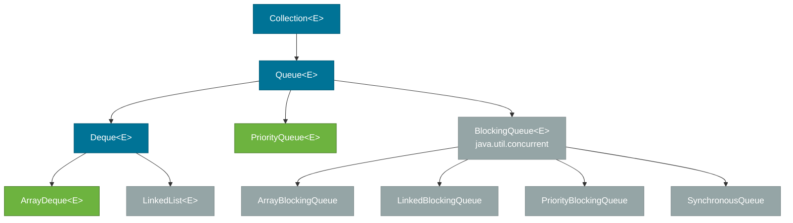
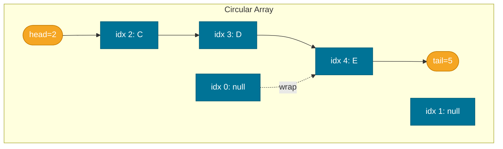
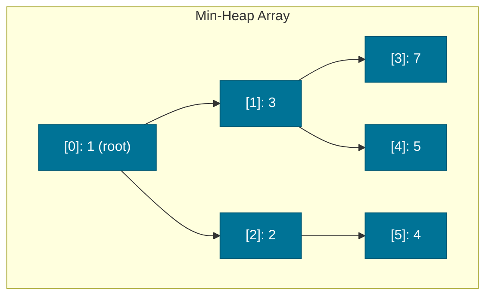
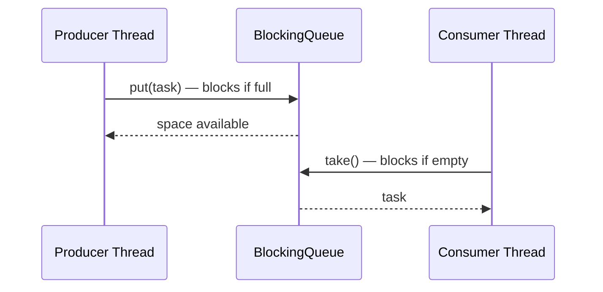
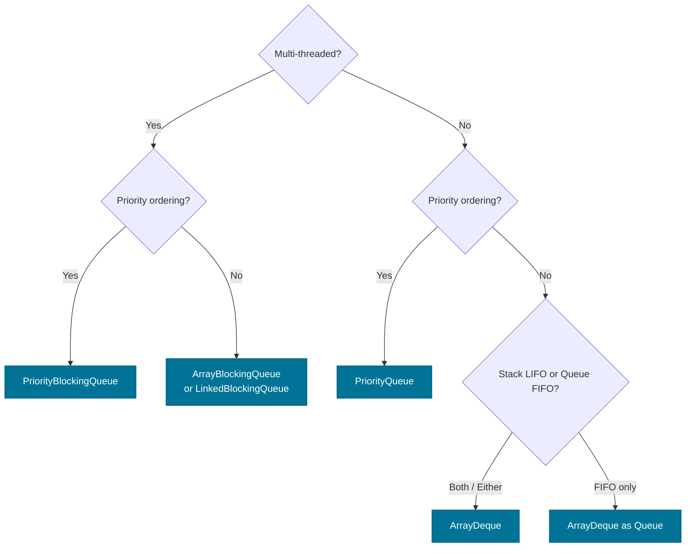

# Queue and Deque — ArrayDeque, PriorityQueue, and BlockingQueue

> `Queue<E>` models a **FIFO** waiting line; `Deque<E>` (double-ended queue) adds the ability to insert and remove from both ends. Together they cover stacks, queues, priority-ordered work lists, and producer-consumer pipelines.

## What Problem Does It Solve?

Many algorithms and system designs need elements processed in a specific order — first-in first-out (task schedulers, BFS traversal), last-in first-out (undo stacks, DFS traversal), or highest-priority first (event processing, Dijkstra's algorithm). Trying to implement these with `ArrayList` forces O(n) head removals. The `Queue`/`Deque` interfaces provide the right contract, and their implementations give you O(1) head/tail operations.

## The Queue Interface

`Queue<E>` and `Deque<E>` are part of the `Collection` hierarchy, with concurrent variants in `java.util.concurrent`:



*`Queue` and `Deque` in the hierarchy. `ArrayDeque` and `PriorityQueue` are the standard implementations; `BlockingQueue` variants live in `java.util.concurrent` for multi-threaded use.*

`Queue<E>` extends [`Collection<E>`](./collections-hierarchy.md) and exposes two sets of equivalent operations — one that throws exceptions on failure, one that returns `null`/`false`:

| Operation | Throws exception | Returns special value |
|-----------|------------------|-----------------------|
| Insert | `add(e)` | `offer(e)` → `false` if full |
| Remove head | `remove()` | `poll()` → `null` if empty |
| Peek head | `element()` | `peek()` → `null` if empty |

:::tip
Prefer the **returning variants** (`offer`, `poll`, `peek`) in application code — they are safer for bounded queues and never throw on empty.
:::

## The Deque Interface

`Deque<E>` extends `Queue<E>` and adds head/tail symmetry:

```java
Deque<String> deque = new ArrayDeque<>();
deque.addFirst("A");   // push to head
deque.addLast("B");    // push to tail
deque.peekFirst();     // "A" — head without removing
deque.peekLast();      // "B" — tail without removing
deque.pollFirst();     // removes and returns "A"
deque.pollLast();      // removes and returns "B"
```

`Deque` doubles as a **stack** via `push()` (= `addFirst`) and `pop()` (= `removeFirst`).

## ArrayDeque — The Default Choice

`ArrayDeque` is backed by a **resizable circular array**. It is the recommended `Deque` and stack/queue implementation for most use cases. Unlike `LinkedList`, it has no per-element node overhead.



*`ArrayDeque` uses head and tail pointers on a circular array — no shifting needed for head removals.*

| Operation | Complexity | Notes |
|-----------|-----------|-------|
| `addFirst` / `addLast` | Amortized O(1) | Rare resize doubles capacity |
| `pollFirst` / `pollLast` | O(1) | Head/tail pointer advance |
| `peekFirst` / `peekLast` | O(1) | No modification |
| `contains` | O(n) | Linear scan |
| `null` elements | Not allowed | Design decision — `null` is used as a sentinel |

`ArrayDeque` does **not** allow `null` elements. Use `LinkedList` if you explicitly need `null` in a deque (which is rare and usually a design smell).

## PriorityQueue — Heap-Based Priority Order

`PriorityQueue<E>` is backed by a **min-heap**. The element at the head is always the **smallest** (natural ordering) or highest-priority (per `Comparator`). FIFO order is **not** preserved.



*Min-heap: every parent ≤ its children. `poll()` removes and returns the root (minimum), then re-heapifies.*

```java
PriorityQueue<Integer> pq = new PriorityQueue<>(); // natural order (min-heap)
pq.offer(5); pq.offer(1); pq.offer(3);
System.out.println(pq.poll()); // 1 — always the minimum
System.out.println(pq.poll()); // 3
System.out.println(pq.poll()); // 5
```

### Max-Heap with Comparator

```java
// Reverse natural order = max-heap
PriorityQueue<Integer> maxHeap = new PriorityQueue<>(Comparator.reverseOrder());
maxHeap.offer(5); maxHeap.offer(1); maxHeap.offer(3);
System.out.println(maxHeap.poll()); // 5

// Custom priority — process tasks by shortest deadline first
PriorityQueue<Task> tasks = new PriorityQueue<>(
    Comparator.comparingLong(Task::getDeadline)
);
```

| Operation | Complexity | Notes |
|-----------|-----------|-------|
| `offer(e)` | O(log n) | Sift up |
| `poll()` | O(log n) | Remove root, sift down |
| `peek()` | O(1) | Root reference only |
| `contains(o)` | O(n) | No index structure |
| `remove(o)` | O(n) | Find + O(log n) re-heapify |

## BlockingQueue — Thread-Safe Producer-Consumer

`BlockingQueue<E>` extends `Queue<E>` and adds **blocking operations** for concurrent use. A producer thread can block when the queue is full; a consumer thread can block when the queue is empty.



*Producer–consumer coordination via `BlockingQueue.put()` and `take()`.*

Key implementations:

| Class | Bound | Notes |
|-------|-------|-------|
| `ArrayBlockingQueue` | Fixed | Array-backed FIFO; fair ordering option |
| `LinkedBlockingQueue` | Optional bound | Higher throughput; separate lock for head/tail |
| `PriorityBlockingQueue` | Unbounded | Priority ordering; blocks only on empty |
| `SynchronousQueue` | 0 capacity | Direct handoff from producer to consumer |
| `DelayQueue` | Unbounded | Elements available only after a delay |

```java
BlockingQueue<String> queue = new ArrayBlockingQueue<>(10); // capacity = 10

// Producer thread
new Thread(() -> {
    try {
        queue.put("task-1"); // ← blocks if queue is full
        queue.put("task-2");
    } catch (InterruptedException e) {
        Thread.currentThread().interrupt();
    }
}).start();

// Consumer thread
new Thread(() -> {
    try {
        String task = queue.take(); // ← blocks if queue is empty
        System.out.println("Processing: " + task);
    } catch (InterruptedException e) {
        Thread.currentThread().interrupt();
    }
}).start();
```

## Choosing the Right Queue



## Common Pitfalls

- **Using `LinkedList` as a queue** — `ArrayDeque` is faster (no per-node allocation, better cache locality). Reserve `LinkedList` for the rare case where you need `null` elements in a deque.
- **Iterating a `PriorityQueue`** — iteration is **not** in priority order. Only `poll()` guarantees priority ordering. If you need sorted output, poll all elements or convert to a sorted list.
- **`Stack` class is legacy** — `java.util.Stack` extends `Vector` and is synchronized on every operation. Use `ArrayDeque` as a stack instead.
- **Confusing `peek` and `poll`** — `peek` returns without removing (non-destructive), `poll` removes and returns. Using `poll` when you meant `peek` silently removes an element.
- **Not handling `InterruptedException`** — always restore the interrupt flag if you catch it: `Thread.currentThread().interrupt()`. Swallowing it silently can prevent thread shutdown.

## Interview Questions

### Beginner

**Q:** What is the difference between `Queue` and `Deque`?  
**A:** `Queue` is FIFO — elements are added at the tail and removed from the head. `Deque` (double-ended queue) allows adding and removing from **both** head and tail, making it usable as both a queue and a stack.

**Q:** What is the difference between `poll()` and `remove()` in a `Queue`?  
**A:** `poll()` returns `null` if the queue is empty; `remove()` throws `NoSuchElementException`. Prefer `poll()` in application code to avoid unchecked exceptions.

### Intermediate

**Q:** How does `PriorityQueue` internally order elements?  
**A:** It uses a **binary min-heap** stored in an array. `offer(e)` appends to the end and "sifts up" to maintain the heap property. `poll()` removes the root (minimum), places the last element at the root, and "sifts down". Both operations are O(log n).

**Q:** Why should you use `ArrayDeque` instead of `java.util.Stack`?  
**A:** `Stack` extends `Vector` and every method is `synchronized`, causing contention even in single-threaded code. `ArrayDeque` is unsynchronized and significantly faster. It also has a cleaner API (`push`/`pop`/`peek`) and no legacy behavior.

### Advanced

**Q:** What is the difference between `ArrayBlockingQueue` and `LinkedBlockingQueue`?  
**A:** `ArrayBlockingQueue` uses a **single lock** for both put and take operations and a fixed-size array — lower memory, but single-threaded producers or consumers can block each other. `LinkedBlockingQueue` uses **two separate locks** (one for head, one for tail), allowing a producer and consumer to work concurrently without contention. It has optional capacity; without one, it is unbounded (backed by a linked list). For high-throughput scenarios, `LinkedBlockingQueue` generally outperforms `ArrayBlockingQueue`.

**Q:** What is `SynchronousQueue` and when is it used?  
**A:** `SynchronousQueue` has zero capacity — each `put` blocks until a matching `take` is ready, and vice versa. It is a direct handoff mechanism: the producer hands the element directly to a waiting consumer. This eliminates any buffering and is used in `Executors.newCachedThreadPool()` to transfer tasks directly to available threads.

## Further Reading

- [Java Tutorials — The Queue Interface](https://docs.oracle.com/javase/tutorial/collections/interfaces/queue.html)
- [ArrayDeque Javadoc (Java 21)](https://docs.oracle.com/en/java/javase/21/docs/api/java.base/java/util/ArrayDeque.html)
- [BlockingQueue Javadoc (Java 21)](https://docs.oracle.com/en/java/javase/21/docs/api/java.base/java/util/concurrent/BlockingQueue.html)

## Related Notes

- [Collections Hierarchy](./collections-hierarchy.md) — where `Queue` and `Deque` fit in the interface tree
- [List](./list.md) — `LinkedList` implements `Deque`; see why `ArrayDeque` is preferred
- [Sorting & Ordering](./sorting-and-ordering.md) — `PriorityQueue` ordering via `Comparable` and `Comparator`
