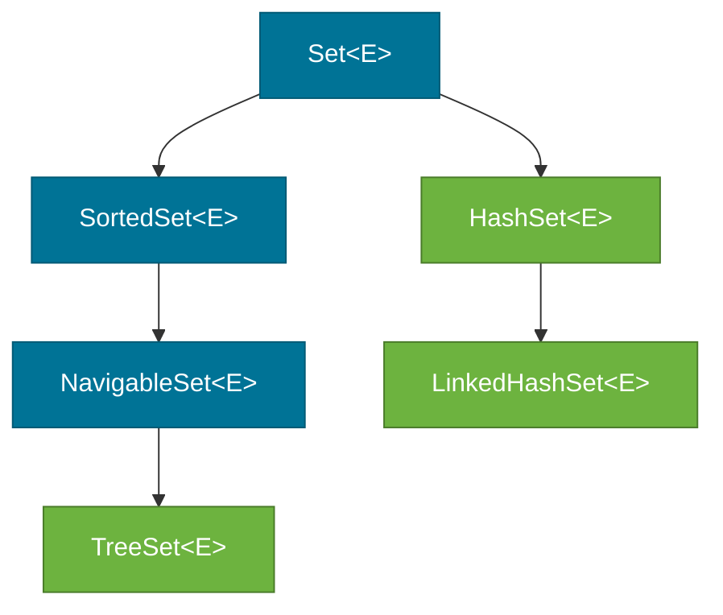

# Set — HashSet, LinkedHashSet, and TreeSet

> `Set<E>` is a `Collection` that enforces uniqueness — it never contains duplicate elements. The three standard implementations differ in how they define "order": `HashSet` gives you none, `LinkedHashSet` preserves insertion order, and `TreeSet` keeps elements in sorted order.

## What Problem Does It Solve?

`List` allows duplicates and you must check manually (`if (!list.contains(x)) list.add(x)`). As the list grows, that check becomes O(n) and easy to forget. `Set` enforces uniqueness automatically and efficiently. For example, tracking active user sessions, deduplicating log entries, or finding the unique words in a document are all natural `Set` use cases.

## The `Set` Interface

`Set<E>` extends [`Collection<E>`](./collections-hierarchy.md) but adds **no new methods** — the uniqueness contract is enforced through the `add` method behavior: `add(e)` returns `false` (and leaves the set unchanged) if the element is already present.

```java
Set<String> tags = new HashSet<>();
tags.add("java");
tags.add("spring");
boolean added = tags.add("java");  // false — already present
System.out.println(tags.size());   // 2
```

The contract: two elements `a` and `b` are considered duplicates if `a.equals(b)` returns `true`.

## The Three Implementations



*Interface hierarchy for `Set`. `LinkedHashSet` extends `HashSet`; `TreeSet` implements `NavigableSet`.*

### HashSet

`HashSet` is backed by a `HashMap` internally. Each element is stored as a key in the map (with a dummy value). That means `add`, `remove`, and `contains` are all **O(1) average** — the hash code determines the bucket, and `equals` confirms the match.

```java
Set<String> set = new HashSet<>();
set.add("banana");
set.add("apple");
set.add("cherry");
// Iteration order is UNPREDICTABLE — do not rely on it
for (String s : set) System.out.println(s); // may print in any order
```

**No ordering guarantee** — iteration order depends on hash codes and internal bucket layout.

### LinkedHashSet

`LinkedHashSet` extends `HashSet`. It maintains a **doubly-linked list** through all entries in addition to the hash table. This costs a small amount of extra memory but preserves **insertion order** during iteration.

```java
Set<String> set = new LinkedHashSet<>();
set.add("banana");
set.add("apple");
set.add("cherry");
// Iteration order = insertion order
for (String s : set) System.out.println(s); // banana, apple, cherry
```

`add`, `remove`, and `contains` are still O(1) average — the linked list is only used for iteration.

### TreeSet

`TreeSet` is backed by a `TreeMap` (a Red-Black Tree). Elements are kept in **sorted order** — by natural ordering if elements implement `Comparable`, or by a `Comparator` passed to the constructor.

```java
Set<String> set = new TreeSet<>();
set.add("banana");
set.add("apple");
set.add("cherry");
// Iteration order = natural (lexicographic) order
for (String s : set) System.out.println(s); // apple, banana, cherry
```

Operations are **O(log n)** — slower than `HashSet`, but `TreeSet` provides additional range navigation methods via `NavigableSet`:

```java
NavigableSet<Integer> nums = new TreeSet<>(List.of(1, 3, 5, 7, 9));
System.out.println(nums.floor(6));      // 5 — greatest element ≤ 6
System.out.println(nums.ceiling(6));    // 7 — smallest element ≥ 6
System.out.println(nums.headSet(5));    // [1, 3]  — exclusive upper bound
System.out.println(nums.tailSet(5));    // [5, 7, 9] — inclusive lower bound
System.out.println(nums.subSet(3, 8));  // [3, 5, 7]
```

## Complexity Comparison

| Operation | `HashSet` | `LinkedHashSet` | `TreeSet` |
|-----------|----------|----------------|----------|
| `add(e)` | O(1) avg | O(1) avg | O(log n) |
| `remove(e)` | O(1) avg | O(1) avg | O(log n) |
| `contains(e)` | O(1) avg | O(1) avg | O(log n) |
| Iteration | O(n) | O(n) | O(n) |
| Ordering | None | Insertion order | Sorted |
| `null` element | 1 allowed | 1 allowed | Not allowed |

## The `equals`/`hashCode` Contract

`HashSet` and `LinkedHashSet` rely on `hashCode()` to find the bucket and `equals()` to verify identity. If you store mutable objects and their fields used in `hashCode`/`equals` change after insertion, the object becomes "lost" in the set — you can no longer find or remove it.

```java
class Tag {
    String name;
    Tag(String name) { this.name = name; }

    @Override public boolean equals(Object o) {
        return o instanceof Tag t && name.equals(t.name);
    }
    @Override public int hashCode() { return name.hashCode(); }
}

Set<Tag> tags = new HashSet<>();
Tag t = new Tag("java");
tags.add(t);

t.name = "python";              // ← mutating the field used in hashCode
System.out.println(tags.contains(t)); // false! hash changed; wrong bucket
```

:::warning
Never mutate fields used in `equals`/`hashCode` while an object is inside a `HashSet` or as a `HashMap` key.
:::

## Code Examples

### Deduplication

```java
List<String> words = List.of("apple", "banana", "apple", "cherry", "banana");
Set<String> unique = new LinkedHashSet<>(words); // preserves first-seen order
System.out.println(unique); // [apple, banana, cherry]
```

### Set Operations (union, intersection, difference)

```java
Set<Integer> a = new HashSet<>(Set.of(1, 2, 3, 4));
Set<Integer> b = new HashSet<>(Set.of(3, 4, 5, 6));

// Union — all elements from both
Set<Integer> union = new HashSet<>(a);
union.addAll(b);               // [1, 2, 3, 4, 5, 6]

// Intersection — elements in both
Set<Integer> intersection = new HashSet<>(a);
intersection.retainAll(b);     // [3, 4]

// Difference — in a but not b
Set<Integer> diff = new HashSet<>(a);
diff.removeAll(b);             // [1, 2]
```

### TreeSet with Custom Comparator

```java
// Sort strings by length, then alphabetically for ties
Set<String> byLength = new TreeSet<>(
    Comparator.comparingInt(String::length).thenComparing(Comparator.naturalOrder())
);
byLength.addAll(List.of("banana", "fig", "apple", "kiwi", "plum"));
System.out.println(byLength); // [fig, kiwi, plum, apple, banana]
```

## Trade-offs & When To Use / Avoid

| | Pros | Cons |
|--|------|------|
| **HashSet** | Fastest O(1) ops; low overhead | No order; iteration order unpredictable |
| **LinkedHashSet** | Insertion order preserved; O(1) ops | Slightly higher memory than `HashSet` |
| **TreeSet** | Sorted iteration; range queries via `NavigableSet` | O(log n) ops; no `null`; requires natural order or `Comparator` |

## Common Pitfalls

- **Forgetting to override `hashCode` when overriding `equals`** — two objects that are "equal" by `equals` will land in different buckets if `hashCode` is inconsistent, producing phantom duplicates in `HashSet`.
- **Expecting order from `HashSet`** — the order you insert elements is not the order you iterate them. If insertion order matters, use `LinkedHashSet`.
- **Adding `null` to `TreeSet`** — throws `NullPointerException` because `null` cannot be compared to any element.
- **Using mutable objects as set elements** — mutating fields involved in `equals`/`hashCode` corrupts the set silently.

## Interview Questions

### Beginner

**Q:** What happens if you add a duplicate to a `HashSet`?  
**A:** `add(e)` returns `false` and the set is unchanged. The duplicate is silently ignored — no exception is thrown.

**Q:** Can a `Set` contain `null`?  
**A:** `HashSet` and `LinkedHashSet` allow exactly one `null` element. `TreeSet` does not — it calls `compareTo` or the `Comparator` to position elements, and `null` has no defined ordering, causing a `NullPointerException`.

### Intermediate

**Q:** How does `HashSet` check for duplicates?  
**A:** It calls `hashCode()` on the new element to find the target bucket, then calls `equals()` on each existing element in that bucket. If any `equals` call returns `true`, the element is a duplicate and is not added.

**Q:** What is the difference between `HashSet` and `LinkedHashSet`?  
**A:** Both have O(1) average performance. `LinkedHashSet` additionally maintains a doubly-linked list through all entries so that iteration proceeds in **insertion order**. This costs a small extra memory overhead per element.

### Advanced

**Q:** Explain the Red-Black Tree used by `TreeSet` and why it guarantees O(log n).  
**A:** A Red-Black Tree is a self-balancing BST. After every `add` or `remove`, the tree rebalances using rotations and recolorings to ensure the height stays within O(log n). `TreeSet` delegates to `TreeMap` where elements are stored as keys. Because the tree height is bounded by O(log n), every lookup, insert, and delete traverses at most O(log n) nodes.

**Q:** When would you use `TreeSet` over `HashSet`?  
**A:** When you need elements in sorted order for iteration, or when you need range operations (`headSet`, `tailSet`, `subSet`, `floor`, `ceiling`). Classic use cases: maintaining a leaderboard, finding all keys in a range, implementing an event scheduler keyed by time.

## Further Reading

- [Java Tutorials — The Set Interface](https://docs.oracle.com/javase/tutorial/collections/interfaces/set.html) — Oracle's canonical guide
- [HashSet Javadoc (Java 21)](https://docs.oracle.com/en/java/javase/21/docs/api/java.base/java/util/HashSet.html) — implementation notes
- [TreeSet Javadoc (Java 21)](https://docs.oracle.com/en/java/javase/21/docs/api/java.base/java/util/TreeSet.html) — NavigableSet API reference

## Related Notes

- [Collections Hierarchy](./collections-hierarchy.md) — where `Set` fits in the interface tree
- [Map](./map.md) — `HashSet` is backed by `HashMap`; understanding `HashMap` explains `HashSet`
- [Sorting & Ordering](./sorting-and-ordering.md) — `Comparable` and `Comparator` are required by `TreeSet`
