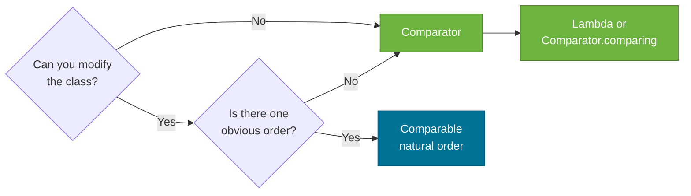

# Sorting and Ordering — Comparable vs Comparator

> `Comparable<T>` lets a class define its own natural ordering; `Comparator<T>` is an external strategy object that imposes an ordering on objects of any type. Both are used throughout the Collections Framework to sort lists and power sorted data structures like `TreeSet` and `TreeMap`.

## What Problem Does It Solve?

Java objects have no inherent ordering — you cannot subtract two objects to determine which is "less". The language needs a way to compare two objects for sorting, binary search, and insertion into sorted collections. Two mechanisms cover different needs:

- **`Comparable`** — "this class knows how to compare itself": used when objects have a single, obvious natural order (alphabetical for `String`, numeric for `Integer`).
- **`Comparator`** — "this external rule defines the order": used when you need multiple orderings, or when you cannot modify the class.

## Comparable — Natural Ordering

A class implements `Comparable<T>` to declare its natural order by overriding `compareTo`:

```java
public interface Comparable<T> {
    int compareTo(T other);
    // Returns:
    //   negative  → this < other
    //   0         → this == other (equal)
    //   positive  → this > other
}
```

### Example: Product by Price

```java
public class Product implements Comparable<Product> {
    private String name;
    private double price;

    public Product(String name, double price) {
        this.name = name;
        this.price = price;
    }

    @Override
    public int compareTo(Product other) {
        return Double.compare(this.price, other.price); // ← always use static compare() methods
    }

    @Override public String toString() { return name + "($" + price + ")"; }
}

List<Product> products = new ArrayList<>(List.of(
    new Product("Laptop", 999.99),
    new Product("Mouse",  29.99),
    new Product("Monitor", 349.99)
));

Collections.sort(products); // uses compareTo — natural order (ascending price)
System.out.println(products); // [Mouse($29.99), Monitor($349.99), Laptop($999.99)]
```

:::tip
Always use **`Double.compare(a, b)`**, **`Integer.compare(a, b)`**, etc. instead of `a - b`. Subtraction of floating-point or near-extreme integers can overflow or produce NaN.
:::

The natural order also drives `TreeSet` and `TreeMap`:

```java
TreeSet<Product> set = new TreeSet<>(products); // elements kept in ascending price order
System.out.println(set.first()); // Mouse($29.99)
```

## Comparator — External Ordering Strategy

`Comparator<T>` is a `@FunctionalInterface` — you can define one as a lambda. Use it when:
- The class already has a natural order but you need a different one
- You cannot modify the class (third-party or JDK type)
- You need multiple orderings for the same type

```java
public interface Comparator<T> {
    int compare(T a, T b);
    // Returns:
    //   negative  → a < b
    //   0         → a == b
    //   positive  → a > b
}
```

### Comparator Factory Methods (Java 8+)

Java 8 added rich static factory methods to `Comparator`:

```java
// Sort by name alphabetically
Comparator<Product> byName = Comparator.comparing(Product::getName);

// Sort by price descending
Comparator<Product> byPriceDesc = Comparator
    .comparingDouble(Product::getPrice)
    .reversed();

// Multi-level: sort by category, then price ascending, then name
Comparator<Product> multiLevel = Comparator
    .comparing(Product::getCategory)
    .thenComparingDouble(Product::getPrice)
    .thenComparing(Product::getName);

// Handle nulls — nulls first
Comparator<Product> nullSafe = Comparator.nullsFirst(byName);
```

### Using Comparator with Collections and Streams

```java
List<Product> products = new ArrayList<>(List.of(
    new Product("Laptop", 999.99),
    new Product("Mouse",  29.99),
    new Product("Monitor", 349.99)
));

// Sort in-place (Java 8+)
products.sort(Comparator.comparing(p -> p.getName()));

// Sort without modifying original
List<Product> sorted = products.stream()
    .sorted(Comparator.comparingDouble(Product::getPrice).reversed())
    .collect(Collectors.toList());

// TreeSet with custom comparator
TreeSet<Product> byNameSet = new TreeSet<>(Comparator.comparing(Product::getName));
byNameSet.addAll(products);
System.out.println(byNameSet.first()); // Laptop (alphabetically first)
```

## compareTo Contract

`compareTo` must be:

1. **Consistent with reflexivity**: `x.compareTo(x) == 0`
2. **Antisymmetric**: if `x.compareTo(y) > 0` then `y.compareTo(x) < 0`
3. **Transitive**: if `x.compareTo(y) > 0` and `y.compareTo(z) > 0` then `x.compareTo(z) > 0`
4. **Recommended (not required)**: `(x.compareTo(y) == 0) == x.equals(y)` — consistency with `equals`

Violating these contracts causes wrong sorting results and broken behavior in sorted collections.

### Consistency with `equals`

If `compareTo` returns 0 but `equals` returns `false`, a `TreeSet` will consider the elements duplicates (dropping one) while a `HashSet` will consider them distinct (keeping both). This discrepancy is a source of subtle bugs.

```java
// BigDecimal violates this — for awareness
BigDecimal a = new BigDecimal("1.0");
BigDecimal b = new BigDecimal("1.00");
a.equals(b);      // false — different scale
a.compareTo(b);   // 0     — same numeric value
// TreeSet(a, b) → only keeps a; HashSet(a, b) → keeps both
```

## Comparison Patterns



*Decision tree: implement `Comparable` when there is a single natural order and you own the class; use `Comparator` otherwise.*

## Practical Sorting Reference

| Goal | How |
|------|-----|
| Sort `List` in natural order | `Collections.sort(list)` or `list.sort(null)` |
| Sort `List` with comparator | `list.sort(comparator)` |
| Sort array | `Arrays.sort(arr)` |
| Sorted `Set` / `Map` | `new TreeSet<>(comparator)` / `new TreeMap<>(comparator)` |
| Reverse order | `Comparator.reverseOrder()` or `comparator.reversed()` |
| Multi-field sort | `Comparator.comparing(...).thenComparing(...)` |
| Null-safe sort | `Comparator.nullsFirst(...)` / `Comparator.nullsLast(...)` |

## Common Pitfalls

- **Using subtraction (`a - b`) in `compareTo`** — can overflow for `int` values near `Integer.MAX_VALUE` or produce NaN for `double`. Always use `Integer.compare(a, b)` or `Double.compare(a, b)`.
- **Inconsistent `compareTo` and `equals`** — `TreeSet`/`TreeMap` use only `compareTo` for equality; they can drop elements you expect to keep. Make `compareTo` return 0 iff `equals` returns `true`.
- **Mutating fields used in comparison** — if a `Product` stored in a `TreeSet` has its `price` changed, the tree structure becomes corrupt. Use immutable value types as keys wherever possible.
- **`Comparator.comparing` with `null` fields** — `Comparator.comparing(Product::getCategory)` throws `NullPointerException` if `getCategory()` returns `null`. Wrap with `Comparator.nullsFirst(...)`.

## Interview Questions

### Beginner

**Q:** What is the difference between `Comparable` and `Comparator`?  
**A:** `Comparable` is implemented by the class itself to define its **natural ordering** (e.g., `String` sorts alphabetically). `Comparator` is a separate object that defines an **external ordering** — useful for multiple orderings or when you can't modify the class. `Collections.sort(list)` uses natural order; `list.sort(comparator)` uses a `Comparator`.

**Q:** What does `compareTo` return?  
**A:** A negative integer if this object is less than the argument, zero if equal, positive if greater. The exact values don't matter — only the sign does.

### Intermediate

**Q:** How do you sort a `List<Product>` by price descending, then by name ascending?  
**A:**
```java
products.sort(
    Comparator.comparingDouble(Product::getPrice).reversed()
              .thenComparing(Product::getName)
);
```

**Q:** Why is `a.compareTo(b)` inconsistent with `equals` in `BigDecimal`?  
**A:** `BigDecimal.equals` considers scale — `1.0` and `1.00` are different objects. `compareTo` compares numeric value only — `1.0` and `1.00` are equal. This means a `TreeSet` of `BigDecimal` will deduplicate `1.0` and `1.00`, while a `HashSet` keeps both.

### Advanced

**Q:** Explain how `Collections.sort` works internally and what it requires.  
**A:** `Collections.sort` delegates to `Arrays.sort` on the list's backing array. Java uses **TimSort** — a hybrid merge sort / insertion sort that is stable and O(n log n) worst case with O(n) best case on nearly sorted input. It requires elements to implement `Comparable` (or a `Comparator` to be provided) and the ordering to be consistent (transitive, antisymmetric). An inconsistent comparator may cause an `IllegalArgumentException` ("Comparison method violates its general contract").

**Q:** What is a stable sort and why does it matter?  
**A:** A stable sort preserves the original relative position of equals elements. For example, if you first sort employees by salary, then by department, a stable sort ensures employees with the same department remain sorted by salary within each department. Java's `Arrays.sort` on objects (TimSort) is **stable**; `Arrays.sort` on primitives (dual-pivot quicksort) is **not stable** (but primitives have no identity, so it doesn't matter).

## Further Reading

- [Comparable Javadoc (Java 21)](https://docs.oracle.com/en/java/javase/21/docs/api/java.base/java/lang/Comparable.html)
- [Comparator Javadoc (Java 21)](https://docs.oracle.com/en/java/javase/21/docs/api/java.base/java/util/Comparator.html)
- [Java Tutorials — Object Ordering](https://docs.oracle.com/javase/tutorial/collections/interfaces/order.html)

## Related Notes

- [Collections Hierarchy](./collections-hierarchy.md) — `TreeSet` and `TreeMap` require natural or defined ordering
- [Set](./set.md) — `TreeSet` uses `compareTo` or `Comparator` for deduplication and ordering
- [Map](./map.md) — `TreeMap` keys must be ordered via `Comparable` or `Comparator`
