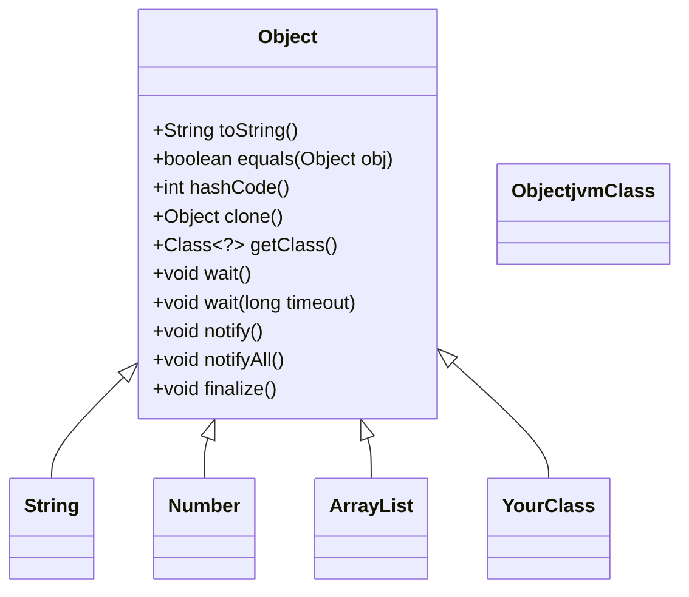
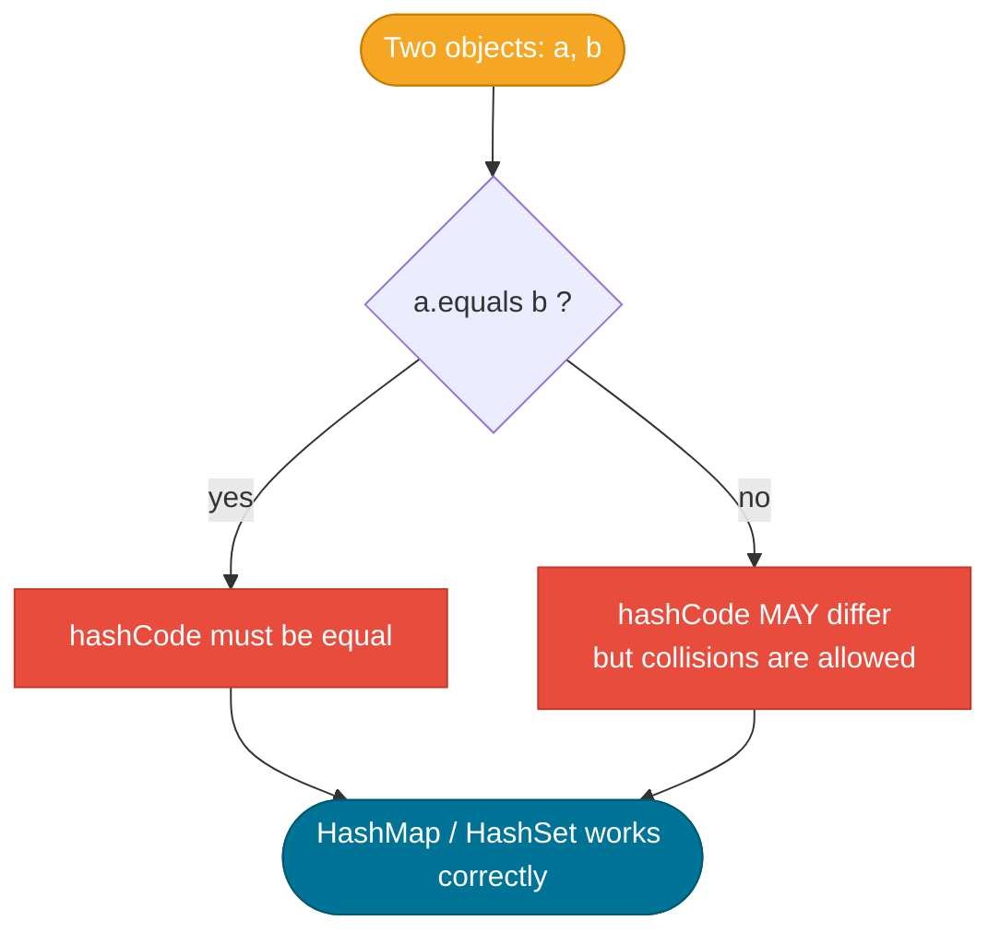

# Object Class

> `java.lang.Object` is the implicit superclass of every Java class — it defines the contract every object must honour for equality, hashing, string representation, and inter-thread coordination.

## What Problem Does It Solve?

Java has thousands of classes from JDK, frameworks, and your own code. Without a shared root type, there would be no way to:

- Store anything in a generic container (`List<Object>`)
- Guarantee every object can be compared for identity (`==`) *or* value equality (`equals`)
- Ensure every object can produce a hash code for use in hash-based data structures
- Provide a built-in debugging string (`toString`)
- Coordinate threads waiting on the same resource (`wait`/`notify`)

`Object` is that shared root — it provides a minimal, universal set of behaviours that every Java object inherits for free.

## The Object Class

`java.lang.Object` sits at the root of the entire Java type hierarchy. Every class you ever write implicitly extends `Object`:

```java
public class Person { }
// is exactly the same as:
public class Person extends Object { }
```

This means an `Object` variable can hold a reference to *any* object in the JVM:

```java
Object anything = new ArrayList<>();   // legal
Object also     = "hello";             // also legal
```

The class lives in `java.lang`, which is auto-imported, so you never need an import statement. It exposes eleven methods; the ones you interact with daily are: `toString`, `equals`, `hashCode`, `clone`, `wait`, `notify`, `notifyAll`, and `getClass`.

## How It Works



*Object sits at the root of every class hierarchy — String, Number, ArrayList, and every user-defined class inherit its methods.*

### `toString()`

The default implementation returns `ClassName@hexHashCode` (e.g. `Person@6d06d69c`), which is rarely useful. Override it in every domain class to aid debugging.

```java
@Override
public String toString() {
    return "Person{name='" + name + "', age=" + age + "}";
}
```

### `equals(Object obj)` — value equality

The default implementation checks **reference equality** (`this == obj`). For value objects (entities, DTOs, value types) you must override it.

The **equals contract** (from the Javadoc — this is a legal contract):

| Property | Meaning |
|----------|---------|
| **Reflexive** | `x.equals(x)` is always `true` |
| **Symmetric** | `x.equals(y)` ↔ `y.equals(x)` |
| **Transitive** | if `x.equals(y)` and `y.equals(z)` then `x.equals(z)` |
| **Consistent** | multiple calls return the same result (given no state change) |
| **Null-safe** | `x.equals(null)` is always `false` — never throws NPE |

### `hashCode()` — integer fingerprint

The **equals–hashCode contract** has one golden rule:

> **If `a.equals(b)` is `true`, then `a.hashCode() == b.hashCode()` must also be `true`.**

The reverse is *not* required: two objects can share a hash code without being equal (a *collision*). Violating this rule silently breaks `HashMap`, `HashSet`, and `Hashtable`.



*The equals–hashCode contract — violating it causes silent data loss in hash-based collections.*

### `clone()`

Creates a shallow copy of the object. Rules:
- The class must implement the marker interface `Cloneable`, otherwise `clone()` throws `CloneNotSupportedException`.
- The default clone is **shallow** — nested mutable objects are shared between original and clone.
- Prefer copy constructors or factory methods; `clone` is considered error-prone by modern convention.

### `wait()` / `notify()` / `notifyAll()`

These are the JVM-level inter-thread coordination primitives. They must be called **inside a `synchronized` block** on the same object. `wait()` releases the monitor and suspends the thread; `notify()` wakes one waiting thread; `notifyAll()` wakes all. See the [multithreading notes](../multithreading/index.md) for practical usage.

### `getClass()`

Returns the runtime `Class<?>` object (useful for reflection). Note: always returns the *actual* (runtime) class, not the declared type:

```java
Object obj = new ArrayList<>();
System.out.println(obj.getClass().getName()); // java.util.ArrayList
```

### `finalize()` — **Legacy, avoid**

Called by the GC before reclaiming an object. **Deprecated** in Java 9 and removed in Java 18 (`@Deprecated(forRemoval=true)`). Use `try-with-resources` and `Cleaner` instead.

## Code Examples

:::tip Practical Demo
See the [Object Class Demo](./demo/object-class-demo.md) for step-by-step runnable examples including the silent HashMap bug caused by a broken `hashCode`.
:::

### Correct `equals` and `hashCode` override

```java
import java.util.Objects;

public class Employee {
    private final int    id;
    private final String name;

    public Employee(int id, String name) {
        this.id   = id;
        this.name = name;
    }

    @Override
    public boolean equals(Object o) {
        if (this == o) return true;                    // ← same reference shortcut
        if (!(o instanceof Employee other)) return false; // ← pattern matching (Java 16+)
        return id == other.id
            && Objects.equals(name, other.name);       // ← null-safe comparison
    }

    @Override
    public int hashCode() {
        return Objects.hash(id, name);  // ← consistent with equals fields
    }

    @Override
    public String toString() {
        return "Employee{id=" + id + ", name='" + name + "'}";
    }
}
```

### `equals` contract violation and its consequence

```java
Employee e1 = new Employee(1, "Alice");
Employee e2 = new Employee(1, "Alice");

System.out.println(e1.equals(e2));    // true  (correct override)
System.out.println(e1.hashCode() == e2.hashCode()); // true

Set<Employee> set = new HashSet<>();
set.add(e1);
System.out.println(set.contains(e2)); // true — works because contract is honoured
```

If you override `equals` but **not** `hashCode`, `set.contains(e2)` returns `false` even though `e1.equals(e2)` is `true` — a silent, hard-to-debug bug.

### `clone()` — shallow copy gotcha

```java
class Box implements Cloneable {
    int[]  items;   // mutable field
    String label;

    @Override
    public Box clone() throws CloneNotSupportedException {
        Box copy = (Box) super.clone(); // ← shallow: copy.items == this.items (same array!)
        copy.items = items.clone();     // ← manual deep copy for mutable fields
        return copy;
    }
}
```

## Best Practices

- **Always override `equals` and `hashCode` together** — IDEs, Lombok (`@EqualsAndHashCode`), and records auto-generate both.
- **Use `Objects.equals(a, b)` and `Objects.hash(...)` instead of manual null checks** — they're null-safe and concise.
- **Include the same fields in both `equals` and `hashCode`** — fields in `equals` that are missing from `hashCode` break the contract.
- **Make `equals` fields final (or at least stable)** — mutable keys in a `HashMap` cause entries to become unreachable.
- **Prefer records for pure value types** — Java 16+ records auto-generate `equals`, `hashCode`, and `toString` correctly.
- **Override `toString`** in every non-trivial class — it pays dividends in log files and stack traces.
- **Avoid `clone()`** — use copy constructors or builder patterns instead.

## Common Pitfalls

**1. Overriding `equals` without `hashCode`**
The most common `Object` contract violation. Every static analysis tool (SonarQube, SpotBugs, IntelliJ) flags this, but it still slips through in handwritten code.

**2. Using mutable fields as `HashMap` keys**
If you mutate an object after inserting it as a map key, its `hashCode` changes and you can never retrieve the value again — the entry is effectively lost.

**3. Calling `wait()` outside `synchronized`**
Throws `IllegalMonitorStateException` at runtime. Always use `wait()`/`notify()` inside a `synchronized` block on the same object.

**4. Comparing with `==` instead of `equals`**
```java
String a = new String("hello");
String b = new String("hello");
a == b      // false — different references
a.equals(b) // true  — same value
```

**5. `getClass()` vs `instanceof` in `equals`**
Using `getClass()` instead of `instanceof` in the equals check breaks symmetry when subclasses are involved. In general, use `instanceof` and be aware of subclass implications. (The debate is nuanced — prefer `sealed` hierarchies or records to sidestep it.)

## Interview Questions

### Beginner

**Q: What is `java.lang.Object` and why does every class extend it?**
**A:** It is the root class of all Java classes. Even classes that don't explicitly extend anything implicitly extend `Object`. It provides a common set of behaviours — identity comparison (`equals`), hashing (`hashCode`), string representation (`toString`), and thread coordination (`wait`/`notify`) — that every object must support.

**Q: What does the default `equals` method do?**
**A:** It performs reference equality — `this == obj`. Two distinct objects are considered unequal even if they hold the same data. You must override it to get value-based equality.

**Q: What is the equals–hashCode contract?**
**A:** If two objects are equal under `equals`, they must produce the same `hashCode`. The opposite is not required. Violating this rule causes data loss in `HashMap` and `HashSet`.

### Intermediate

**Q: Why is overriding `equals` without overriding `hashCode` dangerous?**
**A:** `HashMap` and `HashSet` use `hashCode` to find the right bucket before calling `equals`. If two logically equal objects have different hash codes, the map will look in the wrong bucket and report the key as absent — causing `get` to return `null` for keys that were actually put in the map.

**Q: What makes an `equals` implementation correct according to the Javadoc contract?**
**A:** It must be reflexive (x = x), symmetric (x = y ↔ y = x), transitive (x = y ∧ y = z → x = z), consistent (stable across multiple calls), and null-safe (never throw NPE when compared to null).

**Q: What are the problems with `clone()` and what should you use instead?**
**A:** `clone()` requires implementing a marker interface, is shallow by default (shared mutable state between original and clone), can throw checked exceptions, and is difficult to use correctly with inheritance. The modern alternatives are copy constructors (`new MyClass(other)`) and static factory methods, or simply using records which are immutable.

### Advanced

**Q: Explain the `getClass()` vs `instanceof` debate in `equals` implementations.**
**A:** Using `getClass()` enforces that both objects are the *same concrete class*, which obeys the symmetry contract even across subclass hierarchies. `instanceof` allows subclasses to be equal to parent instances, but this can break symmetry if the subclass overrides `equals` differently. Effective Java (Bloch) recommends `instanceof` with a `final` class or a careful design. In practice, use records for value types — they sidestep the problem entirely.

**Q: How does `finalize()` interact with garbage collection, and why was it removed?**
**A:** The GC enqueues finalizable objects on a special finalizer queue. A separate finalizer thread runs `finalize()` before reclaiming the object, causing at least one extra GC cycle. This delays reclamation, creates resurrection risk (the object can be referenced again inside `finalize`), and is non-deterministic. Java 9 deprecated it; Java 18 removed it. The replacement is `java.lang.ref.Cleaner`, which is more predictable and doesn't resurrect objects.

## Further Reading

- [Object Javadoc (Java 21)](https://docs.oracle.com/en/java/javase/21/docs/api/java.base/java/lang/Object.html) — the formal contract specification for every method
- [Effective Java, Item 10–13](https://www.baeldung.com/java-equals-hashcode-contracts) — Bloch's canonical rules for `equals` and `hashCode` (Baeldung summary)
- [Baeldung: equals and hashCode](https://www.baeldung.com/java-equals-hashcode-contracts) — practical guide with examples

## Related Notes

- [Collections Framework](../collections-framework/index.md) — `HashMap` and `HashSet` rely directly on the `equals`/`hashCode` contract defined here; breaking it causes silent data loss in collections.
- [Java Type System — Autoboxing](../java-type-system/index.md) — wrapper types (Integer, Long) inherit `Object`'s `equals` but have caching quirks that interact with `==` comparisons.
- [OOP — Inheritance](../oops/index.md) — understanding that `Object` is the implicit superclass is foundational to understanding the entire Java type hierarchy.
