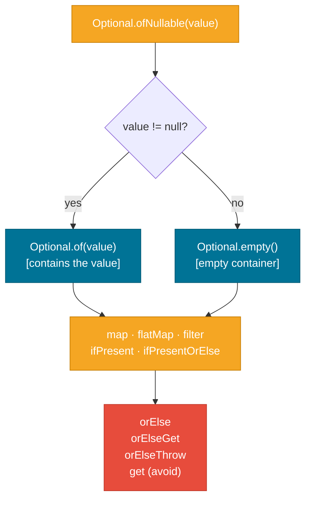

# Optional (Java 8+)

> `Optional<T>` is a container that holds either a value or nothing — it makes the possibility of absence explicit in a method's return type so callers can't accidentally ignore it.

## What Problem Does It Solve?

`null` has been called the "billion dollar mistake" by its inventor Tony Hoare because it produces `NullPointerException` — one of the most common runtime errors in Java. The core problem is that `null` is invisible in a method signature:

```java
// Does this return null when nothing is found? Who knows?
public Customer findByEmail(String email) { ... }
```

The caller has to read documentation, look at the source, or wait for a NPE at runtime to discover the possibility of absence. `Optional` makes it visible in the type signature:

```java
public Optional<Customer> findByEmail(String email) { ... }
```

Now the type itself communicates: *this might not return a value.* The caller is forced to explicitly decide what to do in the empty case via the Optional API.

## Optional

`java.util.Optional<T>` is a **value-based container class** that wraps a single nullable value. It was introduced in Java 8 alongside the Stream API.

```java
Optional<String> name = Optional.of("Alice");    // contains "Alice"
Optional<String> empty = Optional.empty();        // contains nothing
Optional<String> maybe = Optional.ofNullable(getUserInput()); // either, depending on input
```

It is final, immutable, and not serializable — it is deliberately designed for **method return types only**.

### Key distinction from null

With a null return:
```java
Customer c = findByEmail("a@b.com");
System.out.println(c.getName()); // NPE if c is null — no compiler warning
```

With Optional:
```java
Optional<Customer> c = findByEmail("a@b.com");
System.out.println(c.getName()); // won't compile — Optional has no getName()
// You must unwrap: c.map(Customer::getName).orElse("unknown")
```

The compiler enforces the "did you handle the empty case?" question.

## How It Works



*Optional's lifecycle — create it with `ofNullable`, transform with `map`/`filter`, and always resolve with `orElse`, `orElseGet`, or `orElseThrow`.*

### Creation methods

| Method | Behaviour |
|--------|-----------|
| `Optional.of(value)` | wraps non-null value; throws NPE if value is null |
| `Optional.empty()` | returns the canonical empty Optional |
| `Optional.ofNullable(value)` | wraps value if non-null, otherwise returns empty |

### Access / terminal methods

| Method | Behaviour |
|--------|-----------|
| `get()` | returns value or throws `NoSuchElementException` — **avoid** |
| `orElse(default)` | returns value or the provided default |
| `orElseGet(supplier)` | returns value or calls supplier (lazy; preferred over `orElse` for expensive defaults) |
| `orElseThrow()` | returns value or throws `NoSuchElementException` (Java 10+) |
| `orElseThrow(exceptionSupplier)` | returns value or throws the specified exception |
| `ifPresent(consumer)` | runs consumer if value present |
| `ifPresentOrElse(consumer, runnable)` | Java 9+ — runs consumer if present, or runnable if empty |

### Transformation methods

| Method | Behaviour |
|--------|-----------|
| `map(function)` | transforms the value if present; returns empty if not |
| `flatMap(function)` | like `map` but the function returns an Optional (avoids nesting) |
| `filter(predicate)` | returns the Optional unchanged if predicate matches; empty otherwise |
| `or(supplier)` | Java 9+ — returns this if present, otherwise calls supplier to produce another Optional |
| `stream()` | Java 9+ — returns a `Stream<T>` of 0 or 1 element |

## Code Examples

:::tip Practical Demo
See the [Optional Demo](./demo/optional-demo.md) for step-by-step creation, pipeline, and `orElse` vs `orElseGet` laziness examples.
:::

### The basic pattern

```java
public Optional<User> findById(long id) {
    return userRepository.findById(id); // returns Optional in Spring Data JPA
}

// Caller uses the API explicitly:
Optional<User> result = findById(42L);
String name = result
    .map(User::getName)     // ← still Optional<String> — transforms if present
    .orElse("Unknown");     // ← resolves to String — provides default if empty
```

### `orElse` vs `orElseGet`

```java
// orElse — the default expression is ALWAYS evaluated, even when the value is present
String value = optional.orElse(expensiveDefaultComputation()); // called regardless!

// orElseGet — the supplier is only called when the Optional is empty (lazy)
String value = optional.orElseGet(() -> expensiveDefaultComputation()); // called only if empty
```

Prefer `orElseGet` whenever the default involves computation, I/O, or object creation.

### Throwing a custom exception

```java
User user = findById(id)
    .orElseThrow(() -> new UserNotFoundException("User not found: " + id));
```

### Chained transformations — no null checks needed

```java
// Without Optional — nested null checks
String city = null;
User user = findById(id);
if (user != null) {
    Address addr = user.getAddress();
    if (addr != null) {
        city = addr.getCity();
    }
}

// With Optional — pipeline of transformations
String city = findById(id)
    .map(User::getAddress)      // Optional<Address>
    .map(Address::getCity)      // Optional<String>
    .orElse("Unknown");         // String
```

### `flatMap` — avoid nested Optionals

```java
// If getAddress() itself returns an Optional<Address>:
Optional<String> city = findById(id)
    .flatMap(User::getAddress)   // ← flatMap flattens Optional<Optional<Address>> → Optional<Address>
    .map(Address::getCity);
```

### `ifPresentOrElse` (Java 9+)

```java
findById(id).ifPresentOrElse(
    user -> log.info("Found: {}", user.getName()),  // present branch
    () -> log.warn("User not found")                 // empty branch
);
```

### Optional in Streams (Java 9+)

```java
// Collect only present values from a stream of Optionals
List<String> values = optionals.stream()
    .flatMap(Optional::stream)   // ← Java 9+ — converts Optional to 0 or 1 element stream
    .collect(Collectors.toList());
```

## Best Practices

- **Use Optional only as a method return type** — not as a field, constructor parameter, or method parameter.
- **Prefer `orElseGet` over `orElse` for non-trivial defaults** — `orElse` evaluates the default eagerly; `orElseGet` is lazy.
- **Avoid `get()` without `isPresent()` first** — it defeats the purpose of Optional; use `orElseThrow()` instead which is explicit about the failure mode.
- **Use `orElseThrow(() -> new MyException(...))` to signal unrecoverable absence** — this is more readable than `orElse(null)` followed by a null check.
- **Do not wrap `Optional` in another `Optional`** — use `flatMap` to collapse nested Optionals.
- **Do not use Optional with serializable types** — Optional is not serializable; don't use it as a JPA entity field or a JSON DTO field.
- **Prefer records with a nullable field for DTOs** — Optional in a DTO adds API complexity without benefit; a nullable field with documentation works better at serialisation boundaries.

## Common Pitfalls

**1. `Optional` as a field**
```java
// BAD — Optional is not Serializable; also signals API design confusion
public class User {
    private Optional<String> middleName; // don't do this
}

// GOOD
public class User {
    private String middleName; // nullable — use Javadoc or @Nullable annotation
}
```

**2. `Optional` as a parameter**
```java
// BAD — callers can pass null instead of Optional.empty(), defeating the purpose
public void process(Optional<String> value) { ... }

// GOOD — overloads or nullable parameter are clearer
public void process(String value) { ... }
public void process() { ... }
```

**3. Calling `get()` without checking `isPresent()`**
```java
Optional<String> opt = Optional.empty();
String s = opt.get();  // throws NoSuchElementException — just as bad as NPE
```

**4. Using `orElse(null)` to reintroduce null**
```java
String s = optional.orElse(null); // you're back to null handling — why use Optional?
```

**5. Comparing with `==`**
Optional is an object; two empty Optionals from `Optional.empty()` are the same cached instance, but `Optional.of("x") == Optional.of("x")` is `false`. Always use `.equals()`.

**6. Performance-sensitive paths**
`Optional` adds a heap allocation per method call. In hot paths (millions of calls/sec), this can cause GC pressure. Measure before optimising, but be aware of the trade-off.

## Interview Questions

### Beginner

**Q: What is `Optional` and why was it introduced?**
**A:** `Optional<T>` is a container that may hold a value or be empty. It was introduced in Java 8 to make the possibility of an absent value explicit in a method's return type, encouraging callers to handle the empty case rather than assuming a value is always present and getting a NPE.

**Q: What is the difference between `Optional.of`, `Optional.empty`, and `Optional.ofNullable`?**
**A:** `Optional.of(value)` wraps a non-null value and throws NPE if null is passed. `Optional.empty()` creates an always-empty Optional. `Optional.ofNullable(value)` wraps the value if non-null, or returns empty if null — this is the safe choice when the value's nullability is uncertain.

**Q: When should you NOT use Optional?**
**A:** Don't use Optional as a class field (it's not Serializable), as a constructor/method parameter (callers can just pass null, defeating the purpose), or in any data transfer object (DTO) that will be serialised to/from JSON.

### Intermediate

**Q: What is the difference between `orElse` and `orElseGet`?**
**A:** `orElse(default)` always evaluates the default expression eagerly, even when the Optional has a value. `orElseGet(supplier)` only calls the supplier lazily when the Optional is empty. For expensive computations, object creation, or I/O as a default, always use `orElseGet`.

**Q: How do you avoid `Optional<Optional<T>>` nesting?**
**A:** Use `flatMap` instead of `map` when the transformation function itself returns an `Optional`. `map` wraps the result in another Optional; `flatMap` flattens it.

**Q: How does `Optional.stream()` work and when is it useful?**
**A:** Available since Java 9, `Optional.stream()` returns a `Stream<T>` with one element if present, or an empty stream if absent. It's used to integrate Optional values into stream pipelines — typically with `Stream<Optional<T>>.flatMap(Optional::stream)` to filter out empty members.

### Advanced

**Q: Why is `Optional` not Serializable and what does that mean for JPA entities?**
**A:** Optional's designers explicitly chose not to implement `Serializable` to discourage its use as a persistent field type. Using Optional as a JPA entity field causes `javax.persistence` to fail at schema generation time, and Java serialisation also fails. For optional fields in entities, use a nullable type. For query results, have the repository method return `Optional<Entity>`.

**Q: How does `Optional` interact with the principle of Command-Query Separation and functional programming?**
**A:** Optional is a monad-like structure aligned with functional programming: `map` corresponds to `fmap`, `flatMap` to `>>=` (bind), and `Optional.of` / `Optional.empty` correspond to unit/return. This makes Optional composable in a pipeline — the caller can chain transformations without intermediate null checks. Under Command-Query Separation, Optional is appropriate on *query* methods (which return a value that may not exist) and inappropriate on *command* methods (which perform actions — a command whose effect may or may not occur should use a boolean or throw an exception, not return Optional).

## Further Reading

- [Optional Javadoc (Java 21)](https://docs.oracle.com/en/java/javase/21/docs/api/java.base/java/util/Optional.html) — full method reference with specifications
- [dev.java: Optional](https://dev.java/learn/api/streams/optional/) — Oracle's official guide on proper Optional usage
- [Baeldung: Java Optional](https://www.baeldung.com/java-optional) — practical patterns and anti-patterns with examples

## Related Notes

- [Functional Programming — Stream API](../functional-programming/index.md) — Optional's `map`, `flatMap`, and `filter` follow the same patterns as Stream; `Optional.stream()` integrates directly into stream pipelines.
- [Object Class](./object-class.md) — Optional is an object; its `equals` and `hashCode` delegate to the wrapped value's `equals`/`hashCode`, which is why `.equals()` is required for comparison.
- [Collections Framework](../collections-framework/index.md) — Spring Data repositories return `Optional<T>` by convention; understanding Optional is required to work effectively with JPA repositories.
