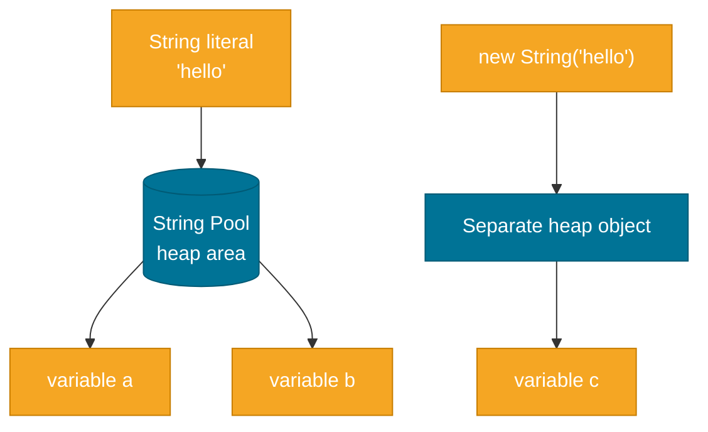

# String, StringBuilder, and StringJoiner

> `String` is immutable and pool-interned for safety and performance; `StringBuilder` is the go-to mutable buffer for building text in a loop; `StringJoiner` (Java 8+) elegantly assembles delimited lists.

## What Problem Does It Solve?

Text manipulation is one of the most common tasks in any application. Java's answer is a family of three closely related classes:

- `String` solves **safe sharing** — the same string literal can be referenced by thousands of objects without defensive copying because it cannot be changed.
- `StringBuilder` solves **efficient construction** — naively concatenating strings with `+` inside a loop creates a new `String` object every iteration; `StringBuilder` accumulates into one resizable buffer.
- `StringJoiner` solves **delimited joining** — assembling comma-separated lists, SQL column lists, or CSV rows with a separator, optional prefix, and suffix is error-prone by hand (the trailing comma problem); `StringJoiner` handles it automatically.

## String — Immutable Text

A `String` in Java is a *value object*: once created, its character content cannot change. Every "modification" operation (like `replace`, `toUpperCase`, `trim`) returns a **new** `String` object.

```java
String s = "hello";
String t = s.toUpperCase(); // ← returns a new String "HELLO"
System.out.println(s);      // still "hello" — s is unchanged
```

### String Pool

String literals are stored in a special area of the JVM heap called the **string pool** (also called the interned string cache). When you write `"hello"` in two places, the JVM uses the same object:

```java
String a = "hello";
String b = "hello";
System.out.println(a == b); // true — same pool object

String c = new String("hello"); // ← forces a new heap object outside the pool
System.out.println(a == c);     // false — different references
System.out.println(a.equals(c)); // true — same content
```

`String.intern()` manually adds a string to the pool and returns the canonical reference. Rarely needed in application code.

### How It Works



*String literals share a single pooled instance — `new String(...)` bypasses the pool and creates a separate heap object.*

### Commonly Used String Methods

| Method | Returns | Notes |
|--------|---------|-------|
| `length()` | `int` | number of chars |
| `charAt(i)` | `char` | 0-indexed |
| `substring(start, end)` | `String` | end is exclusive |
| `indexOf(str)` | `int` | -1 if not found |
| `contains(seq)` | `boolean` | |
| `startsWith(prefix)` / `endsWith(suffix)` | `boolean` | |
| `replace(old, new)` | `String` | plain substring replacement |
| `replaceAll(regex, repl)` | `String` | regex-based |
| `split(regex)` | `String[]` | |
| `trim()` / `strip()` | `String` | `strip()` is unicode-aware (Java 11+) |
| `toUpperCase()` / `toLowerCase()` | `String` | |
| `equals(obj)` / `equalsIgnoreCase(s)` | `boolean` | always use `equals`, never `==` |
| `isBlank()` | `boolean` | Java 11+ — true if empty or whitespace-only |
| `repeat(n)` | `String` | Java 11+ |
| `formatted(args)` | `String` | Java 15+ alias for `String.format` |

### Text Blocks (Java 15+)

Multi-line strings without escape soup:

```java
String json = """
        {
            "name": "Alice",
            "age": 30
        }
        """;  // ← closing """ sets the indentation baseline
```

## StringBuilder — Mutable Buffer

`StringBuilder` provides a **resizable character array**. Operations like `append`, `insert`, `delete`, and `reverse` mutate the internal buffer in-place — no intermediate `String` objects are created.

```java
StringBuilder sb = new StringBuilder();
for (int i = 1; i <= 5; i++) {
    sb.append("item").append(i);  // ← chaining — each append returns `this`
    if (i < 5) sb.append(", ");
}
String result = sb.toString(); // "item1, item2, item3, item4, item5"
```

### `StringBuilder` vs `StringBuffer`

| | `StringBuilder` | `StringBuffer` |
|--|----------------|----------------|
| Thread-safe? | No | Yes (synchronized) |
| Performance | Faster | Slower |
| When to use | Single-threaded text building | Shared mutable string across threads (rare) |

> In practice, `StringBuffer` is almost never the right choice. If thread safety is needed, coordinate at a higher level rather than synchronising on the buffer itself.

### Important methods

| Method | Effect |
|--------|--------|
| `append(x)` | adds `x.toString()` at the end |
| `insert(index, x)` | inserts at position |
| `delete(start, end)` | removes characters (end exclusive) |
| `deleteCharAt(i)` | removes single character |
| `replace(start, end, str)` | replaces range |
| `reverse()` | reverses the buffer |
| `toString()` | produces the final `String` |

## StringJoiner — Declarative Joining

`StringJoiner` (Java 8+) builds a character sequence from parts separated by a **delimiter**, with optional **prefix** and **suffix**. It solves the "trailing delimiter" problem that plagues manual join loops.

```java
StringJoiner sj = new StringJoiner(", ", "[", "]"); // delimiter, prefix, suffix
sj.add("apple");
sj.add("banana");
sj.add("cherry");
System.out.println(sj.toString()); // [apple, banana, cherry]
```

If no elements are added, the default result is the empty string `""`. You can override this with `setEmptyValue("NONE")`.

### Under the hood: `String.join` and `Collectors.joining`

`StringJoiner` is the engine behind `String.join` and `Collectors.joining`:

```java
// String.join — static convenience
String csv = String.join(", ", "a", "b", "c"); // "a, b, c"

// Collectors.joining — in a Stream
List<String> names = List.of("Alice", "Bob", "Carol");
String result = names.stream()
    .collect(Collectors.joining(", ", "(", ")")); // "(Alice, Bob, Carol)"
```

## Code Examples

:::tip Practical Demo
See the [String, StringBuilder, StringJoiner Demo](./demo/string-stringbuilder-stringjoiner-demo.md) for benchmarked examples and real-world formatting patterns.
:::

### The `+` concatenation trap in a loop

```java
// BAD — O(n²) string allocation in a loop
String result = "";
for (String word : words) {
    result += word + " "; // ← creates a new String every iteration
}

// GOOD — O(n) with StringBuilder
StringBuilder sb = new StringBuilder();
for (String word : words) {
    sb.append(word).append(' ');
}
String result = sb.toString();
```

> Note: The compiler *does* optimise single-expression `+` chains like `"Hello, " + name + "!"` into a `StringBuilder` internally. The loop pattern above is NOT optimised — you must use `StringBuilder` yourself.

### Building a SQL column list

```java
List<String> columns = List.of("id", "name", "email", "created_at");

String sql = columns.stream()
    .collect(Collectors.joining(", ", "SELECT ", " FROM users"));
// "SELECT id, name, email, created_at FROM users"
```

### Checking string content safely

```java
String input = getUserInput(); // may be null

// Null-safe blank check (Java 11+)
if (input == null || input.isBlank()) {
    throw new IllegalArgumentException("Input cannot be blank");
}

// Prefer equals with the literal on the left — avoids NPE
if ("admin".equals(input)) {  // ← safe even if input is null
    grantAccess();
}
```

### Parsing and extracting

```java
String csv = "Alice,30,Engineer";
String[] parts = csv.split(",");       // ["Alice", "30", "Engineer"]
String name = parts[0].strip();        // strip is unicode-aware (Java 11+)
int    age  = Integer.parseInt(parts[1]);
```

## Best Practices

- **Use `equals()` not `==` to compare string content** — `==` checks reference identity, not value.
- **Put the literal on the left** in comparisons: `"expected".equals(variable)` prevents `NullPointerException`.
- **Use `StringBuilder` inside loops**, not `+` concatenation.
- **Prefer `strip()` over `trim()`** for whitespace removal in Java 11+ — `strip()` handles Unicode whitespace correctly.
- **Use `isBlank()` instead of `isEmpty()` for UI/input validation** — `isEmpty` misses whitespace-only strings.
- **Use `String.join` or `Collectors.joining` for list assembly** — never hand-roll delimiter logic.
- **Use text blocks** for multi-line strings (SQL, JSON, HTML templates) — they're far more readable than escaped newlines.

## Common Pitfalls

**1. Comparing strings with `==`**
```java
String a = new String("test");
String b = new String("test");
a == b      // false — different heap objects
a.equals(b) // true  — content is the same
```

**2. Forgetting that String methods return new objects**
```java
String s = "  hello  ";
s.trim();              // BUG — result is discarded!
s = s.trim();          // correct
```

**3. Using `+` inside a loop**
Each `+` creates a temporary `String`. In a 10,000-iteration loop, that's 10,000 garbage objects. Use `StringBuilder`.

**4. Splitting an empty string**
```java
"".split(",")            // returns ["")] — one empty element, NOT an empty array!
"a,b,,c".split(",")      // ["a", "b", "", "c"]
"a,b,,c".split(",", -1)  // ← use -1 to preserve trailing empty strings
```

**5. The `StringBuffer` mistake**
Reaching for `StringBuffer` because it's "thread-safe" — in most cases the buffer is local to a method and thread safety at this level is unnecessary and adds overhead.

## Interview Questions

### Beginner

**Q: Why is `String` immutable in Java?**
**A:** Immutability makes strings safe to share across threads without synchronisation, enables the string pool (JVM can reuse literals), and makes strings safe as `HashMap` keys (hash code never changes). The JDK designers chose this trade-off deliberately.

**Q: When should you use `StringBuilder` instead of `+`?**
**A:** When building a string in a loop or across many steps. The `+` operator creates a new `String` object every time, making loop concatenation O(n²). `StringBuilder` appends in-place and is O(n). The compiler optimises single-line chains automatically, but *not* loop bodies.

**Q: What is the string pool?**
**A:** A special heap area where the JVM stores and reuses string literals. When two literals have the same content, they point to the same object. Strings created with `new String("...")` bypass the pool.

### Intermediate

**Q: What is the difference between `trim()` and `strip()`?**
**A:** `trim()` removes characters with code point ≤ `\u0020` (ASCII space). `strip()`, introduced in Java 11, uses `Character.isWhitespace()` which also recognises Unicode whitespace characters like the non-breaking space (`\u00A0`) and ideographic space (`\u3000`). Prefer `strip()` for modern code.

**Q: When would you use `StringJoiner` over `StringBuilder`?**
**A:** When joining a collection with a consistent delimiter and optional prefix/suffix. `StringJoiner` automatically handles the trailing delimiter problem (no extra comma at the end). It's also the engine behind `Collectors.joining` in Streams. Use `StringBuilder` when you need arbitrary insertion, deletion, or non-uniform formatting.

**Q: What does `String.intern()` do and when is it useful?**
**A:** It places the string into the string pool and returns the canonical pooled reference. Useful when loading large amounts of strings from external sources (e.g., a CSV parser) that contain many duplicates — interning deduplicates them and reduces heap pressure. In modern JVMs with G1GC and string deduplication, manual `intern()` is rarely needed.

### Advanced

**Q: How does the Java compiler optimise `+` string concatenation since Java 9?**
**A:** Java 9 replaced the `StringBuilder`-based bytecode pattern with an `invokedynamic` call to `StringConcatFactory`. At runtime (JIT), this can use more efficient strategies like a single pass over all parts to pre-calculate the required buffer size, avoiding intermediate copies. The exact strategy is JVM-implementation-dependent but is generally faster than the old approach. This optimisation applies to compile-time chains, not to `+` in loops.

**Q: Explain the memory layout of a Java `String` in modern JDK versions.**
**A:** Since Java 9, `String` uses a compact representation: if all characters fit in Latin-1 (ISO-8859-1), they are stored in a `byte[]` with one byte per character (`LATIN1` encoding). Otherwise, they use UTF-16 with two bytes per character (`UTF16` encoding). This compact strings feature (JEP 254) eliminates the wasted high byte that all-ASCII strings previously carried in Java 8's `char[]` backing, roughly halving the heap footprint of typical English text.

## Further Reading

- [String Javadoc (Java 21)](https://docs.oracle.com/en/java/javase/21/docs/api/java.base/java/lang/String.html) — full method reference with contracts
- [JEP 378: Text Blocks](https://openjdk.org/jeps/378) — the spec for multi-line string literals
- [Baeldung: Java String Pool](https://www.baeldung.com/java-string-pool) — practical explanation with JVM diagrams
- [dev.java: Working with Strings](https://dev.java/learn/strings/) — Oracle's official tutorial

## Related Notes

- [Object Class](./object-class.md) — `String` inherits `equals` and `hashCode` from `Object`; String's implementations correctly compare content, which is why `"a".equals("a")` works as expected.
- [Core Java — Primitive Types](../core-java/index.md) — understanding `char` vs `String` and how autoboxing interacts with wrapper types.
- [Functional Programming — Stream API](../functional-programming/index.md) — `Collectors.joining` is the idiomatic Stream way to build delimited strings; it uses `StringJoiner` internally.
