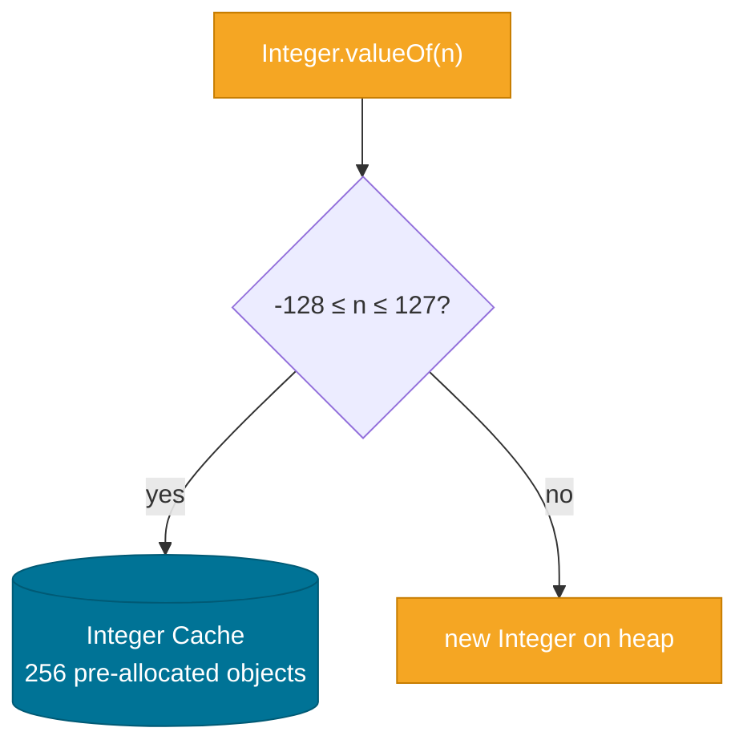

# Wrapper Classes

> Java's eight primitive wrapper types (`Integer`, `Long`, `Double`, `Float`, `Short`, `Byte`, `Character`, `Boolean`) box primitive values into objects so they can participate in collections, generics, and APIs that only accept `Object` — but the boundary between primitives and their wrappers carries caching traps and performance implications you must know.

## What Problem Does It Solve?

Java's type system has a fundamental split: **primitives** (`int`, `long`, `double`, etc.) are fast value types stored on the stack, while **objects** live on the heap. This split creates problems:

1. **Collections can't hold primitives** — `List<int>` is illegal. You need `List<Integer>`.
2. **Generics are erased to `Object`** — `Map<String, Integer>` works; `Map<String, int>` doesn't.
3. **APIs that accept `Object` or use generics** require object types.
4. **Null representation** — a primitive `int` can't be null; `Integer` can be, which is useful when a value is genuinely absent.
5. **Utility methods** — `Integer.parseInt("42")`, `Integer.toBinaryString(255)`, `Integer.MAX_VALUE` live on the wrapper class, not on the primitive.

The wrapper classes bridge this gap: each primitive has a corresponding object wrapper with:
- The primitive value boxed inside
- Static factory/parsing methods
- Useful constants (`MIN_VALUE`, `MAX_VALUE`, `SIZE`, `BYTES`)

## The Eight Wrappers

| Primitive | Wrapper | Size (bits) |
|-----------|---------|-------------|
| `boolean` | `Boolean` | — |
| `byte` | `Byte` | 8 |
| `short` | `Short` | 16 |
| `char` | `Character` | 16 |
| `int` | `Integer` | 32 |
| `long` | `Long` | 64 |
| `float` | `Float` | 32 |
| `double` | `Double` | 64 |

All numeric wrappers extend `java.lang.Number`. All eight implement `java.lang.Comparable<T>`.

## How It Works

### Autoboxing and Unboxing

Java 5 introduced automatic conversion between primitives and wrappers:

- **Boxing**: the compiler silently wraps a primitive in its wrapper — `int i = 42; Integer obj = i;`
- **Unboxing**: the compiler silently extracts the primitive — `Integer obj = 42; int i = obj;`

This conversion is syntactic sugar: the compiler inserts calls to `Integer.valueOf(i)` (boxing) and `obj.intValue()` (unboxing) in the bytecode.

```java
List<Integer> list = new ArrayList<>();
list.add(7);           // ← boxing: Integer.valueOf(7)
int x = list.get(0);  // ← unboxing: intValue()
```

### Caching — The `valueOf` Integer Cache

`Integer.valueOf(int)` caches instances for values in the range **-128 to 127** (inclusive). This is a JVM optimisation: these small integers are reused rather than reallocated.

```java
Integer a = 100;   // uses the cache
Integer b = 100;
System.out.println(a == b); // true  ← same cached instance

Integer c = 200;   // outside cache range
Integer d = 200;
System.out.println(c == d); // false ← different heap objects
```

The same cache applies to `Byte`, `Short`, `Long` (same range), and `Character` (0–127). `Boolean` caches `TRUE` and `FALSE`.



*`Integer.valueOf` returns a cached instance for small values — using `==` on two `Integer` objects with values > 127 produces `false` even when they hold the same number.*

The upper bound of the cache can be raised with the JVM flag `-XX:AutoBoxCacheMax=<n>`, but the lower bound is always -128.

### Key Static Methods

```java
Integer.parseInt("42")           // String → int
Integer.parseInt("FF", 16)       // hex string → int (255)
Integer.valueOf("42")            // String → Integer (cached where possible)
Integer.toString(42)             // int → "42"
Integer.toBinaryString(8)        // "1000"
Integer.toHexString(255)         // "ff"
Integer.toOctalString(8)         // "10"
Integer.bitCount(7)              // number of set bits: 3
Integer.highestOneBit(100)       // 64
Integer.numberOfLeadingZeros(1)  // 31
Integer.compare(a, b)            // safe comparison (avoids overflow in subtraction)
Integer.sum(a, b) / max / min    // functional-style numeric ops (Java 8+)
```

### `Number` Superclass Methods

All numeric wrappers inherit from `Number`:

```java
Integer i = 42;
i.intValue()    // 42
i.longValue()   // 42L
i.doubleValue() // 42.0
i.floatValue()  // 42.0f
```

## Code Examples

:::tip Practical Demo
See the [Wrapper Classes Demo](./demo/wrapper-classes-demo.md) for the Integer cache trap, unboxing NPE patterns, and the overflow-safe comparator in action.
:::

### Parsing user input

```java
String input = "123";
int value;
try {
    value = Integer.parseInt(input);  // ← throws NumberFormatException if non-numeric
} catch (NumberFormatException e) {
    throw new IllegalArgumentException("Invalid number: " + input, e);
}
```

### Safe numeric comparison

```java
// DANGEROUS: subtraction can overflow for large negative/positive combos
int compare = a - b;  // may overflow if a and b are far apart

// SAFE: use Integer.compare
int compare = Integer.compare(a, b); // returns negative, zero, or positive

// Also works as a method reference in sort:
list.sort(Integer::compare);
```

### Autoboxing NullPointerException trap

```java
Map<String, Integer> scores = new HashMap<>();
int score = scores.get("Alice"); // ← NPE! get returns null; unboxing null throws NPE

// Fix 1: null check before unboxing
Integer scoreObj = scores.get("Alice");
if (scoreObj != null) {
    int s = scoreObj;
}

// Fix 2: use getOrDefault
int score = scores.getOrDefault("Alice", 0);
```

### The `==` caching trap in practice

```java
Integer x = 127;
Integer y = 127;
System.out.println(x == y);     // true  ← cached

Integer p = 128;
Integer q = 128;
System.out.println(p == q);     // false ← NOT cached — different objects
System.out.println(p.equals(q)); // true  ← always use equals for value comparison
```

### Boxing overhead in a tight loop

```java
// BAD — boxes and unboxes every iteration
Long sum = 0L;
for (long i = 0; i < 1_000_000; i++) {
    sum += i;  // ← unboxes sum, adds i, re-boxes result: 1M allocations
}

// GOOD — stays on the stack
long sum = 0L;
for (long i = 0; i < 1_000_000; i++) {
    sum += i;  // primitive — no allocation
}
```

## Trade-offs & When To Use / Avoid

| | Primitive | Wrapper |
|--|-----------|---------|
| Memory | Minimal (value on stack) | Object header + value on heap |
| Performance | Faster (no GC pressure) | Slower (boxing/unboxing, allocation) |
| Null-able | No | Yes |
| Use in generics | No | Yes |
| Collections | No | Yes |
| Default value | 0, false | null |

**Use primitives when:**
- In tight numerical loops or performance-critical paths
- As local variables, method parameters, or array elements
- There is no meaningful concept of "absent value"

**Use wrappers when:**
- Storing in a `Collection` or `Map`
- The field can legitimately be `null` (e.g., optional DTO field)
- Using generics or method references that require an object type
- Using the static utility methods to parse or convert

## Common Pitfalls

**1. Comparing wrappers with `==`**
Always use `.equals()` for value comparison of wrapper objects. The cache makes `==` accidentally "work" for small integers but fail for larger values, creating intermittent bugs.

**2. Unboxing `null` causes NPE**
```java
Integer value = null;
int x = value;  // NullPointerException at unboxing
```
Check for null before unboxing, or use `Objects.requireNonNullElse(value, 0)`.

**3. `Integer.MIN_VALUE` in `Comparator` subtraction**
Writing a `Comparator` as `(a, b) -> a - b` overflows when `a` is very large positive and `b` is very large negative:
```java
// DANGEROUS
list.sort((a, b) -> a - b);       // may overflow!

// SAFE
list.sort(Integer::compare);       // or Comparator.naturalOrder()
```

**4. Huge `Long` values and `==`**
The caching trap applies to `Long` too: values outside -128 to 127 are not cached.
```java
Long a = 128L;
Long b = 128L;
a == b // false
```

**5. Autoboxing in conditional expressions**
```java
Integer value = condition ? 1 : null;
int x = value;  // NPE when condition is false — null unboxed
```

## Interview Questions

### Beginner

**Q: What is autoboxing and unboxing?**
**A:** Autoboxing is the automatic conversion of a primitive to its wrapper type (e.g., `int` → `Integer`). Unboxing is the reverse. The compiler generates these conversions transparently by inserting `Integer.valueOf(i)` (boxing) or `intValue()` (unboxing) calls.

**Q: Why can't you use `int` directly in a `List`?**
**A:** Java generics only work with reference types, and `int` is a primitive value type. Generics are erased to `Object` at runtime, and primitives don't extend `Object`. So `List<Integer>` is required; Java auto-boxes when you call `list.add(42)`.

**Q: What values does `Integer` cache?**
**A:** -128 to 127 (inclusive). `Integer.valueOf(n)` returns the same object for any `n` in this range, which is why `Integer a = 100; Integer b = 100; a == b` is `true`. For values outside this range, a new object is created, so `==` returns `false`.

### Intermediate

**Q: When can unboxing cause a `NullPointerException`?**
**A:** When a `null` wrapper is unboxed — e.g., retrieving a value from a `Map<String, Integer>` for a key that doesn't exist returns `null`, and assigning that to an `int` local variable triggers unboxing, which throws NPE. Always check for null or use `getOrDefault` before unboxing.

**Q: Why is `Integer.compare(a, b)` preferred over `a - b` as a comparator?**
**A:** `a - b` can overflow when the values are on opposite extremes (e.g., `Integer.MIN_VALUE - 1` gives `Integer.MAX_VALUE`), producing a wrong result and a bug in sorting. `Integer.compare(a, b)` uses conditional logic and always returns a correct negative, zero, or positive value.

**Q: What is the difference between `Integer.parseInt` and `Integer.valueOf`?**
**A:** `parseInt` converts a `String` to a primitive `int`. `valueOf` converts a `String` or `int` to an `Integer` object (and uses the cache for small values). Use `parseInt` when you need a primitive, `valueOf` when you need an object.

### Advanced

**Q: Can the Integer cache range be changed, and should it be?**
**A:** The JVM flag `-XX:AutoBoxCacheMax=<n>` raises the upper bound of the `Integer` cache. Lowering below 127 is not supported. Enlarging it can reduce allocation pressure in codebases that box many medium-sized integers intensively (e.g., certain stream pipelines), but it also increases startup memory. It's rarely needed; prefer avoiding boxing in hot paths altogether.

**Q: How do Project Valhalla value types planned for Java address the wrapper class problem?**
**A:** Project Valhalla introduces "primitive classes" (value types) that are laid out inline in memory — no object header overhead and no pointer indirection — while still allowing use in generics. This would allow `List<int>` in a future Java, eliminating the need for `Integer` in generic containers. As of Java 21, Valhalla is still in preview stages; the feature is not yet in production Java.

## Further Reading

- [Integer Javadoc (Java 21)](https://docs.oracle.com/en/java/javase/21/docs/api/java.base/java/lang/Integer.html) — full reference including bit manipulation methods
- [Oracle Tutorial: Autoboxing and Unboxing](https://docs.oracle.com/javase/tutorial/java/data/autoboxing.html) — concise official explanation
- [Baeldung: Primitives vs Objects](https://www.baeldung.com/java-primitives-vs-objects) — performance benchmarks with JMH

## Related Notes

- [Object Class](./object-class.md) — all wrapper classes extend `Object` and inherit `equals`/`hashCode`, which are correctly implemented to compare by value.
- [Java Type System — Autoboxing](../java-type-system/index.md) — the type system note covers widening/narrowing, autoboxing rules, and type erasure in detail.
- [Collections Framework](../collections-framework/index.md) — every generic collection uses wrapper types; the caching and equals/hashCode contracts covered here directly affect `HashMap` and `HashSet` behaviour.
