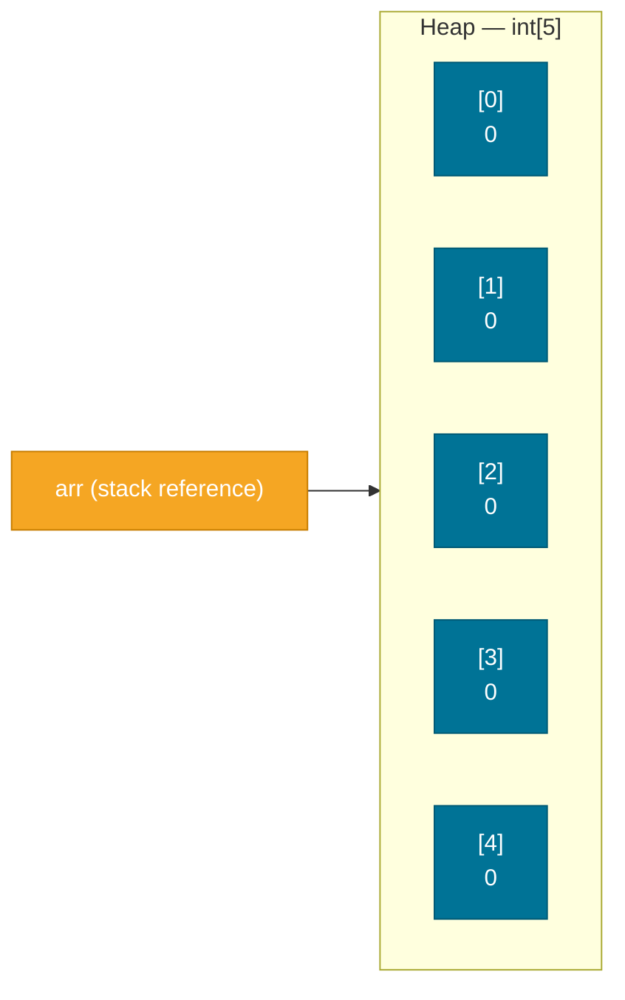

# Arrays

> An array is Java's simplest data structure — a fixed-size, ordered, contiguous block of elements of a single type.

## What Problem Does It Solve?

Suppose you need to track the monthly sales figures for a year. Without arrays, you'd declare 12 separate variables: `jan`, `feb`, `mar`, ... — and all loops, summations, and comparisons would become unmaintainable. Arrays let you group related values under a single name, access any element instantly by position, and iterate over all values with a simple loop.

Arrays are also the building block for higher-level data structures: `ArrayList` is backed by an array internally; `HashMap` uses an array of buckets; sorting algorithms operate on arrays. Understanding arrays is prerequisite knowledge for everything else in the collections framework.

## What Is It?

An **array** in Java is:
- A **fixed-size** container — the length is set at creation time and cannot change.
- **Zero-indexed** — the first element is at index 0, the last at index `length - 1`.
- **Type-homogeneous** — all elements must be the same type (or the same supertype for reference arrays).
- A **reference type** — the array variable holds a reference to the array object on the heap, even if the elements are primitives.

## How It Works

### Memory Layout

When you create `int[] arr = new int[5]`, the JVM:
1. Allocates a contiguous block of memory on the heap for 5 `int` values (5 × 4 = 20 bytes, plus a small header).
2. Initializes every element to the default value (`0` for `int`, `null` for reference types, `false` for `boolean`).
3. Stores the array's length in a hidden field accessible via `arr.length`.


*`arr` lives on the stack as a reference. The actual array — 5 contiguous integer slots — lives on the heap. Elements default to 0.*

### Creation Syntax

```java
// Declare + allocate (elements default-initialized)
int[] numbers  = new int[5];

// Declare + allocate + initialize with values
int[] primes   = new int[]{2, 3, 5, 7, 11};

// Shorthand array initializer (only for declaration + init in one step)
int[] squares  = {1, 4, 9, 16, 25};

// Reference type array (elements default to null)
String[] names = new String[3];
names[0] = "Alice";
names[1] = "Bob";
// names[2] is null
```

### Accessing and Modifying Elements

```java
int[] arr = {10, 20, 30, 40, 50};
int first = arr[0];              // 10
int last  = arr[arr.length - 1]; // 50
arr[2]    = 99;                  // modifies index 2: {10, 20, 99, 40, 50}
```

Accessing an index outside `0` to `length-1` throws `ArrayIndexOutOfBoundsException` at runtime.

### Iterating

```java
int[] scores = {85, 92, 78, 95, 88};

// Classic for loop — use when you need the index
for (int i = 0; i < scores.length; i++) {
    System.out.println("Score " + i + ": " + scores[i]);
}

// Enhanced for-each — use when you only need values
for (int score : scores) {
    System.out.println(score);
}
```

## Multi-Dimensional Arrays

Java's "multi-dimensional" arrays are actually **arrays of arrays** — a 2D array is an array where each element is itself an array.

```java
// 3 rows, 4 columns — rectangular 2D array
int[][] matrix = new int[3][4];
matrix[0][0] = 1;
matrix[2][3] = 99;

// 2D array literal
int[][] grid = {
    {1, 2, 3},
    {4, 5, 6},
    {7, 8, 9}
};

// Iterating a 2D array
for (int[] row : grid) {
    for (int val : row) {
        System.out.print(val + " ");
    }
    System.out.println();
}
```

Since each row is an independent array, rows can have different lengths (**jagged arrays**):

```java
int[][] jagged = new int[3][];
jagged[0] = new int[]{1};
jagged[1] = new int[]{2, 3};
jagged[2] = new int[]{4, 5, 6};
```

## The `Arrays` Utility Class

`java.util.Arrays` provides static methods for common array operations:

| Method | Purpose |
|--------|---------|
| `Arrays.sort(arr)` | Sorts in ascending order (uses dual-pivot quicksort for primitives, TimSort for objects) |
| `Arrays.binarySearch(arr, key)` | Binary search on a sorted array — returns index or negative value |
| `Arrays.copyOf(arr, newLength)` | Copies array, truncating or padding with defaults |
| `Arrays.copyOfRange(arr, from, to)` | Copies a subrange |
| `Arrays.fill(arr, val)` | Fills all elements with a value |
| `Arrays.equals(a, b)` | Element-wise equality check |
| `Arrays.toString(arr)` | Readable string like `[1, 2, 3]` |
| `Arrays.asList(arr)` | Wraps array as a fixed-size `List` |
| `Arrays.stream(arr)` | Returns an `IntStream`/`Stream<T>` for functional processing |

```java
int[] arr = {5, 2, 8, 1, 9, 3};
Arrays.sort(arr);                   // {1, 2, 3, 5, 8, 9}
int idx = Arrays.binarySearch(arr, 5); // 3
System.out.println(Arrays.toString(arr)); // [1, 2, 3, 5, 8, 9]

int[] copy = Arrays.copyOf(arr, 4); // [1, 2, 3, 5]
Arrays.fill(copy, 0);               // [0, 0, 0, 0]
```

## Code Examples

### Summing an Array

```java
int[] sales = {1200, 980, 1540, 870, 1100};
int total = 0;
for (int sale : sales) {
    total += sale;
}
System.out.println("Total: " + total); // 5690
```

### Finding Min/Max

```java
int[] scores = {42, 87, 55, 96, 73};
int min = scores[0], max = scores[0];
for (int i = 1; i < scores.length; i++) {
    if (scores[i] < min) min = scores[i];
    if (scores[i] > max) max = scores[i];
}
// Or simply:
// int min = Arrays.stream(scores).min().getAsInt();
```

### Reversing an Array In-Place

```java
int[] arr = {1, 2, 3, 4, 5};
for (int left = 0, right = arr.length - 1; left < right; left++, right--) {
    int temp     = arr[left];  // swap
    arr[left]    = arr[right];
    arr[right]   = temp;
}
System.out.println(Arrays.toString(arr)); // [5, 4, 3, 2, 1]
```

### Copying and Resizing (Simulating Growth)

```java
int[] original = {1, 2, 3};
// "Grow" the array by creating a larger copy
int[] grown = Arrays.copyOf(original, 6); // [1, 2, 3, 0, 0, 0]
grown[3] = 4;
```

### Two-Dimensional Matrix Multiplication

```java
int[][] a = {{1, 2}, {3, 4}};
int[][] b = {{5, 6}, {7, 8}};
int n = a.length;
int[][] result = new int[n][n];

for (int i = 0; i < n; i++) {
    for (int j = 0; j < n; j++) {
        for (int k = 0; k < n; k++) {
            result[i][j] += a[i][k] * b[k][j]; // ← accumulate dot product
        }
    }
}
```

## Best Practices

- **Use enhanced for-each** when you don't need the index — cleaner and less error-prone.
- **Prefer `ArrayList` over arrays** for collections that may grow, shrink, or need rich APIs. Use raw arrays only when performance, fixed size, or primitives demand it.
- **Use `Arrays.toString()`** when printing arrays — raw `System.out.println(arr)` prints a memory address, not the contents.
- **Use `Arrays.copyOf()` or `System.arraycopy()`** to copy arrays — never just assign (`int[] copy = original` copies the reference, not the data).
- **Validate index bounds before access** in production APIs where the caller controls indices.
- **For 2D arrays, document the row/column convention** — row-first vs column-first indexing is a common source of bugs.

## Common Pitfalls

**Printing an array without `Arrays.toString()`**:
```java
int[] arr = {1, 2, 3};
System.out.println(arr);  // prints "[I@6d06d69c" — the reference, not contents!
System.out.println(Arrays.toString(arr)); // "[1, 2, 3]"
```

**Copying by assignment copies the reference, not the data**:
```java
int[] a = {1, 2, 3};
int[] b = a;         // b points to the SAME array
b[0] = 99;
System.out.println(a[0]); // 99 — a was mutated through b!
int[] c = Arrays.copyOf(a, a.length); // correct deep copy
```

**`ArrayIndexOutOfBoundsException` from off-by-one**:
```java
int[] arr = new int[5];
arr[5] = 10; // ← AIOOBE: valid indices are 0..4
```

**`NullPointerException` on uninitialized reference elements**:
```java
String[] names = new String[3]; // elements are null
names[0].length(); // ← NPE: names[0] is null
```

**`Arrays.asList()` returns a fixed-size list** — calling `.add()` or `.remove()` on it throws `UnsupportedOperationException`:
```java
List<String> list = Arrays.asList("a", "b", "c");
list.add("d"); // ← UnsupportedOperationException
new ArrayList<>(Arrays.asList("a", "b", "c")).add("d"); // correct
```

## Interview Questions

### Beginner

**Q:** What is the default value of elements in a newly created `int[]` array?
**A:** `0`. Java guarantees all array elements are initialized to their type's default value: `0` for numeric types, `false` for `boolean`, `'\u0000'` for `char`, and `null` for reference types.

**Q:** What exception is thrown when you access an invalid array index?
**A:** `ArrayIndexOutOfBoundsException`, a subclass of `RuntimeException`. It is thrown at runtime when the index is negative or greater than or equal to the array's length.

### Intermediate

**Q:** What is the difference between `==` and `Arrays.equals()` for arrays?
**A:** `==` checks reference identity — whether two variables point to the same array object. `Arrays.equals(a, b)` checks element-wise equality — whether both arrays have the same length and identical elements at each position. For deep equality on multi-dimensional arrays, use `Arrays.deepEquals()`.

**Q:** Is a Java array an object? Can it be assigned to an `Object` variable?
**A:** Yes. Every array in Java is an object — it is a class instance with a `length` field and inherits methods from `Object`. An `int[]` can be assigned to `Object`, and it will pass `obj instanceof int[]`. It has a class whose name is `[I` (for `int[]`).

### Advanced

**Q:** How does `Arrays.sort()` work internally for primitives vs objects?
**A:** For primitive arrays, `Arrays.sort()` uses **dual-pivot quicksort** (introduced in Java 7) — an in-place, non-stable sort with average O(n log n) performance. For object arrays (and during `Arrays.sort(T[], Comparator)`), it uses **TimSort** — a stable, hybrid merge/insertion sort optimized for partially-sorted data, also O(n log n) but with better worst-case guarantees and stability.

**Q:** What is `System.arraycopy()` and when would you use it over `Arrays.copyOf()`?
**A:** `System.arraycopy(src, srcPos, dest, destPos, length)` is a native method that performs a highly optimized bulk memory copy. Use it when you need to copy into an existing destination array at a specific offset, or for maximum performance (e.g., inside `ArrayList.grow()`). `Arrays.copyOf()` is a higher-level wrapper that always creates a new array — it is easier to use but internally calls `System.arraycopy`.

## Further Reading

- [Java Arrays Tutorial (Oracle)](https://docs.oracle.com/javase/tutorial/java/nutsandbolts/arrays.html) — official overview of array syntax and usage
- [java.util.Arrays API](https://docs.oracle.com/en/java/javase/21/docs/api/java.base/java/util/Arrays.html) — full Javadoc for every method in the `Arrays` utility class
- [Baeldung — Guide to Java Arrays](https://www.baeldung.com/java-arrays-guide) — comprehensive practical guide with many examples

## Related Notes

- [Control Flow](./control-flow.md) — nearly all array processing uses loops and conditionals defined there
- [Collections Framework](../collections-framework/index.md) — `ArrayList`, `HashMap`, and other dynamic data structures that supersede arrays for most production use cases
- [Methods](./methods.md) — arrays are commonly passed as method parameters and returned from methods; pass-by-value semantics for arrays are explained there
