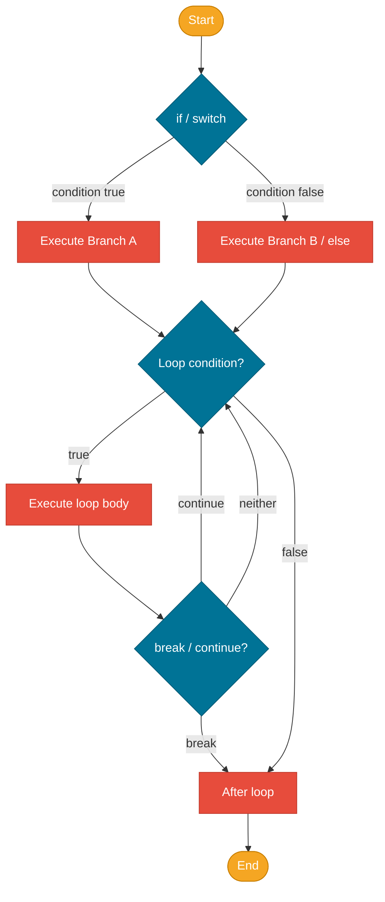

# Control Flow

> A program that only executes statements top-to-bottom isn't very useful — control flow gives you the ability to branch, repeat, and skip based on conditions.

> Note: Clarifications — switch expressions and pattern-matching features are described with their JDK provenance; switch-expression semantics come from JEP 361 (JDK 14) and pattern matching features evolved across JEP 394/406 and later JDKs. Treat pattern-match-for-switch as version-specific — check the JEPs before using in older JDKs.

## What Problem Does It Solve?

Every real program must answer questions at runtime: Is the user authenticated? Is the list empty? Should this action be retried? Without control flow, you'd have to write separate code paths for every possible combination of inputs — an impossible task. Branching (`if`/`switch`) lets a single program adapt to different inputs; looping (`for`/`while`) lets you process collections and repeat operations without code duplication.

## What Is It?

**Control flow** is the order in which statements are executed. Java provides:

- **Selection statements** (`if`/`else`, `switch`) — choose between code paths based on a condition.
- **Iteration statements** (`for`, `while`, `do-while`) — repeat a block of code.
- **Jump statements** (`break`, `continue`, `return`) — alter or exit a loop or method early.

## Selection Statements

### `if` / `else if` / `else`

The most fundamental branching construct:

```java
int score = 75;

if (score >= 90) {
    System.out.println("A");
} else if (score >= 75) {
    System.out.println("B");       // ← this branch executes
} else if (score >= 60) {
    System.out.println("C");
} else {
    System.out.println("F");
}
```

Branches are evaluated top-to-bottom; the **first matching** condition wins and the rest are skipped.

:::tip
Always use curly braces `{}` even for single-line `if` bodies. The classic mistake of adding a second statement that looks indented inside the branch, when it's actually always executed, has caused serious production bugs (including one in an Apple SSL library).
:::

### `switch` Statement (Classic)

The classic `switch` statement selects a branch based on an integer, string, or enum value:

```java
String day = "MON";
switch (day) {
    case "MON":
    case "TUE":
    case "WED":
    case "THU":
    case "FRI":
        System.out.println("Weekday");
        break;   // ← MUST break, otherwise falls through to next case
    case "SAT":
    case "SUN":
        System.out.println("Weekend");
        break;
    default:
        System.out.println("Unknown");
}
```

:::warning
**Fall-through is the default** in classic `switch`. If you omit `break`, execution continues into the next `case` block. This is occasionally intentional (grouping cases) but usually a bug. Always add `break` unless fall-through is deliberate and commented.
:::

### `switch` Expression (Java 14+)

The modern `switch` **expression** (standardized in Java 14) eliminates fall-through and can return a value:

```java
// Arrow syntax: no fall-through, no break needed
String dayType = switch (day) {
    case "MON", "TUE", "WED", "THU", "FRI" -> "Weekday";  // ← comma-separated cases
    case "SAT", "SUN"                        -> "Weekend";
    default                                  -> "Unknown";
};

// Yield: for multi-statement case blocks that produce a value
int numLetters = switch (day) {
    case "MON", "FRI", "SUN" -> 6;
    case "TUE"               -> 7;
    case "THU", "SAT"        -> 8;
    default -> {
        System.out.println("Unusual day: " + day);
        yield day.length(); // ← yield returns a value from a block case
    }
};
```

`switch` expressions work on `int`, `Integer`, `String`, `enum`, and since Java 21 (pattern matching in `switch`) also on arbitrary object types.

## Iteration Statements

### `for` Loop

Best when you know the number of iterations in advance:

```java
// Classic for loop
for (int i = 0; i < 5; i++) {
    System.out.println(i); // 0, 1, 2, 3, 4
}

// Loop parts: initializer ; condition ; update
// Any part can be omitted (infinite loop: for(;;) {...})
```

### Enhanced `for` Loop (for-each)

Simpler iteration over arrays and `Iterable` collections:

```java
String[] fruits = {"apple", "banana", "cherry"};
for (String fruit : fruits) {
    System.out.println(fruit);
}

List<Integer> numbers = List.of(1, 2, 3, 4);
for (int n : numbers) {
    System.out.println(n * 2);
}
```

Use enhanced for when you don't need the index. Use classic for when you need index-based access or need to iterate in reverse.

### `while` Loop

Repeats while a condition is true — condition is checked **before** each iteration:

```java
int i = 0;
while (i < 5) {
    System.out.println(i);
    i++;
}
// body executes 0 times if condition starts false
```

### `do-while` Loop

Like `while`, but condition is checked **after** each iteration — the body always executes **at least once**:

```java
Scanner scanner = new Scanner(System.in);
String input;
do {
    System.out.print("Enter a non-empty string: ");
    input = scanner.nextLine();
} while (input.isBlank()); // ← prompt again if blank
```

## Jump Statements

### `break`

`break` exits the **innermost** enclosing loop or `switch` immediately:

```java
for (int i = 0; i < 100; i++) {
    if (i == 5) break; // stops the loop at i=5
    System.out.println(i);
}
```

**Labeled break** exits from a specific outer loop (use sparingly):

```java
outer:
for (int i = 0; i < 3; i++) {
    for (int j = 0; j < 3; j++) {
        if (i == 1 && j == 1) break outer; // ← exits the outer loop entirely
        System.out.println(i + "," + j);
    }
}
```

### `continue`

`continue` skips the rest of the current iteration and goes to the next:

```java
for (int i = 0; i < 10; i++) {
    if (i % 2 == 0) continue; // skip even numbers
    System.out.println(i);    // prints 1, 3, 5, 7, 9
}
```

### `return`

`return` exits the current method (and optionally returns a value). In the context of control flow, it's also a way to exit a loop early while exiting the method at the same time.

## How It Works


*High-level control flow: selection statements branch execution, iteration statements repeat until a condition fails, and jump statements modify that cycle.*

## Code Examples

### Grading Logic with `switch` Expression

```java
public String grade(int score) {
    return switch (score / 10) {
        case 10, 9 -> "A";
        case 8     -> "B";
        case 7     -> "C";
        case 6     -> "D";
        default    -> "F";
    };
}
```

### FizzBuzz (Classic Beginner Benchmark)

```java
for (int i = 1; i <= 100; i++) {
    if      (i % 15 == 0) System.out.println("FizzBuzz");
    else if (i % 3  == 0) System.out.println("Fizz");
    else if (i % 5  == 0) System.out.println("Buzz");
    else                   System.out.println(i);
}
```

### Early Exit Pattern (`break` on find)

```java
List<String> names = List.of("Alice", "Bob", "Charlie");
String target = "Bob";
boolean found = false;

for (String name : names) {
    if (name.equals(target)) {
        found = true;
        break; // ← no need to keep looping
    }
}
```

### Input Validation with `do-while`

```java
int age;
Scanner sc = new Scanner(System.in);
do {
    System.out.print("Enter age (1-120): ");
    age = sc.nextInt();
} while (age < 1 || age > 120);
```

### Pattern Matching Switch (Java 21)

```java
Object obj = getSomeValue();
String description = switch (obj) {
    case Integer i  -> "Integer: " + i;
    case String  s  -> "String of length " + s.length();
    case null       -> "null value";
    default         -> "Unknown type: " + obj.getClass().getName();
};
```

## Best Practices

- **Prefer `switch` expression (Java 14+)** over classic `switch` statement for value selection — no fall-through risk, cleaner syntax.
- **Use enhanced for-each** instead of index-based loops whenever you don't need the index — it is less error-prone and more readable.
- **Keep loop bodies short** — extract complex logic into named methods so the loop's intent stays clear.
- **Avoid deeply nested loops and conditions** — more than two levels of nesting is a sign to extract a helper method.
- **Initialize loop variables at a minimal scope** — declare `int i` inside the `for` initializer, not before it.
- **Don't use labeled break/continue** unless absolutely necessary — they make code harder to follow. Consider restructuring into a helper method instead.

## Common Pitfalls

**Fall-through in classic `switch`**:
```java
switch (val) {
    case 1:
        doSomething(); // ← missing break: falls through to case 2!
    case 2:
        doSomethingElse(); // runs for BOTH val=1 and val=2
}
```

**Infinite loop because the loop variable is never updated**:
```java
int i = 0;
while (i < 10) {
    System.out.println(i);
    // ← forgot i++; this runs forever
}
```

**Modifying a collection while iterating with for-each**:
```java
List<String> list = new ArrayList<>(List.of("a", "b", "c"));
for (String s : list) {
    list.remove(s); // ← throws ConcurrentModificationException
}
// Use Iterator.remove() or removeIf() instead
```

**Off-by-one in `for` loops**:
```java
// To iterate indices 0..n-1:
for (int i = 0; i <= n; i++) { ... } // ← BUG: runs n+1 times, index n is out of bounds
for (int i = 0; i < n;  i++) { ... } // ← correct
```

## Interview Questions

### Beginner

**Q:** What is the difference between `while` and `do-while`?
**A:** In a `while` loop, the condition is checked before executing the body — if the condition is false at the start, the body never runs. In `do-while`, the body executes at least once, and then the condition is checked. Use `do-while` when you always need at least one execution, such as input validation loops.

**Q:** What does `break` do inside a loop?
**A:** `break` immediately exits the innermost enclosing loop (or `switch`). Execution continues with the statement after the loop.

### Intermediate

**Q:** What is the difference between a `switch` statement and a `switch` expression in Java?
**A:** The classic `switch` statement uses `case:` with required `break` to avoid fall-through. The `switch` expression (Java 14+) uses `case ->` arrow syntax with no fall-through, can return a value, and exhaustiveness is compiler-checked (for enums and sealed types). The expression form is preferred in modern Java for clarity and safety.

**Q:** Why does modifying a collection during a for-each loop throw `ConcurrentModificationException`?
**A:** The for-each loop uses the collection's `Iterator` internally. The iterator tracks a `modCount` to detect changes to the collection's structure while iteration is in progress. If you add or remove elements directly, the count changes and the iterator detects the inconsistency and throws `ConcurrentModificationException`. Use `Iterator.remove()`, `List.removeIf()`, or collect removals and do them after the loop.

### Advanced

**Q:** How does pattern matching in `switch` (Java 21) work with sealed classes?
**A:** When switching over a sealed class hierarchy with pattern matching, the compiler can verify **exhaustiveness** — it checks at compile time that all permitted subtypes are covered. If you add a new subtype to the sealed class and forget to update the `switch`, the compiler emits an error. This is a major reliability advantage: unlike `instanceof`-chain ifs, the `switch` stays in sync with the type hierarchy automatically.

**Q:** What is the performance difference between a `switch` and a chain of `if-else if` statements?
**A:** For many cases, the compiler can optimize a `switch` over integral types and strings into a **jump table** or **hash-based lookup** (O(1)), while a chain of `if-else if` is always O(n). For small numbers of cases (< ~5), the difference is negligible. For large enumerations or string dispatch, `switch` can be significantly faster. JIT compilation may further optimize both patterns.

## Further Reading

- [Java Control Flow Tutorial (Oracle)](https://docs.oracle.com/javase/tutorial/java/nutsandbolts/flow.html) — official tutorial covering `if`, `switch`, `for`, `while`, `break`, `continue`
- [JEP 361 — Switch Expressions](https://openjdk.org/jeps/361) — the JEP that standardized switch expressions in Java 14
- [JLS §14 — Blocks, Statements, and Patterns](https://docs.oracle.com/javase/specs/jls/se21/html/jls-14.html) — formal specification for all control flow constructs

## Related Notes

- [Operators & Expressions](./operators-and-expressions.md) — the boolean conditions used in control flow are built from relational and logical operators
- [Arrays](./arrays.md) — most array processing involves loops and control flow constructs introduced here
- [Methods](./methods.md) — `return` exits a method and is closely related to branching patterns discussed here
