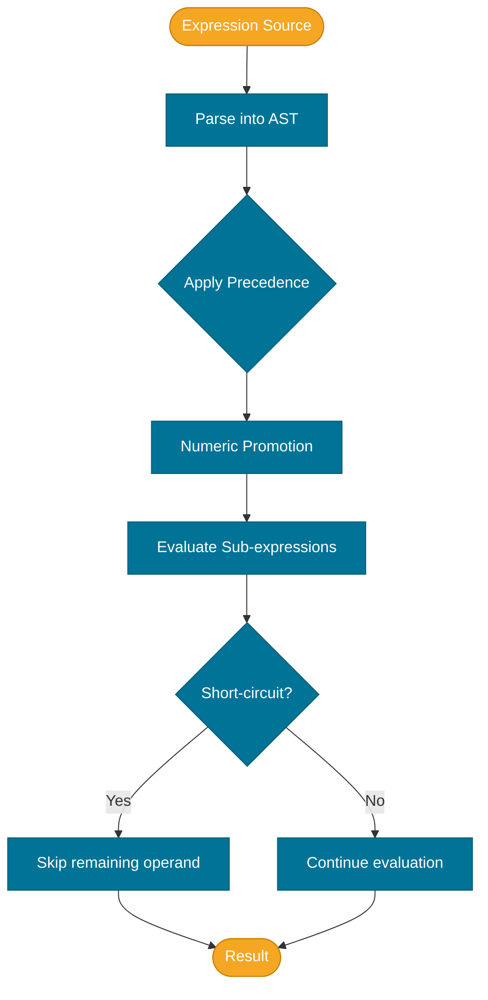

# Operators & Expressions

> An expression is any combination of values, variables, methods, and operators that evaluates to a single value — and operators are the vocabulary that combines them.

> Note: Clarifications — operator semantics here follow the Java Language Specification (JLS). Where the file discusses newer language constructs (for example, pattern-matching `instanceof` or switch expressions), JDK/JEP references are included; consult JEP 394 and JEP 361 for pattern/switch specifics.

## What Problem Does It Solve?

Programs compute. They add prices, compare dates, combine boolean conditions, and manipulate bits in message flags. Without operators, every computation would require calling a method — even basic arithmetic. Operators provide a compact, expressive syntax for common computations that the compiler can optimize efficiently. Understanding operator precedence and behavior prevents subtle logic bugs lurking in complex conditions that look correct but evaluate differently than intended.

## What Is It?

An **operator** is a symbol (or keyword) that performs an operation on one or more **operands** and produces a result. An **expression** is any syntactic construct that can be evaluated to a value — from a single variable `x` to a compound condition `(x > 0 && y < 100)`.

Java operators fall into these categories:

| Category | Examples |
|----------|----------|
| Arithmetic | `+`, `-`, `*`, `/`, `%`, `++`, `--` |
| Relational | `==`, `!=`, `<`, `>`, `<=`, `>=` |
| Logical | `&&`, `\|\|`, `!` |
| Bitwise & Shift | `&`, `\|`, `^`, `~`, `<<`, `>>`, `>>>` |
| Assignment | `=`, `+=`, `-=`, `*=`, `/=`, `%=`, `&=`, `\|=`, `^=`, `<<=`, `>>=`, `>>>=` |
| Ternary | `? :` |
| `instanceof` | `instanceof`, pattern-matching `instanceof` (Java 16+) |

## Arithmetic Operators

Standard math operators work as expected on numeric types.

```java
int a = 17, b = 5;
System.out.println(a + b);   // 22
System.out.println(a - b);   // 12
System.out.println(a * b);   // 85
System.out.println(a / b);   // 3  ← integer division truncates, does NOT round
System.out.println(a % b);   // 2  ← remainder (modulo)
```

### Integer Division Gotcha

When both operands are integers, `/` produces an integer result by truncating toward zero:
```java
int x = 7 / 2;     // → 3, not 3.5
double y = 7.0 / 2; // → 3.5 (one operand is double, so result is double)
double z = (double) 7 / 2; // → 3.5 (cast promotes before division)
```

### Increment and Decrement

`++` and `--` exist in **prefix** and **postfix** forms with a subtle difference:

```java
int n = 5;
int pre  = ++n; // ← increment FIRST, then use: pre=6, n=6
int post = n++; // ← use FIRST, then increment: post=6, n=7
```

## Relational Operators

Relational operators produce a `boolean` result.

```java
int x = 10;
System.out.println(x == 10); // true
System.out.println(x != 10); // false
System.out.println(x >  5);  // true
System.out.println(x <= 10); // true
```

:::warning
**Never use `==` to compare objects** (including `String`, `Integer`, etc.) for content equality. `==` checks **reference identity** — whether two variables point to the same object in memory. Use `.equals()` for content equality.
```java
String a = new String("hello");
String b = new String("hello");
System.out.println(a == b);       // false — different objects
System.out.println(a.equals(b));  // true  — same content
```
:::

## Logical Operators

Logical operators combine `boolean` expressions.

| Operator | Name | Returns `true` when... |
|----------|------|------------------------|
| `&&` | Logical AND | Both sides are `true` |
| `\|\|` | Logical OR | At least one side is `true` |
| `!` | Logical NOT | The operand is `false` |

### Short-Circuit Evaluation

`&&` and `||` use **short-circuit evaluation** — they stop evaluating as soon as the result is determined:

- `false && <anything>` → immediately `false`; right side is never evaluated.
- `true || <anything>` → immediately `true`; right side is never evaluated.

```java
String name = null;
// Safe null check using short-circuit:
if (name != null && name.length() > 0) {
    // ← if name is null, the second condition is NEVER evaluated → no NPE
}
```

Use the non-short-circuit operators `&` and `|` only when you explicitly need both sides evaluated (rare, usually for side-effect operations).

## Bitwise and Shift Operators

These operate on the individual bits of integer types (`int`, `long`, `byte`, `short`, `char`).

| Operator | Operation | Example (`a=0b1010`, `b=0b1100`) |
|----------|-----------|----------------------------------|
| `&` | Bitwise AND | `a & b` → `0b1000` (8) |
| `\|` | Bitwise OR | `a \| b` → `0b1110` (14) |
| `^` | Bitwise XOR | `a ^ b` → `0b0110` (6) |
| `~` | Bitwise NOT | `~a` → all bits flipped (two's complement) |
| `<<` | Left shift | `a << 1` → `0b10100` (multiply by 2) |
| `>>` | Signed right shift | `a >> 1` → `0b0101` (divide by 2, sign-extends) |
| `>>>` | Unsigned right shift | always fills leftmost bits with 0 |

```java
int flags = 0b0000_1010; // bits 1 and 3 set
int mask  = 0b0000_0010; // bit 1
boolean bit1Set = (flags & mask) != 0; // true
int withBit2    = flags | 0b0000_0100; // set bit 2
int toggleBit3  = flags ^ 0b0000_1000; // toggle bit 3
```

## Assignment Operators

Compound assignment operators combine an operation with assignment:

```java
int x = 10;
x += 5;  // x = x + 5 = 15
x -= 3;  // x = x - 3 = 12
x *= 2;  // x = x * 2 = 24
x /= 4;  // x = x / 4 = 6
x %= 4;  // x = x % 4 = 2
x <<= 1; // x = x << 1 = 4
```

## Ternary Operator

The **ternary operator** `? :` is a compact conditional expression:

```
condition ? valueIfTrue : valueIfFalse
```

```java
int abs = (x >= 0) ? x : -x;
String label = (score >= 60) ? "Pass" : "Fail";
```

Use ternary for simple, inline value selection. Avoid nesting ternaries — it quickly becomes unreadable.

## `instanceof` Operator

`instanceof` tests whether an object is of a specific type:

```java
Object obj = "hello";
boolean isString = obj instanceof String; // true
```

**Pattern-matching `instanceof`** (Java 16+ as standard) eliminates the cast:

```java
// Old style:
if (obj instanceof String) {
    String s = (String) obj;
    System.out.println(s.toUpperCase());
}

// Pattern-matching (Java 16+):
if (obj instanceof String s) {
    System.out.println(s.toUpperCase()); // s is already typed as String
}
```

## Operator Precedence

Precedence determines which operations are evaluated first in an expression with multiple operators. Higher precedence binds more tightly.

| Precedence | Operators |
|-----------|-----------|
| Highest | `++`, `--` (postfix), `()`, `[]`, `.` |
| | `++`, `--` (prefix), `+`, `-` (unary), `~`, `!` |
| | `*`, `/`, `%` |
| | `+`, `-` |
| | `<<`, `>>`, `>>>` |
| | `<`, `>`, `<=`, `>=`, `instanceof` |
| | `==`, `!=` |
| | `&` |
| | `^` |
| | `\|` |
| | `&&` |
| | `\|\|` |
| | `? :` (ternary) |
| Lowest | `=`, `+=`, `-=` … (assignments) |

:::tip
**Use parentheses generously** to make precedence explicit rather than relying on memorization. `(a + b) * c` is clearer than assuming `*` binds tighter.
:::

## How It Works


*Expression evaluation flow: the compiler parses precedence, applies numeric promotion, evaluates sub-expressions, and applies short-circuit rules where applicable.*

## Code Examples

### Combining Logical and Relational Operators

```java
int age = 25;
boolean hasLicense = true;
boolean canDrive = age >= 18 && hasLicense; // true

// Short-circuit saves a method call if the first check fails:
String username = null;
boolean isValid = username != null && !username.isBlank(); // false (short-circuits at null check)
```

### Bitwise Use Case — Permission Flags

```java
// Common pattern: encode permissions as bit flags
static final int READ    = 0b001; // 1
static final int WRITE   = 0b010; // 2
static final int EXECUTE = 0b100; // 4

int userPerms = READ | WRITE;  // 3 — has READ and WRITE

// Check if user can read:
boolean canRead = (userPerms & READ) != 0; // true

// Grant EXECUTE:
userPerms |= EXECUTE;  // 7

// Revoke WRITE:
userPerms &= ~WRITE;   // 5 — clears the WRITE bit
```

### Shift Operators for Fast Power-of-Two Arithmetic

```java
int x = 1;
System.out.println(x << 4); // 16 = 1 * 2^4  (left shift = multiply by 2^n)
System.out.println(64 >> 3); // 8  = 64 / 2^3 (right shift = divide by 2^n)
```

## Best Practices

- **Use `&&` and `||` (short-circuit)** instead of `&` and `|` for boolean logic — short-circuiting avoids unnecessary computation and prevents NullPointerExceptions.
- **Never compare objects with `==`** — use `.equals()`. Reserve `==` for primitives and explicit reference identity checks (e.g., `obj == null`).
- **Parenthesize complex expressions** — do not rely on precedence memorization in code others will maintain.
- **Avoid side effects in ternary conditions** — keep the condition simple and pure.
- **Prefer pattern-matching `instanceof`** (Java 16+) over old-style cast-after-check.
- **Use named constants for bit masks** rather than inline hex literals to make bitwise code self-documenting.

## Common Pitfalls

**Integer division surprises**:
```java
int ratio = 3 / 4;  // → 0, not 0.75
double correct = 3.0 / 4; // → 0.75
```

**`+` as string concatenation vs. addition**:
```java
System.out.println("Value: " + 1 + 2);  // "Value: 12" — left to right, concatenation
System.out.println("Value: " + (1 + 2)); // "Value: 3"  — parentheses force addition first
```

**Prefix vs. postfix `++` in assignments**:
```java
int x = 5;
int a = x++;  // a=5, x=6 (use then increment)
int b = ++x;  // b=7, x=7 (increment then use)
```

**Comparing `==` on Integer objects** (autoboxing cache boundary):
```java
Integer a = 127;
Integer b = 127;
System.out.println(a == b); // true — JVM caches -128..127
Integer c = 128;
Integer d = 128;
System.out.println(c == d); // false! — different objects outside cache range
```

## Interview Questions

### Beginner

**Q:** What is the difference between `&` and `&&` in Java?
**A:** `&&` is the logical AND with short-circuit evaluation — if the left side is `false`, the right side is never evaluated. `&` is the bitwise AND (and non-short-circuit logical AND) — both sides are always evaluated. For boolean logic, always prefer `&&` for safety and efficiency.

**Q:** What does the `%` operator return for negative numbers?
**A:** The result has the same sign as the **dividend** (left operand): `-7 % 3` → `-1`; `7 % -3` → `1`. This is the **remainder**, not the mathematical modulo.

### Intermediate

**Q:** Why does `"a" + 1 + 2` produce `"a12"` not `"a3"`?
**A:** The `+` operator is evaluated left to right. `"a" + 1` triggers string concatenation (since one operand is a `String`), producing `"a1"`. Then `"a1" + 2` produces `"a12"`. To add first, use `"a" + (1 + 2)`.

**Q:** What is short-circuit evaluation and why does it matter?
**A:** With `&&`, if the left operand is `false`, the right operand is not evaluated. With `||`, if the left operand is `true`, the right is skipped. This matters for null-safety: `obj != null && obj.method()` safely avoids calling `method()` on null, because the right side is never reached when `obj` is null.

### Advanced

**Q:** What is the purpose of `>>>` vs `>>`?
**A:** `>>` is the **signed right shift** — it fills vacated bits with the sign bit (0 for positive, 1 for negative), preserving the sign. `>>>` is the **unsigned right shift** — it always fills with 0, regardless of sign. For example, `-1 >> 1` → `-1` (all 1s), but `-1 >>> 1` → `Integer.MAX_VALUE` (0 followed by all 1s). Use `>>>` when treating an `int` as a bag of bits rather than a signed number.

**Q:** How does pattern-matching `instanceof` work, and what does it bind?
**A:** `obj instanceof String s` both tests the type and binds a new local variable `s` of type `String` in scope if the test is true. The variable `s` is in scope for the `true` branch of the enclosing condition. It eliminates the cast and prevents using the wrong type by accident.

## Further Reading

- [Java Operators Tutorial (Oracle)](https://docs.oracle.com/javase/tutorial/java/nutsandbolts/operators.html) — concise overview of all operator categories with precedence table
- [JLS §15 — Expressions](https://docs.oracle.com/javase/specs/jls/se21/html/jls-15.html) — authoritative formal semantics for every Java expression
- [Baeldung — Java Operators](https://www.baeldung.com/java-operators) — practical guide with edge-case examples

## Related Notes

- [Variables & Data Types](./variables-and-data-types.md) — operands used in expressions are always typed, and numeric promotion rules depend on operand types
- [Type Conversion](./type-conversion.md) — numeric promotion in expressions is a form of widening conversion
- [Control Flow](./control-flow.md) — relational and logical operators drive every `if`, `while`, and `for` condition
