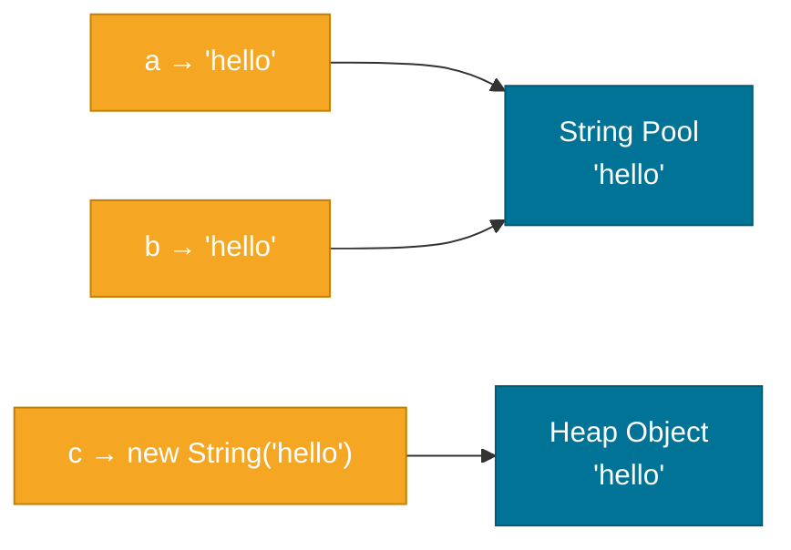

# Strings

> `String` is the most frequently used class in Java — and it comes with design decisions that surprise most developers until they understand the reasoning.

## What Problem Does It Solve?

Text manipulation is central to almost every program — parsing user input, building URLs, logging, serialization, and rendering output all involve strings. Java's `String` class needed to solve several competing demands simultaneously:

- **Safety**: strings used as HashMap keys or method arguments must not change unexpectedly when shared.
- **Performance**: programs create millions of strings; reusing identical literals saves heap memory.
- **Security**: passwords and file paths passed to security-sensitive code must not be modifiable by the caller after passing.

Java solves all three with **immutability** — once a `String` is created, its content cannot change. This also makes `String` inherently thread-safe.

## What Is It?

`java.lang.String` is a class (not a primitive) that represents an immutable sequence of Unicode characters. Every `String` object is a final, read-only value — any operation that appears to "modify" a string actually creates a new one.

```java
String greeting = "Hello";
greeting = greeting + ", World"; // "Hello" object is NOT modified
                                 // a new String "Hello, World" is created
```

## Immutability and the String Pool

### String Pool (String Intern Pool)

Java maintains a pool of unique string literals in the heap (in the permanent generation in older JVMs, in the main heap since Java 7). When you write a string literal, the JVM checks the pool first:

- If an identical string already exists, the literal variable points to the pooled object.
- If not, the string is added to the pool.

```java
String a = "hello";         // added to pool
String b = "hello";         // reuses the same pooled object
String c = new String("hello"); // FORCES creation of a new heap object, bypasses pool

System.out.println(a == b); // true  — same pooled object
System.out.println(a == c); // false — c is a different heap object
System.out.println(a.equals(c)); // true — same content
```


*`a` and `b` both point to the same pooled `"hello"`. `c` is forced to a new heap object by `new String()`.*

:::tip
You can manually add a string to the pool with `intern()`:
```java
String c = new String("hello").intern(); // now points to pooled "hello"
System.out.println(a == c); // true
```
This is rarely needed in application code — it's an optimization for programs that create many duplicate strings dynamically.
:::

## How It Works

### `String` Concatenation

The `+` operator on strings is syntactic sugar. The compiler transforms it into a `StringBuilder` chain for simple cases. Since Java 9, the JVM uses `invokedynamic` with `StringConcatFactory` for more efficient concatenation at runtime.

```java
String name = "Alice";
int age = 30;
String msg = "Name: " + name + ", Age: " + age;
// Roughly compiled to: new StringBuilder().append("Name: ").append(name).append(", Age: ").append(age).toString()
```

:::warning
**Avoid string concatenation in loops.** Each `+` creates a new `String` object, leading to O(n²) memory usage and temporary objects. Use `StringBuilder` instead.
```java
// Bad: O(n²) — creates a new String every iteration
String result = "";
for (String word : words) {
    result += word + " ";
}

// Good: O(n) — single StringBuilder, no intermediate Strings
StringBuilder sb = new StringBuilder();
for (String word : words) {
    sb.append(word).append(' ');
}
String result = sb.toString();
```
:::

## `StringBuilder` and `StringBuffer`

When you need to build a string dynamically, use:

- **`StringBuilder`** — mutable, fast, **not thread-safe**. Use in single-threaded contexts (99% of cases).
- **`StringBuffer`** — mutable, synchronized, **thread-safe but slower**. Rarely needed — prefer other thread-safety mechanisms.

```java
StringBuilder sb = new StringBuilder();
sb.append("Hello");      // appends text
sb.append(", ");
sb.append("World");
sb.insert(5, "!");       // inserts at index 5 → "Hello!, World"
sb.delete(5, 6);         // removes chars 5..5 → "Hello, World"
sb.reverse();            // "dlroW ,olleH"
String result = sb.toString(); // converts back to immutable String
```

`StringBuilder` has an initial capacity (default 16 chars) and grows automatically when needed. Provide an initial capacity hint if you know the approximate size: `new StringBuilder(256)`.

## Core `String` API

| Method | Description | Example |
|--------|-------------|---------|
| `length()` | Returns number of characters | `"hello".length()` → `5` |
| `charAt(i)` | Character at index | `"hello".charAt(1)` → `'e'` |
| `substring(start)` | From start to end | `"hello".substring(2)` → `"llo"` |
| `substring(start,end)` | From start (inclusive) to end (exclusive) | `"hello".substring(1,3)` → `"el"` |
| `indexOf(str)` | First index of substring, or -1 | `"hello".indexOf("ll")` → `2` |
| `contains(str)` | True if substring present | `"hello".contains("ell")` → `true` |
| `startsWith(prefix)` | True if starts with prefix | |
| `endsWith(suffix)` | True if ends with suffix | |
| `equals(other)` | Content equality (case-sensitive) | |
| `equalsIgnoreCase(other)` | Content equality ignoring case | |
| `toUpperCase()` | All uppercase (locale-sensitive) | |
| `toLowerCase()` | All lowercase | |
| `trim()` | Remove leading/trailing ASCII whitespace | |
| `strip()` | Remove leading/trailing Unicode whitespace (Java 11+) | |
| `isBlank()` | True if empty or only whitespace (Java 11+) | |
| `replace(old, new)` | Replace all occurrences | |
| `replaceAll(regex, replacement)` | Replace using regex | |
| `split(regex)` | Split into array | `"a,b,c".split(",")` → `["a","b","c"]` |
| `join(delim, parts)` | Join strings with delimiter | `String.join(",", "a","b")` → `"a,b"` |
| `format(fmt, args)` | `printf`-style formatting | `String.format("%s: %d", "x", 5)` → `"x: 5"` |
| `toCharArray()` | Converts to `char[]` | |
| `valueOf(obj)` | Static: converts any type to String | |
| `isEmpty()` | True if length is 0 | |
| `matches(regex)` | True if matches regex | |
| `repeat(n)` | Repeats string n times (Java 11+) | `"ab".repeat(3)` → `"ababab"` |
| `formatted(args)` | Instance form of `format` (Java 15+) | |

## Code Examples

### String Comparison

```java
String s1 = "Java";
String s2 = "java";
System.out.println(s1.equals(s2));            // false — case-sensitive
System.out.println(s1.equalsIgnoreCase(s2));  // true
System.out.println(s1.compareTo(s2));         // negative — 'J' (74) < 'j' (106) in Unicode
```

### Parsing and Splitting

```java
String csv = "Alice,30,Engineer";
String[] parts = csv.split(","); // ["Alice", "30", "Engineer"]
String name = parts[0];
int age  = Integer.parseInt(parts[1]); // ← parse String to int
```

### String Formatting

```java
String name = "Bob";
double price = 9.99;
String msg = String.format("Hello, %s! Total: $%.2f", name, price);
// "Hello, Bob! Total: $9.99"

// Java 15+ text blocks for multiline strings:
String json = """
    {
        "name": "%s",
        "age": %d
    }
    """.formatted(name, 25);
```

### `StringBuilder` Efficient Joining

```java
String[] words = {"the", "quick", "brown", "fox"};
StringBuilder sb = new StringBuilder(64); // pre-size hint
for (int i = 0; i < words.length; i++) {
    if (i > 0) sb.append(' ');
    sb.append(words[i]);
}
System.out.println(sb.toString()); // "the quick brown fox"
```

### Text Blocks (Java 15+)

```java
String html = """
        <html>
            <body>
                <p>Hello, World!</p>
            </body>
        </html>
        """;
// Indentation relative to the closing """ is stripped automatically
```

## Best Practices

- **Always use `.equals()` for string content comparison** — never `==`.
- **Use `StringBuilder` in loops** to avoid O(n²) string concatenation.
- **Use `String.isBlank()` (Java 11+)** over `s.trim().isEmpty()` — it handles all Unicode whitespace.
- **Use `strip()` over `trim()`** for trimming Unicode whitespace (Java 11+); `trim()` only handles ASCII space (U+0020).
- **Avoid `new String("literal")`** — there's no reason to bypass the string pool for literals.
- **Use text blocks** (Java 15+) for multiline strings — far more readable than `\n` concatenation.
- **Pre-size `StringBuilder`** when the expected output size is known to minimize internal array resizes.

## Common Pitfalls

**Using `==` to compare strings**:
```java
String a = new String("test");
String b = new String("test");
System.out.println(a == b); // false — different objects
System.out.println(a.equals(b)); // true
```

**NullPointerException on string method calls**:
```java
String s = null;
s.equals("hello"); // ← NPE
"hello".equals(s); // ← safe — compare with the literal on the left
```

**String concatenation in a loop creating O(n²) garbage**:
```java
String result = "";
for (int i = 0; i < 10000; i++) {
    result += i; // ← 10000 temporary String objects created!
}
```

**`split()` with a special regex character**:
```java
"a.b.c".split(".");    // ← WRONG: "." in regex means "any character" → empty array
"a.b.c".split("\\.");  // ← correct: escape the dot
```

**`substring()` indices are start-inclusive, end-exclusive**:
```java
"hello".substring(1, 3); // "el" — indices 1 and 2 only (3 is exclusive)
```

## Interview Questions

### Beginner

**Q:** Why is `String` immutable in Java?
**A:** Immutability provides three key benefits: (1) **Thread safety** — multiple threads can read the same `String` concurrently without synchronization. (2) **Security** — a `String` passed to a security check (e.g., a file path or password) cannot be modified by other code holding the same reference. (3) **String pool optimization** — the JVM can safely reuse pooled string literals because no one can change them.

**Q:** What is the difference between `String`, `StringBuilder`, and `StringBuffer`?
**A:** `String` is immutable — every modification creates a new object. `StringBuilder` is mutable and efficient but not thread-safe — use it in single-threaded contexts. `StringBuffer` is mutable and thread-safe (synchronized methods) but slower — it was the original mutable string class and is rarely needed today.

### Intermediate

**Q:** What is the String pool, and where does it live in modern Java?
**A:** The string pool (or intern pool) is a cache of `String` objects with unique values. When you write a string literal, the JVM checks the pool: if the same string exists, the literal resolves to the existing object; otherwise, the new string is added. Since Java 7 (and finalized in Java 8), the pool lives in the **main heap** (previously it was in PermGen, which caused `OutOfMemoryError` issues). You can manually add a string to the pool with `s.intern()`.

**Q:** Why should you avoid `+` concatenation inside loops?
**A:** Each `+` produces a new intermediate `String` object. In a loop of n iterations, you create n temporary objects and copy the growing string n times, resulting in O(n²) total characters copied. `StringBuilder.append()` amortizes growth — it doubles the backing buffer when full, giving O(n) total copy operations.

### Advanced

**Q:** How does Java compile string concatenation with `+` in Java 9+?
**A:** Prior to Java 9, `javac` compiled `a + b` into an explicit `new StringBuilder().append(a).append(b).toString()`. Since Java 9, the compiler emits an `invokedynamic` instruction that calls `StringConcatFactory.makeConcatWithConstants()`. The JVM can then choose the most efficient strategy at runtime (e.g., using `VarHandle` to write directly into a pre-allocated byte array), avoiding unnecessary `StringBuilder` allocation.

**Q:** What does `String.intern()` do and what are the risks of overusing it?
**A:** `intern()` ensures the returned reference points to the canonical pooled copy of the string. If the string is already in the pool, it returns that; otherwise, it adds it and returns the new pooled version. Overusing `intern()` is dangerous: if you intern thousands of unique strings, you fill the pool with objects that are never GC'd (the pool holds strong references), causing a memory leak and `OutOfMemoryError` under pressure.

## Further Reading

- [java.lang.String API (Java 21)](https://docs.oracle.com/en/java/javase/21/docs/api/java.base/java/lang/String.html) — complete Javadoc for every String method
- [Oracle Java Tutorial — Strings](https://docs.oracle.com/javase/tutorial/java/data/strings.html) — official introductory guide to String usage
- [Baeldung — Why String Is Immutable in Java](https://www.baeldung.com/java-string-immutable) — in-depth explanation with memory diagrams

## Related Notes

- [Variables & Data Types](./variables-and-data-types.md) — `String` is a reference type; understanding primitives vs. references explains why `==` fails on strings
- [Core APIs](../core-apis/index.md) — covers wrapper classes and `StringBuilder`/`StringBuffer` in more depth
- [Methods](./methods.md) — string methods are a practical showcase of method signatures, overloading, and return types
