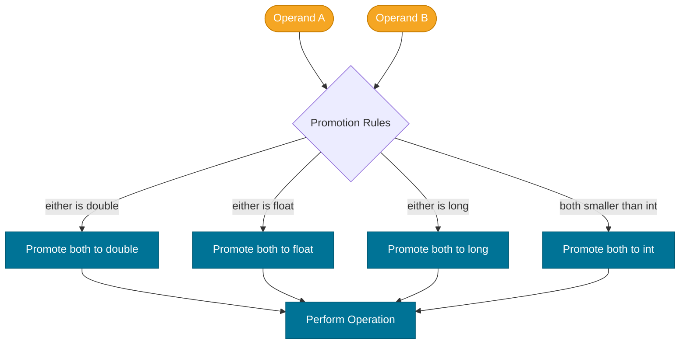

# Type Conversion

> Java is a statically typed language — but it provides well-defined rules for converting values between compatible types, both automatically and on your explicit request.

> Note: Clarifications — this note follows the Java Language Specification (JLS) conversion rules; examples are simplified for readability. For exact normative rules on numeric and reference conversions consult the JLS and the Java API. See https://docs.oracle.com/javase/specs/ and the `double`/`int` conversion sections for precise semantics.

## What Problem Does It Solve?

Real programs constantly mix numeric types. An API returns a `long` timestamp but your business logic works with `int`. A user inputs a `double` price but you need to truncate it to the nearest `int` for display. Without conversion rules, you'd have to manually read and rewrite every bit — error-prone and unreadable.

Java solves this with two mechanisms:
- **Widening conversion** — safe automatic promotion when no data can be lost.
- **Narrowing conversion** — explicit casting when data *may* be lost, so you must consciously accept the risk.

## What Is It?

Type conversion (also called *type casting*) is the process of treating a value of one type as a value of another compatible type.

Java defines several conversion contexts where this happens — assignments, method invocations, arithmetic expressions, and explicit casts. Each context has its own rules about which conversions are allowed automatically and which require a cast.

## Widening Conversions (Implicit)

A **widening conversion** promotes a smaller type to a larger one. Because the destination type has at least as much capacity, no data is lost, and Java performs it **automatically** (also called *implicit conversion* or *upcasting* for primitives).

The widening chain for numeric primitives:

```
byte → short → int → long → float → double
                char ↗
```

```java
int   i = 100;
long  l = i;       // ← widening: int to long, automatic, no cast needed
float f = l;       // ← widening: long to float, automatic
double d = f;      // ← widening: float to double, automatic
```

:::warning
`long` → `float` and `long` → `double` are technically widening but can **lose precision**. A `long` has 64-bit integer precision; a `float` has only ~23 bits of mantissa. Java still performs this automatically, but large `long` values may be rounded.
```java
long precise = 1_234_567_890_123_456_789L;
float approx = precise;  // ← compiles fine, but precision is lost silently!
```
:::

## Narrowing Conversions (Explicit Cast)

A **narrowing conversion** moves to a *smaller* or incompatible type. Because data *may* be lost (truncation, sign change, loss of fractional part), Java requires an **explicit cast**: `(targetType) value`.

```
double → float → long → int → short → byte
                              int   → char
```

```java
double d = 9.99;
int    i = (int) d;   // ← explicit cast required; fractional part dropped → 9
long   l = 123_456_789_012L;
int  truncated = (int) l; // ← upper bits discarded; result may be garbage
```

### How Narrowing Works at the Bit Level

When casting `double` to `int`:
1. The fractional part is **truncated** (not rounded) toward zero.
2. If the value is out of `int` range (`±2³¹`), the result is `Integer.MAX_VALUE` or `Integer.MIN_VALUE`... actually, it's more complex — the JVM converts by discarding bits, so the result wraps unpredictably.

```java
double big = 1e18;
int    bad = (int) big;  // → 2147483647 (Integer.MAX_VALUE, clamped behavior)
double neg = -1e18;
int    bad2 = (int) neg; // → -2147483648 (Integer.MIN_VALUE)
```

## Numeric Promotion in Expressions

Java automatically promotes operands in arithmetic expressions before performing the operation. This happens even without explicit casts:

1. If either operand is `double`, the other is promoted to `double`.
2. Else if either is `float`, the other is promoted to `float`.
3. Else if either is `long`, the other is promoted to `long`.
4. **Otherwise, both operands are promoted to `int`** — even if they are `byte` or `short`.

```java
byte a = 10, b = 20;
// byte result = a + b;  // ← COMPILE ERROR: expression is int, not byte
int  result = a + b;    // ← correct: a and b promoted to int first
```


*Java's binary numeric promotion rules: operands are always widened to a common type before arithmetic is performed.*

## Reference Type Conversion

For reference types (objects), conversion works through the class hierarchy:

- **Upcasting** (subtype → supertype): always safe, done automatically.
- **Downcasting** (supertype → subtype): requires explicit cast; throws `ClassCastException` at runtime if the actual object is not the target type.

```java
Object  obj  = "Hello";          // ← upcast: String → Object, implicit
String  str  = (String) obj;     // ← downcast: explicit cast, safe here
Integer num  = (Integer) obj;    // ← ClassCastException at runtime!
```

Use `instanceof` (or the pattern-matching form since Java 16) to check before casting:

```java
Object obj = "Hello";
if (obj instanceof String s) {   // ← pattern matching instanceof (Java 16+)
    System.out.println(s.length()); // s is already a String here, no extra cast
}
```

## Code Examples

### Widening Demonstration

```java
public class WideningDemo {
    public static void main(String[] args) {
        byte b = 42;
        short s = b;    // byte → short
        int   i = s;    // short → int
        long  l = i;    // int → long
        float f = l;    // long → float (may lose precision for large values)
        double d = f;   // float → double

        System.out.printf("byte=%d, short=%d, int=%d, long=%d, float=%.1f, double=%.1f%n",
            b, s, i, l, f, d);
        // Output: byte=42, short=42, int=42, long=42, float=42.0, double=42.0
    }
}
```

### Narrowing with Explicit Cast

```java
public class NarrowingDemo {
    public static void main(String[] args) {
        double pi = 3.14159;
        int truncated = (int) pi;  // → 3 (fractional part dropped, NOT rounded)
        System.out.println(truncated); // 3

        int value = 300;
        byte b = (byte) value; // 300 in binary: 0001_0010_1100
                               // byte keeps only last 8 bits: 0010_1100 = 44
        System.out.println(b); // 44 — data was lost and wrapped
    }
}
```

### Compound Assignment and Hidden Casts

```java
byte b = 10;
b += 5;  // ← legal! compound assignment (+=, -=, *=, /=) includes an implicit narrowing cast
// equivalent to: b = (byte)(b + 5);

// But this is a compile error:
// b = b + 5; // ← ERROR: b+5 is int, cannot assign to byte without explicit cast
```

### Reference Downcasting with `instanceof`

```java
List<Object> items = List.of("hello", 42, 3.14);
for (Object item : items) {
    if (item instanceof String str) {
        System.out.println("String of length " + str.length());
    } else if (item instanceof Integer n) {
        System.out.println("Integer: " + n);
    }
}
```

## Best Practices

- **Prefer widening over narrowing** whenever possible — narrowing is a signal that you may be throwing away precision or range.
- **Always check with `instanceof` before downcasting** a reference type to avoid `ClassCastException`.
- **Use pattern-matching `instanceof`** (Java 16+) instead of casting in a separate statement — it's safer and more concise.
- **Be explicit about intent when narrowing** — add a comment explaining why the data loss is acceptable (e.g., `// safe: value is always 0–255 here`).
- **Use `Math.toIntExact(long)`** when you expect a `long` to fit in an `int` at runtime — it throws `ArithmeticException` instead of silently truncating.
- **Do not rely on floating-point narrowing for rounding** — `(int) 2.9` → `2`, not `3`. Use `Math.round()` if you need rounding.

## Common Pitfalls

**Assuming `(int)` rounds rather than truncates**:
```java
double d = 2.9;
int i = (int) d;  // → 2, not 3
int rounded = (int) Math.round(d); // → 3
```

**Silent precision loss when widening `long` to `float`**:
```java
long exact = 123_456_789_012_345L;
float f = exact;          // compiles silently
long back = (long) f;     // 123456791543808 — not what you started with!
```

**Forgetting that `byte` arithmetic promotes to `int`**:
```java
byte x = 50, y = 100;
// byte sum = x * y;  // ERROR: 50*100=5000 doesn't fit, but also the expression is int
int sum = x * y;      // correct: both promoted to int before multiplication
```

**Compound assignment masks narrowing errors**:
```java
int big = 200;
byte b = 10;
b += big; // compiles without error! implicit (byte) cast applied
           // 210 in byte = 210 - 256 = -46
System.out.println(b); // -46 — silent data corruption
```

## Interview Questions

### Beginner

**Q:** What is the difference between widening and narrowing conversion in Java?
**A:** Widening converts from a smaller type to a larger one (e.g., `int` → `long`) and is done automatically — no data is lost. Narrowing converts from a larger type to a smaller one (e.g., `double` → `int`) and requires an explicit cast (`(int)`) because data may be lost through truncation or wrapping.

**Q:** What does `(int) 3.9` return?
**A:** It returns `3`. Java truncates toward zero when casting `double` to `int` — it does not round. Use `Math.round()` if rounding is needed.

### Intermediate

**Q:** Why does `byte a = 10; byte b = 20; byte c = a + b;` not compile?
**A:** Java's binary numeric promotion rules state that any operands smaller than `int` are promoted to `int` before arithmetic. The expression `a + b` produces an `int`, which cannot be assigned to `byte` without an explicit cast: `byte c = (byte)(a + b);`.

**Q:** Why do compound assignment operators like `+=` not require an explicit cast?
**A:** The Java Language Specification defines compound assignment operators to include an *implicit narrowing cast*. `b += 5` is equivalent to `b = (byte)(b + 5)`. This is a convenience but can hide accidental data loss.

### Advanced

**Q:** Can widening conversion lose data? Give an example.
**A:** Yes. Converting a `long` to `float` or `double` is technically widening (the type is larger), but `float` has only 23 bits of mantissa (~7 significant decimal digits) versus `long`'s 63 bits of integer precision. Large `long` values are silently rounded: `long l = 123_456_789_012_345L; float f = l;` loses the lower-order digits without any compiler warning.

**Q:** What is the result of `(byte) 200` and why?
**A:** 200 in binary is `1100_1000`. As an 8-bit signed type, the high bit is the sign bit. `1100_1000` in two's complement is `–56`. So `(byte) 200` equals `–56`. This is modular arithmetic: 200 − 256 = −56.

## Further Reading

- [Java Language Specification §5 — Conversions and Contexts](https://docs.oracle.com/javase/specs/jls/se21/html/jls-5.html) — the authoritative formal definition of every conversion kind in Java
- [Oracle Java Tutorial — Data Types](https://docs.oracle.com/javase/tutorial/java/nutsandbolts/datatypes.html) — accessible overview of primitive types and literals
- [Baeldung — Java Type Casting](https://www.baeldung.com/java-type-casting) — practical guide with examples for both primitive and reference casting

## Related Notes

- [Variables & Data Types](./variables-and-data-types.md) — defines the 8 primitive types that are the subject of most conversions explained here
- [Operators & Expressions](./operators-and-expressions.md) — arithmetic operators trigger numeric promotion, which is a form of widening conversion
- [Java Type System](../java-type-system/index.md) — covers autoboxing (primitive ↔ wrapper interconversion) which builds on these conversion rules
