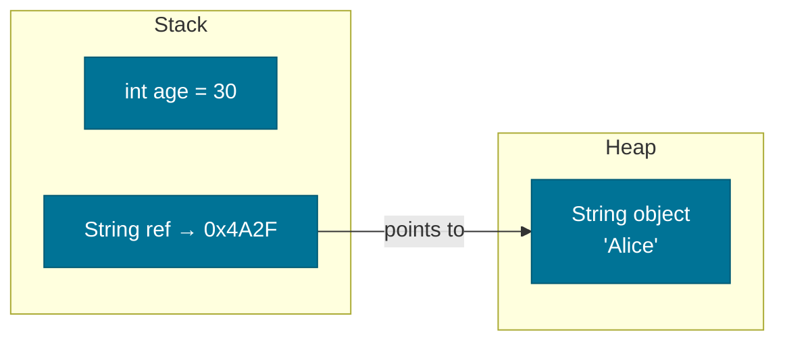

# Variables & Data Types

> Every value stored in a Java program has a type — and understanding that type system is the foundation for writing correct, performant code.

## What Problem Does It Solve?

Without a type system, a program has no way to know what operations are valid on a piece of data. You can't multiply a name by a salary, or compare a timestamp to a boolean. Java's type system enforces correctness at compile time: the compiler rejects nonsensical operations before your code ever runs. This catches an entire class of bugs — null pointer misuse, arithmetic on strings, binary-level corruption — before they become runtime disasters.

Additionally, types tell the JVM exactly how much memory to allocate. An `int` always takes 4 bytes; a `long` always takes 8. This predictability lets the JVM optimize memory layout and access patterns efficiently.

## What Is It?

A **variable** is a named storage location that holds a value of a specific type. In Java, every variable must be declared with a type before use.

Java has two categories of types:

- **Primitive types** — 8 built-in types that store raw values directly in memory (stack or inline in objects).
- **Reference types** — everything else: classes, interfaces, arrays, and enums. A reference variable stores a *pointer* to an object on the heap, not the object itself.

### The 8 Primitive Types

| Type | Size | Default | Range / Notes |
|------|------|---------|---------------|
| `byte` | 1 byte | `0` | –128 to 127 |
| `short` | 2 bytes | `0` | –32,768 to 32,767 |
| `int` | 4 bytes | `0` | –2³¹ to 2³¹–1 (~2.1 billion) |
| `long` | 8 bytes | `0L` | –2⁶³ to 2⁶³–1 |
| `float` | 4 bytes | `0.0f` | 6–7 decimal digits of precision |
| `double` | 8 bytes | `0.0d` | 15–16 decimal digits of precision |
| `char` | 2 bytes | `'\u0000'` | Single UTF-16 code unit (0 to 65,535) |
| `boolean` | JVM-defined | `false` | `true` or `false` only |

:::info
The JVM spec does not mandate a specific bit-size for `boolean` in isolation — it's often stored as an `int` internally. But in arrays (`boolean[]`), it's typically 1 byte.
:::

## How It Works

### Variable Declaration and Initialization

```
<type> <name>;           // Declaration
<type> <name> = <value>; // Declaration + initialization
```

Local variables (inside methods) **must** be initialized before use — the compiler enforces this. Instance variables get default values automatically (see the table above).


*From declaration to value: the compiler registers the variable's type, the JVM allocates the right amount of memory, and reads the value when the variable is accessed.*

### Stack vs. Heap

- **Primitives** declared as local variables live on the **stack**. They are fast and automatically freed when the method returns.
- **Reference variables** (like `String name`) also live on the stack, but the *object they point to* lives on the **heap** and is managed by the garbage collector.


*Local primitive `age` lives entirely on the stack. The reference `ref` is on the stack but the actual `String` object lives on the heap.*

### `final` Variables (Constants)

Declaring a variable `final` means it can be assigned **exactly once** and never changed after that.

```java
final int MAX_RETRIES = 3;   // primitive constant
final String BASE_URL = "https://api.example.com"; // reference constant
```

For primitives, `final` truly makes the value immutable. For references, `final` prevents reassignment of the reference — but the *object itself* can still be mutated (unless it is also immutable by design, like `String`).

### Type Inference with `var` (Java 10+)

Since Java 10, local variables can use `var` to let the compiler infer the type:

```java
var count = 42;          // inferred as int
var name  = "Alice";     // inferred as String
var items = new ArrayList<String>(); // inferred as ArrayList<String>
```

`var` is compile-time type inference — not dynamic typing. The inferred type is locked in at compile time and fully type-safe.

:::warning
`var` works only for **local variables** with an initializer. It cannot be used for fields, method parameters, or return types.
:::

## Code Examples

### Primitive Declarations

```java
public class DataTypeDemo {
    public static void main(String[] args) {
        // Integer types
        byte  b  = 100;
        short s  = 30_000;         // ← underscore separators improve readability (Java 7+)
        int   i  = 2_000_000;
        long  l  = 9_000_000_000L; // ← L suffix required for long literals > Integer.MAX_VALUE

        // Floating-point types
        float  f = 3.14f;          // ← f suffix required; defaults to double otherwise
        double d = 3.141592653589793;

        // Other primitives
        char    c = 'J';           // single quotes for char, not double
        boolean flag = true;

        System.out.println("int max: " + Integer.MAX_VALUE); // 2147483647
    }
}
```

### Reference Types and `null`

```java
String name = null;        // reference variable pointing to nothing
name = "Alice";            // now points to a String object on the heap

// Attempting to call a method on null throws NullPointerException
// name.length() would throw NPE if name were still null
System.out.println(name.length()); // 5
```

### Constants with `static final`

```java
public class AppConfig {
    // Convention: UPPER_SNAKE_CASE for constants
    public static final int MAX_CONNECTIONS = 100;
    public static final String APP_NAME     = "MyService";
}
```

### `var` Type Inference

```java
var price  = 19.99;                             // inferred: double
var items  = List.of("apple", "banana");        // inferred: List<String>
var entry  = Map.entry("key", 42);              // inferred: Map.Entry<String, Integer>

// var in a for-each loop
for (var item : items) {
    System.out.println(item.toUpperCase());     // ← item is String — full IDE support
}
```

### Hexadecimal, Octal, and Binary Literals

```java
int hex    = 0xFF;       // hexadecimal — 255
int octal  = 0177;       // octal       — 127
int binary = 0b1010_1010; // binary (Java 7+) — 170
```

## Best Practices

- **Prefer `int` for integer arithmetic** unless you specifically need the range of `long` or the memory savings of `byte`/`short` — premature micro-optimization adds confusion.
- **Always use `double` over `float`** for general decimal arithmetic; `float`'s precision is too coarse for most use cases.
- **Never use `float` or `double` for financial calculations** — use `BigDecimal` to avoid floating-point rounding errors.
- **Declare constants as `static final`** at the class level, not as magic numbers scattered throughout methods.
- **Use `var` for local variables** when the type is obvious from the right-hand side (e.g., `var list = new ArrayList<String>()`). Avoid `var` when the inferred type is unclear (e.g., `var x = compute()` — what does `compute` return?).
- **Initialize every local variable** at the point of declaration rather than declaring first and assigning later.
- **Use underscore separators** in long numeric literals for readability: `1_000_000` instead of `1000000`.

## Common Pitfalls

**Integer overflow without warning**: Java does not throw an exception when an `int` overflows — it silently wraps around.
```java
int max = Integer.MAX_VALUE; // 2147483647
int overflow = max + 1;      // becomes -2147483648 — no exception!
```
Use `Math.addExact()` if you need overflow detection.

**Forgetting the `L` suffix on long literals**:
```java
long big = 10_000_000_000;   // ← COMPILE ERROR: integer literal too large
long big = 10_000_000_000L;  // ← correct
```

**Confusing `char` with `String`**:
```java
char c  = 'A';   // single quotes → char (a number under the hood, 65)
String s = "A";  // double quotes → String object
int  sum = c + 1; // → 66 (arithmetic on the Unicode value)
```

**`final` on a reference does not make the object immutable**:
```java
final List<String> list = new ArrayList<>();
list.add("oops"); // ← perfectly legal — final only locks the reference, not the content
```

**Floating-point equality comparisons**:
```java
double a = 0.1 + 0.2;
System.out.println(a == 0.3); // false — floating-point representation error
// Use: Math.abs(a - 0.3) < 1e-9 for equality checks
```

## Interview Questions

### Beginner

**Q:** What are the 8 primitive types in Java?
**A:** `byte`, `short`, `int`, `long` (integers); `float`, `double` (floating-point); `char` (UTF-16 character); and `boolean` (true/false).

**Q:** What is the difference between a primitive and a reference type?
**A:** A primitive stores the actual value directly in memory (e.g., `int x = 5` puts 5 in the variable's memory slot). A reference type stores a pointer to an object on the heap — the variable holds an address, not the object itself.

**Q:** What is `final` in Java?
**A:** `final` on a variable means it can only be assigned once. For primitives, the value cannot change. For references, the pointer cannot be redirected — but the object the pointer points to can still be modified.

### Intermediate

**Q:** What happens when an `int` overflows in Java?
**A:** Java uses two's complement arithmetic for integers. When a value exceeds `Integer.MAX_VALUE`, it wraps around silently to `Integer.MIN_VALUE`. No exception is thrown. Use `Math.addExact()` or switch to `long` if overflow is a concern.

**Q:** Why should you avoid `float` for monetary calculations?
**A:** `float` and `double` use binary floating-point representation (IEEE 754), which cannot exactly represent many decimal fractions. For example, `0.1 + 0.2` does not equal `0.3` precisely. Use `BigDecimal` with explicit scale and rounding mode for financial arithmetic.

**Q:** What does `var` do in Java 10+, and what are its limitations?
**A:** `var` is a local variable type inference keyword. The compiler determines the type from the right-hand side initializer at compile time — it is not dynamic typing. Limitations: only works for local variables, requires an initializer, cannot be used for fields, parameters, or return types.

### Advanced

**Q:** How are primitive instance fields stored differently from local primitive variables in terms of JVM memory?
**A:** Local primitive variables live on the **thread's stack frame** and are freed when the method returns. Primitive instance fields, however, are stored **inside the object on the heap** — they are part of the object layout. This means primitives in objects are subject to garbage collection alongside the owning object.

**Q:** What is the memory impact of using `byte` vs `int` for an instance field?
**A:** While `byte` is 1 byte vs `int`'s 4 bytes, the JVM typically aligns object fields in memory to word boundaries (4 or 8 bytes). A single `byte` field in an object may consume 4 bytes due to alignment padding. The actual savings only appear in large arrays (`byte[]` vs `int[]`), where each element has no padding.

## Further Reading

- [Java Primitive Data Types (Oracle Tutorial)](https://docs.oracle.com/javase/tutorial/java/nutsandbolts/datatypes.html) — official tutorial covering all 8 primitives, literals, and default values
- [dev.java — Language Basics](https://dev.java/learn/language-basics/) — modern Java language fundamentals from the OpenJDK team
- [Java Language Specification §4 — Types, Values, and Variables](https://docs.oracle.com/javase/specs/jls/se21/html/jls-4.html) — authoritative spec-level reference

## Related Notes

- [Type Conversion](./type-conversion.md) — how Java automatically (or explicitly) converts between the primitive types described here
- [Java Type System](../java-type-system/index.md) — deeper exploration of primitives vs. objects, autoboxing, generics, and type inference
- [Core APIs](../core-apis/index.md) — the wrapper classes (`Integer`, `Double`, etc.) that wrap each primitive type as objects
