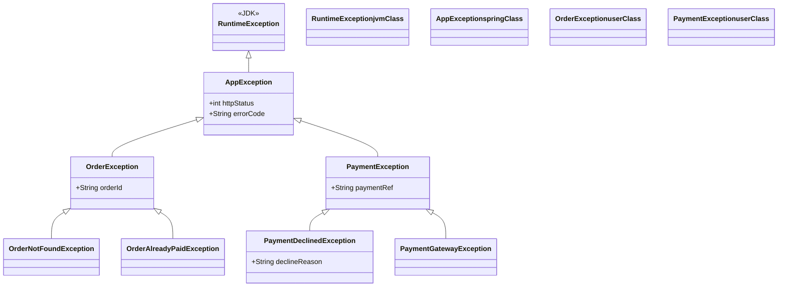

# Custom Exceptions

> A custom exception is a class you write that extends `Exception` or `RuntimeException` — it lets you model domain-specific failure modes with meaningful names, typed fields, and diagnostic context.

## What Problem Does It Solve?

Using only JDK-built exceptions (`IllegalArgumentException`, `IOException`, etc.) forces your callers to guess what went wrong from a generic message string. Consider:

```java
throw new RuntimeException("User not found");       // caller has no type to catch
throw new RuntimeException("Payment declined");     // same type, different meaning
throw new RuntimeException("Account suspended");    // indistinguishable at the catch site
```

All three failures look identical from the caller's perspective. If the caller wants to handle "payment declined" differently from "user not found", they'd have to parse a string — which is fragile and breaks the moment someone changes the message.

Custom exceptions solve this by giving each failure mode a **dedicated type**:

```java
throw new UserNotFoundException(userId);
throw new PaymentDeclinedException(orderId, "Card expired");
throw new AccountSuspendedException(accountId, suspensionReason);
```

Now callers can `catch (UserNotFoundException e)` with precision. Logging, error responses, monitoring alerts, and retry logic can all be keyed on type rather than string matching.

## What Is It?

A custom exception is any class that extends `Throwable` — in practice, either `Exception` (checked) or `RuntimeException` (unchecked). It can:

- Have a meaningful **class name** that communicates the failure (`OrderNotFoundException` tells you more than `RuntimeException`).
- Carry **typed fields** for machine-readable diagnostic context (`orderId`, `userId`, HTTP status code).
- **Chain** to an original exception to preserve the root cause (`new ServiceException("msg", cause)`).
- Form a **hierarchy** so callers can catch at different levels of specificity.

## Designing a Custom Exception

### Minimal Template

```java
public class ResourceNotFoundException extends RuntimeException {

    public ResourceNotFoundException(String message) {
        super(message);
    }

    public ResourceNotFoundException(String message, Throwable cause) {
        super(message, cause);        // ← always offer a cause constructor
    }
}
```

This is the minimum. Most production exceptions are this simple. Do **not** add boilerplate constructors you'll never use.

### Adding Typed Context Fields

Generic messages like `"User not found: 42"` are readable but non-machine-parseable. Adding a typed field lets code react to the specific value:

```java
public class UserNotFoundException extends RuntimeException {

    private final long userId;       // ← typed, immutable context field

    public UserNotFoundException(long userId) {
        super("User not found: " + userId);
        this.userId = userId;
    }

    public long getUserId() {        // ← accessor so catch blocks can extract it
        return userId;
    }
}
```

```java
// caller can now react without parsing the message string
} catch (UserNotFoundException e) {
    log.warn("No user for id={}", e.getUserId());     // ← type-safe access
    return ResponseEntity.notFound().build();
}
```

### Choosing: Checked vs. Unchecked

| Choose | When |
|--------|------|
| **`RuntimeException`** (unchecked) | Application code; callers cannot meaningfully recover; you don't want `throws` pollution across layers |
| **`Exception`** (checked) | Public library API; the caller *can* recover and you want the compiler to remind them |

:::tip
For a Spring Boot application, **almost always extend `RuntimeException`**. The controller advice (`@ControllerAdvice`) is the single recovery point, so intermediate layers (services, repositories) should let exceptions propagate without catching or declaring them.
:::

### Building a Domain Exception Hierarchy

For larger systems, create a base exception for the entire domain, then specific subtypes:


*A two-level hierarchy: catch `AppException` anywhere you need generic app-level error handling; catch `OrderNotFoundException` for specific recovery logic.*

## Code Examples

:::tip Practical Demo
See the [Custom Exceptions Demo](./demo/custom-exceptions-demo.md) for step-by-step runnable examples — building from a minimal exception to a full hierarchy with Spring `@ControllerAdvice`.
:::

### 1 — Base Application Exception

A shared base with HTTP status and error code fields, useful for a REST API:

```java
public abstract class AppException extends RuntimeException {

    private final int httpStatus;       // ← maps directly to HTTP response status
    private final String errorCode;     // ← machine-readable code for frontend/monitoring

    protected AppException(String message, int httpStatus, String errorCode) {
        super(message);
        this.httpStatus = httpStatus;
        this.errorCode = errorCode;
    }

    protected AppException(String message, Throwable cause, int httpStatus, String errorCode) {
        super(message, cause);          // ← cause constructor for wrapping
        this.httpStatus = httpStatus;
        this.errorCode = errorCode;
    }

    public int getHttpStatus() { return httpStatus; }
    public String getErrorCode()  { return errorCode; }
}
```

### 2 — Specific Domain Exceptions

```java
public class OrderNotFoundException extends AppException {

    private final String orderId;

    public OrderNotFoundException(String orderId) {
        super("Order not found: " + orderId, 404, "ORDER_NOT_FOUND");
        this.orderId = orderId;
    }

    public String getOrderId() { return orderId; }
}

public class PaymentDeclinedException extends AppException {

    private final String declineReason;

    public PaymentDeclinedException(String orderId, String declineReason) {
        super("Payment declined for order " + orderId + ": " + declineReason, 402, "PAYMENT_DECLINED");
        this.declineReason = declineReason;
    }

    public String getDeclineReason() { return declineReason; }
}
```

### 3 — Exception Chaining (wrapping infrastructure exceptions)

Repositories often deal with `SQLException` or Spring's `DataAccessException`. Wrap them with context:

```java
public Order findById(String orderId) {
    try {
        return jdbcTemplate.queryForObject(SQL, orderRowMapper, orderId);
    } catch (EmptyResultDataAccessException e) {
        // Expected "not found" case — wrap with domain type, preserve cause
        throw new OrderNotFoundException(orderId);      // ← cause-free is OK here; no additional context is lost
    } catch (DataAccessException e) {
        // Unexpected DB error — must preserve original cause
        throw new AppException(
            "Database error looking up order " + orderId,
            e,                        // ← cause preserved for root-cause analysis
            500,
            "DB_ERROR"
        ) {};
    }
}
```

### 4 — Global Handler in Spring Boot

Custom exceptions pay off when paired with a `@ControllerAdvice` that maps them to HTTP responses:

```java
@RestControllerAdvice
public class GlobalExceptionHandler {

    @ExceptionHandler(AppException.class)               // ← catches the base type and all subtypes
    public ResponseEntity<ErrorResponse> handleAppException(AppException ex) {
        ErrorResponse body = new ErrorResponse(
            ex.getErrorCode(),
            ex.getMessage()
        );
        return ResponseEntity.status(ex.getHttpStatus()).body(body);  // ← uses typed field, not a string
    }

    @ExceptionHandler(OrderNotFoundException.class)     // ← overrides base handler for this specific type
    public ResponseEntity<ErrorResponse> handleOrderNotFound(OrderNotFoundException ex) {
        log.info("Order not found: {}", ex.getOrderId());
        ErrorResponse body = new ErrorResponse("ORDER_NOT_FOUND", ex.getMessage());
        return ResponseEntity.notFound().build();
    }
}
```

## Best Practices

- **Name exceptions after what went wrong**, not how they were raised: `OrderNotFoundException` not `OrderLookupFailedException`.
- **Always provide a cause constructor** — `MyException(String msg, Throwable cause)` so wrapping never loses the original stack trace.
- **Keep fields immutable and final** — exception objects should be value-like; no setters.
- **Don't use exceptions as DTOs** — don't add 20 fields to an exception for logging purposes; keep it to the minimum context needed to handle the failure.
- **Create a base exception per bounded context** — `OrderException`, `PaymentException` — and catch at the right granularity.
- **Avoid deep hierarchies** — more than two levels of exception inheritance is usually over-engineering; flat is fine.
- **Serialize with `serialVersionUID`** when exceptions cross JVM boundaries (e.g., RMI, Serializable transport):

```java
public class MyException extends RuntimeException {
    private static final long serialVersionUID = 1L;   // ← prevents InvalidClassException across versions
    // ...
}
```

## Common Pitfalls

- **No cause constructor**: The single most common mistake. Writing `throw new ServiceException("DB failed")` when you've caught an actual `SQLException` destroys the root cause and makes production debugging very hard.
- **Exception that's also a data class**: Adding `@Getter` / `@Setter` annotations to make the exception double as a response DTO. Exceptions are for signalling failures, not transporting data between layers.
- **Catching your own base exception inside the same layer**: If `OrderService` catches `OrderException` from a sub-method, it's probably handling things too eagerly. Let the global handler do it.
- **Missing `serialVersionUID` in serializable contexts**: If an exception crosses an RMI or serialization boundary without a fixed `serialVersionUID`, the receiver may get `InvalidClassException` when the exception class is updated.
- **Inventing a checked exception just to be explicit**: Adding `throws OrderNotFoundException` to a service method just so the caller "knows" it could fail usually backfires — every caller now has to declare or catch it even if they can't do anything useful with it.

## Interview Questions

### Beginner

**Q:** How do you create a custom exception in Java?  
**A:** Extend `RuntimeException` (for unchecked) or `Exception` (for checked). Provide at minimum a constructor that takes a `String message` and calls `super(message)`, plus a second constructor that also accepts a `Throwable cause` so exceptions can be chained.

**Q:** When should you create a custom exception instead of using a JDK exception?  
**A:** When the failure mode is specific to your domain and callers need to distinguish it from other failures. If the built-in name (`IllegalArgumentException`, `IOException`) precisely describes the failure, reuse it. If you need a name like `InsufficientFundsException` or `OrderExpiredException` that's meaningless in the JDK, create a custom one.

### Intermediate

**Q:** What is exception chaining and how does it apply to custom exceptions?  
**A:** Exception chaining preserves the original cause when wrapping a lower-level exception in a higher-level one. For custom exceptions, always provide a `(String message, Throwable cause)` constructor that passes `cause` to `super()`. This ensures that when you catch a `SQLException` and wrap it in `DataAccessException`, the original SQL stack trace is preserved and retrievable via `getCause()`.

**Q:** How does a custom exception hierarchy integrate with Spring Boot's `@ControllerAdvice`?  
**A:** You register `@ExceptionHandler` methods for each exception type you want to handle. Spring picks the most-specific matching handler — so `@ExceptionHandler(OrderNotFoundException.class)` fires when that specific type is thrown, while `@ExceptionHandler(AppException.class)` acts as a catch-all for any unhandled subtype. This way each custom exception automatically maps to the right HTTP status without any `try/catch` in the controllers.

### Advanced

**Q:** What are the trade-offs of adding typed fields to a custom exception versus embedding data in the message string?  
**A:** Typed fields (`getOrderId()`) are superior in almost every way: they are machine-readable, don't break when the message format changes, are accessible without string parsing, and can be logged in structured form (e.g., JSON log entries). Message strings are for humans; typed fields are for code. The one downside of fields is that exceptions with many fields can feel like DTOs — keep it to just the identifiers needed for diagnosis and handling.

**Follow-up:** How would you handle serialization of an exception that contains a non-serializable field?  
**A:** Mark the field `transient` so it's excluded from serialization, or implement `writeObject`/`readObject` to handle it manually. The cleaner approach is to only put serializable, primitive or simple types in exception fields. This is rarely a concern in REST APIs but matters for RMI or any distributed exception transport.

## Further Reading

- [Oracle Tutorial: Creating Exception Classes](https://docs.oracle.com/javase/tutorial/essential/exceptions/creating.html) — the official walkthrough for defining custom exception types
- [Throwable Javadoc](https://docs.oracle.com/en/java/javase/21/docs/api/java.base/java/lang/Throwable.html) — full constructor signatures; note the `(String, Throwable)` constructor for cause chaining
- [Baeldung: Custom Exceptions](https://www.baeldung.com/java-new-custom-exception) — practical examples including checked and unchecked patterns
- [Baeldung: Exception Handling in Spring](https://www.baeldung.com/java-exception-handling-spring) — how custom exceptions plug into `@ControllerAdvice` and `@ResponseStatus`

## Related Notes

- [Exception Hierarchy](./exception-hierarchy.md) — prerequisite: understanding `Throwable`, `Exception`, and `RuntimeException` is essential before designing a hierarchy of your own
- [try/catch/finally](./try-catch-finally.md) — how to throw and catch the exceptions you create, including chaining and multi-catch
- [Best Practices](./exception-best-practices.md) — when to create custom exceptions vs. re-use JDK ones, and how to design an exception strategy for a Spring Boot service
