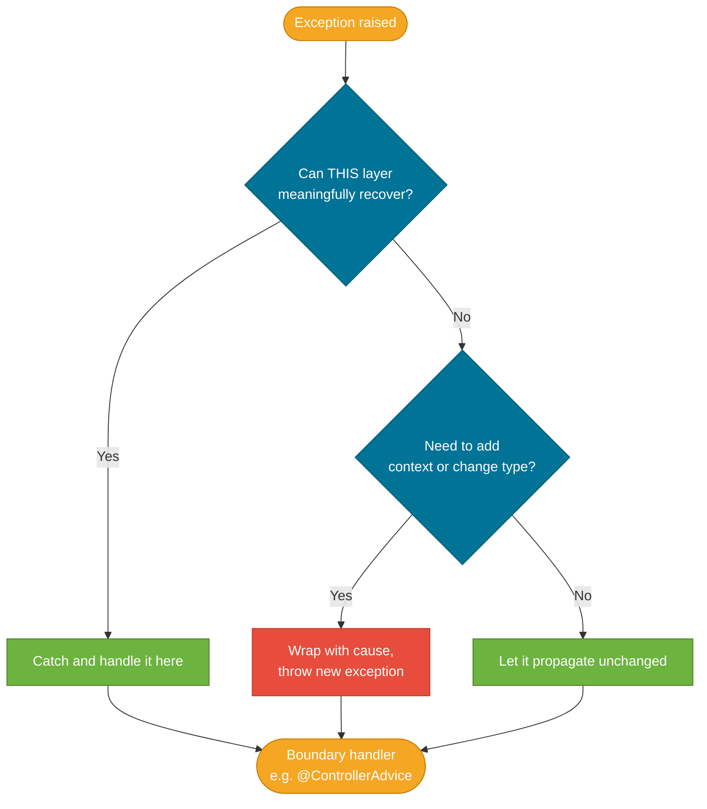
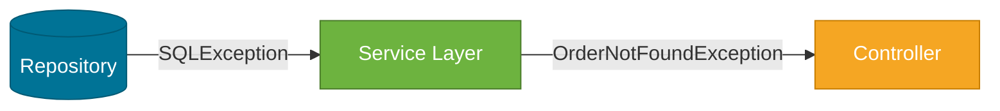

# Exception Best Practices

> Exceptions are a contract between a method and its callers — good exception design communicates failure modes clearly, preserves context for debugging, and does not pollute code that cannot act on the failure.

## What Problem Does It Solve?

Exception handling is easy to do badly. Two failure modes are especially common in real codebases:

1. **Silent swallowing** — `catch (Exception e) {}` hides bugs and makes failures invisible.
2. **Exception pollution** — checked exceptions declared in method signatures force every layer to handle or re-declare failures it knows nothing about.

Both patterns produce code that is hard to debug in production and fragile to maintain. Good exception practices prevent these problems by establishing clear rules for where exceptions are thrown, where they are caught, and how context is preserved across layers.

:::tip Practical Demo
See the [Exception Best Practices Demo](./demo/exception-best-practices-demo.md) for side-by-side good vs. bad pattern comparisons — swallowing, double-logging, flow control misuse, and `InterruptedException` handling.
:::

## The Golden Rules

:::tip Practical Demo
See the [Exception Best Practices Demo](./demo/exception-best-practices-demo.md) for side-by-side good vs. bad pattern comparisons — swallowing, double-logging, flow control misuse, and `InterruptedException` handling.
:::

These five rules cover 90% of exception-handling decisions:


*Decision tree: at each layer, ask whether you can recover. If not, wrap (to add context) or propagate (unchanged). Only log at the place where you actually handle the exception.*

### Rule 1 — Catch what you can handle; propagate the rest

A layer should only catch an exception if it can **do something useful** — retry, fall back to a default, return a user-friendly error. If it can't, let the exception propagate. Catching just to log and rethrow creates noise.

```java
// Bad — catches, logs, rethrows: double-logs downstream
public Order findOrder(String id) {
    try {
        return orderRepository.findById(id);
    } catch (OrderNotFoundException e) {
        log.error("Order not found", e);   // ← logs here
        throw e;                            // ← AND logs again in the controller advice
    }
}

// Good — propagate; let the boundary handler log
public Order findOrder(String id) {
    return orderRepository.findById(id);  // ← OrderNotFoundException propagates cleanly
}
```

### Rule 2 — Preserve the cause when wrapping

Whenever you catch one exception and throw another, pass the original as the cause. This is non-negotiable for production debugging:

```java
// Bad — root cause lost forever
} catch (SQLException e) {
    throw new DataAccessException("DB lookup failed");
}

// Good — original stack trace accessible via getCause()
} catch (SQLException e) {
    throw new DataAccessException("DB lookup failed", e);  // ← cause preserved
}
```

### Rule 3 — Convert at layer boundaries, not inside layers

Translate lower-level exceptions to higher-level domain exceptions **once**, at the boundary between architectural layers (typically the repository → service boundary):


*Convert once — at the repository boundary. The service and controller never see `SQLException`.*

```java
// Repository layer — translate infrastructure exception to domain exception
public Order findById(String id) {
    try {
        return jdbcTemplate.queryForObject(SQL, rowMapper, id);
    } catch (EmptyResultDataAccessException e) {
        throw new OrderNotFoundException(id);       // ← translate here, once
    }
}

// Service layer — works only with domain exceptions; no SQL knowledge
public OrderDto getOrder(String id) {
    Order order = orderRepository.findById(id);     // ← OrderNotFoundException propagates
    return toDto(order);
}
```

### Rule 4 — Log once, at the boundary

Log the full exception (with stack trace) **once**, at the outermost recovery point (`@ControllerAdvice`, job runner, message consumer):

```java
@RestControllerAdvice
public class GlobalExceptionHandler {

    private static final Logger log = LoggerFactory.getLogger(GlobalExceptionHandler.class);

    @ExceptionHandler(AppException.class)
    public ResponseEntity<ErrorResponse> handleApp(AppException ex) {
        log.error("Application error [{}]: {}", ex.getErrorCode(), ex.getMessage(), ex);  // ← one log per request
        return ResponseEntity.status(ex.getHttpStatus())
                             .body(new ErrorResponse(ex.getErrorCode(), ex.getMessage()));
    }
}
```

Logging at every layer creates duplicate log lines and confuses operations teams trying to count error rates.

### Rule 5 — Never swallow exceptions silently

An empty `catch` block is almost always a bug. At minimum, log the exception. The only acceptable case for ignoring an exception is when you have a very specific, documented reason:

```java
// Acceptable — documented, intentional, and the exception is genuinely irrelevant
try {
    cache.invalidate(key);
} catch (CacheException e) {
    // Cache invalidation failure is non-critical; the next request will repopulate.
    // Logging at TRACE level to avoid alerting, but not silently dropped.
    log.trace("Cache invalidation failed for key={}, continuing", key, e);
}
```

## Checked vs. Unchecked: When To Use Each

The debate is settled for most application code:

| Use Case | Recommendation |
|---|---|
| Application service / domain code | **Unchecked** — avoids `throws` pollution |
| Framework / library public API | **Checked** if callers can realistically recover |
| Repository layer (wrapping JDBC, JPA) | **Unchecked** — Spring does this with `DataAccessException` |
| `InterruptedException` | Always **re-interrupt the thread** after catching |

:::info
Spring Framework made the definitive choice: all Spring data access exceptions are unchecked, wrapping JDBC's checked `SQLException`. This is now the consensus for most Java frameworks and is why almost all modern Java code uses unchecked exceptions.
:::

## Exception Anti-Patterns

### Anti-Pattern 1 — Exception Swallowing

```java
// Never do this
try {
    processPayment(order);
} catch (Exception e) {
    // nothing here
}
```

The payment failed. Nothing logged. The user gets a "success" response. This is the worst possible failure mode.

### Anti-Pattern 2 — Catch-and-Ignore with a Broad Type

```java
// Almost as bad — logs Exception which hides which type it was
} catch (Exception e) {
    log.error("Something failed: " + e.getMessage()); // ← no stack trace, no type
}
```

Always pass the exception object to the logger so the stack trace is included.

### Anti-Pattern 3 — Exception for Flow Control

```java
// Do NOT use exceptions to drive logic
try {
    int value = Integer.parseInt(userInput);
} catch (NumberFormatException e) {
    // treat as "no value provided"
}
```

`NumberFormatException` is expensive to construct (stack trace capture) and this pattern hides the real problem. Use `StringUtils.isNumeric()` or a regex check first:

```java
if (userInput != null && userInput.matches("\\d+")) {
    int value = Integer.parseInt(userInput);
}
```

### Anti-Pattern 4 — `throws Exception` in Signatures

```java
// Avoid — tells the caller nothing
public void processOrder(String id) throws Exception { ... }

// Better — precise contract
public void processOrder(String id) throws OrderNotFoundException, PaymentDeclinedException { ... }
// Best for application code — use unchecked exceptions and no throws clause at all
public void processOrder(String id) { ... }
```

### Anti-Pattern 5 — `printStackTrace()` in Production Code

```java
} catch (IOException e) {
    e.printStackTrace();   // ← goes to stderr; not in your logging system; invisible in k8s
}
```

Always use a proper `Logger`:

```java
} catch (IOException e) {
    log.error("Failed to read config file", e);  // ← captured by your logging framework
}
```

## Fail-Fast Principle

Fail fast means **detect violations as early as possible** and raise an exception immediately, rather than letting bad data propagate deep into the system where the failure is harder to diagnose.

```java
public void processOrder(Order order) {
    Objects.requireNonNull(order, "order must not be null");              // ← throws NPE at entry
    if (order.getItems().isEmpty()) {
        throw new IllegalArgumentException("Order must have at least one item");  // ← fail fast
    }
    // ... rest of processing is guaranteed to have a valid order
}
```

`Objects.requireNonNull()` (Java 7+) is the idiomatic way to check for null at method entry. For more complex preconditions, use explicit `if` + `throw`.

## `InterruptedException` — Special Case

`InterruptedException` is a checked exception from `java.lang` that signals a thread's interrupt flag has been set. It must **never** be swallowed silently:

```java
// Wrong — destroys the interrupt signal
try {
    Thread.sleep(1000);
} catch (InterruptedException e) {
    // ignore
}

// Correct — restore the interrupt flag so callers can detect it
try {
    Thread.sleep(1000);
} catch (InterruptedException e) {
    Thread.currentThread().interrupt();   // ← re-set the interrupt flag
    throw new RuntimeException("Sleep interrupted", e); // ← or handle appropriately
}
```

Swallowing `InterruptedException` breaks cooperative shutdown in thread pools — `ExecutorService.shutdownNow()` sets the interrupt flag on worker threads; if they swallow it, they'll never stop.

## Interview Questions

### Beginner

**Q:** What is exception swallowing and why is it bad?  
**A:** Exception swallowing means catching an exception and doing nothing — empty `catch` block or only printing a useless message. It's bad because the failure is silently hidden: the program continues in an inconsistent state, the error never appears in logs, and debugging becomes nearly impossible.

**Q:** What is the fail-fast principle?  
**A:** Fail fast means detecting invalid state or illegal arguments as early as possible in a method and throwing an exception immediately, rather than letting bad data propagate. The benefit is that the stack trace points to the actual entry point of bad data instead of some distant internal failure.

### Intermediate

**Q:** What does "log once" mean in exception handling?  
**A:** It means you should log the full exception (with stack trace) exactly once — at the point where it is finally handled. If a service catches an exception, logs it, then rethrows it, and then the controller advice logs it again, you get duplicate entries in your logs. Log at the boundary handler only; let exceptions propagate cleanly before that.

**Q:** Why should you re-interrupt the thread when catching `InterruptedException`?  
**A:** When `InterruptedException` is thrown, the thread's interrupt flag is cleared. If you just swallow the exception, no one up the call stack knows the thread was interrupted. This breaks `ExecutorService.shutdownNow()`, which works by interrupting threads. Re-calling `Thread.currentThread().interrupt()` restores the flag so the executor can detect the shutdown signal and terminate the thread correctly.

### Advanced

**Q:** How should exception handling be structured in a layered Spring Boot application?  
**A:** In a typical Controller → Service → Repository architecture: the repository translates infrastructure exceptions (`SQLException`, `DataAccessException`) into domain exceptions at the boundary. The service layer neither catches nor declares domain exceptions — it lets them propagate. The controller layer does not have `try/catch` either. A `@ControllerAdvice` global handler catches all `AppException` subtypes at the top, maps them to HTTP responses, and logs them once. This way exception handling is centralized, each layer stays clean, and every exception is logged exactly once.

**Follow-up:** What are the risks of using exceptions for control flow?  
**A:** First, constructing an exception is expensive — the JVM captures a full stack trace at the point of creation. In a tight loop or a high-frequency code path, this creates significant GC pressure. Second, using exceptions for expected/normal conditions (like "record not found during a contains check") obscures intent — `Optional.empty()` or a boolean return communicates "no result" without the overhead. Exceptions should represent unexpected or exceptional conditions, not routine absence.

## Further Reading

- [Effective Java (Joshua Bloch) — Items 69–77](https://www.baeldung.com/java-exceptions-interview-questions) — The canonical rules for exception use in Java, summarized at Baeldung
- [Oracle Tutorial: Exceptions](https://docs.oracle.com/javase/tutorial/essential/exceptions/) — end-to-end tutorial including advantages, checked exceptions design rationale
- [JLS §11 — Exceptions](https://docs.oracle.com/javase/specs/jls/se21/html/jls-11.html) — specification-level definition of exception semantics and the checked/unchecked distinction
- [Baeldung: Spring Exception Handling](https://www.baeldung.com/java-exception-handling-spring) — how Spring Boot integrates with `@ExceptionHandler` and `@ControllerAdvice`

## Related Notes

- [Exception Hierarchy](./exception-hierarchy.md) — the `Throwable` tree and the checked/unchecked distinction that underpins most of these rules
- [try/catch/finally](./try-catch-finally.md) — the mechanics of throwing, catching, and cleaning up; `try-with-resources` and why it replaces `finally`
- [Custom Exceptions](./custom-exceptions.md) — how to create domain-specific exceptions so these best practices have meaningful types to work with
