# Exception Hierarchy

> Java's exception system is a class hierarchy rooted at `Throwable` — every error and exception you'll ever see is an instance of this tree.

## What Problem Does It Solve?

Before Java, errors were returned as special values: a function might return `-1` to signal failure, `null` to indicate "not found", or some numeric error code. This approach has serious drawbacks:

- The caller can **ignore** the error return and proceed with bad data.
- Error codes are **untyped** — there's no way to distinguish "file not found" from "permission denied" by the type alone.
- Error-handling code is **tangled** with the happy-path code, making both harder to read.

Java's exception mechanism solves this by making errors **first-class objects** that carry a type, a message, a stack trace, and an optional cause. Critically, the type hierarchy lets you catch errors at different levels of specificity — catch an `IOException` to handle any I/O failure, or catch `FileNotFoundException` specifically.

## The Throwable Tree

```mermaid
classDiagram
  direction TB

  class Throwable {
    +String message
    +Throwable cause
    +StackTraceElement[] stackTrace
    +getMessage() String
    +getCause() Throwable
    +printStackTrace()
  }
  class Error {
    <<unchecked>>
  }
  class Exception {
    <<checked>>
  }
  class RuntimeException {
    <<unchecked>>
  }

  class OutOfMemoryError
  class StackOverflowError
  class AssertionError

  class IOException
  class SQLException
  class ClassNotFoundException

  class NullPointerException
  class IllegalArgumentException
  class IndexOutOfBoundsException
  class IllegalStateException
  class UnsupportedOperationException

  Throwable <|-- Error
  Throwable <|-- Exception
  Exception <|-- RuntimeException

  Error <|-- OutOfMemoryError
  Error <|-- StackOverflowError
  Error <|-- AssertionError

  Exception <|-- IOException
  Exception <|-- SQLException
  Exception <|-- ClassNotFoundException

  RuntimeException <|-- NullPointerException
  RuntimeException <|-- IllegalArgumentException
  RuntimeException <|-- IndexOutOfBoundsException
  RuntimeException <|-- IllegalStateException
  RuntimeException <|-- UnsupportedOperationException

  classDef checked fill:#6db33f,color:#fff,stroke:#4a7c2a
  classDef unchecked fill:#e74c3c,color:#fff,stroke:#c0392b
  classDef jvmClass fill:#007396,color:#fff,stroke:#005a75
  class Exception checked
  class IOException checked
  class SQLException checked
  class ClassNotFoundException checked
  class Error unchecked
  class RuntimeException unchecked
  class OutOfMemoryError unchecked
  class StackOverflowError unchecked
  class AssertionError unchecked
  class NullPointerException unchecked
  class IllegalArgumentException unchecked
  class IndexOutOfBoundsException unchecked
  class IllegalStateException unchecked
  class UnsupportedOperationException unchecked
  class Throwable jvmClass
```


*The complete `Throwable` tree. Green = checked (compiler enforces handling); Red = unchecked (no compiler enforcement).*

## How It Works

:::tip Practical Demo
See the [Exception Hierarchy Demo](./demo/exception-hierarchy-demo.md) for runnable examples — including printing the full Throwable tree at runtime, compiler-enforced checked handling, and why `catch (Exception e)` misses `Error`.
:::

The hierarchy has three main branches, each with a distinct purpose:

### 1. `Throwable` (root)

`java.lang.Throwable` is the base class for everything that can be thrown with the `throw` keyword or caught with a `catch` block. It holds:

- **`message`** — a human-readable description of the failure.
- **`cause`** — a reference to the underlying exception (exception chaining).
- **`stackTrace`** — the call stack at the point the exception was created.

You should **never** extend `Throwable` directly. Extend `Exception` or `RuntimeException` depending on the contract you want.

### 2. `Error` — Don't Catch These

`Error` signals problems at the JVM or system level that your application code **cannot meaningfully recover from**:

| Error Type | When It Appears |
|---|---|
| `OutOfMemoryError` | JVM heap is exhausted |
| `StackOverflowError` | Call stack is full (infinite recursion) |
| `AssertionError` | An `assert` statement fails (with `-ea` flag) |
| `LinkageError` | Class loading / bytecode compatibility problems |

:::danger
Never catch `Error` unless you are writing infrastructure code (e.g., a JVM agent or application server). Catching `OutOfMemoryError` and continuing is almost always wrong — the JVM is in an undefined state. 
:::

### 3. `Exception` — Checked Exceptions

`Exception` (minus the `RuntimeException` subtree) contains **checked exceptions**. The compiler enforces that every checked exception thrown by a method is either:
- **Caught** in a `try/catch` block inside the method, or
- **Declared** in the method's `throws` clause so the caller can handle it.

This is the *checked exception contract*: the method advertises failure modes to its callers via the type system.

```java
// The compiler forces callers to handle IOException
public String readFile(String path) throws IOException {  // ← declared in throws
    return Files.readString(Path.of(path));
}
```

Common checked exceptions: `IOException`, `SQLException`, `ClassNotFoundException`, `InterruptedException`.

### 4. `RuntimeException` — Unchecked Exceptions

`RuntimeException` and all its subclasses are **unchecked** — the compiler does not require you to catch or declare them. They represent *programming errors* or *precondition violations* that could theoretically happen at any call site:

| Exception | Typical Cause |
|---|---|
| `NullPointerException` | Calling a method on `null` |
| `IllegalArgumentException` | Caller passed an invalid argument |
| `IndexOutOfBoundsException` | Array or list index out of range |
| `IllegalStateException` | Object is in the wrong state for this operation |
| `UnsupportedOperationException` | Operation is not supported (e.g., unmodifiable list) |
| `ArithmeticException` | Integer divide by zero |
| `ClassCastException` | Invalid downcast |

:::tip
Use `IllegalArgumentException` to signal that the caller passed bad input. Use `IllegalStateException` when the object itself isn't ready (e.g., calling `close()` twice). These are the two workhorses of defensive programming.
:::

## Checked vs. Unchecked: The Design Decision

This is one of Java's most debated design choices. Here is how to think about it:

| | Checked | Unchecked |
|---|---|---|
| **Models** | Recoverable, external failures (I/O, DB, network) | Programming bugs, precondition violations |
| **Compiler enforces** | Yes — declare or catch | No |
| **Propagation** | Must be declared at every layer | Propagates silently |
| **Common in** | JDK I/O, JDBC, reflection APIs | Application code, modern frameworks |
| **Recommended for** | Public library APIs with documented failure modes | Almost everything else in application code |

Modern practice (and Spring Boot, in particular) leans heavily toward unchecked exceptions for application code. Spring's `DataAccessException` hierarchy, for example, wraps all checked `SQLExceptions` into unchecked equivalents so that service code doesn't get cluttered with catch blocks for infrastructure concerns.

:::info
The "checked vs. unchecked" debate: James Gosling added checked exceptions to force callers to acknowledge failure; critics like Bruce Eckel argue they produce "exception swallowing" (e.g., `catch (Exception e) {}`). The modern consensus is: use checked exceptions for I/O and external resources; use unchecked for everything else.
:::

## Common Pitfalls

- **Catching `Exception` (or worse, `Throwable`)**: This catches `RuntimeException` and all programming bugs silently. Always catch the most specific type you can handle.
- **Catching and ignoring**: `catch (IOException e) {}` — this is worse than no catch block at all because failures become invisible.
- **Confusing `Error` for `Exception`**: `Error` is not a subtype of `Exception`. A `catch (Exception e)` block will **not** catch `OutOfMemoryError` or `StackOverflowError`.
- **Wrapping without cause**: When wrapping one exception in another, always pass the original as the cause: `new RuntimeException("context message", originalException)`. Without it, the root cause is lost forever.
- **Extending `Exception` instead of `RuntimeException`**: Most modern application code should throw unchecked exceptions. Only create checked exceptions when callers can realistically recover and you are writing a library API.

## Interview Questions

### Beginner

**Q:** What is the difference between `Error` and `Exception`?  
**A:** Both extend `Throwable`, but they mean different things. `Error` signals unrecoverable JVM-level problems (like `OutOfMemoryError`) that application code should never catch. `Exception` signals application-level failures that can potentially be handled. Most application code only throws and catches `Exception` subtypes.

**Q:** What is a checked exception?  
**A:** A checked exception is any `Exception` that is **not** a `RuntimeException`. The Java compiler forces every method that can throw a checked exception to either declare it in a `throws` clause or catch it. This prevents callers from accidentally ignoring it.

**Q:** Name three unchecked exceptions you use frequently.  
**A:** `NullPointerException` (null dereference), `IllegalArgumentException` (invalid method argument), and `IllegalStateException` (object in wrong state for the operation).

### Intermediate

**Q:** Why does Spring Boot use unchecked exceptions for data access instead of checked ones?  
**A:** Spring wraps checked `SQLExceptions` in its `DataAccessException` hierarchy (unchecked) so that service-layer code doesn't have to declare or catch infrastructure exceptions. This keeps service methods clean and lets exceptions propagate to a central handler (`@ControllerAdvice`) without polluting every method signature. It's a deliberate design choice to avoid "exception pollution" across layers.

**Q:** What is exception chaining and why does it matter?  
**A:** Exception chaining means preserving the original exception (`cause`) when you wrap it in another. You do this with `new MyCoolException("context", originalException)`. Without chaining, the original stack trace and root cause are lost, and debugging production failures becomes extremely difficult.

### Advanced

**Q:** Given that checked exceptions improve API discoverability, why does most modern Java code avoid them?  
**A:** Checked exceptions become a maintenance burden as APIs evolve — adding a new failure mode requires changing every `throws` clause up the call stack. They also encourage bad patterns like swallowing exceptions (`catch (Exception e) {}`) when callers don't know how to handle them. In layered architectures (Controller → Service → Repository), checked exceptions from the repository would need to be declared or caught at every layer even though only the outermost layer can meaningfully handle them. The trend is to use checked exceptions at library API boundaries and unchecked inside applications.

**Follow-up:** How would you design the exception hierarchy for a payment processing service?  
**A:** Create a base unchecked exception like `PaymentException extends RuntimeException`. Create specific subclasses: `InsufficientFundsException`, `CardDeclinedException`, `GatewayTimeoutException`. Only at the HTTP boundary (controller/exception handler) do you map these to HTTP status codes. This keeps service and domain layers free of `throws` declarations while still providing typed, catchable exceptions where needed.

## Further Reading

- [Java Language Specification §11 — Exceptions](https://docs.oracle.com/javase/specs/jls/se21/html/jls-11.html) — the authoritative definition of what "checked" means and how throw/catch is resolved
- [Oracle Tutorial: Exceptions](https://docs.oracle.com/javase/tutorial/essential/exceptions/) — practical walkthrough of the try/catch/finally mechanism with examples
- [Baeldung: Checked and Unchecked Exceptions](https://www.baeldung.com/java-checked-unchecked-exceptions) — side-by-side comparison with code examples
- [Throwable Javadoc](https://docs.oracle.com/en/java/javase/21/docs/api/java.base/java/lang/Throwable.html) — full API including `getSuppressed()` and `addSuppressed()`

## Related Notes

- [try/catch/finally](./try-catch-finally.md) — now that you know the hierarchy, see how to actually throw and catch exceptions, and when `finally` runs
- [Custom Exceptions](./custom-exceptions.md) — how to extend `Exception` or `RuntimeException` for your own domain-specific failure types
- [Control Flow](../core-java/control-flow.md) — `try`, `catch`, `finally`, and `throw` are control-flow keywords in Java; understanding this note's tree is a prerequisite
