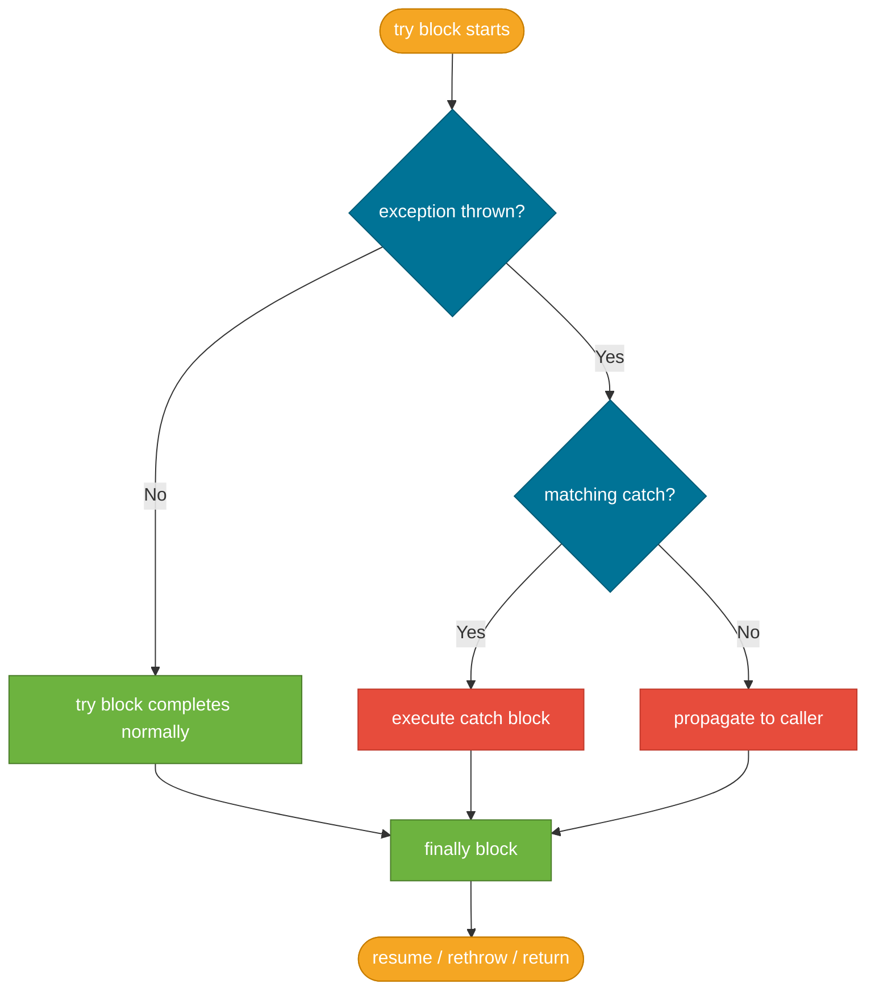
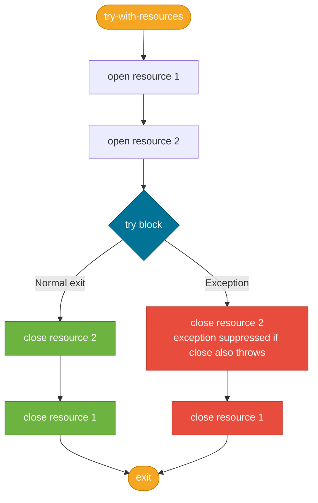

# try / catch / finally

> The `try/catch/finally` construct is Java's core mechanism for handling exceptions — separating the happy path from error recovery code and guaranteeing cleanup even when things go wrong.

## What Problem Does It Solve?

Before structured exception handling, every function call that could fail required an inline check:

```java
// Without exceptions — every step needs a null or error-code check
String content = readFile(path);
if (content == null) { ... handle error ... }
String parsed = parseJson(content);
if (parsed == null) { ... handle error ... }
```

This interleaves happy-path code with error-handling code at every step. `try/catch` solves this by letting you write the happy path as a clean sequence and handle all failures in a separate block. `finally` solves the cleanup problem: releasing a database connection or file handle must happen whether or not an exception is thrown, and `finally` guarantees it runs.

`try-with-resources` (Java 7) goes one step further — it *eliminates* the `finally` block entirely for resource cleanup, and also handles the subtle bug where a `finally` block can silently swallow an exception thrown by `close()`.

## How It Works

### Basic try/catch Flow


*Exception handling flow: if no catch matches, `finally` still runs before the exception propagates up the call stack.*

### The `try` Block

The `try` block contains the code that might throw an exception. Execution leaves the `try` block immediately at the point where the exception is thrown — no subsequent statements in the `try` block run.

### The `catch` Block

`catch` blocks are evaluated **top-to-bottom**; the first one whose type is a supertype of (or the same as) the thrown exception wins.

:::warning
Put more specific exception types **before** more general ones. If you put `catch (Exception e)` first, all subsequent `catch` blocks become unreachable — in fact, the compiler will reject this with a compile-time error for checked exceptions.
:::

```java
try {
    String content = Files.readString(Path.of("/data/config.json"));
    JsonObject config = parseJson(content);
} catch (FileNotFoundException e) {       // ← most specific first
    log.warn("Config file not found, using defaults");
} catch (IOException e) {                 // ← broader I/O error
    throw new StartupException("Cannot read config", e); // ← wrap with cause
}
```

### The `finally` Block

The `finally` block **always executes** — whether the `try` block completes normally, throws an exception, or even executes a `return` statement:

```java
Connection conn = dataSource.getConnection();
try {
    // ... use connection
    return result;         // ← finally STILL runs before the caller gets result
} finally {
    conn.close();          // ← always runs; guaranteed cleanup
}
```

:::danger
If the `finally` block itself throws an exception or executes `return`, it **suppresses** any exception thrown by the `try` block. The original exception is permanently lost. This is a subtle and serious bug — avoid `return` and risky calls in `finally`.
:::

### Multi-Catch (Java 7+)

When two different exception types need identical handling, use a multi-catch to avoid code duplication:

```java
try {
    registry.lookup(name);
} catch (NamingException | RemoteException e) {  // ← pipe-separated types
    throw new ServiceUnavailableException("Registry unreachable", e);
}
```

The multi-catch variable (`e`) is **implicitly final** — you cannot reassign it inside the catch block.

### `try-with-resources` (Java 7+)

`try-with-resources` automatically closes any `AutoCloseable` resource declared in the `try(...)` header when the block exits, in **reverse declaration order**:


*Resources are closed in reverse order of declaration. If `close()` itself throws, the exception is suppressed (retrievable via `getSuppressed()`) so the original exception is preserved.*

```java
// Before Java 7 — explicit finally, prone to exception-swallowing bug
BufferedReader br = new BufferedReader(new FileReader(path));
try {
    return br.readLine();
} finally {
    br.close();  // ← if this throws AND try threw, try's exception is lost
}

// Java 7+ try-with-resources — clean and correct
try (BufferedReader br = new BufferedReader(new FileReader(path))) {
    return br.readLine();  // ← br.close() called automatically; original exception preserved
}
```

Multiple resources are supported — declare them separated by semicolons:

```java
try (
    InputStream in  = new FileInputStream(src);   // ← opened second-to-last
    OutputStream out = new FileOutputStream(dest) // ← opened last
) {
    in.transferTo(out);
}   // ← out.close() called first, then in.close()
```

:::tip
**Prefer `try-with-resources` over `finally` for any `Closeable` or `AutoCloseable` resource.** It is shorter, safer, and correctly handles the rare case where both your code and `close()` throw exceptions.
:::

## Code Examples

:::tip Practical Demo
See the [try/catch/finally Demo](./demo/try-catch-finally-demo.md) for step-by-step runnable examples — including the `finally` return pitfall, suppressed exceptions, and side-by-side `try-with-resources` vs manual `finally`.
:::

### 1 — Catching and Wrapping

A service method that catches a checked `IOException` and re-throws it as an unchecked exception with context:

```java
public String loadTemplate(String name) {
    Path templatePath = Paths.get("templates", name + ".html");
    try {
        return Files.readString(templatePath);          // ← throws checked IOException
    } catch (IOException e) {
        throw new RuntimeException(                     // ← rethrow as unchecked
            "Template not found: " + name, e);         // ← original exception preserved as cause
    }
}
```

### 2 — try-with-resources with JDBC

Classic JDBC pattern that correctly closes `Connection`, `PreparedStatement`, and `ResultSet`:

```java
public Optional<User> findById(long id) {
    String sql = "SELECT id, name, email FROM users WHERE id = ?";
    try (
        Connection conn = dataSource.getConnection();           // ← closed last
        PreparedStatement stmt = conn.prepareStatement(sql)    // ← closed second
    ) {
        stmt.setLong(1, id);
        try (ResultSet rs = stmt.executeQuery()) {             // ← closed first
            if (rs.next()) {
                return Optional.of(new User(rs.getLong(1), rs.getString(2), rs.getString(3)));
            }
        }
    } catch (SQLException e) {
        throw new DataAccessException("User lookup failed for id=" + id, e);
    }
    return Optional.empty();
}
```

### 3 — Suppressed Exceptions

When your code throws and `close()` also throws, the close exception is *suppressed* — it can be retrieved:

```java
try {
    try (MyResource r = new MyResource()) {
        r.doWork();          // ← suppose this throws IllegalStateException
    }                        // ← close() also throws IOException
} catch (IllegalStateException e) {
    Throwable[] suppressed = e.getSuppressed();  // ← retrieve suppressed close exception
    for (Throwable t : suppressed) {
        log.error("Suppressed during close", t);
    }
    throw e;
}
```

### 4 — Re-throwing with `instanceof` Pattern Matching (Java 16+)

```java
try {
    externalService.call();
} catch (Exception e) {
    if (e instanceof TimeoutException te) {         // ← pattern matching: no cast needed
        log.warn("Timeout after {}ms", te.getElapsedMs());
    }
    throw e;   // ← re-throw the original exception unchanged
}
```

## Best Practices

- **Catch the most specific type you can handle** — catching `Exception` or `Throwable` masks bugs.
- **Always include the cause when re-throwing** — `new RuntimeException("msg", e)` not `new RuntimeException("msg")`.
- **Use `try-with-resources` for all `Closeable` types** — eliminates resource-leak bugs.
- **Don't catch and swallow** — `catch (IOException e) { /* ignore */ }` is almost always wrong; at minimum, log the exception.
- **Don't use exceptions for flow control** — throwing and catching is expensive; don't use it as a pseudo-`if`.
- **Return from `try` is fine; `return` from `finally` is a bug** — a `return` in `finally` will suppress any in-flight exception.
- **Log at the boundary, not at every layer** — if you catch and rethrow at each layer, you'll log the same error multiple times; log once at the point where you actually handle it.

## Common Pitfalls

- **Exception order in multi-catch**: if `catch (IOException)` comes before `catch (FileNotFoundException)`, `FileNotFoundException` (a subtype of `IOException`) will never be reached. The compiler catches this for checked exceptions but not always for unchecked.
- **`finally` hiding an exception**: a `return` or `throw` inside `finally` will suppress whatever exception the `try` block was propagating. Always keep `finally` blocks minimal and exception-free.
- **Resource leak without `try-with-resources`**: if you open a stream and then throw before calling `close()`, the stream leaks. Use `try-with-resources` every time.
- **Catching but not handling**: `catch (SomeException e) { throw new RuntimeException(e); }` is technically fine (wraps with cause), but doing it just to avoid a `throws` declaration is a code smell — the layer doing this probably shouldn't be catching at all.
- **Forgetting `InterruptedException` restoration**: If you catch `InterruptedException`, re-interrupt the thread: `Thread.currentThread().interrupt()`. Swallowing it corrupts the thread's interrupt status and breaks cooperative shutdown.

## Interview Questions

### Beginner

**Q:** What is the difference between `throw` and `throws`?  
**A:** `throw` is a statement that actually throws an exception object at runtime: `throw new IllegalArgumentException("bad input")`. `throws` is a keyword in a method signature that **declares** which checked exceptions the method might throw: `void read() throws IOException`. One is execution; the other is a contract declaration.

**Q:** Does `finally` always execute?  
**A:** Almost always. The `finally` block runs even if the `try` block returns or throws. The only cases where it does not run are: the JVM exits via `System.exit()`, the JVM itself crashes, or the thread is killed (a daemon thread dying when the JVM shuts down).

**Q:** What is `try-with-resources`?  
**A:** It's a `try` statement that accepts `AutoCloseable` resources in its header and automatically calls `close()` on them when the block exits — whether normally or with an exception. It was introduced in Java 7 and replaces the error-prone `finally { resource.close(); }` pattern.

### Intermediate

**Q:** What happens when both the `try` block and the `finally` block throw exceptions?  
**A:** The exception from `finally` **replaces** the exception from `try`. The original exception is silently lost. This is a known pitfall of manual `finally`-based resource cleanup. `try-with-resources` handles this correctly: if both the try block and `close()` throw, the `close()` exception is *suppressed* and attached to the primary exception, preservable via `getSuppressed()`.

**Q:** What is exception chaining and how do you do it?  
**A:** Exception chaining means preserving the original exception (the *cause*) when wrapping it in a new exception. You do it by passing the original as the second argument: `new ServiceException("Lookup failed", originalException)`. Call `getCause()` to retrieve it. Without chaining, you lose the root cause and debugging becomes very hard.

### Advanced

**Q:** If a `catch` block rethrows an exception using `throw e`, what type does the compiler infer in a multi-catch?  
**A:** In a multi-catch (`catch (IOException | SQLException e)`), `e` is effectively typed as the union type's least upper bound. When you rethrow `e`, the compiler is smart enough (Java 7+) to infer the precise types for the purposes of checked exception propagation — so you don't need to declare both in a `throws` clause if the outer method doesn't need to.

**Follow-up:** How does `try-with-resources` interact with inheritance — specifically, can you use it with a class that implements `Closeable` but not `AutoCloseable`?  
**A:** `Closeable` (in `java.io`) extends `AutoCloseable` (in `java.lang`). Any `Closeable` is therefore also `AutoCloseable`, so all streams, readers, writers, and channels work with `try-with-resources`. The important difference: `AutoCloseable.close()` declares `throws Exception`, while `Closeable.close()` declares `throws IOException` — a narrower contract.

## Further Reading

- [JLS §14.20 — The try statement](https://docs.oracle.com/javase/specs/jls/se21/html/jls-14.html#jls-14.20) — the authoritative spec for try/catch/finally and try-with-resources semantics
- [Oracle Tutorial: Exceptions](https://docs.oracle.com/javase/tutorial/essential/exceptions/) — end-to-end walkthrough including the exceptions advantage and chained exceptions
- [Baeldung: try-with-resources](https://www.baeldung.com/java-try-with-resources) — deep dive with suppressed exception examples
- [AutoCloseable Javadoc](https://docs.oracle.com/en/java/javase/21/docs/api/java.base/java/lang/AutoCloseable.html) — what you need to implement to make your own resource work with try-with-resources

## Related Notes

- [Exception Hierarchy](./exception-hierarchy.md) — prerequisite: understand `Throwable`, `Error`, `Exception`, and `RuntimeException` before choosing what to catch
- [Custom Exceptions](./custom-exceptions.md) — extending `Exception` or `RuntimeException` to create domain-specific exceptions that you'll `throw` and `catch`
- [Best Practices](./exception-best-practices.md) — higher-level guidance on when to catch, when to rethrow, and how to design exception hierarchies for your application
