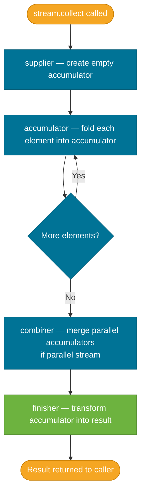

# Collectors

> A `Collector` tells the `collect()` terminal operation how to accumulate stream elements into a container — a list, map, string, or any custom structure.

## What Problem Does It Solve?

The Streams API's `collect()` terminal operation is intentionally open-ended — it doesn't know what container to produce. Before `Collectors`, assembling stream output required a mutable accumulation pattern:

```java
Map<String, List<Employee>> byDept = new HashMap<>();
for (Employee e : employees) {
    byDept.computeIfAbsent(e.getDepartment(), k -> new ArrayList<>())
          .add(e);
}
```

`Collectors.groupingBy` replaces 5 lines of mutable imperative logic with a single declarative expression:

```java
Map<String, List<Employee>> byDept =
    employees.stream().collect(Collectors.groupingBy(Employee::getDepartment));
```

## What Is It?

`Collector<T, A, R>` is a functional interface with three type parameters:
- **T** — the element type from the stream
- **A** — the mutable accumulator (internal, hidden from callers)
- **R** — the final result type

The `java.util.stream.Collectors` utility class provides factory methods for the most common collectors. These are sufficient for nearly all production use cases.

## Built-in Collectors Reference

| Collector | Output Type | Description |
|-----------|-------------|-------------|
| `toList()` | `List<T>` | Mutable list (order preserved) |
| `toUnmodifiableList()` | `List<T>` | Immutable list |
| `toSet()` | `Set<T>` | Mutable set (no duplicates, no order guarantee) |
| `toCollection(Supplier)` | Custom collection | Specify your own collection type |
| `joining()` | `String` | Concatenate elements |
| `joining(delim)` | `String` | With delimiter |
| `joining(delim, prefix, suffix)` | `String` | Full formatting |
| `counting()` | `Long` | Count of elements |
| `summingInt/Long/Double` | numeric | Sum of an extracted numeric field |
| `averagingInt/Long/Double` | `Double` | Average of extracted numeric field |
| `summarizingInt/Long/Double` | `*SummaryStatistics` | Min/max/sum/avg/count in one pass |
| `toMap(keyFn, valueFn)` | `Map<K, V>` | Keys and values from element |
| `groupingBy(classifier)` | `Map<K, List<V>>` | Group elements by key |
| `partitioningBy(predicate)` | `Map<Boolean, List<T>>` | Split into true/false groups |
| `minBy/maxBy(comparator)` | `Optional<T>` | Extreme element |
| `collectingAndThen(downstream, finisher)` | R | Post-process another collector's result |

## How It Works

When you call `stream.collect(collector)`, the stream calls four lifecycle methods on the collector:



*Collector lifecycle — four phases fold stream elements into a container; the combiner is only called for parallel streams.*

## Code Examples

### `toList` and `toSet`

```java
// Stream.toList() — Java 16+, returns unmodifiable list
List<String> names = employees.stream()
    .map(Employee::getName)
    .toList();  // ← prefer over Collectors.toList() for read-only lists

// Mutable list when you need to add to it later
List<String> mutable = employees.stream()
    .map(Employee::getName)
    .collect(Collectors.toList());
```

### `joining` — Build Strings

```java
List<String> tags = List.of("java", "streams", "collectors");

String csv    = tags.stream().collect(Collectors.joining(", "));
// → "java, streams, collectors"

String pretty = tags.stream().collect(Collectors.joining(", ", "[", "]"));
// → "[java, streams, collectors]"
```

### `groupingBy` — The Most Important Collector

```java
record Employee(String name, String department, int salary) {}

List<Employee> employees = List.of(
    new Employee("Alice", "Engineering", 95000),
    new Employee("Bob",   "Engineering", 88000),
    new Employee("Carol", "Marketing",   72000),
    new Employee("Dave",  "Marketing",   68000)
);

// Group by department → Map<String, List<Employee>>
Map<String, List<Employee>> byDept =
    employees.stream()
             .collect(Collectors.groupingBy(Employee::department));
// {"Engineering": [Alice, Bob], "Marketing": [Carol, Dave]}

// Downstream collector: count per department instead of listing
Map<String, Long> countByDept =
    employees.stream()
             .collect(Collectors.groupingBy(
                 Employee::department,
                 Collectors.counting()        // ← downstream collector
             ));
// {"Engineering": 2, "Marketing": 2}

// Downstream collector: average salary per department
Map<String, Double> avgSalaryByDept =
    employees.stream()
             .collect(Collectors.groupingBy(
                 Employee::department,
                 Collectors.averagingInt(Employee::salary)
             ));
```

### `partitioningBy` — Boolean Split

```java
Map<Boolean, List<Employee>> seniorVsJunior =
    employees.stream()
             .collect(Collectors.partitioningBy(e -> e.salary() > 80000));

List<Employee> senior = seniorVsJunior.get(true);  // Alice, Bob
List<Employee> junior = seniorVsJunior.get(false); // Carol, Dave
```

### `toMap` — Custom Key-Value Mapping

```java
// Map name → salary
Map<String, Integer> salaryMap =
    employees.stream()
             .collect(Collectors.toMap(
                 Employee::name,    // ← key extractor
                 Employee::salary   // ← value extractor
             ));
// Throws IllegalStateException if duplicate keys exist!

// Merge function to handle duplicates (keep higher salary)
Map<String, Integer> safeSalaryMap =
    employees.stream()
             .collect(Collectors.toMap(
                 Employee::department,
                 Employee::salary,
                 (existing, replacement) -> Math.max(existing, replacement) // ← merge fn
             ));
```

### `collectingAndThen` — Post-Process

```java
// Collect to a list and immediately make it unmodifiable
List<String> immutable =
    employees.stream()
             .map(Employee::name)
             .collect(Collectors.collectingAndThen(
                 Collectors.toList(),
                 Collections::unmodifiableList // ← finisher
             ));
```

### Custom Collector

```java
// A collector that joins strings with " | " and wraps in HTML bold
Collector<String, StringBuilder, String> boldJoiner =
    Collector.of(
        StringBuilder::new,               // supplier
        (sb, s) -> {                       // accumulator
            if (sb.length() > 0) sb.append(" | ");
            sb.append("<b>").append(s).append("</b>");
        },
        (sb1, sb2) -> sb1.append(sb2),    // combiner (for parallel)
        StringBuilder::toString            // finisher
    );

String result = Stream.of("Java", "Streams", "Collectors")
    .collect(boldJoiner);
// → "<b>Java</b> | <b>Streams</b> | <b>Collectors</b>"
```

## Best Practices

- **Use `Stream.toList()` (Java 16+)** for read-only output — it's shorter than `Collectors.toList()` and returns an unmodifiable list.
- **Always provide a merge function in `toMap`** when duplicate keys are possible — the default behavior throws `IllegalStateException`, which will surface as a runtime bug.
- **Prefer `groupingBy` + downstream collector** over a `groupingBy` followed by a second stream pass — the downstream approach is a single-pass operation.
- **Use `summarizingInt/Long/Double`** when you need multiple statistics from the same field in one pass over the data.
- **Avoid collecting into a mutable list when you only need to read** — prefer `toUnmodifiableList()` or `Stream.toList()` to prevent accidental mutation downstream.

## Common Pitfalls

**1. Duplicate keys in `toMap` crash at runtime**
`toMap` without a merge function throws `IllegalStateException: Duplicate key <value>` if two elements produce the same key. Always ask: can there be duplicates? If yes, provide a merge function.

**2. `groupingBy` returns a `HashMap` — order is not guaranteed**
If you need a sorted map, use the three-argument overload:
```java
Collectors.groupingBy(Employee::department, TreeMap::new, Collectors.toList())
```

**3. `Collectors.toList()` vs `Stream.toList()`**
- `Collectors.toList()` — returns a mutable `ArrayList`
- `Stream.toList()` (Java 16+) — returns an **unmodifiable** list; adding to it throws `UnsupportedOperationException`

**4. Forgetting that `counting()` returns `Long`, not `int`**
`Collections.groupingBy(..., Collectors.counting())` returns `Map<K, Long>`. Assigning to `Map<K, Integer>` fails to compile.

**5. Using `joining` on a non-String stream**
`Collectors.joining()` is only available on `Stream<String>`. For other types, map to strings first: `stream.map(Object::toString).collect(Collectors.joining(", "))`.

## Interview Questions

### Beginner

**Q:** What does `collect(Collectors.toList())` do?
**A:** It's a terminal operation that accumulates all stream elements into a new mutable `ArrayList` and returns it. It triggers execution of the entire pipeline.

**Q:** What is `Collectors.groupingBy`?
**A:** `groupingBy` groups stream elements by a classifier function. It returns `Map<K, List<T>>` where keys are the classifier's output and values are lists of elements with that key — equivalent to `GROUP BY` in SQL.

### Intermediate

**Q:** What happens if `toMap` encounters duplicate keys?
**A:** It throws `IllegalStateException: Duplicate key <value>`. Provide a merge function as the third argument to define how to combine values when keys collide.

**Q:** How do you count elements per group using `groupingBy`?
**A:** Use a downstream collector: `Collectors.groupingBy(classifier, Collectors.counting())`. This returns `Map<K, Long>` with the count of elements per group.

### Advanced

**Q:** How do you implement a custom `Collector`?
**A:** Implement or use `Collector.of` with four phases: (1) `supplier` — creates the mutable accumulator; (2) `accumulator` — folds one element into the accumulator; (3) `combiner` — merges two accumulators (needed for parallel streams); (4) `finisher` — converts the accumulator to the final result type. Add a `CONCURRENT` or `UNORDERED` characteristic if safe for better parallel performance.

**Follow-up:** When is the `combiner` actually used?
**A:** Only in parallel stream execution — the stream is split into sub-streams, each producing its own accumulator, and the combiners merge them. For sequential streams, the combiner is never called.

## Further Reading

- [Collectors — dev.java](https://dev.java/learn/api/streams/collectors/) — official guide with groupingBy, joining, and custom collector examples
- [Collectors API — Java 21 Javadoc](https://docs.oracle.com/en/java/javase/21/docs/api/java.base/java/util/stream/Collectors.html) — full factory method reference
- [Guide to Java 8's Collectors — Baeldung](https://www.baeldung.com/java-8-collectors) — practical reference with many examples
- [groupingBy — Baeldung](https://www.baeldung.com/java-collectors-groupingby) — deep dive into `groupingBy` with downstream collectors

## Related Notes

- [Streams API](./streams-api.md) — collectors power the `collect()` terminal operation; understand the pipeline model first
- [Functional Interfaces](./functional-interfaces.md) — collector factory methods take `Function` and `Predicate` arguments for key extraction and grouping
- [Collections Framework](../collections-framework/index.md) — collectors produce standard Collections types like `List`, `Set`, and `Map`; understanding these types helps choose the right collector
