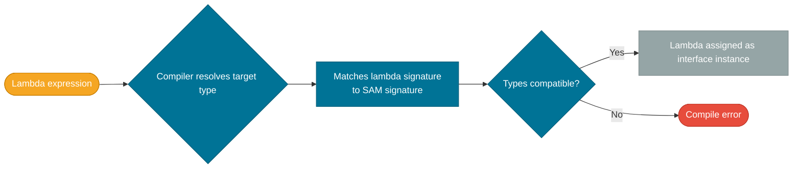

# Functional Interfaces

> A functional interface is any interface with exactly one abstract method — the contract that lets the compiler connect a lambda expression to a concrete type.

## What Problem Does It Solve?

Java is a statically typed language: every value has a declared type. Before Java 8, there was no standard way to type a "function". Every library invented its own single-method interfaces (`Runnable`, `Callable`, `Comparator`, `ActionListener`), creating an explosion of inconsistent types with no unifying abstraction.

After Java 8, `java.util.function` provides a small, composable set of standard types. A method that accepts a `Predicate<String>` immediately communicates its contract to callers — no extra documentation needed.

## What Is It?

A functional interface is an interface that has **exactly one abstract method** (SAM — Single Abstract Method). It may have any number of default or static methods. The `@FunctionalInterface` annotation enforces this contract at compile time.

```java
@FunctionalInterface
public interface Transformer<T, R> {
    R transform(T input); // ← the single abstract method

    // default and static methods are fine
    default Transformer<T, R> andLog() {
        return input -> {
            R result = this.transform(input);
            System.out.println("Input: " + input + " → " + result);
            return result;
        };
    }
}
```

### Built-in Types in `java.util.function`

The four core types cover almost every imaginable case:

| Interface | Method | Takes | Returns | Use case |
|-----------|--------|-------|---------|----------|
| `Function<T, R>` | `R apply(T t)` | T | R | Transform one value to another |
| `Predicate<T>` | `boolean test(T t)` | T | boolean | Filter / condition check |
| `Consumer<T>` | `void accept(T t)` | T | void | Side-effect operation (print, save) |
| `Supplier<T>` | `T get()` | — | T | Provide/produce a value lazily |

Extended variants:

| Interface | Purpose |
|-----------|---------|
| `BiFunction<T, U, R>` | Two inputs, one output |
| `BiPredicate<T, U>` | Two inputs, boolean output |
| `BiConsumer<T, U>` | Two inputs, void |
| `UnaryOperator<T>` | `Function<T, T>` — same type in and out |
| `BinaryOperator<T>` | `BiFunction<T, T, T>` — combine two values of same type |
| `IntFunction<R>`, `ToIntFunction<T>` | Primitive specializations to avoid boxing |

## How It Works

When a lambda is assigned to a variable, passed to a method, or returned from a method, the compiler looks at the **target type** — the expected functional interface — and matches the lambda's parameter types and return type against the SAM.



*Lambda type resolution — the compiler infers the lambda's concrete type from the expected functional interface at the call site.*

### Composing Functions

The built-in interfaces provide **default methods** for composition, making it easy to chain operations without intermediate variables:

**`Function` composition:**
```java
Function<String, String> trim    = String::trim;
Function<String, String> toLower = String::toLowerCase;

// andThen: apply trim, then apply toLower to the result
Function<String, String> normalize = trim.andThen(toLower);
// compose: apply toLower first, then trim to the result (reverse order)
Function<String, String> altOrder = trim.compose(toLower);

normalize.apply("  HELLO  "); // → "hello"
```

**`Predicate` composition:**
```java
Predicate<String> notEmpty = s -> !s.isEmpty();
Predicate<String> isLong   = s -> s.length() > 5;

Predicate<String> valid = notEmpty.and(isLong);     // both must be true
Predicate<String> either = notEmpty.or(isLong);     // at least one true
Predicate<String> isEmpty = notEmpty.negate();      // logical NOT
```

## Code Examples

### `Function<T, R>` — Transform

```java
Function<String, Integer> toLength = String::length;
Function<Integer, String> withLabel = n -> "Length: " + n;

// Chain with andThen
Function<String, String> pipeline = toLength.andThen(withLabel);
System.out.println(pipeline.apply("Hello")); // → "Length: 5"
```

### `Predicate<T>` — Filter

```java
Predicate<Integer> isEven    = n -> n % 2 == 0;
Predicate<Integer> isPositive = n -> n > 0;

List<Integer> numbers = List.of(-4, -1, 0, 2, 3, 6);
numbers.stream()
       .filter(isEven.and(isPositive)) // ← composed predicate
       .forEach(System.out::println);  // 2, 6
```

### `Consumer<T>` — Side Effect

```java
Consumer<String> print  = System.out::println;
Consumer<String> log    = msg -> logger.info("LOG: " + msg);

// andThen chains two consumers — both execute
Consumer<String> printAndLog = print.andThen(log);
printAndLog.accept("User registered"); // prints to stdout AND logs
```

### `Supplier<T>` — Lazy Supply

```java
Supplier<List<String>> listFactory = ArrayList::new; // ← no value yet

// The list is only created when .get() is called
List<String> names = listFactory.get();
names.add("Alice");
```

### `BiFunction<T, U, R>` — Two Inputs

```java
BiFunction<String, Integer, String> repeat = (s, n) -> s.repeat(n);
System.out.println(repeat.apply("abc", 3)); // → "abcabcabc"
```

### Primitive Specializations — Avoid Boxing

```java
// Use IntPredicate instead of Predicate<Integer> to avoid boxing overhead
IntPredicate isEven = n -> n % 2 == 0; // ← takes primitive int, not Integer
IntStream.range(0, 10)
         .filter(isEven)
         .forEach(System.out::println);
```

### Custom Functional Interface

```java
@FunctionalInterface
public interface TriFunction<A, B, C, R> {
    R apply(A a, B b, C c);
}

TriFunction<Integer, Integer, Integer, Integer> sum3 = (a, b, c) -> a + b + c;
System.out.println(sum3.apply(1, 2, 3)); // → 6
```

## Best Practices

- **Always annotate custom functional interfaces with `@FunctionalInterface`** — it causes a compile error if you accidentally add a second abstract method, protecting callers.
- **Prefer the standard `java.util.function` types** over custom interfaces when the signature fits — callers already know the API.
- **Use primitive specializations** (`IntFunction`, `LongPredicate`, etc.) in performance-sensitive code to avoid autoboxing overhead.
- **Compose rather than nest** — `predA.and(predB)` is more readable than a lambda that manually checks both conditions.
- **Do not use `Function<T, void>`** — void is not a valid type parameter. Use `Consumer<T>` for side-effecting operations.

## Common Pitfalls

**1. Forgetting that `Runnable` and `Callable` are functional interfaces**
These pre-Java 8 interfaces satisfy the SAM rule and work fine with lambda syntax:
```java
Runnable r = () -> System.out.println("Running");
Callable<String> c = () -> "result";
```

**2. Choosing `Function<T, Boolean>` over `Predicate<T>`**
`Predicate<T>` signals intent (a filter condition) and provides composition methods (`and`, `or`, `negate`). `Function<T, Boolean>` is technically equivalent but loses that expressiveness and requires unboxing.

**3. Overloading with multiple functional interface parameters of the same shape**
```java
// Ambiguous: both Runnable and Supplier<String> match () -> "hi"
void execute(Runnable r) { ... }
void execute(Supplier<String> s) { ... }

execute(() -> "hi"); // ← compile error: ambiguous
```
Avoid overloads where two functional interface parameters have the same arity.

**4. Ignoring checked exceptions**
None of the built-in interfaces declare checked exceptions. To handle them, wrap in a try-catch inside the lambda or create a custom interface that declares `throws`.

## Interview Questions

### Beginner

**Q:** What is a functional interface?
**A:** An interface with exactly one abstract method (SAM). Lambdas and method references can be used wherever a functional interface is expected, because the compiler maps the lambda to the SAM automatically.

**Q:** What does `@FunctionalInterface` do?
**A:** It's a documentation annotation that also adds a compile-time check: if the annotated interface has more or fewer than one abstract method, the build fails. It doesn't change runtime behavior.

### Intermediate

**Q:** What is the difference between `Function<T, R>` and `Predicate<T>`?
**A:** Both are input-to-output functions, but `Predicate<T>` specializes the output to `boolean` and provides composition methods (`and`, `or`, `negate`) designed for filter conditions. Use `Predicate<T>` when the result is a boolean test, not a general transformation.

**Q:** How do you compose two `Function` instances?
**A:** With `andThen` (apply this function first, then the next) or `compose` (apply the argument function first, then this). For example: `trim.andThen(toLower)` normalizes a string in two steps.

### Advanced

**Q:** Why should you prefer `IntPredicate` over `Predicate<Integer>` in a tight loop?
**A:** `Predicate<Integer>` must autobox the primitive `int` to `Integer` on every call, creating GC pressure. `IntPredicate` operates directly on `int` primitives with no boxing. The JVM specializations (`IntFunction`, `LongConsumer`, etc.) exist precisely to eliminate this overhead in hot paths.

**Follow-up:** Are there equivalent specializations for all primitive types?
**A:** For `boolean`, `int`, `long`, and `double` only. `byte`, `short`, `float`, and `char` are not covered — they are widened to `int` or `double` and the `Int`/`Long`/`Double` variants are used.

## Further Reading

- [Functional Interfaces — dev.java](https://dev.java/learn/lambdas/functional-interfaces/) — first-party guide with SAM rule, composition, and standard types
- [java.util.function package — Java 21 API docs](https://docs.oracle.com/en/java/javase/21/docs/api/java.base/java/util/function/package-summary.html) — full list of all built-in functional interfaces with Javadoc
- [Java 8 Functional Interfaces — Baeldung](https://www.baeldung.com/java-8-functional-interfaces) — practical guide with composing examples

## Related Notes

- [Lambdas](./lambdas.md) — lambdas are the syntax used to implement functional interfaces; read lambdas first
- [Method References](./method-references.md) — method references are an alternative to lambdas and also implement functional interfaces
- [Streams API](./streams-api.md) — every stream operation (`filter`, `map`, `forEach`) takes a functional interface argument
