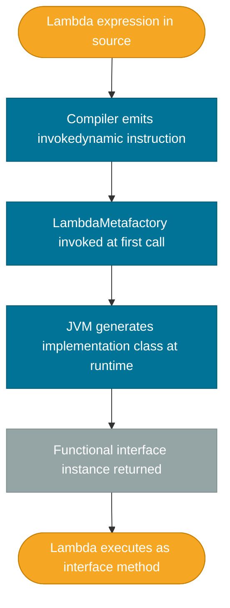

# Lambdas

> A lambda expression is an anonymous function — a concise way to pass behavior as a value, replacing single-method anonymous classes with a one-liner.

## What Problem Does It Solve?

Before Java 8, passing behavior required either a full class or an anonymous inner class. Both were verbose:

```java
// Pre-Java 8 — anonymous inner class just to compare two strings
Collections.sort(names, new Comparator<String>() {
    @Override
    public int compare(String a, String b) {
        return a.compareTo(b);
    }
});
```

Six lines to say "sort alphabetically." The boilerplate obscured the intent, made code harder to scan, and discouraged functional-style programming patterns entirely. Lambdas collapse that ceremony down to the essential logic.

## What Is It?

A lambda expression is a **block of code that can be treated as a value** — stored in a variable, passed to a method, or returned from a method. It has no name and no explicit class.

```
(parameters) -> expression
(parameters) -> { statements; }
```

Lambda expressions are the syntactic mechanism for working with **functional interfaces** — interfaces that declare exactly one abstract method. The compiler maps the lambda to that method automatically.

```java
// With lambda
Collections.sort(names, (a, b) -> a.compareTo(b));
```

## Syntax Breakdown

```java
// Full form
(String a, String b) -> { return a.compareTo(b); }

// Inferred parameter types (most common)
(a, b) -> a.compareTo(b)

// Single parameter — parentheses optional
name -> name.toUpperCase()

// No parameters
() -> System.out.println("Hello")

// Block body with explicit return
(x, y) -> {
    int sum = x + y;
    return sum * 2;
}
```

The compiler **infers** parameter types from the target functional interface, so explicit types are rarely needed.

## How It Works

Under the hood, a lambda does **not** create an anonymous class at compile time the way `new Comparator<>() {...}` does. Instead, the compiler emits an `invokedynamic` bytecode instruction, and the JVM creates an implementation of the target functional interface at runtime using `LambdaMetafactory`.



*Lambda compilation and runtime dispatch — the JVM defers class creation to first use, which is faster and uses less heap than compile-time anonymous classes.*

### Variable Capture and Effectively Final

A lambda can capture variables from the enclosing scope, but those variables must be **effectively final** — their value must not change after initialization (even without the `final` keyword).

```java
String prefix = "Hello"; // effectively final — never reassigned
Runnable r = () -> System.out.println(prefix + " World");

// prefix = "Hi"; // ← would make it NOT effectively final → compile error
```

This restriction exists because lambdas may outlive the stack frame where they were created (e.g., stored in a list, passed to a thread). Mutating a captured local variable would create a race condition between the lambda and its capture site.

Instance fields and static fields are **not** subject to the effectively-final rule because they live on the heap, not the stack.

### `this` Inside a Lambda

Unlike anonymous classes, a lambda does not introduce a new scope. `this` refers to the **enclosing object**, not the lambda itself:

```java
public class Greeter {
    private String name = "World";

    public Runnable buildGreeting() {
        // 'this' refers to the Greeter instance, not the lambda
        return () -> System.out.println("Hello, " + this.name);
    }
}
```

In an anonymous inner class, `this` would refer to the inner class instance. Lambdas share the enclosing class's `this`.

## Code Examples

### Basic Sorting

```java
List<String> names = Arrays.asList("Charlie", "Alice", "Bob");

// Lambda as Comparator
names.sort((a, b) -> a.compareTo(b));

// Equivalent method reference (see Method References note)
names.sort(String::compareTo);
```

### Storing a Lambda in a Variable

```java
// Predicate<String> is a functional interface: boolean test(String t)
Predicate<String> isLong = s -> s.length() > 5;

System.out.println(isLong.test("Java"));        // false
System.out.println(isLong.test("Functional"));  // true
```

### Lambda with a Block Body

```java
Function<Integer, String> classifier = n -> {
    if (n < 0) return "negative";
    if (n == 0) return "zero";
    return "positive";
};

System.out.println(classifier.apply(-3));  // negative
```

### Capturing Instance State

```java
public class OrderProcessor {
    private final double taxRate = 0.08;

    public List<Double> applyTax(List<Double> prices) {
        return prices.stream()
            .map(price -> price * (1 + taxRate)) // ← captures instance field; no effectively-final restriction
            .collect(Collectors.toList());
    }
}
```

### Common Anti-Pattern: Mutating a Captured Variable

```java
// Does NOT compile
int count = 0;
List<String> items = List.of("a", "b", "c");
items.forEach(item -> count++); // ← ERROR: count must be effectively final
```

Fix: use an `AtomicInteger` or collect to a result instead of mutating a local counter.

```java
long count = items.stream().filter(s -> !s.isEmpty()).count(); // ← correct approach
```

## Best Practices

- **Keep lambdas short** — if the body exceeds 3–4 lines, extract it to a named private method and use a method reference instead. Named methods are easier to test and debug.
- **Prefer method references** over lambdas that only delegate: use `String::toUpperCase` over `s -> s.toUpperCase()`.
- **Do not mutate external state** inside a lambda — it defeats the purpose of functional style and introduces race conditions in parallel streams.
- **Never use checked exceptions** in a lambda directly — wrap them in unchecked exceptions or use a utility like Vavr's `CheckedFunction` if you need checked exception propagation.
- **Name your functional interfaces** — if a lambda type appears in multiple methods, assign a type alias via a custom functional interface rather than repeating the generic signature.

## Common Pitfalls

**1. Confusing `this` with anonymous class behavior**
Developers coming from the pre-Java 8 style expect `this` inside a lambda to refer to the lambda. It does not — `this` is the enclosing class. Use a named variable if you need a reference to the lambda itself.

**2. Trying to mutate captured locals**
The compiler error `"local variable must be effectively final"` trips up most developers returning to Java. The fix is almost always to use the Streams API's reduction operations (`reduce`, `collect`, `count`) instead of a loop-style counter.

**3. Serialization**
Lambdas are not serializable by default (unlike named inner classes). Do not store lambdas in serializable objects or sessions.

**4. Performance in hot loops**
Creating a new lambda reference on every iteration of a tight hot loop can add GC pressure. Extract frequently allocated lambdas to static final fields when performance profiling identifies this as a bottleneck.

**5. Overusing lambda nesting**
Nesting lambdas (lambda inside a lambda) is legal but quickly becomes unreadable. Extract to named methods after the first level of nesting.

## Interview Questions

### Beginner

**Q:** What is a lambda expression in Java?
**A:** A lambda is an anonymous function — a block of code with parameters and a body, but no name or class. It implements a functional interface (an interface with exactly one abstract method). For example, `(a, b) -> a.compareTo(b)` implements `Comparator<String>`.

**Q:** What does "effectively final" mean?
**A:** A variable is effectively final if its value is never changed after initialization, even without the `final` keyword. Lambdas can capture effectively-final local variables from the enclosing scope, but cannot capture variables that are later reassigned.

### Intermediate

**Q:** How does `this` behave inside a lambda vs. an anonymous inner class?
**A:** Inside a lambda, `this` refers to the enclosing instance (the class that contains the lambda). Inside an anonymous inner class, `this` refers to the anonymous class instance itself. This makes lambdas more predictable when accessing enclosing state.

**Q:** How are lambdas implemented at the bytecode level?
**A:** The compiler emits an `invokedynamic` instruction. At runtime, `LambdaMetafactory` dynamically generates a class that implements the target functional interface. This is more efficient than compile-time anonymous classes because class generation is deferred and often shared with no per-instance overhead beyond the capture.

### Advanced

**Q:** Why can't lambdas capture mutable local variables, and how do you work around it?
**A:** Local variables live on the stack. A lambda capturing them may execute on a different thread or after the stack frame is gone. Allowing mutation would require copying the variable to the heap and synchronizing access — Java chose simplicity by forbidding it. Workarounds: (1) use `AtomicInteger` or an array wrapper, (2) restructure to functional operations like `reduce` or `collect`, (3) use instance fields instead.

**Follow-up:** Does the same restriction apply to instance fields?
**A:** No — instance fields are on the heap and are accessible without the effectively-final constraint. However, mutating instance fields from a lambda is not thread-safe unless synchronized.

## Further Reading

- [Lambda Expressions — dev.java](https://dev.java/learn/lambdas/) — official first-party guide covering syntax, capture, and the lambda/functional-interface relationship
- [Lambda Expressions Tutorial — Oracle](https://docs.oracle.com/javase/tutorial/java/javaOO/lambdaexpressions.html) — approachable walkthrough with motivating examples
- [Java 8 Lambda Tips — Baeldung](https://www.baeldung.com/java-8-lambda-expressions-tips) — practical tips with common pitfalls

## Related Notes

- [Functional Interfaces](./functional-interfaces.md) — lambdas require a target functional interface; understanding `Function`, `Predicate`, and `Consumer` is essential to writing non-trivial lambdas
- [Method References](./method-references.md) — method references are the shorthand form of lambdas that delegate to an existing method; know when to prefer one over the other
- [Streams API](./streams-api.md) — lambdas are the primary way to supply behavior to stream operations like `filter`, `map`, and `forEach`
