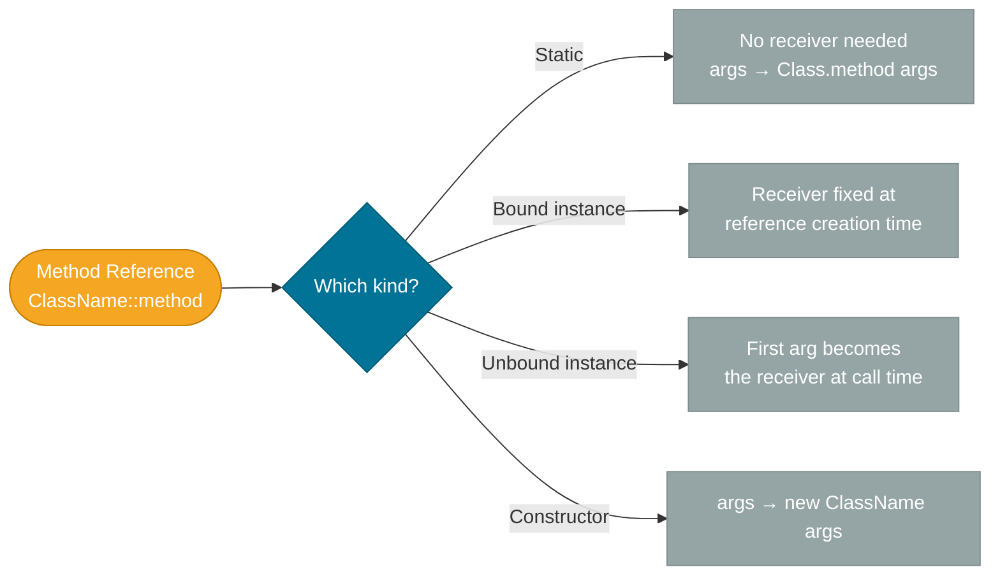

# Method References

> A method reference is shorthand for a lambda that does nothing but call an existing method — it replaces `x -> SomeClass.method(x)` with `SomeClass::method`.

## What Problem Does It Solve?

Lambdas are concise, but they can still carry noise when the only thing they do is delegate to a named method:

```java
// Lambda that only wraps an existing method call
list.stream()
    .map(s -> s.toUpperCase())     // ← the lambda adds no logic
    .forEach(s -> System.out.println(s));
```

Every `s ->` prefix is a visual distraction when the reader already knows what `toUpperCase()` and `println` do. Method references remove that ceremony:

```java
list.stream()
    .map(String::toUpperCase)
    .forEach(System.out::println);
```

The signal-to-noise ratio doubles, and the reader focuses on *what* is being done, not *how* to call it.

## What Is It?

A method reference is a reference to an existing method, expressed with the `::` operator. Like a lambda, it implements a functional interface — the compiler matches the method's signature to the target SAM. There are four distinct kinds.

## The Four Kinds

### 1. Static Method Reference

```
ClassName::staticMethod
```

Equivalent lambda: `(args) -> ClassName.staticMethod(args)`

```java
// Static method: Integer.parseInt(String s)
Function<String, Integer> parser = Integer::parseInt;
parser.apply("42"); // → 42

// Without method reference
Function<String, Integer> parserLong = s -> Integer.parseInt(s);
```

### 2. Bound Instance Method Reference

```
instance::instanceMethod
```

Equivalent lambda: `(args) -> instance.instanceMethod(args)`

The object the method is called on is **fixed (bound)** at the point of reference creation.

```java
String prefix = "Hello, ";
// Bound: the string "Hello, " is the fixed receiver
Function<String, String> greeter = prefix::concat;
greeter.apply("Alice"); // → "Hello, Alice"
greeter.apply("Bob");   // → "Hello, Bob"
```

### 3. Unbound Instance Method Reference

```
ClassName::instanceMethod
```

Equivalent lambda: `(instance, args) -> instance.instanceMethod(args)`

The object the method is called on is **not yet determined** — it becomes the first argument at call time.

```java
// instance is provided at call time (by the stream)
Function<String, String> toUpper = String::toUpperCase;
toUpper.apply("hello"); // → "HELLO"

// In a stream: each element becomes the receiver
List.of("alice", "bob").stream()
    .map(String::toUpperCase)
    .collect(Collectors.toList()); // ["ALICE", "BOB"]
```

### 4. Constructor Reference

```
ClassName::new
```

Equivalent lambda: `(args) -> new ClassName(args)`

```java
// Supplier<List<String>>: no args → new ArrayList<String>()
Supplier<List<String>> listMaker = ArrayList::new;
List<String> names = listMaker.get();

// Function<String, StringBuilder>: one arg → new StringBuilder(s)
Function<String, StringBuilder> sbMaker = StringBuilder::new;
StringBuilder sb = sbMaker.apply("Hello");
```

## How It Works



*The four kinds of method references — the key difference is whether the receiver is already known (bound/static/constructor) or supplied at call time (unbound).*

The compiler translates each method reference into an `invokedynamic` call backed by `LambdaMetafactory`, exactly like a lambda. There is no runtime difference.

## Code Examples

### Filtering with a Static Method

```java
List<String> strings = List.of("42", "not-a-number", "7", "");

// Integer::parseInt as a filter would throw — use a safer static method
List<String> numeric = strings.stream()
    .filter(StringUtils::isNumeric)     // ← static method reference
    .collect(Collectors.toList());
```

### Collecting with Constructor Reference

```java
// BiFunction used implicitly by toMap — value constructor
Map<String, List<String>> grouped = names.stream()
    .collect(Collectors.groupingBy(
        String::toLowerCase,            // ← unbound instance: key classifier
        Collectors.toCollection(LinkedHashSet::new) // ← constructor reference
    ));
```

### Event Listener with Bound Instance

```java
public class ButtonHandler {
    public void onClick() {
        System.out.println("Button clicked!");
    }
}

ButtonHandler handler = new ButtonHandler();
button.addActionListener(handler::onClick); // ← bound: always calls this instance
```

### Comparing with Unbound Method Reference

```java
// Comparator.comparing expects Function<T, U extends Comparable<U>>
List<String> words = List.of("banana", "apple", "cherry");
words.sort(Comparator.comparing(String::length)); // → [apple, banana, cherry]
```

### Chaining with `andThen` and Method References

```java
Function<String, String> normalize =
    ((Function<String, String>) String::trim)
        .andThen(String::toLowerCase);  // ← unbound instance reference

normalize.apply("  HELLO  "); // → "hello"
```

### Summary of All Four Kinds

```java
// 1. Static
Function<String, Integer>  staticRef   = Integer::parseInt;

// 2. Bound instance
String prefix = "Dr. ";
Function<String, String>   boundRef    = prefix::concat;

// 3. Unbound instance
Function<String, String>   unboundRef  = String::toUpperCase;

// 4. Constructor
Supplier<ArrayList<String>> ctorRef   = ArrayList::new;
```

## Trade-offs & When To Use / Avoid

| | Pros | Cons |
|--|------|------|
| **Method reference** | Concise; expresses intent directly; reuses existing, tested methods | Requires an existing named method; can hide the signature (harder for newcomers to read) |
| **Lambda** | Flexible; self-contained; obvious what happens inline | More verbose for simple delegations; can become too long if logic grows |

**Use a method reference when:**
- The lambda body is exactly `args -> existingMethod(args)` — no extra logic, no wrapping
- The method name clearly communicates intent (`String::isEmpty` vs. `s -> s.isEmpty()`)

**Use a lambda when:**
- The body has inline logic beyond a single call
- You need to adapt parameters (reorder, partially apply)
- The method reference would require a cast that hurts readability

## Common Pitfalls

**1. Confusing bound and unbound instance references**
`"hello"::toUpperCase` (bound — always converts "hello") vs. `String::toUpperCase` (unbound — converts whatever string is passed). The difference is subtle but critical when used in streams.

**2. Constructor reference arity mismatch**
`Function<String, StringBuilder>` expects a constructor that takes one `String`. If you write `StringBuilder::new` and the target type expects a `Supplier`, the compiler will pick the no-arg constructor. Ensure the target functional interface has the right arity.

**3. Overloaded methods cause ambiguity**
```java
// println is overloaded — which overload does this reference?
Consumer<String>  printStr = System.out::println;  // OK — target type resolves it
Consumer<Object>  printObj = System.out::println;  // OK
// Consumer<Integer> printInt = System.out::println; // ambiguous — int vs Integer
```
Prefer explicit casts or method references on less-overloaded methods.

**4. Using method references where the receiver changes per call**
If you write `handler::process` but `handler` is mutable and reassigned, the reference still points to the *original* instance. This surprises developers who expect it to dynamically dispatch.

## Interview Questions

### Beginner

**Q:** What is a method reference, and what does `::` mean?
**A:** A method reference is a shorthand lambda that calls an existing method. The `::` operator separates the class (or instance) from the method name. For example, `String::toUpperCase` is equivalent to `s -> s.toUpperCase()`.

**Q:** What are the four kinds of method references?
**A:** Static (`Integer::parseInt`), bound instance (`prefix::concat`), unbound instance (`String::toUpperCase`), and constructor (`ArrayList::new`).

### Intermediate

**Q:** What is the difference between a bound and an unbound instance method reference?
**A:** A bound reference fixes the receiver at creation time — `prefix::concat` always calls `concat` on the specific `prefix` string. An unbound reference leaves the receiver open — `String::toUpperCase` takes any `String` as its first argument at call time, which is why it maps naturally to `Function<String, String>`.

**Q:** When should you prefer a lambda over a method reference?
**A:** When the lambda body contains logic beyond a single method call — argument reordering, conditional logic, exception wrapping — a lambda is clearer. Method references are best when the body is purely a delegation.

### Advanced

**Q:** How does the compiler resolve an overloaded method reference like `System.out::println`?
**A:** The compiler uses the **target type** (the functional interface the reference is assigned to) to determine which overload is selected. If the target is `Consumer<String>`, the `println(String)` overload is chosen. If the target is ambiguous (e.g., no assignment context), a cast or explicit lambda is needed.

**Follow-up:** What happens at runtime — is there a performance difference vs. a lambda?
**A:** Both compile to `invokedynamic` backed by `LambdaMetafactory`. The JVM creates an implementation class once and reuses it. There is no measureable performance difference between a method reference and an equivalent lambda.

## Further Reading

- [Method References — dev.java](https://dev.java/learn/lambdas/method-references/) — official guide with all four kinds and examples
- [Method References Tutorial — Oracle](https://docs.oracle.com/javase/tutorial/java/javaOO/methodreferences.html) — concise Oracle tutorial with code
- [Java Method References — Baeldung](https://www.baeldung.com/java-method-references) — practical examples with common pitfalls

## Related Notes

- [Lambdas](./lambdas.md) — method references are the concise alternative to lambdas; read that note first to understand what a method reference replaces
- [Functional Interfaces](./functional-interfaces.md) — method references implement functional interfaces; the target type determines which overload is selected
- [Streams API](./streams-api.md) — method references are used extensively inside stream pipelines for `map`, `filter`, `forEach`, and `sorted`
