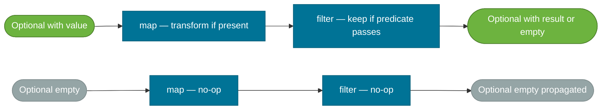

# Optional Deep Dive

> `Optional<T>` is a container that either holds a value or is empty — it makes "this result might not exist" an explicit part of a method's return type instead of a hidden `null` contract.

## What Problem Does It Solve?

`null` is Java's billion-dollar mistake. Every reference type can be null, but nothing in the signature tells a caller they need to check. The result is defensive code scattered everywhere — or worse, `NullPointerException` in production:

```java
// Caller has no idea findByEmail can return null
User user = userRepository.findByEmail(email);
String city = user.getAddress().getCity(); // ← NullPointerException if user or address is null
```

The intent "I might not find a user" lives only in documentation, not the signature. `Optional` moves that intent into the type:

```java
Optional<User> user = userRepository.findByEmail(email);
String city = user
    .map(User::getAddress)
    .map(Address::getCity)
    .orElse("Unknown");
// No NPE possible — Optional forces you to handle the absent case
```

## What Is It?

`Optional<T>` is a final, immutable container class in `java.util` that wraps either:
- **A present value** — `Optional.of(value)` or `Optional.ofNullable(value)`
- **An empty state** — `Optional.empty()`

It is intentionally **not a general-purpose nullable wrapper**. It is designed for one purpose: **return types of methods that may not find a result**. The Java API design FAQ says explicitly that `Optional` should not be used as a field type, method parameter, or in collections.

## Creating an Optional

```java
// Safe: value must be non-null — throws NullPointerException if null
Optional<String> safe = Optional.of("hello");

// When you don't know if the value is null
Optional<String> maybe = Optional.ofNullable(someNullableValue);
// → Optional.of("value") if non-null, Optional.empty() if null

// Explicit empty
Optional<String> empty = Optional.empty();
```

## How It Works

### Retrieving Values

Never call `.get()` blindly — it throws `NoSuchElementException` if the Optional is empty. Use the safer alternatives:

| Method | Behavior when empty |
|--------|---------------------|
| `get()` | Throws `NoSuchElementException` |
| `orElse(T default)` | Returns `default` |
| `orElseGet(Supplier<T>)` | Calls `Supplier` to produce default — lazy |
| `orElseThrow()` | Throws `NoSuchElementException` (Java 10+) |
| `orElseThrow(Supplier<X>)` | Throws custom exception |
| `ifPresent(Consumer<T>)` | Calls Consumer if value present; no-op if empty |
| `ifPresentOrElse(Consumer, Runnable)` | Java 9+ — action if present, fallback if empty |

```java
Optional<String> name = Optional.ofNullable(getName());

// ✗ Never do this
String value = name.get(); // bombs if empty

// ✓ Safe alternatives
String val1 = name.orElse("Anonymous");
String val2 = name.orElseGet(() -> loadDefaultName()); // ← lazy: only called when empty
String val3 = name.orElseThrow(() -> new UserNotFoundException("Name not found"));

name.ifPresent(n -> sendWelcome(n)); // no-op if empty
name.ifPresentOrElse(              // Java 9+
    n -> System.out.println("Hello, " + n),
    () -> System.out.println("No name found")
);
```

### Pipeline Chaining

Optional integrates with the Streams-style pipeline using `map`, `flatMap`, and `filter`:



*Optional pipeline — operations short-circuit and propagate emptiness, similar to how a stream with zero elements passes through all intermediate operations unchanged.*

```java
Optional<String> city = userRepository.findByEmail(email)
    .map(User::getAddress)         // Optional<Address> — empty if user not found
    .filter(a -> a.isVerified())   // keep only verified addresses
    .map(Address::getCity);        // Optional<String> — city name or empty
```

`flatMap` is used when the mapping function itself returns an `Optional`:

```java
// getPhoneNumber() returns Optional<String>, so use flatMap, not map
Optional<String> phone = userRepository.findByEmail(email)
    .flatMap(User::getPhoneNumber); // avoids Optional<Optional<String>>
```

### `Optional.stream()` (Java 9+)

Converts an Optional into a zero-or-one element stream, enabling integration with `Stream.flatMap`:

```java
List<String> emails = List.of("alice@example.com", "invalid", "bob@example.com");

List<User> users = emails.stream()
    .map(userRepository::findByEmail) // Stream<Optional<User>>
    .flatMap(Optional::stream)         // ← Java 9+: flatten away empties
    .collect(Collectors.toList());     // only found users
```

## Code Examples

### Chain Without NPE

```java
// Old way: nested null checks
String city = null;
User user = userRepository.findByEmail(email);
if (user != null) {
    Address address = user.getAddress();
    if (address != null) {
        city = address.getCity();
    }
}
if (city == null) city = "Unknown";

// Optional way: flat chain, no nesting
String city = userRepository.findByEmail(email)
    .map(User::getAddress)
    .map(Address::getCity)
    .orElse("Unknown");
```

### Conditional Action

```java
// Execute only when value is present
userRepository.findByEmail(email)
    .ifPresent(user -> eventBus.publish(new UserLoginEvent(user)));
```

### Lazy Default with `orElseGet`

```java
// orElse ALWAYS evaluates the argument — even if the Optional is present
String eager  = optional.orElse(expensiveComputation()); // ← always called!

// orElseGet only evaluates the Supplier when the Optional is empty
String lazy   = optional.orElseGet(() -> expensiveComputation()); // ← called only when empty
```

### Throwing a Custom Exception

```java
User user = userRepository.findById(id)
    .orElseThrow(() -> new UserNotFoundException("User not found: " + id));
```

### Combining Two Optionals (Java 9+ `or`)

```java
Optional<User> primaryUser   = primaryDb.findByEmail(email);
Optional<User> fallbackUser  = fallbackDb.findByEmail(email);

Optional<User> found = primaryUser.or(() -> fallbackUser); // ← Java 9+
```

## Best Practices

- **Use `Optional` only as a method return type** — never as a field, constructor parameter, or collection element. `Optional` is not serializable and adds overhead per-instance.
- **Prefer `orElseGet` over `orElse` for expensive defaults** — `orElse` always evaluates its argument, even when the Optional has a value.
- **Do not use `isPresent()` + `get()`** — this is just a verbose null check. Use `map`, `filter`, `orElse`, or `ifPresent` instead.
- **Use `Optional.ofNullable` at the boundary** where a legacy API returns null; inside your own code, never produce null where Optional is expected.
- **Prefer `orElseThrow()` over `get()`** (Java 10+) — they have the same result but `orElseThrow` communicates intent.

## Common Pitfalls

**1. Using `get()` without checking**
```java
Optional<String> name = Optional.empty();
name.get(); // ← NoSuchElementException at runtime
```
`get()` on an empty Optional throws immediately. Treat it like dereferencing null. Always use a safe retrieval method.

**2. `orElse` calling an expensive method unconditionally**
```java
// BAD: the database query runs even if the Optional is present
User user = findUser(id).orElse(loadDefaultUserFromDb());
// FIX: use orElseGet for lazy evaluation
User user = findUser(id).orElseGet(() -> loadDefaultUserFromDb());
```

**3. Optional as a method parameter**
```java
// BAD
public void process(Optional<String> name) { ... }
// A caller can pass Optional.empty(), Optional.of("x"), or null — three states!
// FIX: use overloads or null checks on a plain String
public void process(String name) { ... }
public void process() { process("Default"); }
```

**4. Optional in a Collection**
```java
// BAD — filtering nulls via Optional is awkward and wasteful
List<Optional<String>> names = ...;
// FIX: filter nulls directly or use a stream with filter(Objects::nonNull)
```

**5. Using Optional for every nullable value (over-engineering)**
Optional adds an object allocation for every call. For internal private methods where nullability is obvious and controlled, a null check is simpler. Use Optional where the absence of a value is a meaningful, documented contract for callers.

## Interview Questions

### Beginner

**Q:** What is `Optional` and why was it introduced?
**A:** `Optional<T>` is a container that may or may not hold a value. It was introduced in Java 8 to make "no result" an explicit part of a method's return type, instead of relying on undocumented `null` returns that cause `NullPointerException`. It forces callers to handle the absent case.

**Q:** What is the difference between `Optional.of` and `Optional.ofNullable`?
**A:** `Optional.of(value)` throws `NullPointerException` if value is null. Use it when you know the value is non-null. `Optional.ofNullable(value)` returns `Optional.empty()` if value is null, making it safe to call on any reference.

### Intermediate

**Q:** Why should you prefer `orElseGet` over `orElse` for expensive computations?
**A:** `orElse(T default)` evaluates the default expression unconditionally — even when the Optional is present. `orElseGet(Supplier<T>)` is lazy — the Supplier is only invoked when the Optional is empty. For expensive operations (database lookups, network calls), `orElseGet` avoids unnecessary work.

**Q:** When should you use `flatMap` instead of `map` on an Optional?
**A:** Use `flatMap` when the mapping function itself returns an `Optional`. Using `map` in that case would produce `Optional<Optional<T>>`, which you'd then need to unwrap again. `flatMap` flattens the nested Optional automatically.

### Advanced

**Q:** What are the anti-pattern uses of `Optional` according to Java's designers?
**A:** Three main anti-patterns: (1) **Optional as a method parameter** — creates confusion between `null`, `Optional.empty()`, and an `Optional` with a value; use overloads or null checks on a plain type instead. (2) **Optional as a field** — `Optional` is not serializable, adds heap overhead per instance, and complicates deserialization. (3) **Optional in collections** — unnecessary complexity; filter nulls directly with `Objects::nonNull`.

**Follow-up:** Is Optional free from overhead?
**A:** No. Every `Optional` that wraps a value is a heap-allocated object. For code called millions of times in tight loops, this adds GC pressure. JVM escape analysis can sometimes eliminate the allocation, but it's not guaranteed. For performance-critical internal code, a null check is cheaper.

## Further Reading

- [Optional — dev.java](https://dev.java/learn/api/optional/) — official usage guide with the correct patterns
- [Optional API — Java 21 Javadoc](https://docs.oracle.com/en/java/javase/21/docs/api/java.base/java/util/Optional.html) — full API reference for all methods
- [Java Optional Guide — Baeldung](https://www.baeldung.com/java-optional) — comprehensive practical guide with anti-patterns
- [Uses of Optional — Baeldung](https://www.baeldung.com/java-optional-uses) — when to use and when to avoid

## Related Notes

- [Streams API](./streams-api.md) — terminal operations like `findFirst()` and `reduce()` return `Optional`; knowing Optional is prerequisite to using them correctly
- [Functional Interfaces](./functional-interfaces.md) — `Optional.map` takes a `Function`, `Optional.filter` takes a `Predicate`, and `Optional.ifPresent` takes a `Consumer`
- [Exceptions](../exceptions/exception-best-practices.md) — `orElseThrow` is the idiomatic replacement for null-check-then-throw patterns
