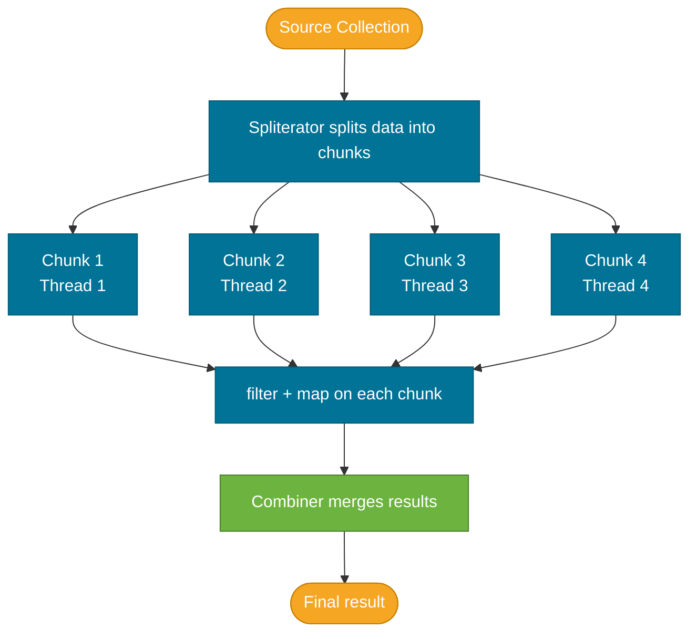

# Parallel Streams

> A parallel stream splits its elements across multiple threads from the ForkJoin common pool — but it only makes things faster when the data is large, the operations are CPU-bound, and there are no shared side effects.

## What Problem Does It Solve?

Sequential stream pipelines run on the calling thread. For computationally heavy work over large datasets, this leaves available CPU cores idle. Developers used to need ExecutorServices and explicit `Future` management to parallelize data processing:

```java
// Manual parallel work — lots of ceremony
ExecutorService pool = Executors.newFixedThreadPool(8);
List<Future<Integer>> futures = new ArrayList<>();
for (Chunk chunk : data.split(8)) {
    futures.add(pool.submit(() -> process(chunk)));
}
// collect, merge, handle exceptions...
```

Parallel streams provide a single-method way to distribute work across cores with zero threading code:

```java
long count = largeList.parallelStream()
    .filter(Item::isAvailable)
    .count(); // ← JVM splits work, merges results automatically
```

## What Is It?

A parallel stream is a stream that partitions its elements into sub-tasks and processes them concurrently on the **ForkJoin common pool** — a JVM-wide shared thread pool with one thread per available CPU core (by default).

When you call `parallelStream()` or `stream().parallel()`, the stream framework:
1. Uses a **spliterator** to split the data source into chunks
2. Submits each chunk as a `ForkJoinTask` to the common pool
3. Collects and merges results from all chunks using the collector's **combiner**

## How It Works



*Parallel stream execution — the source is split into chunks processed on separate threads; the combiner merges results without any manual thread management.*

### The ForkJoin Common Pool

By default, parallel streams use `ForkJoinPool.commonPool()`, which has `Runtime.getRuntime().availableProcessors() - 1` worker threads (minimum 1). This pool is **shared across the entire JVM** — blocking one thread inside a parallel stream blocks it for all parallel users.

```java
// Check the common pool parallelism
System.out.println(ForkJoinPool.commonPool().getParallelism());
// e.g., 7 on an 8-core machine
```

### Custom Thread Pool

To avoid monopolizing the common pool (e.g., in a Spring Boot app under load), submit the parallel stream to a custom pool:

```java
ForkJoinPool customPool = new ForkJoinPool(4); // ← limit parallelism

List<Result> results = customPool.submit(() ->
    items.parallelStream()
         .map(this::heavyOperation)
         .collect(Collectors.toList())
).get(); // ← ForkJoinTask.get() — blocks the calling thread for the result
```

:::warning
Always **shut down custom pools** when done. Leaked `ForkJoinPool` instances hold threads open and cause memory leaks in long-running applications.
:::

### When Parallel Helps

Parallel streams give a real speedup only when all of these conditions are met:

| Condition | Why It Matters |
|-----------|---------------|
| Large dataset (thousands+ elements) | Thread overhead must be amortized; small datasets run slower in parallel due to splitting/merging overhead |
| CPU-bound operation | IO-bound tasks block threads; parallelism adds threads without adding throughput |
| No shared mutable state | Concurrent writes without synchronization cause incorrect results or race conditions |
| Splittable data source | `ArrayList` and arrays split efficiently; `LinkedList` does not |
| Operations are stateless | `sorted`, `distinct` buffer all elements and undermine parallel gains |

## Code Examples

### Simple Parallel Aggregation

```java
List<Integer> millions = IntStream.rangeClosed(1, 10_000_000)
    .boxed()
    .collect(Collectors.toList());

// Sequential
long start = System.nanoTime();
long sumSeq = millions.stream().mapToLong(Integer::longValue).sum();
System.out.println("Sequential: " + Duration.ofNanos(System.nanoTime() - start).toMillis() + "ms");

// Parallel — faster on multi-core for CPU-bound sum
start = System.nanoTime();
long sumPar = millions.parallelStream().mapToLong(Integer::longValue).sum();
System.out.println("Parallel: " + Duration.ofNanos(System.nanoTime() - start).toMillis() + "ms");
```

### Parallel Map-Reduce

```java
// Expensive computation across a large list
double avgScore = students.parallelStream()
    .mapToDouble(Student::computeGpa)   // ← heavy per-element computation
    .average()
    .orElse(0.0);
```

### Unsafe: Shared Mutable State

```java
// BUG: Concurrent modification of a non-thread-safe list
List<Integer> results = new ArrayList<>();
IntStream.range(0, 1000)
    .parallel()
    .forEach(i -> results.add(i)); // ← data race — ArrayList is not thread-safe
// results may be shorter than 1000, or throw ConcurrentModificationException
```

Fix — collect safely:
```java
List<Integer> safe = IntStream.range(0, 1000)
    .parallel()
    .boxed()
    .collect(Collectors.toList()); // ← Collectors handle thread safety internally
```

### Unsafe: Stateful Intermediate with `forEach`

```java
// BUG: forEach order is undefined in parallel
List<String> ordered = new ArrayList<>();
names.parallelStream()
     .map(String::toUpperCase)
     .forEach(ordered::add); // ← non-deterministic order, non-thread-safe add
```

Fix — use `forEachOrdered` if order matters (sacrifices some parallelism):
```java
names.parallelStream()
     .map(String::toUpperCase)
     .forEachOrdered(ordered::add); // ← order preserved, but threads synchronize
```

### Custom ForkJoin Pool

```java
ForkJoinPool pool = new ForkJoinPool(2); // limit to 2 threads

try {
    Map<String, Long> result = pool.submit(() ->
        employees.parallelStream()
            .collect(Collectors.groupingBy(
                Employee::department,
                Collectors.counting()
            ))
    ).get();
} finally {
    pool.shutdown(); // ← always clean up
}
```

### Checking If a Stream Is Parallel

```java
Stream<String> s = list.stream();
s.isParallel(); // false

Stream<String> p = list.parallelStream();
p.isParallel(); // true

// Convert between sequential and parallel mid-pipeline
Stream<String> toggled = list.stream()
    .parallel() // ← switch to parallel
    .filter(...)
    .sequential(); // ← switch back to sequential
```

## Trade-offs & When To Use / Avoid

| | Pros | Cons |
|--|------|------|
| **Parallel streams** | Multi-core utilization; zero threading boilerplate | Shared common pool; hard to debug; incorrect when state is mutable; overhead for small data |
| **Sequential streams** | Deterministic; debuggable with `peek`; no shared-pool risk | Single core; slower for large CPU-bound workloads |

**Use parallel streams when:**
- Dataset is large (>10,000 elements as a rough threshold)
- Each element's processing is CPU-intensive (> microseconds per element)
- Operations are stateless and have no side effects
- Source is splittable (array, `ArrayList`)

**Avoid parallel streams when:**
- Operations involve IO (database calls, HTTP, filesystem) — use async frameworks instead
- Data source is a `LinkedList`, `TreeMap`, or a generator — splits inefficiently
- Running inside a container with limited CPU (e.g., a Docker container with 0.5 CPU) — the common pool sees the host CPU count, not the container limit
- Logic requires encounter order (avoid `forEach`; use `forEachOrdered` or `collect` instead)
- Code runs in a web server — blocking the common pool hurts all concurrent requests

## Common Pitfalls

**1. Assuming parallel is always faster**
On small datasets, the overhead of splitting, scheduling, and merging exceeds the savings. Benchmark before switching to parallel. A list of 100 elements will almost always run slower in parallel.

**2. Shared mutable state causes silent data corruption**
Adding to a non-thread-safe `ArrayList` inside `parallelStream().forEach` loses elements without throwing. This is the single most common parallel streams bug.

**3. The common pool starvation**
If a parallel stream calls a blocking operation (e.g., `Thread.sleep`, a database query), those threads block in the shared `ForkJoinPool.commonPool()`. All other parallel stream users in the JVM are degraded. Use a custom pool or a reactive framework for IO.

**4. `sorted` in a parallel stream hurts performance**
`sorted` must buffer every element before returning any, serializing the parallel work. The combiner has to merge sorted chunks — which is faster than sorting from scratch, but still adds overhead.

**5. `forEach` vs `forEachOrdered` in parallel**
`forEach` on a parallel stream does **not** preserve encounter order. If the order of side effects matters, use `forEachOrdered`, which re-serializes output order.

## Interview Questions

### Beginner

**Q:** How do you make a stream parallel?
**A:** Call `.parallelStream()` on a Collection, or call `.parallel()` on an existing stream. The stream will then use the ForkJoin common pool to process elements concurrently.

**Q:** Does parallel always make things faster?
**A:** No. Parallel streams are beneficial only for large datasets with CPU-intensive, stateless operations. For small datasets or IO-bound work, the thread coordination overhead makes parallel streams slower than sequential.

### Intermediate

**Q:** What thread pool does a parallel stream use by default?
**A:** The `ForkJoinPool.commonPool()` — a JVM-wide pool with one worker thread per available CPU core (minus one). This pool is shared, so blocking inside a parallel stream degrades all other parallel stream users.

**Q:** Can you use a parallel stream inside a Spring MVC request thread safely?
**A:** With caution. The parallel work runs on the ForkJoin common pool, not the request thread. If the operations are CPU-bound and stateless, it's technically safe. However, blocking the common pool (e.g., with database calls) harms all concurrent requests. For IO-bound tasks inside a web controller, use async/reactive approaches instead.

### Advanced

**Q:** How does the ForkJoin framework split a parallel stream's data?
**A:** Through the source's `Spliterator`. Each `Spliterator` has a `trySplit()` method that subdivides the data recursively. `ArrayList` splits in O(1) by dividing index ranges. `LinkedList` splits in O(n) by traversal, which is why it performs poorly in parallel. After all threads finish, results are merged using the Collector's `combiner`.

**Follow-up:** How do you prevent a parallel stream from monopolizing the ForkJoin common pool?
**A:** Submit the stream to a custom `ForkJoinPool` via `pool.submit(() -> list.parallelStream()...).get()`. This limits the number of threads and isolates the work from other parallel users. Remember to shut down the custom pool when done.

## Further Reading

- [Parallel Streams — dev.java](https://dev.java/learn/api/streams/parallel-streams/) — official guide to parallel stream internals and the ForkJoin pool
- [When to Use Parallel Streams — Baeldung](https://www.baeldung.com/java-when-to-use-parallel-stream) — practical benchmarks and heuristics for deciding when parallel streams help
- [Custom Thread Pool for Parallel Streams — Baeldung](https://www.baeldung.com/java-8-parallel-streams-custom-threadpool) — how to isolate parallel stream work from the common pool

## Related Notes

- [Streams API](./streams-api.md) — understand sequential stream execution, lazy evaluation, and stateful operations before adding parallelism
- [Collectors](./collectors.md) — the `combiner` in a custom Collector is central to correct parallel collection behavior
- [Multithreading & Concurrency](../multithreading/index.md) — parallel streams are powered by ForkJoin, which is part of the Java concurrency framework
