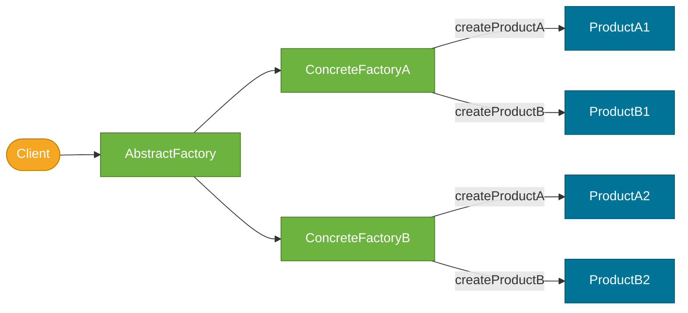

# Abstract Factory Pattern

> A creational design pattern that provides an interface for creating **families of related objects** without specifying their concrete classes.

## What Problem Does It Solve?

Imagine building a cross-platform UI framework. You have buttons and checkboxes, and you support Windows, macOS, and Linux. With the Factory Method pattern you could create a `ButtonFactory` — but then you also need a separate `CheckboxFactory`, a `TextFieldFactory`, and so on. The problem: nothing guarantees that a Windows button is paired with a Windows checkbox. A client could accidentally mix a Windows button with a macOS checkbox — inconsistent look and behavior.

The Abstract Factory pattern solves this by grouping the factories together. One `WindowsUIFactory` creates *all* Windows widgets, and one `MacOSUIFactory` creates *all* macOS widgets. You swap the whole factory, not individual creators.

If Factory Method is *"give me a transport"*, Abstract Factory is *"give me an entire fleet of transports that all belong to the same brand"*.

## What Is It?

The Abstract Factory pattern defines:

- An **AbstractFactory** interface with a creation method for **each product** in the family.
- **ConcreteFactory** classes that implement `AbstractFactory` and create a consistent family of products.
- **AbstractProduct** interfaces for each product type.
- **ConcreteProduct** classes — actual implementations.

The client is programmed entirely against the `AbstractFactory` and `AbstractProduct` interfaces. Swapping the concrete factory changes the entire product family.

## How It Works


*The client uses the AbstractFactory interface. Swapping ConcreteFactoryA for ConcreteFactoryB changes the entire product family — all products remain internally consistent.*

**Steps:**
1. Client receives (or creates) a `ConcreteFactory` — usually injected at startup via config.
2. Client calls `factory.createButton()`, `factory.createCheckbox()` etc.
3. Each call returns the *same-brand* `ConcreteProduct`.
4. Client uses every product through its abstract interface — never knowing the concrete type.

## Code Examples

### Notification Channel Factory (Email vs SMS family)

```java
// ── Abstract Products ──────────────────────────────────────────────────

public interface MessageSender {
    void send(String to, String body);
}

public interface DeliveryTracker {
    String getStatus(String messageId);
}

// ── Abstract Factory ───────────────────────────────────────────────────

public interface NotificationFactory {
    MessageSender createSender();
    DeliveryTracker createTracker();
}

// ── Concrete Products — Email family ───────────────────────────────────

public class EmailSender implements MessageSender {
    public void send(String to, String body) {
        System.out.println("Email → " + to + ": " + body);
    }
}

public class EmailTracker implements DeliveryTracker {
    public String getStatus(String messageId) { return "email-delivered"; }
}

// ── Concrete Products — SMS family ─────────────────────────────────────

public class SmsSender implements MessageSender {
    public void send(String to, String body) {
        System.out.println("SMS → " + to + ": " + body);
    }
}

public class SmsTracker implements DeliveryTracker {
    public String getStatus(String messageId) { return "sms-sent"; }
}

// ── Concrete Factories ─────────────────────────────────────────────────

public class EmailNotificationFactory implements NotificationFactory {
    public MessageSender createSender()   { return new EmailSender(); }  // ← always email family
    public DeliveryTracker createTracker(){ return new EmailTracker(); }
}

public class SmsNotificationFactory implements NotificationFactory {
    public MessageSender createSender()   { return new SmsSender(); }    // ← always SMS family
    public DeliveryTracker createTracker(){ return new SmsTracker(); }
}

// ── Client ─────────────────────────────────────────────────────────────

public class NotificationService {
    private final MessageSender sender;
    private final DeliveryTracker tracker;

    public NotificationService(NotificationFactory factory) { // ← receives factory, not products
        this.sender  = factory.createSender();
        this.tracker = factory.createTracker();
    }

    public void sendAndTrack(String recipient, String msg, String id) {
        sender.send(recipient, msg);
        System.out.println("Status: " + tracker.getStatus(id));
    }
}

// ── Bootstrap — swap factory to change channel ─────────────────────────
NotificationFactory factory = new EmailNotificationFactory(); // ← change to SmsNotificationFactory for SMS
NotificationService svc = new NotificationService(factory);
svc.sendAndTrack("alice@example.com", "Order shipped!", "MSG-001");
```

### Spring Configuration — Abstract Factory with Profiles

In Spring Boot, `@Profile` is the runtime equivalent of swapping concrete factories:

```java
@Configuration
@Profile("email")                          // ← active when spring.profiles.active=email
public class EmailFactoryConfig {

    @Bean public MessageSender messageSender()     { return new EmailSender(); }
    @Bean public DeliveryTracker deliveryTracker() { return new EmailTracker(); }
}

@Configuration
@Profile("sms")                            // ← active when spring.profiles.active=sms
public class SmsFactoryConfig {

    @Bean public MessageSender messageSender()     { return new SmsSender(); }
    @Bean public DeliveryTracker deliveryTracker() { return new SmsTracker(); }
}

// The NotificationService bean below works with EITHER profile
@Service
public class NotificationService {
    @Autowired private MessageSender sender;    // ← injected from whichever profile is active
    @Autowired private DeliveryTracker tracker;
}
```

:::tip
This is the Abstract Factory pattern in Spring idiom — `@Profile` or `@Conditional` selects the concrete factory (configuration class), and the service bean is blissfully unaware of which family it got.
:::

## Trade-offs & When To Use / Avoid

| | Pros | Cons |
|--|------|------|
| **Abstract Factory** | Guarantees product family consistency; client is fully decoupled from concrete classes | Adding a new product type requires changing the AbstractFactory interface *and* all concrete factories |
| **vs Factory Method** | Handles multiple coordinated product types | More complex setup; overkill for a single product type |
| **vs DI container** | Pure OOP, no framework required | Spring's `@Profile`/`@Conditional` handles this pattern natively — often more practical |

**When to use:**
- You have *families* of related objects that must be used together (UI themes, cloud provider SDKs, testing vs production infra).
- You need to guarantee internal consistency between products (don't mix products from different families).
- You want to swap the entire infrastructure layer (e.g., switch from AWS S3 + SQS to GCP Storage + Pub/Sub) by changing one class.

**When to avoid:**
- When you have only one product type — Factory Method is sufficient.
- In Spring applications the IoC container + profiles/conditions does this more fluently.

## Common Pitfalls

- **Confusing with Factory Method** — Factory Method creates *one product*; Abstract Factory creates *a family of related products*. The key difference is that Abstract Factory has **multiple creation methods**, one per product type.
- **Interface explosion on adding a product** — adding a new product type (e.g., `createScrollBar()`) requires updating every concrete factory. Plan your product family upfront.
- **Over-using when products aren't truly a family** — if the products don't actually need to be consistent with each other, Abstract Factory adds complexity for no benefit.

## Interview Questions

### Beginner

**Q:** What is the difference between Factory Method and Abstract Factory?
**A:** Factory Method defines one creation method and lets subclasses decide the concrete type (one product). Abstract Factory defines multiple creation methods for a *family* of related products and ensures all products come from the same family. Think: Factory Method = one product; Abstract Factory = a coordinated product suite.

### Intermediate

**Q:** How does Spring Boot's `@Profile` relate to the Abstract Factory pattern?
**A:** A `@Configuration` class annotated with `@Profile("email")` acts as a concrete factory that wires up the entire email product family. Switching profiles swaps the concrete factory, and all downstream beans receive consistent implementations — exactly the Abstract Factory pattern in Spring idiom.

### Advanced

**Q:** What is the main extensibility limitation of Abstract Factory, and how do you mitigate it?
**A:** Adding a new product type (e.g., adding `createPushSender()` to `NotificationFactory`) requires modifying the abstract interface and every concrete factory — it violates Open/Closed for the factory hierarchy. Mitigations include: using default interface methods with a sensible `null`/no-op return, decomposing into smaller focused factory interfaces (Interface Segregation Principle), or choosing a more flexible approach like a DI container with named beans.

## Further Reading

- [Abstract Factory — Refactoring Guru](https://refactoring.guru/design-patterns/abstract-factory) — clear UML and Java examples
- [Abstract Factory in Java — Baeldung](https://www.baeldung.com/java-abstract-factory-pattern) — practical multi-family example

## Related Notes

- [Factory Method Pattern](./factory-method-pattern.md) — the simpler single-product factory; prerequisite before reading Abstract Factory.
- [Strategy Pattern](./strategy-pattern.md) — also uses interface injection to vary behavior; Abstract Factory varies *creation*, Strategy varies *algorithm*.
- [Singleton Pattern](./singleton-pattern.md) — concrete factories are often Singletons since they hold no state.
