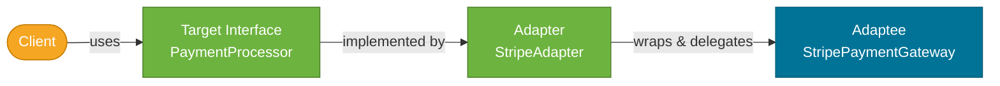
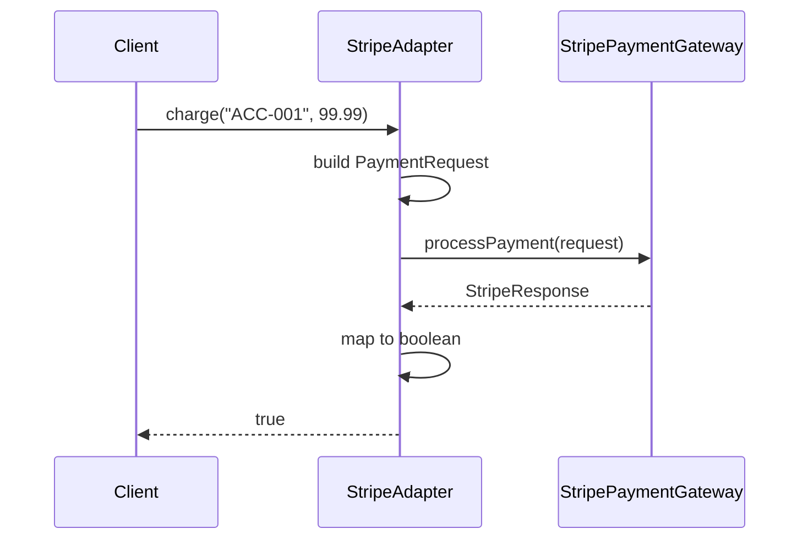

# Adapter Pattern

> A structural design pattern that converts the interface of a class into another interface that clients expect, allowing incompatible classes to work together.

## What Problem Does It Solve?

You're integrating a third-party payment library — `StripePaymentGateway` — into your application. Your system expects a `PaymentProcessor` interface with a `charge(String accountId, BigDecimal amount)` method. But Stripe's API has `processPayment(PaymentRequest request)` with a completely different signature and object model.

You can't change Stripe's library (third-party). Changing your own `PaymentProcessor` interface would break every existing implementation. You need a **translation layer** — something that speaks both languages.

That translation layer is the Adapter. It wraps `StripePaymentGateway` and exposes the `PaymentProcessor` interface, translating calls as they pass through.

## Analogy

Think of a power plug adapter when travelling internationally. Your laptop has a US two-prong plug (the *adaptee*). The European socket expects a different shape (the *target* interface). The plastic adapter converts the plug shape — your laptop doesn't change, the wall doesn't change, and you get electricity.

## What Is It?

The Adapter pattern has three participants:

| Role | Description |
|------|-------------|
| **Target** | The interface your client code expects |
| **Adaptee** | The existing class with an incompatible interface |
| **Adapter** | Implements `Target`, wraps `Adaptee`, translates calls |

Two variants exist:
- **Object Adapter** — wraps the adaptee via *composition* (recommended; more flexible).
- **Class Adapter** — extends the adaptee via *inheritance* (requires concrete adaptee; less flexible).

## How It Works


*The Client sees only the Target interface. The Adapter translates each Target method call into the Adaptee's API.*


*Call translation: the Adapter reshapes both the input (builds PaymentRequest) and the output (maps StripeResponse) for the client.*

## Code Examples

:::tip Practical Demo
See [Adapter Pattern Demo](./demo/adapter-pattern-demo.md) for five runnable examples — object adapter, legacy service bridge, two-way log adapter, and Spring `@Profile`-based adapter.
:::

### Object Adapter (Composition — Preferred)

```java
// ── Target interface (what our system expects) ──────────────────────

public interface PaymentProcessor {
    boolean charge(String accountId, BigDecimal amount);
}

// ── Adaptee (third-party library — we cannot modify this) ───────────

public class StripePaymentGateway {
    public StripeResponse processPayment(PaymentRequest request) {
        // calls Stripe REST API...
        return new StripeResponse("ch_001", "SUCCESS");
    }
}

// ── Adapter ──────────────────────────────────────────────────────────

public class StripePaymentAdapter implements PaymentProcessor { // ← implements Target

    private final StripePaymentGateway stripe;                  // ← wraps Adaptee

    public StripePaymentAdapter(StripePaymentGateway stripe) {
        this.stripe = stripe;
    }

    @Override
    public boolean charge(String accountId, BigDecimal amount) {
        // ← translate Target interface to Adaptee's API
        PaymentRequest request = new PaymentRequest(accountId, amount.doubleValue(), "USD");
        StripeResponse response = stripe.processPayment(request);
        return "SUCCESS".equals(response.getStatus());          // ← translate result
    }
}

// ── Client ────────────────────────────────────────────────────────────

PaymentProcessor processor = new StripePaymentAdapter(new StripePaymentGateway());
boolean ok = processor.charge("ACC-001", new BigDecimal("99.99"));
```

### Spring Dependency Injection — Adapter Makes Legacy Services Injectable

```java
// Legacy XML-based service cannot be refactored
public class LegacyXmlReportService {
    public String generateXmlReport(String[] data, String format) { /* ... */ return "<report/>"; }
}

// Modern interface — what Spring services expect
public interface ReportService {
    String generateReport(List<String> data);
}

// Adapter — bridges legacy and modern
@Component
public class LegacyReportAdapter implements ReportService {

    private final LegacyXmlReportService legacy = new LegacyXmlReportService();

    @Override
    public String generateReport(List<String> data) {
        return legacy.generateXmlReport(data.toArray(String[]::new), "DEFAULT");
    }
}

// Spring Boot service — only knows ReportService
@Service
public class DashboardService {
    @Autowired
    private ReportService reportService;  // ← gets LegacyReportAdapter injected
}
```

### Java Standard Library Examples

```java
// Arrays.asList — adapts an array to the List interface
List<String> list = Arrays.asList("a", "b", "c");

// Collections.enumeration — adapts an Iterator to the legacy Enumeration interface
Enumeration<String> e = Collections.enumeration(list);

// InputStreamReader — adapts a byte-based InputStream to a character-based Reader
Reader reader = new InputStreamReader(System.in, StandardCharsets.UTF_8);
```

:::info
`InputStreamReader` is one of the most important JDK adapters: it bridges the `InputStream` (byte-stream) world to the `Reader` (character-stream) world — adapting the byte interface to the character interface.
:::

### Class Adapter (via Inheritance — Less Common)

```java
// Class Adapter — extends Adaptee instead of wrapping it
// Only possible when Adaptee is a concrete (non-final) class
public class StripeClassAdapter extends StripePaymentGateway implements PaymentProcessor {

    @Override
    public boolean charge(String accountId, BigDecimal amount) {
        PaymentRequest request = new PaymentRequest(accountId, amount.doubleValue(), "USD");
        StripeResponse response = this.processPayment(request); // ← calls inherited method
        return "SUCCESS".equals(response.getStatus());
    }
}
```

:::warning
Avoid Class Adapter when possible. It binds you to `StripePaymentGateway`'s implementation details and prevents using a different Adaptee instance or mocking `StripePaymentGateway` in tests.
:::

## Trade-offs & When To Use / Avoid

| | Pros | Cons |
|--|------|------|
| **Object Adapter** | Flexible; works with subclasses of Adaptee; easy to mock in tests | Requires a wrapper class per adaptee |
| **Class Adapter** | No indirection via composition | Ties you to one concrete Adaptee; breaks encapsulation |

**When to use:**
- Integrating third-party or legacy code that doesn't match your interface contract.  
- When you can't (or shouldn't) modify the adaptee (third-party, sealed, generated code).
- Making old code work in a new DI context (Spring beans from legacy services).

**When to avoid:**
- When you *can* modify the adaptee directly — just update the interface.
- When the adaptation is so complex that it hides important behavior — consider redesigning the interface instead.

## Common Pitfalls

- **Adapter vs Facade confusion** — Adapter makes one interface look like *another existing* interface (1:1 translation). Facade simplifies *multiple* interfaces behind one simplified API. Different intent.
- **Adapter vs Decorator confusion** — Adapter changes the interface; Decorator keeps the interface the same but adds behavior.
- **Leaking adaptee types** — if `charge()` throws `StripeException`, the adapter should translate that to your own exception type, not let the adaptee's exception leak into client code.
- **Too many adapters** — if every service needs an adapter, your interfaces may be poorly designed. Revisit the interface design first.

## Interview Questions

### Beginner

**Q:** What is the Adapter pattern and when would you use it?
**A:** It translates one interface into another so incompatible classes can work together. You'd use it when integrating a third-party library or legacy service that has a different method signature or object model than your system expects.

**Q:** What is the difference between object adapter and class adapter?
**A:** Object adapter wraps the adaptee via *composition* — it holds a reference to the adaptee. Class adapter extends the adaptee via *inheritance*. Object adapter is preferred because it's more flexible and allows mocking the adaptee.

### Intermediate

**Q:** How does Adapter differ from Decorator?
**A:** Both wrap an object, but Adapter converts an **incompatible interface** into a compatible one (interface translation), while Decorator wraps a **compatible interface** to add new behavior (without changing the interface). Adapter is about interface compatibility; Decorator is about behavior extension.

**Q:** Name two places in the JDK where Adapter is used.
**A:** `InputStreamReader` adapts `InputStream` (bytes) to `Reader` (characters). `Arrays.asList()` adapts an array to the `List` interface. `Collections.enumeration()` adapts a `Collection` iterator to the legacy `Enumeration` interface.

### Advanced

**Q:** How would you design an Adapter that handles exception translation?
**A:** The Adapter should catch the adaptee's exceptions (which may be third-party checked or runtime exceptions with implementation-specific messages) and translate them into your domain exceptions:
```java
public boolean charge(String accountId, BigDecimal amount) {
    try {
        StripeResponse r = stripe.processPayment(buildRequest(accountId, amount));
        return "SUCCESS".equals(r.getStatus());
    } catch (StripeApiException e) {                            // ← adaptee exception
        throw new PaymentException("Stripe charge failed: " + e.getCode(), e); // ← domain exception
    }
}
```
This prevents the adaptee's internals from leaking through the Target interface.

## Further Reading

- [Adapter Pattern — Refactoring Guru](https://refactoring.guru/design-patterns/adapter) — illustrated walkthrough with real-world analogy and Java
- [Adapter Pattern in Java — Baeldung](https://www.baeldung.com/java-adapter-pattern) — practical examples with class and object adapter variants

## Related Notes

- [Decorator Pattern](./decorator-pattern.md) — often confused with Adapter; both wrap objects, but Decorator adds behavior while Adapter changes the interface.
- [Facade Pattern](./facade-pattern.md) — also simplifies access to complex code, but unifies *multiple* interfaces into one, rather than translating one interface into another.
- [Proxy Pattern](./proxy-pattern.md) — another wrapper pattern; Proxy controls access to the same interface, while Adapter exposes a different interface.
