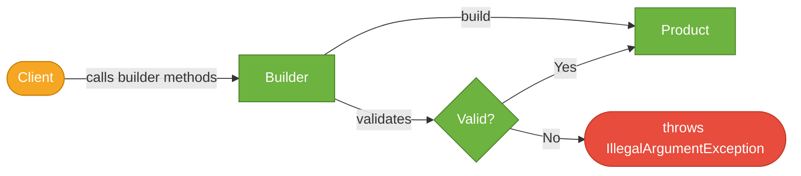

# Builder Pattern

> A creational design pattern that constructs complex objects step-by-step, separating construction logic from the final object representation.

## What Problem Does It Solve?

Imagine a `User` class with 10 fields: `firstName`, `lastName`, `email`, `phone`, `address`, `age`, `role`, `isActive`, `createdAt`, `preferences`. How do you create instances of this class?

**Option 1 — telescoping constructors**: `new User(firstName, lastName, email, phone, null, 25, "ADMIN", true, null, null)`. Unreadable. What does the 4th `null` mean? Easy to swap argument order by mistake.

**Option 2 — setters**: `user.setEmail(...)`, `user.setPhone(...)`. Now the object exists in an *incomplete*, potentially invalid state between calls — a problem in multithreaded code or when validation must hold at all times.

The Builder pattern solves both problems: it provides a fluent, readable API for assembling a complex object, and only produces a fully-constructed, validated, immutable object at the end via a `build()` call.

## What Is It?

The Builder pattern separates the *construction* of an object from the object itself. A separate `Builder` class (usually a static inner class) accumulates configuration step-by-step and then creates the target object in one shot.

In Java, this appears in three forms:
1. **Classic GoF Builder**: A `Director` drives construction using an abstract `Builder` interface — useful when the same construction process must produce different types.
2. **Item-21 Effective Java Builder**: A static inner `Builder` class — the dominant Java idiom for complex value objects.
3. **Lombok `@Builder`**: Generates the Effective Java builder automatically — used in almost all Spring Boot projects.

## How It Works


*Client configures the Builder step-by-step. `build()` validates and produces the immutable Product.*

**Construction flow:**
1. Client calls `new Product.Builder()` (or `Product.builder()` with Lombok).
2. Client chains setter-style methods: `.field1(val).field2(val)…`.
3. Client calls `.build()`.
4. Builder validates required fields and constraints.
5. Builder passes all accumulated values into the `Product` private constructor.
6. A fully-constructed `Product` is returned.

## Code Examples

:::tip Practical Demo
See [Builder Pattern Demo](./demo/builder-pattern-demo.md) for five runnable examples — from the classic Effective Java idiom to Lombok `@Builder` to a Director-driven preset builder.
:::

### Effective Java Builder (Classic Idiom)

```java
public final class UserProfile {

    // All fields are final — object is immutable after build()
    private final String firstName;
    private final String lastName;
    private final String email;
    private final String phone;     // optional
    private final int age;

    private UserProfile(Builder builder) {  // ← private; only Builder can construct
        this.firstName = builder.firstName;
        this.lastName  = builder.lastName;
        this.email     = builder.email;
        this.phone     = builder.phone;
        this.age       = builder.age;
    }

    public String getEmail() { return email; }
    // ...other getters

    public static class Builder {

        // Required fields
        private final String firstName;
        private final String email;

        // Optional fields — with sensible defaults
        private String lastName = "";
        private String phone    = null;
        private int    age      = 0;

        public Builder(String firstName, String email) {  // ← required fields in constructor
            this.firstName = firstName;
            this.email     = email;
        }

        public Builder lastName(String val) { this.lastName = val; return this; }  // ← returns this for chaining
        public Builder phone(String val)    { this.phone    = val; return this; }
        public Builder age(int val)         { this.age      = val; return this; }

        public UserProfile build() {
            if (email == null || !email.contains("@"))
                throw new IllegalArgumentException("Invalid email");  // ← validation before construction
            return new UserProfile(this);
        }
    }
}

// Usage — reads like a sentence
UserProfile user = new UserProfile.Builder("Alice", "alice@example.com")
        .lastName("Smith")
        .age(30)
        .phone("+1-555-0100")
        .build();
```

### Lombok `@Builder` (Spring Boot Projects)

```java
import lombok.Builder;
import lombok.Value;

@Value          // ← makes all fields final, generates getters, equals, hashCode, toString
@Builder        // ← generates the static Builder inner class automatically
public class UserProfile {
    String firstName;
    String lastName;
    String email;
    String phone;
    int age;
}

// Usage — identical to the manual version
UserProfile user = UserProfile.builder()
        .firstName("Alice")
        .email("alice@example.com")
        .lastName("Smith")
        .age(30)
        .build();
```

:::tip
In Spring Boot projects, `@Builder` + `@Value` (or `@Data`) from Lombok is the standard. Save the manual idiom for cases where custom validation in `build()` is needed.
:::

### Builder with Validation

```java
@Builder
public class HttpRequest {
    private final String method;
    private final String url;
    private final Map<String, String> headers;
    private final String body;

    // Lombok @Builder can be customized by adding a static inner class
    public static class HttpRequestBuilder {
        public HttpRequest build() {
            if (method == null) throw new IllegalStateException("method is required");
            if (url == null || url.isBlank()) throw new IllegalStateException("url is required");
            if (headers == null) headers = new HashMap<>(); // ← default
            return new HttpRequest(method, url, headers, body);
        }
    }
}
```

### GoF Director Builder (Multiple Representations)

```java
interface QueryBuilder {
    QueryBuilder select(String... columns);
    QueryBuilder from(String table);
    QueryBuilder where(String condition);
    String build();
}

class SqlQueryBuilder implements QueryBuilder {
    private final StringBuilder sb = new StringBuilder();
    public QueryBuilder select(String... cols) { sb.append("SELECT ").append(String.join(", ", cols)); return this; }
    public QueryBuilder from(String table) { sb.append(" FROM ").append(table); return this; }
    public QueryBuilder where(String cond) { sb.append(" WHERE ").append(cond); return this; }
    public String build() { return sb.toString(); }
}

// Director — encapsulates a fixed construction sequence
class QueryDirector {
    public String buildUserQuery(QueryBuilder builder) {
        return builder.select("id", "name", "email")
                      .from("users")
                      .where("active = true")
                      .build();
    }
}

// Different builders produce different output formats (SQL, NoSQL query DSL, etc.)
String sql = new QueryDirector().buildUserQuery(new SqlQueryBuilder());
// → "SELECT id, name, email FROM users WHERE active = true"
```

## Trade-offs & When To Use / Avoid

| | Pros | Cons |
|--|------|------|
| **Builder** | Readable construction; enforces valid state at build time; supports immutability | More boilerplate than simple POJOs (mitigated by Lombok); slight overhead of extra object |
| **vs Telescoping constructors** | Eliminates unreadable parameter lists; order doesn't matter | — |
| **vs Setters** | Object can be immutable; validation centralized in `build()` | Can't mutate after construction (intentional) |

**When to use Builder:**
- Classes with 4+ fields, especially when many are optional.
- Value objects / DTOs that should be immutable.
- Test data creation (`UserProfile.builder().email("test@x.com").build()`).
- Any object requiring validated, consistent state at construction time.

**When to avoid:**
- Simple classes with 1–3 fields — a constructor is cleaner.
- Mutable domain entities that are updated incrementally by the ORM (use setters + JPA lifecycle).

## Common Pitfalls

- **Forgetting `return this;`** in a manual builder method — breaks the fluent chain, compile error caught quickly.
- **Mutable fields in `@Value` with `@Builder`** — if you add a `List` field without `@Singular`, Lombok will share the reference. Use `@Singular` for collection fields or copy defensively.
- **Lomboks `@Builder` and JPA** — `@Entity` classes need a no-args constructor (JPA requirement). `@Builder` only generates an all-args constructor. Add `@NoArgsConstructor` + `@AllArgsConstructor` alongside `@Builder`.
- **Missing required-field validation** — Lombok's generated `build()` doesn't validate. Override the `build()` method in a custom inner-class extension to add validation.
- **Thread safety misconception** — a `Builder` instance is **not** thread-safe. Don't share a `Builder` across threads. The *built object* can be safely published if it's immutable.

## Interview Questions

### Beginner

**Q:** What is the Builder pattern and what problem does it solve?
**A:** Builder is a creational pattern that constructs complex objects step-by-step via a fluent API. It solves the "telescoping constructor" problem — classes with many optional fields — and ensures the object is only created when all required input is provided and valid.

**Q:** What does `return this` do in a builder method?
**A:** It returns the builder itself, enabling method chaining (`.name("Alice").age(30).build()`). Without it, each setter call would return `void` and you couldn't chain.

### Intermediate

**Q:** How do you add validation to a Lombok `@Builder`?
**A:** Override the generated `build()` method inside a custom inner class named `<ClassName>Builder`. Lombok will merge your implementation with the generated code:
```java
public static class UserBuilder {
    public User build() {
        if (email == null) throw new IllegalArgumentException("email required");
        return new User(firstName, email);
    }
}
```

**Q:** Why is Builder preferred over setters for immutable objects?
**A:** Setters require fields to be non-final and leave the object in a partially constructed state between calls. Builder accumulates all configuration, validates once, then calls a private constructor — the resulting object is fully initialized and can have `final` fields.

### Advanced

**Q:** How does Builder differ from the GoF Director-Builder pattern versus the Effective Java inner-class Builder?
**A:** The GoF Director-Builder has an abstract `Builder` interface and a separate `Director` class that drives construction — useful when the same algorithm must produce different product types. The Effective Java idiom (and Lombok) uses a static inner `Builder` tied to one specific class, optimized for readability and immutability. Spring projects almost exclusively use the Effective Java / Lombok variant.

**Follow-up:** How do you handle inheritance with Lombok `@Builder`?
**A:** `@Builder` does not work well out of the box with class inheritance. The recommended approaches are: use `@SuperBuilder` (Lombok 1.18.2+), which generates builder hierarchies for parent and child classes; or use composition over inheritance for value objects.

## Further Reading

- [Builder Pattern — Refactoring Guru](https://refactoring.guru/design-patterns/builder) — clear diagrams and Java examples
- [Lombok @Builder Guide — Baeldung](https://www.baeldung.com/java-builder-pattern-and-lombok) — practical Lombok integration with Spring Boot
- [Effective Java, Item 2 — Consider a builder when faced with many constructor parameters](https://www.baeldung.com/java-builder-pattern) — the canonical Java builder idiom

## Related Notes

- [Singleton Pattern](./singleton-pattern.md) — another creational pattern; often Singleton configuration holders are built with the Builder pattern.
- [Factory Method Pattern](./factory-method-pattern.md) — Factory creates one of several types; Builder assembles one complex type step-by-step. Often confused in interviews.
- [Java Evolution](../java-evolution/index.md) — Java 16+ records are an alternative to Builder for simple immutable value objects; records don't need a Builder for small field counts.
