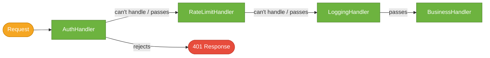
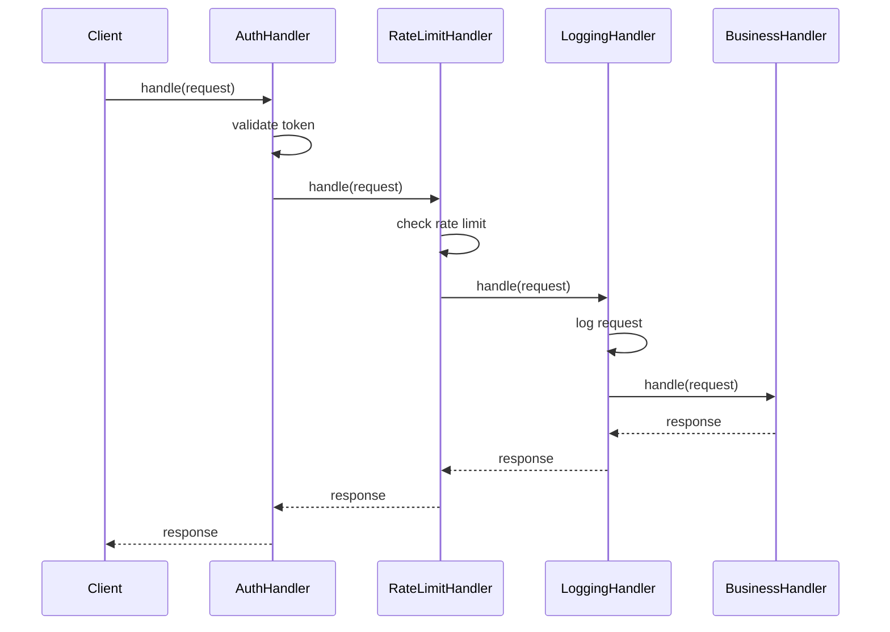

# Chain of Responsibility Pattern

> A behavioral design pattern that lets requests travel along a **chain of handlers**. Each handler decides whether to process the request or pass it to the next handler in the chain.

## What Problem Does It Solve?

An HTTP request arrives at a web application and must pass through authentication, authorization, rate-limiting, logging, and finally the business logic. If a single `RequestProcessor` handles all of this, it grows into a 500-line class. Adding a new concern (e.g., request deduplication) requires modifying it. Reordering steps requires carefully reorganizing the method body.

More broadly: when a request must pass through multiple processing stages — where each stage can handle, modify, or reject the request — hardcoding a sequence of if-checks in one class is rigid and hard to maintain.

Chain of Responsibility solves this by linking handlers in sequence. Each handler knows only the next handler. Each processes only what it's responsible for. You add, remove, or reorder handlers by changing the chain construction — not the handlers themselves.

## What Is It?

| Role | Description |
|------|-------------|
| **Handler** | Interface (or abstract class) declaring `handle(request)` and a reference to the next handler |
| **ConcreteHandler** | Processes requests it can handle; forwards the rest to `nextHandler.handle(request)` |
| **Client** | Builds the chain and submits requests to the first handler |

Two variants:
- **Stopping chain** — a handler that can handle the request *stops* the chain (e.g., an auth filter that returns 401 before the business logic runs).
- **Passing chain** — every handler processes the request and passes it forward (e.g., Spring's `Filter` chain where each filter adds/reads headers and then continues).

## How It Works


*Request enters the chain. Each handler either processes (and optionally stops) or passes to the next. AuthHandler can short-circuit the chain with a 401.*


*Each handler processes its concern and passes the request inward (and the response outward). Request and response flow through every handler in sequence.*

## Code Examples

### Middleware Pipeline (Core CoR)

```java
// ── Handler interface ──────────────────────────────────────────────────
public abstract class RequestHandler {

    protected RequestHandler next; // ← reference to the next handler in the chain

    public RequestHandler setNext(RequestHandler next) {
        this.next = next;
        return next; // ← fluent — allows chaining: h1.setNext(h2).setNext(h3)
    }

    public abstract void handle(HttpRequest request, HttpResponse response);
}

// ── Concrete Handlers ─────────────────────────────────────────────────

public class AuthHandler extends RequestHandler {
    @Override
    public void handle(HttpRequest request, HttpResponse response) {
        String token = request.getHeader("Authorization");

        if (token == null || !jwtService.isValid(token)) {
            response.setStatus(401);
            response.setBody("Unauthorized");
            return; // ← STOPS the chain — no next handler called
        }

        if (next != null) next.handle(request, response); // ← PASSES to next
    }
}

public class RateLimitHandler extends RequestHandler {
    private final RateLimiter limiter = RateLimiter.create(100); // 100 req/sec

    @Override
    public void handle(HttpRequest request, HttpResponse response) {
        if (!limiter.tryAcquire()) {
            response.setStatus(429);
            response.setBody("Too Many Requests");
            return; // ← STOPS chain if rate exceeded
        }
        if (next != null) next.handle(request, response);
    }
}

public class LoggingHandler extends RequestHandler {
    @Override
    public void handle(HttpRequest request, HttpResponse response) {
        System.out.println("→ " + request.getMethod() + " " + request.getPath());
        if (next != null) next.handle(request, response); // ← always passes
        System.out.println("← " + response.getStatus());
    }
}

public class BusinessHandler extends RequestHandler {
    @Override
    public void handle(HttpRequest request, HttpResponse response) {
        // Process the actual business request
        response.setStatus(200);
        response.setBody(orderService.process(request));
        // ← end of chain; no next handler
    }
}

// ── Build the chain ────────────────────────────────────────────────────
RequestHandler auth    = new AuthHandler();
RequestHandler rate    = new RateLimitHandler();
RequestHandler logging = new LoggingHandler();
RequestHandler biz     = new BusinessHandler();

auth.setNext(rate)          // ← fluent chain construction
    .setNext(logging)
    .setNext(biz);

// ── Submit request ─────────────────────────────────────────────────────
auth.handle(incomingRequest, response); // ← enter at first handler
```

### Functional Style with `List<Handler>` (Java 8+)

```java
@FunctionalInterface
public interface RequestMiddleware {
    boolean handle(HttpRequest request, HttpResponse response);
    // returns true = handled and should stop; false = pass to next
}

public class Pipeline {
    private final List<RequestMiddleware> handlers = new ArrayList<>();

    public Pipeline addHandler(RequestMiddleware h) { handlers.add(h); return this; }

    public void process(HttpRequest req, HttpResponse res) {
        for (RequestMiddleware handler : handlers) {
            if (handler.handle(req, res)) return; // ← stop if handled
        }
    }
}

Pipeline pipeline = new Pipeline()
    .addHandler((req, res) -> {  // Auth
        if (req.getHeader("Authorization") == null) { res.setStatus(401); return true; }
        return false;
    })
    .addHandler((req, res) -> {  // Logging
        System.out.println("Request: " + req.getPath());
        return false;            // always pass
    })
    .addHandler((req, res) -> {  // Business
        res.setStatus(200); res.setBody("OK");
        return true;
    });
```

### Spring Security Filter Chain

Spring Security's `FilterChainProxy` is the most prominent Java CoR implementation. Each `SecurityFilter` is a handler in the chain:

```java
// Spring's filter chain (simplified representation)
SecurityFilterChain filterChain = http
    .addFilterBefore(new CorsFilter(), UsernamePasswordAuthenticationFilter.class)
    .authorizeHttpRequests(auth -> auth
        .requestMatchers("/public/**").permitAll()
        .anyRequest().authenticated()
    )
    .sessionManagement(s -> s.sessionCreationPolicy(STATELESS))
    .build();
```


*Spring Security's filter chain processes every HTTP request. Each filter handles one security concern and calls `chain.doFilter()` to pass to the next.*

### Java's Logger Hierarchy — Another CoR

`java.util.logging.Logger` propagates log records up a parent logger chain until a handler is found or the root logger is reached — the Chain of Responsibility pattern applied to log routing.

## Trade-offs & When To Use / Avoid

| | Pros | Cons |
|--|------|------|
| **CoR** | Open/Closed — add/remove handlers without changing others; single responsibility per handler; configurable at runtime | Request may reach the end unhandled (silent failure); hard to trace which handler processed the request |
| **vs if/else chain** | Clean separation; each handler independently testable | More classes; chain construction is external |

**When to use:**
- Multi-stage request processing: HTTP filters, middleware pipelines, validation chains.
- Event handling where multiple objects might handle an event.
- When the set of handlers or their order needs to vary at runtime.

**When to avoid:**
- When exactly one specific handler should always process the request — direct delegation is clearer.
- Performance-critical paths with very long chains — each handler adds overhead.

## Common Pitfalls

- **Forgotten `next` call** — a handler that forgets to call `next.handle()` silently breaks the chain. All handlers after it are never called. Always intentionally choose: process-and-stop or process-and-pass.
- **Null `next` reference** — if the last handler calls `next.handle()` without null-checking, `NullPointerException`. Always guard: `if (next != null) next.handle(req, res)` or use a terminal `NoOpHandler`.
- **Unhandled requests** — if no handler in the chain processes the request, the caller gets no response or an empty result. Add a catch-all terminal handler at the end.
- **Circular chains** — accidentally linking H3 → H1 causes infinite recursion. Chains should only flow forward.

## Interview Questions

### Beginner

**Q:** What is the Chain of Responsibility pattern?
**A:** It passes a request along a chain of handlers. Each handler decides whether to process the request (and optionally stop the chain) or pass it to the next handler. This decouples the sender from the receiver and allows dynamic pipeline composition.

**Q:** Where is Chain of Responsibility used in Spring?
**A:** Spring Security's `FilterChainProxy` — each `SecurityFilter` is a handler. The Servlet API's `FilterChain` is another example. Spring's `HandlerInterceptor` chain in Spring MVC is also CoR.

### Intermediate

**Q:** What is the difference between a stopping chain and a passing chain?
**A:** A stopping chain — one handler processes the request and the chain ends (e.g., an auth filter returning 401, which stops all subsequent processing). A passing chain — every handler processes the request and always calls the next handler (e.g., Spring's filters all calling `chain.doFilter()` to pass processing forward).

**Q:** How does Chain of Responsibility support the Open/Closed Principle?
**A:** New handlers can be added to the chain without modifying existing handlers. Each handler is closed for modification (its logic doesn't change) but the chain is open for extension (new handlers can be inserted anywhere).

### Advanced

**Q:** How would you build a configurable, database-driven validation pipeline using Chain of Responsibility?
**A:** Define a `ValidationRule` interface. Store rule names and ordering in a database. At startup, load rules, resolve them to `@Component` beans by name (using Spring's `ApplicationContext.getBean(name, ValidationRule.class)`), and link them into a chain. New rules are added by inserting a new row in the database and implementing a new `@Component` — no code changes to existing rules or the pipeline builder.

## Further Reading

- [Chain of Responsibility — Refactoring Guru](https://refactoring.guru/design-patterns/chain-of-responsibility) — illustrated walkthrough with Java examples
- [Chain of Responsibility in Java — Baeldung](https://www.baeldung.com/chain-of-responsibility-pattern) — practical middleware and validation examples
- [Spring Security Filter Architecture](https://docs.spring.io/spring-security/reference/servlet/architecture.html#servlet-security-filters) — official docs on Spring's filter chain

## Related Notes

- [Decorator Pattern](./decorator-pattern.md) — both wrap operations in a chain; Decorator always passes to the wrapped object; CoR may stop the chain before reaching the end.
- [Command Pattern](./command-pattern.md) — commands are often passed along a chain (each handler decides if it can process the command).
- [Proxy Pattern](./proxy-pattern.md) — a Proxy intercepts all calls to one object; CoR routes a request through many handlers, each potentially stopping the flow.
