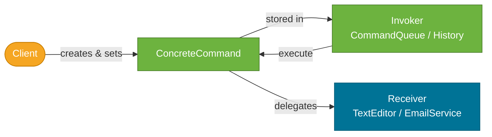

# Command Pattern

> A behavioral design pattern that encapsulates a request as a standalone **command object**, decoupling the sender of a request from the receiver that executes it.

## What Problem Does It Solve?

A text editor needs Ctrl+Z (undo). How does `UndoManager` know how to reverse a bold-text operation? Or a find-and-replace? Each operation is different — `UndoManager` can't hardcode knowledge of every possible action.

Similarly, a task scheduler needs to queue and execute operations at different times. How does it queue a "send email" job and a "generate report" job uniformly, without importing both service classes?

Both problems share a root cause: the invoker (UndoManager, Scheduler) needs to work with operations *abstractly* — without knowing their concrete type. The Command pattern solves this by boxing each operation into a `Command` object with a standard `execute()` (and optionally `undo()`) interface.

## What Is It?

The Command pattern has four participants:

| Role | Description |
|------|-------------|
| **Command** | Interface with `execute()` (and optionally `undo()`) |
| **ConcreteCommand** | Implements `Command`; holds the receiver reference and action parameters |
| **Receiver** | The object that knows how to do the actual work |
| **Invoker** | Triggers commands via `command.execute()`; may maintain command history for undo |

```
Invoker ──── command.execute() ──── ConcreteCommand ──── receiver.action()
                                           │
                                    (stores state for undo)
```

## How It Works


*Client creates the command and hands it to the Invoker. The Invoker doesn't know what the command does — it just calls execute(). The ConcreteCommand delegates the real work to the Receiver.*

## Code Examples

### Text Editor with Undo

```java
// ── Command interface ─────────────────────────────────────────────────
public interface TextCommand {
    void execute();
    void undo();   // ← optional but critical for undo support
}

// ── Receiver ───────────────────────────────────────────────────────────
public class TextDocument {
    private final StringBuilder content = new StringBuilder();

    public void insertText(int pos, String text) {
        content.insert(pos, text);
    }

    public void deleteText(int pos, int length) {
        content.delete(pos, pos + length);
    }

    public String getContent() { return content.toString(); }
}

// ── Concrete Commands ─────────────────────────────────────────────────
public class InsertTextCommand implements TextCommand {
    private final TextDocument doc;
    private final int position;
    private final String text;

    public InsertTextCommand(TextDocument doc, int position, String text) {
        this.doc      = doc;
        this.position = position;
        this.text     = text;
    }

    @Override
    public void execute() {
        doc.insertText(position, text);
    }

    @Override
    public void undo() {
        doc.deleteText(position, text.length()); // ← reverse the insert
    }
}

public class DeleteTextCommand implements TextCommand {
    private final TextDocument doc;
    private final int position;
    private final int length;
    private String deleted; // ← saved for undo

    public DeleteTextCommand(TextDocument doc, int position, int length) {
        this.doc      = doc;
        this.position = position;
        this.length   = length;
    }

    @Override
    public void execute() {
        deleted = doc.getContent().substring(position, position + length); // ← save before delete
        doc.deleteText(position, length);
    }

    @Override
    public void undo() {
        doc.insertText(position, deleted); // ← restore deleted text
    }
}

// ── Invoker — manages command history ─────────────────────────────────
public class CommandHistory {

    private final Deque<TextCommand> history = new ArrayDeque<>();

    public void executeCommand(TextCommand cmd) {
        cmd.execute();
        history.push(cmd);          // ← push to undo stack
    }

    public void undo() {
        if (!history.isEmpty()) {
            history.pop().undo();   // ← pop and reverse
        }
    }
}

// ── Usage ──────────────────────────────────────────────────────────────
TextDocument doc     = new TextDocument();
CommandHistory editor = new CommandHistory();

editor.executeCommand(new InsertTextCommand(doc, 0, "Hello"));
editor.executeCommand(new InsertTextCommand(doc, 5, " World"));
System.out.println(doc.getContent()); // → Hello World

editor.undo();
System.out.println(doc.getContent()); // → Hello

editor.undo();
System.out.println(doc.getContent()); // → (empty)
```

### Task Queue with Lambda Commands

Because `Command` often has a single `execute()` method, it's a `@FunctionalInterface` — you can use lambdas:

```java
@FunctionalInterface
public interface Task {
    void execute();
}

public class TaskQueue {
    private final Queue<Task> queue = new LinkedList<>();

    public void enqueue(Task task) { queue.add(task); }

    public void processAll() {
        while (!queue.isEmpty()) {
            queue.poll().execute();   // ← invoke each command
        }
    }
}

// Lambda commands — clean and concise
TaskQueue taskQueue = new TaskQueue();
taskQueue.enqueue(() -> emailService.sendNewsletter());
taskQueue.enqueue(() -> reportService.generateMonthlyReport());
taskQueue.enqueue(() -> analyticsService.exportLogs());

taskQueue.processAll();  // runs in order, zero knowledge of services
```

### Spring's `@Scheduled` and `Runnable` as Command

`Runnable` is Java's built-in Command interface — `run()` is `execute()`. Spring's `@Scheduled`, `ExecutorService`, and `CompletableFuture` all use `Runnable`/`Callable` as commands:

```java
// Runnable = Command, ExecutorService = Invoker, lambda = ConcreteCommand
ExecutorService executor = Executors.newFixedThreadPool(4);

executor.submit(() -> orderService.processOrder(orderId));   // ← command queued for async execution
executor.submit(() -> cacheService.warmUp());
```

### Spring Batch — Step as Command

Spring Batch's `Step` is a Command: each step encapsulates a discrete unit of work, the `Job` is the Invoker that executes steps in sequence, and steps can be restarted or skipped — a direct application of Command's ability to queue, track, and re-execute operations.

## Trade-offs & When To Use / Avoid

| | Pros | Cons |
|--|------|------|
| **Command** | Undo/redo support; queuing and scheduling; macro recording; simple Invoker code | Extra classes per operation; undo state management is complex for deep operations |
| **vs direct method calls** | Invoker decoupled from receiver; operations are first-class objects | More indirection; harder to follow the call flow |

**When to use:**
- Undo/redo functionality (editors, database migrations with rollback).
- Task queues and schedulers where operations are queued and executed later.
- Macro recording — record a sequence of commands to replay.
- Transactional operations that need rollback on failure.

**When to avoid:**
- Simple, one-off method calls with no need for undo/queue — direct calls are clearer.
- When `Runnable`/`Callable`/lambdas already satisfy your queuing needs without extra abstraction.

## Common Pitfalls

- **Not saving state for undo** — if `execute()` modifies data, `undo()` must know what the previous state was. Save the original value *before* executing, inside the command object.
- **Commands holding stale references** — if the Receiver (e.g., an entity) is mutated after the command is created but before it is executed, the command may act on stale data. Capture values at creation time, not references to mutable objects.
- **Unbounded command history** — storing every command for undo consumes memory. Limit history depth: `if (history.size() > MAX_HISTORY) history.removeLast()`.
- **Thread safety of queued commands** — if commands are queued in one thread and executed in another, ensure the command's captured state is safely published (use `final` fields or `volatile`).

## Interview Questions

### Beginner

**Q:** What is the Command pattern?
**A:** It encapsulates a request as an object, separating the invoker (who triggers the operation) from the receiver (who performs it). This enables queuing, logging, and undo/redo.

**Q:** How does `Runnable` relate to the Command pattern?
**A:** `Runnable` is Java's built-in Command interface — `run()` is the `execute()` method. When you submit a `Runnable` to an `ExecutorService`, the executor is the Invoker, and the lambda is the ConcreteCommand.

### Intermediate

**Q:** How do you implement undo in the Command pattern?
**A:** Add an `undo()` method to the Command interface. Each ConcreteCommand saves enough state in `execute()` to reverse the operation in `undo()`. An Invoker (CommandHistory) maintains a stack — `executeCommand()` pushes to the stack; `undo()` pops and calls `undo()` on the command.

**Q:** How does Spring Batch use the Command pattern?
**A:** Each `Step` in a `Job` is a ConcreteCommand. The `Job` (Invoker) calls `step.execute(stepExecution)` in sequence. Steps encapsulate a discrete chunk of work and support restart/skip — exactly the Command pattern's ability to queue, track, and re-execute operations.

### Advanced

**Q:** How would you implement a transactional command with rollback support?
**A:** Use Command for a database migration scenario: each command wraps a `forward` SQL and `rollback` SQL. Execute all commands in a list; if one fails, walk the history backwards calling `undo()` on each. For Spring: use `@Transactional` on the Invoker method so Spring's transaction manager handles rollback automatically if any step throws.

## Further Reading

- [Command Pattern — Refactoring Guru](https://refactoring.guru/design-patterns/command) — illustrated undo/redo walkthrough with Java
- [Command Design Pattern in Java — Baeldung](https://www.baeldung.com/java-command-pattern) — practical queue and undo examples

## Related Notes

- [Observer Pattern](./observer-pattern.md) — Observer broadcasts what happened; Command encapsulates what to do next. Often used together in event-driven systems.
- [Strategy Pattern](./strategy-pattern.md) — both encapsulate operations. Strategy varies an algorithm in a context; Command encapsulates a one-time operation for deferred execution.
- [Chain of Responsibility Pattern](./chain-of-responsibility-pattern.md) — a command can be passed along a chain of handlers until one processes it.
