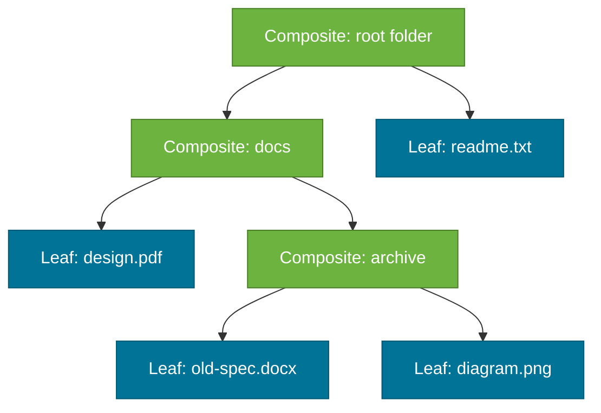
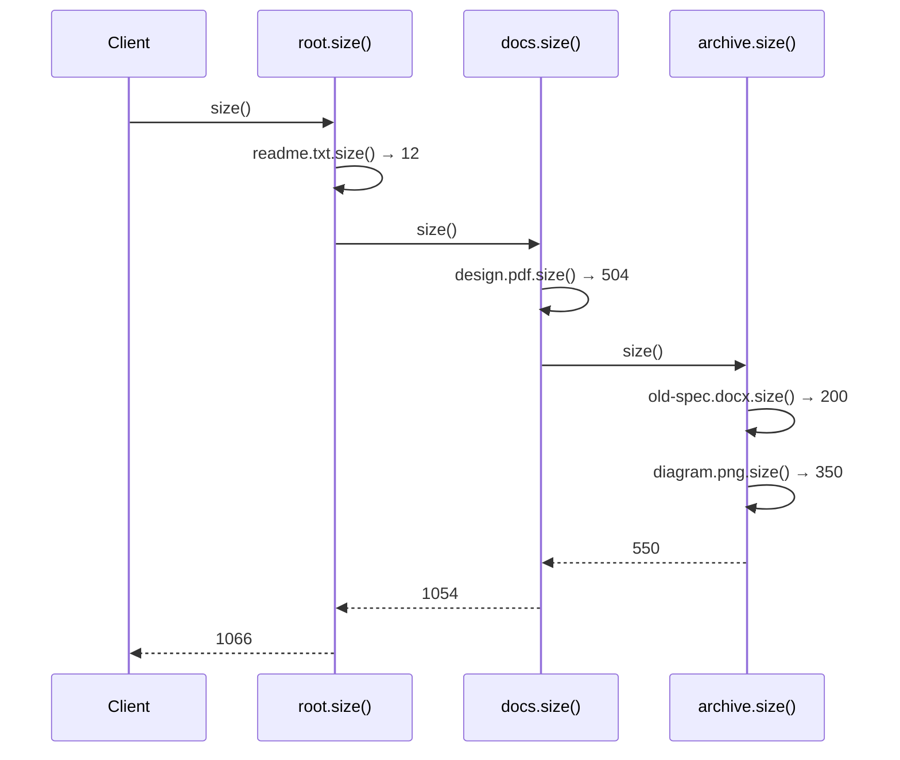

# Composite Pattern

> A structural design pattern that composes objects into tree structures to represent **part-whole hierarchies**, letting clients treat individual objects and groups of objects uniformly through a shared interface.

## What Problem Does It Solve?

Consider a file system: you have files and folders. A folder can contain files *and* other folders. Your app needs to calculate the total size of any node — whether it's a single file or a deeply nested folder. Without a unified model, your code becomes full of `instanceof` checks:

```java
if (node instanceof File) calculateFileSize((File) node);
else if (node instanceof Folder) calculateFolderSize((Folder) node); // recursive mess
```

The Composite pattern solves this by giving both `File` and `Folder` the same `Component` interface with a `size()` method. The `Folder` implementation of `size()` simply sums the `size()` of all its children (which may be files or folders). Client code never needs to know which kind of node it's dealing with.

## What Is It?

The Composite pattern has three participants:

| Role | Description |
|------|-------------|
| **Component** | Shared interface for both leaf and composite objects |
| **Leaf** | A single object with no children (File, MenuItem, Employee) |
| **Composite** | A container that holds child `Component` objects; implements operations by delegating to children |

## How It Works


*Tree structure: green nodes are Composites (folders); blue nodes are Leaves (files). Every node implements the same `Component` interface.*


*Recursive delegation: each Composite delegates to children; result is aggregated up the tree.*

## Code Examples

### File System Example

```java
// ── Component ─────────────────────────────────────────────────────────
public interface FileSystemNode {
    String getName();
    long getSizeKb();               // ← uniform operation on both leaves and composites
    void print(String indent);
}

// ── Leaf ─────────────────────────────────────────────────────────────
public class File implements FileSystemNode {
    private final String name;
    private final long sizeKb;

    public File(String name, long sizeKb) {
        this.name   = name;
        this.sizeKb = sizeKb;
    }

    @Override
    public String getName() { return name; }

    @Override
    public long getSizeKb() { return sizeKb; }   // ← leaf: just return own size

    @Override
    public void print(String indent) {
        System.out.println(indent + "📄 " + name + " (" + sizeKb + " KB)");
    }
}

// ── Composite ─────────────────────────────────────────────────────────
public class Folder implements FileSystemNode {
    private final String name;
    private final List<FileSystemNode> children = new ArrayList<>();  // ← child components

    public Folder(String name) { this.name = name; }

    public void add(FileSystemNode node)    { children.add(node); }
    public void remove(FileSystemNode node) { children.remove(node); }

    @Override
    public String getName() { return name; }

    @Override
    public long getSizeKb() {
        return children.stream()
                       .mapToLong(FileSystemNode::getSizeKb)  // ← delegates to each child
                       .sum();                                // ← aggregates result
    }

    @Override
    public void print(String indent) {
        System.out.println(indent + "📁 " + name + "/");
        children.forEach(child -> child.print(indent + "  ")); // ← recursive
    }
}

// ── Client ────────────────────────────────────────────────────────────
Folder root = new Folder("root");
root.add(new File("readme.txt", 12));

Folder docs = new Folder("docs");
docs.add(new File("design.pdf", 504));

Folder archive = new Folder("archive");
archive.add(new File("old-spec.docx", 200));
archive.add(new File("diagram.png", 350));
docs.add(archive);
root.add(docs);

root.print("");          // prints full tree
System.out.println("Total: " + root.getSizeKb() + " KB"); // → 1066 KB
```

### Menu System (Composite in UI Frameworks)

```java
public interface MenuComponent {
    String getName();
    void render(int depth);
}

public class MenuItem implements MenuComponent {
    private final String name;
    private final String url;
    public MenuItem(String name, String url) { this.name = name; this.url = url; }
    public String getName() { return name; }
    public void render(int depth) {
        System.out.println("  ".repeat(depth) + "- " + name + " → " + url);
    }
}

public class Menu implements MenuComponent {
    private final String name;
    private final List<MenuComponent> items = new ArrayList<>();

    public Menu(String name) { this.name = name; }
    public void add(MenuComponent item) { items.add(item); }
    public String getName() { return name; }

    public void render(int depth) {
        System.out.println("  ".repeat(depth) + "▶ " + name);
        items.forEach(item -> item.render(depth + 1));  // ← recursive rendering
    }
}

// Build a navigation menu
Menu nav = new Menu("Main Nav");
nav.add(new MenuItem("Home", "/"));

Menu shop = new Menu("Shop");
shop.add(new MenuItem("Electronics", "/shop/electronics"));
shop.add(new MenuItem("Clothing", "/shop/clothing"));
nav.add(shop);

nav.add(new MenuItem("Contact", "/contact"));
nav.render(0);
```

### Spring Security — Composite AuthorizationManager

Spring Security 5.7+ uses `CompositeAuthorizationManager` which chains multiple `AuthorizationManager` instances — the Composite pattern applied to authorization rules:

```java
// Conceptually:
AuthorizationManager<HttpServletRequest> composite = new CompositeAuthorizationManager(
    new IsAuthenticatedAuthorizationManager(),
    new RoleHierarchyAuthorizationManager("ROLE_ADMIN"),
    new RequestMatchingAuthorizationManager()
);
```

## Trade-offs & When To Use / Avoid

| | Pros | Cons |
|--|------|------|
| **Composite** | Treat leaves and composites uniformly; recursive operations are elegant | Adding operations requires changing the Component interface (which affects all leaves and composites) |
| **vs instanceof checks** | Eliminates `instanceof`; OCP-compliant for tree traversal | Component interface can become cluttered if leaf-only or composite-only operations need to be added |

**When to use:**
- Inherently tree-structured data: file systems, menus, org charts, HTML/XML DOM, expression trees.
- When you want to treat individual items and groups the same way.

**When to avoid:**
- Flat, non-hierarchical data — Composite adds complexity for no benefit.
- When leaf and composite objects have fundamentally different operations — the unified interface becomes awkward.

## Common Pitfalls

- **Putting `add()`/`remove()` in the Component interface** — forces Leaf to implement child management methods that are meaningless for it. Prefer transparent or safe Composite variants: either put `add/remove` only on `Composite`, or have Leaf throw `UnsupportedOperationException`.
- **Cyclic references** — if a composite is mistakenly added as its own child, recursive operations loop infinitely. Guard with identity checks: `if (child == this) throw new IllegalArgumentException`.
- **Shared mutable state in leaves** — if a `File` object is added to two different `Folder` composites, moving or renaming it has unexpected side effects. Ensure leaves are owned by only one parent, or use value objects.

## Interview Questions

### Beginner

**Q:** What is the Composite pattern and what kind of structure does it model?
**A:** It models tree (part-whole) hierarchies and lets you treat individual objects (leaves) and groups of objects (composites) through a shared interface. Classic examples: file system (files inside folders), menu items inside menus, employees in an org chart.

### Intermediate

**Q:** Where does the JDK or Spring use the Composite pattern?
**A:** The Java AWT/Swing component hierarchy is a textbook Composite — `JPanel` is a composite that holds other `Component` instances (which may themselves be JPanels). Spring Security's `CompositeAuthorizationManager` chains multiple authorization managers. Spring's `CompositePropertySource` aggregates multiple property sources.

### Advanced

**Q:** What are the design tensions in deciding whether to put `add()`/`remove()` in the Component interface?
**A:** Putting them in `Component` provides **transparency** — client can treat all components uniformly, including adding children. But Leaf must implement them with `UnsupportedOperationException`, violating ISP. Keeping `add()`/`remove()` only on `Composite` provides **safety** — Leaf doesn't implement invalid operations — but clients need to know whether they're working with a Leaf or Composite to add children, partially losing the uniformity benefit. In practice, safety (keeping tree-manipulation on Composite) is preferred because clients that traverse should go through the Component interface, while clients that build the tree already know they have a Composite.

## Further Reading

- [Composite Pattern — Refactoring Guru](https://refactoring.guru/design-patterns/composite) — clear tree diagram and Java examples
- [Composite Pattern in Java — Baeldung](https://www.baeldung.com/java-composite-design-pattern) — practical department/employee tree example

## Related Notes

- [Decorator Pattern](./decorator-pattern.md) — also wraps components, but Decorator adds behavior to a single object; Composite manages a tree of children.
- [Iterator Pattern](./strategy-pattern.md) — frequently used with Composite to traverse the tree without exposing its internal structure.
- [Facade Pattern](./facade-pattern.md) — Facade aggregates subsystem operations; Composite aggregates child object operations in a recursive tree.
