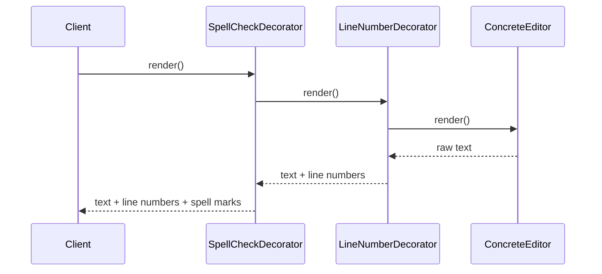

# Decorator Pattern

> A structural design pattern that attaches additional behaviors to an object dynamically by wrapping it in *decorator* objects that implement the same interface.

## What Problem Does It Solve?

Suppose you have a `TextEditor` and you want to add features: line numbers, syntax highlighting, spell-check, word wrap. Naive approaches have serious problems:

**Subclassing** — create `LineNumberEditor`, `SyntaxHighlightEditor`, `SpellCheckEditor`. But what about combinations? `LineNumberSyntaxHighlightEditor`, `LineNumberSpellCheckEditor`… With *n* features you get 2ⁿ subclasses. This is called **class explosion**.

**Modifying the base class** — adds every feature to one class, violating the Single Responsibility Principle and making the class enormous and untestable.

The Decorator pattern solves this by wrapping the object. Each decorator adds one behavior, and decorators can be nested arbitrarily — you compose features at runtime without touching the original class.

## What Is It?

The Decorator pattern has four participants:

| Role | Description |
|------|-------------|
| **Component** | Interface that both the real object and decorators implement |
| **ConcreteComponent** | The original object being decorated |
| **BaseDecorator** | Abstract class that holds a reference to a `Component` and delegates all calls to it |
| **ConcreteDecorator** | Extends `BaseDecorator`, adds behavior before/after delegating |

The key insight: **a decorator IS a Component** (same interface) and **HAS a Component** (wraps one). This allows stacking.

## How It Works


*Decorators are stacked like layers around the original object. Each layer adds one behavior. The client sees a single Component interface.*

**Delegation chain (call travels inward, result travels outward):**


*Each decorator calls the wrapped component, then transforms/augments the result before returning it upward.*

## Code Examples

### Core Decorator Skeleton

```java
// ── Component ────────────────────────────────────
public interface DataProcessor {
    String process(String data);
}

// ── ConcreteComponent ────────────────────────────
public class PlainDataProcessor implements DataProcessor {
    public String process(String data) {
        return data;  // ← base behavior — no modification
    }
}

// ── BaseDecorator ─────────────────────────────────
public abstract class DataProcessorDecorator implements DataProcessor {

    protected final DataProcessor wrapped; // ← holds the component reference

    public DataProcessorDecorator(DataProcessor wrapped) {
        this.wrapped = wrapped;
    }

    // Default: delegate to wrapped — subclasses override to add behavior
    public String process(String data) {
        return wrapped.process(data);
    }
}

// ── ConcreteDecorators ───────────────────────────

public class EncryptionDecorator extends DataProcessorDecorator {
    public EncryptionDecorator(DataProcessor wrapped) { super(wrapped); }

    @Override
    public String process(String data) {
        String processed = wrapped.process(data);   // ← inner first
        return encrypt(processed);                  // ← then add behavior
    }

    private String encrypt(String data) {
        return Base64.getEncoder().encodeToString(data.getBytes()); // ← simplified
    }
}

public class CompressionDecorator extends DataProcessorDecorator {
    public CompressionDecorator(DataProcessor wrapped) { super(wrapped); }

    @Override
    public String process(String data) {
        String processed = wrapped.process(data);
        return compress(processed);
    }

    private String compress(String data) {
        return "[COMPRESSED:" + data + "]";         // ← simplified placeholder
    }
}

// ── Client — compose decorators at runtime ────────

DataProcessor plain = new PlainDataProcessor();

// Apply encryption only
DataProcessor encrypted = new EncryptionDecorator(plain);

// Apply compression on top of encryption
DataProcessor compressedAndEncrypted =
        new CompressionDecorator(new EncryptionDecorator(plain)); // ← stacked

System.out.println(compressedAndEncrypted.process("Hello World"));
// → [COMPRESSED:SGVsbG8gV29ybGQ=]
```

### Java I/O — Decorator in the JDK

Java's entire `java.io` package is built on the Decorator pattern. `InputStream` is the component interface; `FileInputStream` is the concrete component; `BufferedInputStream`, `GZIPInputStream`, `DataInputStream` are decorators.

```java
// Stack decorators to compose behavior
InputStream raw = new FileInputStream("data.bin");       // ← ConcreteComponent
InputStream buffered = new BufferedInputStream(raw);     // ← adds buffering
InputStream gzip     = new GZIPInputStream(buffered);    // ← adds decompression
DataInputStream data = new DataInputStream(gzip);        // ← adds typed read methods

int value = data.readInt();   // ← reads int, decompressed, from buffered file
```


*Java I/O decorators: each layer adds one responsibility. The innermost reads raw bytes; each outer layer transforms them.*

### Spring Security — Filter Chain as Decorator

Spring Security's `FilterChainProxy` stacks `SecurityFilter` objects in the same decorator pattern — each filter adds one security concern (authentication, CSRF, session management) around the chain.

```java
// Conceptually, Spring Security builds:
Filter chain =
    new CsrfFilter(
        new UsernamePasswordAuthenticationFilter(
            new SessionManagementFilter(
                new FilterSecurityInterceptor(targetServlet)
            )
        )
    );
```

## Trade-offs & When To Use / Avoid

| | Pros | Cons |
|--|------|------|
| **Decorator** | Add/remove behavior at runtime; avoids class explosion; Single Responsibility per decorator | Deep stacks can be hard to debug; order of composition matters and can cause subtle bugs |
| **vs Inheritance** | Composable; no class explosion; doesn't require modifying the original | Requires more classes; harder to inspect what decorators are applied to an object at runtime |
| **vs Strategy** | Decorator wraps and extends; Strategy replaces an algorithm entirely | Different intent — use Strategy to vary core behavior, Decorator to layer extra behavior |

**When to use:**
- Adding optional, combinable behaviors (logging, caching, auth checks, encryption).
- When modifying the original class is not possible (third-party class, legacy code).
- Java I/O, Spring filters, middleware pipelines.

**When to avoid:**
- When order of decorators would be unpredictable or hard to enforce.
- When you only need one fixed set of behaviors — a simple subclass is clearer.

## Common Pitfalls

- **Forgetting to delegate** — if a decorator doesn't call `wrapped.process()`, the inner component is bypassed entirely. Every decorator must delegate unless intentionally short-circuiting.
- **Order-sensitive composition bugs** — `new CompressionDecorator(new EncryptionDecorator(base))` vs `new EncryptionDecorator(new CompressionDecorator(base))` produce different results. Document the expected order in code comments.
- **Too many tiny decorators** — decorating each concern individually is correct in principle, but can produce an overwhelming stack that's hard to configure. Group frequently co-used decorators into a composite.
- **Breaking equals/hashCode** — the decorator and the original have different object identities. If the component is stored in a `Set` or as a `Map` key, wrapping it in a decorator creates a different key.

## Interview Questions

### Beginner

**Q:** What is the Decorator pattern?
**A:** It dynamically adds behavior to an object by wrapping it in another object that implements the same interface. The wrapper delegates to the original but adds behavior before or after the call.

**Q:** Where does Java use the Decorator pattern in its standard library?
**A:** The entire `java.io` package is built on Decorator. `FileInputStream` is the base; `BufferedInputStream`, `GZIPInputStream`, and `DataInputStream` are decorators that wrap it and add buffering, decompression, and typed reading respectively.

### Intermediate

**Q:** What is the difference between Decorator and inheritance for extending behavior?
**A:** Inheritance adds behavior at compile-time and applies to all instances of a subclass. Decorator adds behavior at runtime to a specific object instance without affecting others. Decorator is composable — you can stack multiple decorators — while inheritance creates a separate class for each combination.

**Q:** How is Spring Security's filter chain related to Decorator?
**A:** Each Spring Security filter wraps the remaining filter chain and adds one security concern (authentication, CSRF check, etc.), then delegates to the next filter. This is the Decorator pattern applied to HTTP request processing — each filter is a decorator on the servlet.

### Advanced

**Q:** How would you implement a logging decorator that works for any service interface without writing a new class each time?
**A:** Use Java **dynamic proxies** (`java.lang.reflect.Proxy`) or a framework like Spring AOP. With dynamic proxies:
```java
Object proxy = Proxy.newProxyInstance(
    target.getClass().getClassLoader(),
    target.getClass().getInterfaces(),
    (proxy1, method, args) -> {
        System.out.println("Calling: " + method.getName());
        Object result = method.invoke(target, args);
        System.out.println("Done: " + method.getName());
        return result;
    }
);
```
This is exactly what Spring AOP does — a `@Around` advice is a generic programmatic Decorator applied via reflection/bytecode.

## Further Reading

- [Decorator Pattern — Refactoring Guru](https://refactoring.guru/design-patterns/decorator) — illustrated breakdown with Java examples
- [Decorator Pattern in Java — Baeldung](https://www.baeldung.com/java-decorator-design-pattern) — practical examples with Java I/O and custom decorators

## Related Notes

- [Proxy Pattern](./proxy-pattern.md) — structurally identical to Decorator (wraps an interface), but intent differs: Proxy controls access, Decorator adds behavior.
- [Strategy Pattern](./strategy-pattern.md) — alternative for varying behavior; Strategy replaces an algorithm, Decorator wraps it with additional steps.
- [Adapter Pattern](./adapter-pattern.md) — also a wrapper, but converts an incompatible interface rather than adding behavior to a compatible one.
