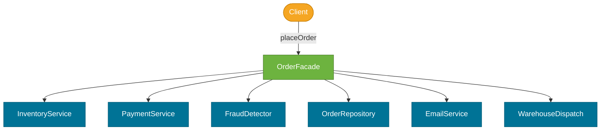

# Facade Pattern

> A structural design pattern that provides a **simple, unified interface** to a complex subsystem, shielding clients from its internal complexity.

## What Problem Does It Solve?

Imagine an e-commerce order flow that requires coordinating: inventory check, payment processing, fraud detection, order persistence, email notification, and warehouse dispatch. Client code that does all of this directly becomes deeply coupled to six subsystems, each with their own exception types, initialization requirements, and calling conventions.

If inventory's API changes, client code breaks. If you add a new step (loyalty points), every caller must be updated. Client code should not need to know *how* to orchestrate a subsystem — it only needs to know *what* it wants done.

The Facade pattern solves this by introducing one `OrderFacade` class that takes a single `placeOrder(Cart)` call and coordinates all the subsystems internally. The client has one dependency instead of six.

## Analogy

A travel agent is a facade to the complex travel booking subsystem: airlines, hotels, car rentals, visa services. You tell the agent "book me a trip to Tokyo for two weeks." The agent calls all the subsystems. You don't interact with each subsystem directly — the facade (agent) handles the coordination.

## What Is It?

The Facade pattern defines:

- A **Facade** class that exposes a set of simplified, high-level methods.
- A **Subsystem** of existing classes that do the real work behind the facade.
- Clients use the Facade exclusively; they may still access subsystem classes directly if they need fine-grained control — the Facade doesn't prevent this.

Facade is about **usability and convenience**, not about hiding things completely (use encapsulation for that).

## How It Works


*The Facade sits between the client and the subsystem. The client makes one call; the Facade orchestrates the subsystem steps internally.*

## Code Examples

### Order Placement Facade

```java
// ── Subsystem classes (complex, independent APIs) ─────────────────────

@Service
class InventoryService {
    public boolean isAvailable(String productId, int qty) { /* ... */ return true; }
    public void reserve(String productId, int qty) { /* ... */ }
}

@Service
class PaymentService {
    public String charge(String cardToken, BigDecimal amount) { /* ... */ return "txn_001"; }
}

@Service
class FraudDetector {
    public boolean isSafe(String customerId, BigDecimal amount) { /* ... */ return true; }
}

@Repository
class OrderRepository {
    public Order save(Order order) { /* ... */ return order; }
}

@Service
class EmailService {
    public void sendOrderConfirmation(String email, Order order) { /* ... */ }
}

// ── Facade — one simple API for the entire order workflow ─────────────

@Service                                      // ← Spring bean — injectable everywhere
public class OrderFacade {

    private final InventoryService inventory;
    private final PaymentService payment;
    private final FraudDetector fraud;
    private final OrderRepository orderRepo;
    private final EmailService email;

    // Constructor injection
    public OrderFacade(InventoryService inventory, PaymentService payment,
                       FraudDetector fraud, OrderRepository orderRepo,
                       EmailService email) {
        this.inventory = inventory;
        this.payment   = payment;
        this.fraud     = fraud;
        this.orderRepo = orderRepo;
        this.email     = email;
    }

    // ← single method: client only needs to know this
    public OrderResult placeOrder(Cart cart, Customer customer) {
        // 1) Fraud check
        if (!fraud.isSafe(customer.getId(), cart.total())) {
            return OrderResult.rejected("Fraud risk detected");
        }

        // 2) Inventory check and reservation
        for (CartItem item : cart.items()) {
            if (!inventory.isAvailable(item.productId(), item.qty())) {
                return OrderResult.rejected("Out of stock: " + item.productId());
            }
            inventory.reserve(item.productId(), item.qty());
        }

        // 3) Charge payment
        String txnId = payment.charge(customer.getCardToken(), cart.total());

        // 4) Persist order
        Order order = new Order(customer.getId(), cart.items(), txnId);
        Order saved = orderRepo.save(order);

        // 5) Send confirmation email
        email.sendOrderConfirmation(customer.getEmail(), saved);

        return OrderResult.success(saved.getId());
    }
}

// ── Controller — clean and simple thanks to the Facade ────────────────
@RestController
@RequestMapping("/orders")
public class OrderController {

    @Autowired
    private OrderFacade orderFacade;  // ← one dependency instead of six

    @PostMapping
    public ResponseEntity<OrderResult> placeOrder(@RequestBody OrderRequest req) {
        OrderResult result = orderFacade.placeOrder(req.cart(), req.customer());
        return result.isSuccess()
            ? ResponseEntity.ok(result)
            : ResponseEntity.badRequest().body(result);
    }
}
```

### JdbcTemplate as a Facade (Spring Standard Library)

`JdbcTemplate` is a classic Facade over JDBC. Raw JDBC requires: get a `Connection`, create a `PreparedStatement`, bind parameters, `executeQuery()`, iterate `ResultSet`, close everything in `finally`. One bug in cleanup leaks a connection.

```java
// Without Facade (raw JDBC) — 20+ lines
Connection conn = dataSource.getConnection();
try {
    PreparedStatement ps = conn.prepareStatement("SELECT * FROM users WHERE id = ?");
    ps.setLong(1, userId);
    ResultSet rs = ps.executeQuery();
    // ... iterate, close, handle exceptions in finally
} finally {
    conn.close(); // ← leak if forgotten
}

// With JdbcTemplate Facade — 3 lines
@Autowired JdbcTemplate jdbc;

User user = jdbc.queryForObject(
    "SELECT * FROM users WHERE id = ?",
    (rs, row) -> new User(rs.getLong("id"), rs.getString("name")),
    userId
);
```

:::info
`JdbcTemplate`, `RestTemplate`, and `RedisTemplate` in Spring are all named `*Template` but structurally they're Facades — they wrap a complex subsystem (JDBC, HTTP client stack, Redis connection) behind a simple, safe API.
:::

## Trade-offs & When To Use / Avoid

| | Pros | Cons |
|--|------|------|
| **Facade** | Simplifies client code; reduces coupling to subsystem classes; single place to enforce orchestration logic | Can become a "God class" if it grows; clients may still need direct subsystem access for advanced use cases |
| **vs no Facade** | Client doesn't need to know subsystem details | Without a Facade, any API change ripples to all callers |

**When to use:**
- Complex subsystems with many classes that clients use together in a fixed sequence.
- Entry-point services in layered architecture (Controller → Service/Facade → Repository).
- Wrapping third-party SDKs (AWS S3, Stripe, SendGrid) behind your own interface.

**When to avoid:**
- When the subsystem is simple — adding a Facade over two classes is over-engineering.
- When clients legitimately need fine-grained control over subsystem internals.

## Common Pitfalls

- **God Facade** — a Facade that does everything for every client with 50 methods. It should focus on one bounded use case. If it grows too large, split it into multiple focused facades.
- **Business logic in Facade** — the Facade is for orchestration, not business rules. If validation, calculations, and domain logic accumulate here, move them to domain services.
- **Facade vs Service confusion in Spring** — a Spring `@Service` class that orchestrates several other services is often a Facade in practice. That's fine. The distinction is intentional: if it's a Facade, it should be thin and delegating.

## Interview Questions

### Beginner

**Q:** What is the Facade pattern?
**A:** It provides a simplified, high-level interface to a complex subsystem. Clients interact with one Facade class instead of coordinating multiple subsystem classes directly.

**Q:** Can you give an example of Facade in the Spring ecosystem?
**A:** `JdbcTemplate` is a Facade over JDBC. It hides connection management, statement creation, result set iteration, and cleanup. You just call `queryForObject()` and get your result. `RestTemplate` and `RedisTemplate` are similar Facades.

### Intermediate

**Q:** How is Facade different from Adapter?
**A:** Adapter translates one *specific* interface into another that clients expect (solving incompatibility). Facade defines a *new, simplified* interface that aggregates multiple subsystem calls into one (solving complexity). Adapter is 1:1 interface translation; Facade is N:1 subsystem simplification.

**Q:** How would you design a Facade for a third-party payment API in Spring Boot?
**A:** Define an interface like `PaymentGateway` with a method `ChargeResult charge(ChargeRequest)`. Have a `StripeGatewayFacade` implement it, injecting the Stripe SDK internally. This keeps your domain code independent of the SDK, allowing you to swap providers.

### Advanced

**Q:** What is the risk of putting transaction boundaries or security checks inside a Facade?
**A:** If a Facade method is annotated with `@Transactional` or `@PreAuthorize`, and it calls other `@Transactional` methods internally (within the same Spring bean via `this.`), Spring's AOP proxy won't intercept those inner calls — the behavior is unexpected. Transaction management should be on the coordinated service methods themselves, not just the Facade.

## Further Reading

- [Facade Pattern — Refactoring Guru](https://refactoring.guru/design-patterns/facade) — clear subsystem diagram and examples
- [Facade Pattern in Java — Baeldung](https://www.baeldung.com/java-facade-pattern) — practical Spring-aligned examples

## Related Notes

- [Adapter Pattern](./adapter-pattern.md) — both simplify access to external code, but Adapter translates interfaces while Facade creates a new simplified one.
- [Template Method Pattern](./template-method-pattern.md) — Facade delegates orchestration; Template Method defines the orchestration algorithm as a fixed skeleton with customizable steps.
- [Proxy Pattern](./proxy-pattern.md) — Proxy controls access to a single object; Facade provides access to a whole subsystem.
