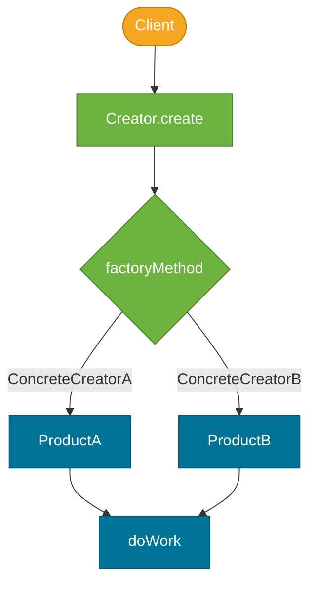

# Factory Method Pattern

> A creational design pattern that provides an interface for creating objects in a superclass but allows subclasses (or implementations) to alter the type of objects that will be created.

## What Problem Does It Solve?

Suppose you have a logistics application that sends parcels. Initially you support only trucks, so your code is littered with `new Truck(...)`. Six months later, you add ship transport. Now you must hunt through all those `new Truck(...)` calls and add conditionals — every new transport type cascades changes through your codebase.

More generally: whenever a class needs to create objects but the exact type of those objects should vary by context, hard-coding `new ConcreteClass()` couples the creator to a specific implementation. Adding new types means modifying existing, tested code — violating the **Open/Closed Principle**.

The Factory Method pattern solves this by delegating the `new` call to a separate factory method that subclasses or implementations can override, keeping the creation logic isolated and extensible.

## What Is It?

The Factory Method pattern defines:

- A **Creator** class (or interface) with a `factoryMethod()` that returns a `Product` interface type.
- **Concrete Creators** that override `factoryMethod()` to return specific `ConcreteProduct` instances.
- The **client** works only with the `Product` interface — it never knows what concrete type was created.

```
Creator (abstract)                    Product (interface)
─────────────────                     ────────────────────
+ someOperation()                     + doWork()
+ factoryMethod(): Product ←──────┐
                                   │  ConcreteProduct
ConcreteCreatorA                   └── implements Product
  + factoryMethod() → ProductA
ConcreteCreatorB
  + factoryMethod() → ProductB
```

There are two common Java variants:
1. **Inheritance-based** (classic GoF) — subclass overrides the factory method.
2. **Static factory method** — a static method on the class itself (e.g., `Optional.of()`, `List.of()`). Simpler; widely used in Java APIs.

## How It Works


*The client calls through the Creator abstraction. The concrete factory method decides which product is built; the client never references either concrete class.*

**Steps:**
1. Client calls a method on the `Creator` (e.g., `transport.deliver()`).
2. `deliver()` internally calls `this.createTransport()` — the factory method.
3. The concrete subclass returns its specific product (`Truck` or `Ship`).
4. `deliver()` uses the returned `Transport` interface — it doesn't care which implementation it got.

## Code Examples

:::tip Practical Demo
See [Factory Method Pattern Demo](./demo/factory-method-pattern-demo.md) for five runnable examples — inheritance-based, static factory, lambda factory, and Spring `@Bean` factory method.
:::

### Inheritance-Based Factory Method

```java
// Product interface
public interface Notification {
    void send(String message);
}

// Concrete products
public class EmailNotification implements Notification {
    private final String email;
    public EmailNotification(String email) { this.email = email; }
    public void send(String message) {
        System.out.println("Sending email to " + email + ": " + message);
    }
}

public class SmsNotification implements Notification {
    private final String phone;
    public SmsNotification(String phone) { this.phone = phone; }
    public void send(String message) {
        System.out.println("Sending SMS to " + phone + ": " + message);
    }
}

// Creator — abstract class with factory method
public abstract class NotificationService {

    // ← factory method — subclasses override this
    protected abstract Notification createNotification(String recipient);

    // template method that uses the factory method
    public void notify(String recipient, String message) {
        Notification n = createNotification(recipient);  // ← calls subclass implementation
        n.send(message);
    }
}

// Concrete creators
public class EmailNotificationService extends NotificationService {
    @Override
    protected Notification createNotification(String recipient) {
        return new EmailNotification(recipient); // ← decides what to create
    }
}

public class SmsNotificationService extends NotificationService {
    @Override
    protected Notification createNotification(String recipient) {
        return new SmsNotification(recipient);
    }
}

// Client — only knows NotificationService, not Email or Sms classes
NotificationService service = new EmailNotificationService();
service.notify("alice@example.com", "Your order shipped!");
```

### Static Factory Method (Common Java Pattern)

```java
public class NotificationFactory {

    // Static factory — chooses concrete type based on a parameter
    public static Notification create(String channel, String recipient) {
        return switch (channel) {           // ← Java 14+ switch expression
            case "email" -> new EmailNotification(recipient);
            case "sms"   -> new SmsNotification(recipient);
            case "push"  -> new PushNotification(recipient);
            default      -> throw new IllegalArgumentException("Unknown channel: " + channel);
        };
    }
}

// Client
Notification n = NotificationFactory.create("email", "alice@example.com");
n.send("Welcome!");
```

### Spring `@Bean` Factory Method

Spring's `@Bean` methods on `@Configuration` classes are factory methods — the method body decides what to instantiate, and Spring calls them to produce beans.

```java
@Configuration
public class DataSourceConfig {

    @Value("${app.datasource.type}")
    private String datasourceType;

    @Bean
    public DataSource dataSource() {  // ← factory method — Spring calls this to create the bean
        return switch (datasourceType) {
            case "h2"       -> new EmbeddedDatabaseBuilder().setType(H2).build();
            case "postgres" -> buildPostgresDataSource();
            default         -> throw new IllegalStateException("Unknown datasource type");
        };
    }
}
```

:::info
`BeanFactory` in Spring is literally named after this pattern. When the container creates beans, it's using the Factory Method pattern with `BeanDefinition` as the product spec.
:::

### Java Standard Library Examples

```java
// Static factory methods built into the JDK
List<String> list     = List.of("a", "b", "c");     // ← factory method on List
Optional<String> opt  = Optional.of("hello");       // ← factory method on Optional
Path path             = Path.of("/usr/local/bin");  // ← factory method on Path
NumberFormat nf       = NumberFormat.getCurrencyInstance(Locale.US); // ← locale-specific subclass
```

## Trade-offs & When To Use / Avoid

| | Pros | Cons |
|--|------|------|
| **Factory Method** | Decouples client from concrete classes; easy to add new products without modifying existing code | Requires a new Creator subclass or a new `case` for each product type |
| **vs `new` directly** | Client code never imports concrete implementation class | More classes/files; can seem over-engineered for simple cases |
| **vs Abstract Factory** | Simpler — creates one product family | Abstract Factory creates *families* of related products; use it when you need multiple coordinated types |

**When to use:**
- You need to vary the type of object created based on configuration, environment, or user input.
- You want to add new product types without modifying the client code.
- Testing — swap in a mock factory to return test doubles.

**When to avoid:**
- When there's only ever one product type — a simple `new` is cleaner.
- When the factory logic is trivial — don't over-abstract a one-liner.

## Common Pitfalls

- **Static factory vs Factory Method pattern confusion** — static factory methods (like `List.of()`) are a Java idiom but differ from GoF Factory Method. In GoF, the factory method is overridable by subclasses to change behavior.
- **God Factory class** — a single `FactoryFactory` with 50 `create*()` methods. Prefer one focused factory per product family.
- **No Open/Closed benefit if adding a `case`** — if your static factory uses `if/else` or `switch` and you must add a case for every new type, consider the **Strategy** or **Abstract Factory** pattern for truly extensible designs.
- **Forgetting to handle the default case** — always throw a meaningful exception for unknown types rather than returning `null`.

## Interview Questions

### Beginner

**Q:** What is the Factory Method pattern?
**A:** It's a creational pattern where a method (the factory method) is responsible for creating objects, rather than calling `new` directly in the client. The client works with an interface and the factory decides which concrete class to instantiate.

**Q:** What is the difference between a constructor and a factory method?
**A:** A constructor always returns the same type and is called with `new`. A static factory method can return any subtype of the declared return type, can have a meaningful name, can return a cached instance, and can return `null` or `Optional` (unlike a constructor). Examples: `Collections.unmodifiableList()`, `Optional.of()`.

### Intermediate

**Q:** How does the Factory Method pattern relate to Spring's IoC container?
**A:** Spring's `BeanFactory` and `ApplicationContext` use the Factory Method pattern. When you annotate a method with `@Bean`, Spring calls that method as a factory method to produce the bean. The container is the Creator; the `@Bean` method is the factory method; the returned object is the product.

**Q:** When would you prefer Factory Method over direct instantiation?
**A:** When the exact type to instantiate varies by runtime conditions (environment, configuration, user input), or when you need to decouple callers from concrete classes for testability. If the type never changes, a constructor is usually simpler.

### Advanced

**Q:** How does the Factory Method pattern enable the Open/Closed Principle?
**A:** By programming to the `Product` interface and injecting a `Creator`, you can add new `ConcreteCreator + ConcreteProduct` pairs without modifying any existing code that uses the `Creator` abstraction. The existing `notify()` or `deliver()` logic is *open for extension* (new subtype) but *closed for modification* (no `if/else` added).

**Follow-up:** How does Factory Method relate to the Template Method pattern?
**A:** Closely — the pattern is sometimes called "a Template Method that creates objects." The Creator's `someOperation()` is a template method that calls `factoryMethod()` as a hook step. The subclass overrides the hook to vary object creation while the overall algorithm stays the same.

## Further Reading

- [Factory Method Pattern — Refactoring Guru](https://refactoring.guru/design-patterns/factory-method) — illustrated walkthrough with UML and Java
- [Factory Pattern in Java — Baeldung](https://www.baeldung.com/java-factory-pattern) — static factory and abstract factory variants with examples
- [Effective Java Item 1 — Consider static factory methods instead of constructors](https://www.baeldung.com/java-constructors-vs-static-factory-methods) — when to prefer static factories over constructors

## Related Notes

- [Abstract Factory Pattern](./abstract-factory-pattern.md) — extends Factory Method to create *families* of related objects; the natural next step after understanding Factory Method.
- [Singleton Pattern](./singleton-pattern.md) — Factory Methods are often used to return a Singleton instance (e.g., `getInstance()`).
- [Template Method Pattern](./template-method-pattern.md) — Factory Method is structurally a Template Method applied to object creation.
