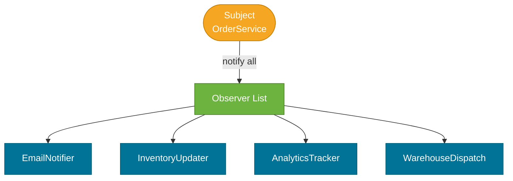
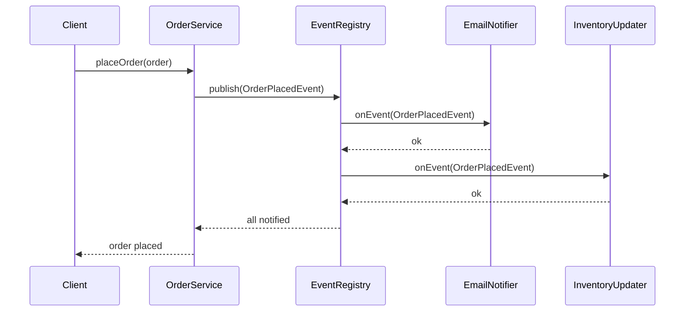

# Observer Pattern

> A behavioral design pattern where a **subject** maintains a list of **observers** and broadcasts state-change notifications to them — without knowing who the observers are or how many exist.

## What Problem Does It Solve?

An `Order` is placed. Now ten different parts of the system need to react: send a confirmation email, update inventory, notify the warehouse, trigger a loyalty points update, push analytics events, record an audit log...

If `OrderService` calls each of these directly, it becomes coupled to all ten services. Adding an eleventh means modifying `OrderService` again. The order service's job is processing orders — not knowing about emails, analytics, and loyalty programs.

More generally: whenever one object changes state and multiple other objects need to react, direct method calls create tight coupling that's hard to extend, test, or maintain.

The Observer pattern solves this: the `OrderService` (subject) only knows about the `OrderEvent` it publishes. Each handler (observer) registers its interest independently. When an order is placed, the subject notifies all observers — without knowing any of them.

## What Is It?

The Observer pattern has two participants:

| Role | Description |
|------|-------------|
| **Subject (Publisher)** | Holds a list of observers. Notifies all of them on state change. |
| **Observer (Subscriber)** | Implements a notification method (`update()`, `onEvent()`). Registers with the subject. |

This is also known as the **Publish-Subscribe** (Pub/Sub) pattern, though Pub/Sub usually implies a message broker in between; raw Observer is point-to-point in memory.

```
Subject ──── observers ────► Observer1
                        ────► Observer2
                        ────► Observer3
```

## How It Works




*The Subject publishes an event to the registry. Each registered observer receives the same event. Subject doesn't call observers directly.*

## Code Examples

:::tip Practical Demo
See [Observer Pattern Demo](./demo/observer-pattern-demo.md) for runnable examples: manual observer registry, Spring `@EventListener`, `@Async` listeners, and `@TransactionalEventListener` usage.
:::

### Manual Observer Implementation

```java
// ── Observer interface ────────────────────────────────────────────────
public interface OrderEventListener {
    void onOrderPlaced(Order order);
}

// ── Subject ────────────────────────────────────────────────────────────
public class OrderService {

    private final List<OrderEventListener> listeners = new ArrayList<>();  // ← observer registry

    public void addListener(OrderEventListener listener) {
        listeners.add(listener);
    }

    public void removeListener(OrderEventListener listener) {
        listeners.remove(listener);
    }

    public void placeOrder(Order order) {
        // Business logic: save to DB, run validations, etc.
        processOrder(order);

        // ← notify all registered observers
        listeners.forEach(l -> l.onOrderPlaced(order));
    }
}

// ── Concrete Observers ─────────────────────────────────────────────────
public class EmailNotifier implements OrderEventListener {
    public void onOrderPlaced(Order order) {
        System.out.println("Sending confirmation email for order " + order.getId());
    }
}

public class InventoryUpdater implements OrderEventListener {
    public void onOrderPlaced(Order order) {
        order.items().forEach(item ->
            System.out.println("Reserving " + item.qty() + " units of " + item.productId()));
    }
}

// ── Bootstrap ──────────────────────────────────────────────────────────
OrderService orderService = new OrderService();
orderService.addListener(new EmailNotifier());
orderService.addListener(new InventoryUpdater());

orderService.placeOrder(new Order(...));  // ← notifies both listeners automatically
```

### Spring Application Events (Recommended Production Approach)

Spring's `ApplicationEventPublisher` / `@EventListener` is an Observer pattern built into the IoC container — subjects and observers don't even need to know each others' classes:

```java
// ── Event (the notification payload) ──────────────────────────────────
public record OrderPlacedEvent(Order order, Instant timestamp) {}

// ── Subject — publishes events ─────────────────────────────────────────
@Service
@RequiredArgsConstructor
public class OrderService {

    private final OrderRepository orderRepo;
    private final ApplicationEventPublisher publisher; // ← Spring's event bus

    public Order placeOrder(Cart cart, Customer customer) {
        Order order = new Order(cart, customer);
        orderRepo.save(order);

        publisher.publishEvent(new OrderPlacedEvent(order, Instant.now())); // ← fire and forget
        return order;
    }
}

// ── Observers — @EventListener methods ────────────────────────────────
@Component
public class EmailNotificationListener {

    @EventListener                              // ← registers as observer automatically
    public void handleOrderPlaced(OrderPlacedEvent event) {
        System.out.println("Email sent for order: " + event.order().getId());
    }
}

@Component
public class InventoryListener {

    @EventListener
    public void handleOrderPlaced(OrderPlacedEvent event) {
        System.out.println("Inventory updated for order: " + event.order().getId());
    }
}

// ── Async observer — non-blocking notification ─────────────────────────
@Component
public class AnalyticsListener {

    @EventListener
    @Async                                      // ← runs in a separate thread
    public void handleOrderPlaced(OrderPlacedEvent event) {
        System.out.println("Analytics tracked (async) for: " + event.order().getId());
    }
}
```

:::tip
`@EventListener` + `@Async` is the production pattern for Spring events. Synchronous listeners block the publisher's thread — use `@Async` for non-critical side effects (emails, analytics) so they don't slow down the main request.
:::

:::warning
Spring events are **in-process only** — if your service crashes between publishing and handling, no event is replayed. For durable, cross-process event delivery use Kafka or RabbitMQ instead.
:::

### Transactional Events

```java
@Component
public class WarehouseDispatchListener {

    @TransactionalEventListener(phase = TransactionPhase.AFTER_COMMIT) // ← fires only if txn committed
    public void handleOrderPlaced(OrderPlacedEvent event) {
        // Safe to dispatch: order is confirmed committed to DB
        warehouseService.dispatchOrder(event.order().getId());
    }
}
```

:::info
`@TransactionalEventListener` guarantees the observer fires only after the publisher's transaction commits. Prevents dispatching a warehouse order for an order that might get rolled back.
:::

### Java Standard Library Observer

`java.util.Observable` / `java.util.Observer` existed in Java 1.0 but was **deprecated in Java 9** due to design flaws:

```java
// ← LEGACY — Do not use in new code
class OldSubject extends Observable {
    void doSomething() {
        setChanged();
        notifyObservers("payload");
    }
}
```

Use Spring Events, `PropertyChangeListener`, or reactive Pub/Sub (Project Reactor's `Flux`/`Mono`) instead.

## Trade-offs & When To Use / Avoid

| | Pros | Cons |
|--|------|------|
| **Observer** | Loose coupling — subject doesn't know observers; easy to add new observers | Event storms — one change triggers cascading notifications; hard to trace event flow |
| **Spring Events** | Zero coupling; async support; transactional support | In-process only; no durability; event ordering not guaranteed |
| **Message broker** | Durable; cross-service; reliable delivery | Infrastructure overhead; eventual consistency |

**When to use:**
- Decoupled side effects: email, notifications, analytics, audit logs triggered by business events.
- GUI frameworks — button click notifies multiple listeners.
- `@TransactionalEventListener` for post-commit side effects.

**When to avoid:**
- When you need guaranteed delivery across process restarts — use a message broker.
- When the causal chain of events needs to be deterministic and debuggable — deep observer chains are notoriously hard to trace.

## Common Pitfalls

- **Memory leaks in manual Observer** — if observers register with a long-lived subject but are never removed, they're held in the observer list forever (preventing GC). Always call `removeListener()` when done.
- **Ordering dependencies** — if Listener B depends on Listener A having run first, ordinary Observer doesn't guarantee order. Use `@Order` on Spring `@EventListener` methods or rethink the design.
- **Synchronous blocking in observers** — a slow observer blocks all subsequent observers and the publisher's thread. Use `@Async` for anything that does I/O.
- **Circular event chains** — Observer A publishes EventX, which triggers Observer B, which publishes EventY, which triggers Observer A again — infinite loop. Guard with state flags or event deduplication.

## Interview Questions

### Beginner

**Q:** What is the Observer pattern?
**A:** It's a behavioral pattern where a subject maintains a list of observers and notifies them when its state changes. It decouples the subject from the objects that need to react to its changes.

**Q:** How does Spring implement the Observer pattern?
**A:** Through `ApplicationEventPublisher` (subject) and `@EventListener`-annotated methods (observers). The publisher fires an event object; Spring's event bus delivers it to all matching `@EventListener` methods across the context.

### Intermediate

**Q:** What is the difference between `@EventListener` and `@TransactionalEventListener`?
**A:** `@EventListener` fires immediately when the event is published — even before the transaction commits. If the transaction rolls back, the side effects have already happened. `@TransactionalEventListener` fires only after the enclosing transaction commits (default: `AFTER_COMMIT`), making it safe for irreversible side effects like sending emails or dispatching orders.

**Q:** Why was `java.util.Observable` deprecated in Java 9?
**A:** Several design flaws: it required subclassing (couldn't apply to existing classes), `setChanged()` was protected (breaking encapsulation), and there was no support for generics or lambda-based observers. Modern alternatives are Spring Events, `PropertyChangeSupport`, or reactive streams.

### Advanced

**Q:** How would you implement an ordered, guaranteed-delivery, durable event system replacing in-memory Spring Events?
**A:** Use a transactional **outbox pattern**: instead of publishing events to Spring's event bus, write them to a database `outbox` table within the same transaction as the business entity. A separate poller reads from the outbox and publishes to a message broker (Kafka/RabbitMQ). Consumers (observers) subscribe from the broker. This guarantees at-least-once delivery and survives application restarts.

**Follow-up:** What concurrency concern exists when multiple observers respond to the same Spring event?
**A:** If multiple listeners are `@Async`, they run in parallel on the async thread pool. Their completion order is non-deterministic. If they share mutable state (a counter, a database record), concurrent access requires synchronization or optimistic locking. If they need sequential execution, remove `@Async` or chain events explicitly.

## Further Reading

- [Observer Pattern — Refactoring Guru](https://refactoring.guru/design-patterns/observer) — illustrated walkthrough with Java examples
- [Spring Application Events — Baeldung](https://www.baeldung.com/spring-events) — complete guide to Spring event publishing, `@EventListener`, async, transactional events
- [Spring Events Reference](https://docs.spring.io/spring-framework/reference/core/beans/context-introduction.html#context-functionality-events) — official Spring docs

## Related Notes

- [Strategy Pattern](./strategy-pattern.md) — another behavioral pattern; Strategy varies how an algorithm runs; Observer varies who reacts when state changes.
- [Command Pattern](./command-pattern.md) — related; Command encapsulates an action; Observer broadcasts that something happened. They're complementary — Observer fires, Command executes.
- [Template Method Pattern](./template-method-pattern.md) — Template Method at the superclass level can call hook methods that act like built-in observers for specific lifecycle points.
