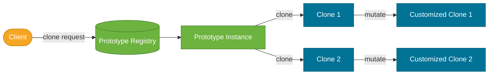
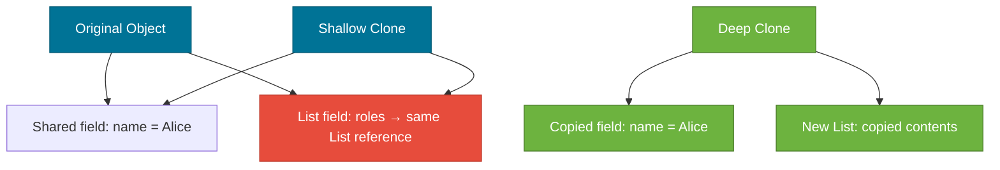

# Prototype Pattern

> A creational design pattern that creates new objects by copying an existing object (the *prototype*), avoiding the cost of full re-initialization.

## What Problem Does It Solve?

Creating an object is sometimes expensive:

- A `ReportTemplate` requires loading a 5 MB stylesheet from disk and running 50 ms of parsing.
- A `GameCharacter` needs to run a physics engine warm-up and load AI state trees.
- A test fixture needs 20 fields pre-populated with realistic defaults.

When you need dozens of similar objects, recreating each from scratch wastes time and resources. Also, some objects have private state that external code cannot access to re-create the object — only the object itself can copy itself faithfully.

The Prototype pattern solves this: keep one pre-built instance (the prototype) and **clone it** when you need a new one. The clone starts with the same state as the prototype, avoiding the expensive initialization, then you tweak only what needs to differ.

## What Is It?

The Prototype pattern has three participants:

- **Prototype interface** — declares a `clone()` method (often Java's `Cloneable`).
- **ConcretePrototype** — implements `clone()` to copy itself.
- **Client** — calls `prototype.clone()` instead of `new ConcreteType()`.

Java has built-in support via `java.lang.Cloneable` and `Object.clone()`, but the interface is flawed (it's a marker interface — `clone()` is actually on `Object`, not `Cloneable`). The preferred Java approach is a **copy constructor** or a custom `clone()` method.

## How It Works


*The Registry holds pre-built prototypes. Clients request a clone, receive a copy with the same state, then customize the clone — the original prototype is untouched.*

**Shallow vs deep copy is the key design decision:**


*Shallow clone shares mutable references — mutating the clone's List also changes the original. Deep clone copies all nested objects.*

## Code Examples

### Copy Constructor (Preferred Java Idiom)

```java
public class DocumentTemplate {

    private String title;
    private String body;
    private List<String> tags;   // ← mutable field — must be deep-copied

    public DocumentTemplate(String title, String body, List<String> tags) {
        this.title = title;
        this.body  = body;
        this.tags  = new ArrayList<>(tags);  // ← defensive copy in normal constructor too
    }

    // Copy constructor — the "prototype clone" method
    public DocumentTemplate(DocumentTemplate other) {
        this.title = other.title;
        this.body  = other.body;
        this.tags  = new ArrayList<>(other.tags); // ← deep copy — new list, same String contents
    }

    // Convenience factory method for readability
    public DocumentTemplate copy() {
        return new DocumentTemplate(this);          // ← returns a fresh clone
    }

    public void setTitle(String title) { this.title = title; }
    public void addTag(String tag)     { this.tags.add(tag); }
    // ...getters
}

// Usage
DocumentTemplate invoice = new DocumentTemplate(
    "Invoice Template", "Dear {{name}}, ...", List.of("finance", "billing")
);

// Clone and customize — original stays untouched
DocumentTemplate marchInvoice = invoice.copy();
marchInvoice.setTitle("March Invoice");
marchInvoice.addTag("march-2026");   // ← doesn't affect the original prototype's tags
```

### Cloneable (Legacy — Know It for Interviews)

```java
public class GameCharacter implements Cloneable {      // ← marker interface
    private String name;
    private int health;
    private List<String> inventory;

    @Override
    public GameCharacter clone() {                     // ← overrides Object.clone()
        try {
            GameCharacter copy = (GameCharacter) super.clone(); // ← shallow copy via native
            copy.inventory = new ArrayList<>(this.inventory);   // ← manually deep-copy mutable fields
            return copy;
        } catch (CloneNotSupportedException e) {
            throw new AssertionError("Should not happen", e);   // ← Cloneable is implemented, so never thrown
        }
    }
}
```

:::warning
`Object.clone()` does a **shallow copy** by default. You must manually deep-copy any mutable reference fields (List, Map, custom objects). Forgetting this is the most common Prototype bug.
:::

### Prototype Registry

```java
public class ShapeRegistry {

    private final Map<String, Shape> registry = new HashMap<>();

    public void register(String key, Shape prototype) {
        registry.put(key, prototype);                // ← store pre-configured prototypes
    }

    public Shape get(String key) {
        Shape proto = registry.get(key);
        if (proto == null) throw new IllegalArgumentException("Unknown shape: " + key);
        return proto.copy();                         // ← always return a clone, never the prototype itself
    }
}

// Bootstrap
ShapeRegistry reg = new ShapeRegistry();
reg.register("red-circle",   new Circle(5, Color.RED));
reg.register("blue-square",  new Square(10, Color.BLUE));

// Use
Shape c1 = reg.get("red-circle"); // new clone each time
Shape c2 = reg.get("red-circle"); // different instance, same initial state
```

### Spring Prototype Scope

Spring's `prototype` bean scope is a direct application of this pattern — each `getBean()` call returns a new instance cloned from the bean definition:

```java
@Component
@Scope("prototype")           // ← new instance per injection / getBean() call
public class ReportBuilder {
    private List<String> lines = new ArrayList<>();

    public void addLine(String line) { lines.add(line); }
    public String build() { return String.join("\n", lines); }
}

// Each injection point gets its own fresh ReportBuilder instance
@Service
public class DashboardService {
    @Autowired
    private ApplicationContext ctx;

    public String buildReport() {
        ReportBuilder rb = ctx.getBean(ReportBuilder.class); // ← new instance
        rb.addLine("Sales: 100");
        return rb.build();
    }
}
```

:::info
Spring's `prototype` scope is conceptually the Prototype pattern, but the "clone" is re-instantiation (calling the constructor again), not `Object.clone()`. The analogy holds: you get a fresh copy of the configuration every time.
:::

## Trade-offs & When To Use / Avoid

| | Pros | Cons |
|--|------|------|
| **Prototype** | Avoids costly re-initialization; creates objects with pre-set complex state | Cloning deep object graphs is complex; circular references need special handling |
| **vs `new`** | Faster when construction is expensive; captures existing state | Unexpected sharing of mutable references if shallow-copied carelessly |
| **vs Builder** | Clone is faster when defaults are the norm and only a few fields change | Builder is clearer when building from scratch with many required fields |

**When to use:**
- Object construction is expensive (DB queries, file I/O, heavy computation).
- You need many similar objects that differ only in a few fields.
- Test fixtures and mock data with reasonable defaults.

**When to avoid:**
- Simple objects — `new` is cleaner and clearer.
- Objects with complex circular references — deep cloning becomes fragile.
- When you're confused about shallow vs deep copy — bugs here are subtle and hard to debug.

## Common Pitfalls

- **Shallow copy of mutable fields** — the #1 bug. Always identify every mutable field (`List`, `Map`, `Date`, custom objects) and deep-copy them in `clone()`/copy constructor.
- **Circular references** — if objects reference each other, naïve deep copy causes `StackOverflowError`. Use a `Map<Object, Object>` visited graph to track already-cloned objects.
- **`Cloneable` design flaws** — `Cloneable` doesn't define `clone()` as a method; a class must be `Cloneable` but the method is on `Object`. The pattern is fragile. Prefer copy constructors or static `copy()` factory methods.
- **Not returning the clone** from the registry — always return a clone, never the prototype instance itself. If clients mutate the prototype, all future clones get the mutated state.

## Interview Questions

### Beginner

**Q:** What is the Prototype pattern?
**A:** It creates new objects by copying an existing prototype rather than constructing from scratch. Useful when construction is expensive and new instances need the same starting state as an existing object.

**Q:** What is the difference between shallow and deep copy?
**A:** A shallow copy copies the object's field values. Primitive and immutable fields (like `String`) are safe. Mutable reference fields (like `List`) still point to the same underlying object — so mutating the copy also affects the original. A deep copy recursively copies all mutable referenced objects, so the copy is fully independent.

### Intermediate

**Q:** Why is Java's `Cloneable` considered broken, and what's the alternative?
**A:** `Cloneable` is a marker interface; the actual `clone()` method is a protected native method on `Object`. There's no enforcement at compile time that a class that implements `Cloneable` has a public `clone()`. It also performs a shallow copy by default, silently causing bugs with mutable fields. The preferred alternative is a **copy constructor** (`public MyClass(MyClass other) {...}`) or a static factory `copy()` method — both are explicit, clear, and don't throw checked exceptions.

### Advanced

**Q:** How would you handle circular references in a deep clone?
**A:** Maintain a `Map<Object, Object> cloneMap` that maps original objects to their clones. Before recursing into an object, check if it's already in `cloneMap`. If it is, return the existing clone instead of recursing again. This breaks the cycle. This is the same technique used by Java serialization to handle circular graphs.

## Further Reading

- [Prototype Pattern — Refactoring Guru](https://refactoring.guru/design-patterns/prototype) — illustrated explanation with Java examples
- [Prototype Pattern in Java — Baeldung](https://www.baeldung.com/java-pattern-prototype) — copy constructor vs `Cloneable` comparison

## Related Notes

- [Builder Pattern](./builder-pattern.md) — another creational pattern; Builder assembles an object from scratch while Prototype clones an existing one. Choose by construction cost and similarity of instances.
- [Singleton Pattern](./singleton-pattern.md) — sometimes a Singleton holds a prototype registry, making it a combination of both patterns.
- [Factory Method Pattern](./factory-method-pattern.md) — a Prototype Registry's `get()` method is essentially a factory method that returns clones instead of freshly-constructed objects.
