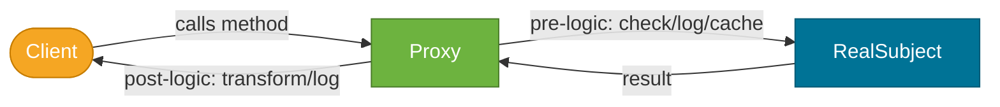
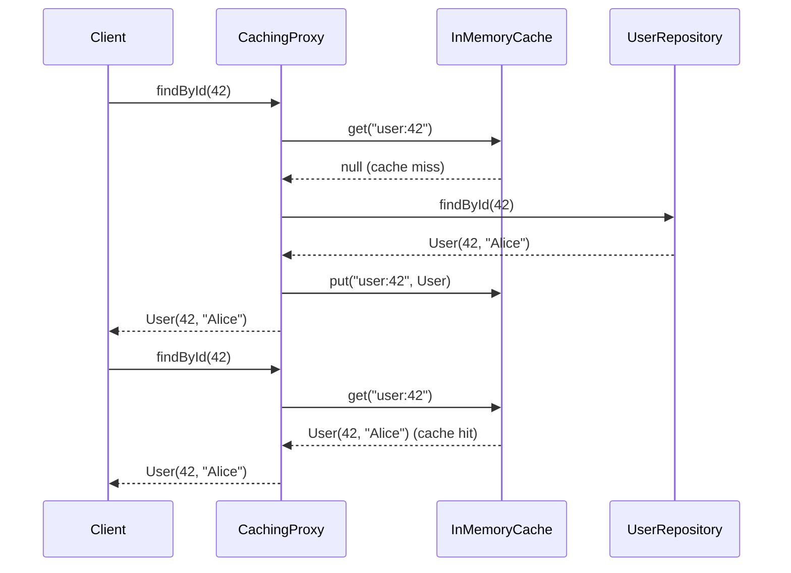
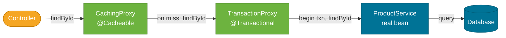

# Proxy Pattern

> A structural design pattern that provides a **surrogate or placeholder** for another object, controlling access to it — adding logic such as security checks, caching, or logging without modifying the real object.

## What Problem Does It Solve?

You have a `UserService` that fetches users from a database. Several problems arise:

1. **Performance** — the same user is fetched from the DB on every call; you want to cache the result.
2. **Authorization** — only admins should call `deleteUser()`; you don't want to mix security code into business logic.
3. **Lazy initialization** — you have a heavy object that's expensive to create; you don't want to create it until it's actually used.
4. **Remote access** — the service lives on a different machine; local code needs to call it through a network stub.

In all four cases, modifying `UserService` itself would mix concerns: business logic + caching, business logic + auth. You need a wrapper that intercepts calls to `UserService` and adds the cross-cutting concern — without the client or `UserService` knowing.

That wrapper is the Proxy.

## What Is It?

The Proxy pattern has three participants:

| Role | Description |
|------|-------------|
| **Subject** | The interface that both the real object and proxy implement |
| **RealSubject** | The actual implementation that does the real work |
| **Proxy** | Implements `Subject`, holds a reference to `RealSubject`, intercepts calls and adds pre/post logic |

**Four Proxy sub-types:**

| Type | What it does | Java example |
|------|-------------|--------------|
| **Virtual Proxy** | Defers creation of an expensive object until first use | Hibernate lazy-loaded entity relations |
| **Protection Proxy** | Adds access control checks | Spring Security AOP |
| **Caching Proxy** | Caches results of expensive operations | Spring `@Cacheable` |
| **Remote Proxy** | Represents a remote object locally | RMI stubs, REST client interfaces |

## How It Works


*Client calls the Proxy as if it were the RealSubject — same interface. The Proxy intercepts, adds logic, delegates to RealSubject, then post-processes.*


*Caching Proxy: first call goes to the real repository and populates the cache; second call returns from cache without touching the DB.*

## Code Examples

:::tip Practical Demo
See [Proxy Pattern Demo](./demo/proxy-pattern-demo.md) for runnable examples: manual caching/logging proxies, JDK dynamic proxy, protection proxy, and Spring `@Cacheable`/AOP examples.
:::

### Manual Proxy — Caching Proxy

```java
// ── Subject interface ─────────────────────────────────────────────────
public interface UserRepository {
    User findById(long id);
    void save(User user);
}

// ── Real Subject ──────────────────────────────────────────────────────
@Repository
public class JpaUserRepository implements UserRepository {
    @PersistenceContext EntityManager em;

    public User findById(long id) {
        return em.find(User.class, id); // ← hits the database
    }
    public void save(User user) { em.persist(user); }
}

// ── Caching Proxy ─────────────────────────────────────────────────────
public class CachingUserRepository implements UserRepository { // ← same interface

    private final UserRepository real;                         // ← wraps real subject
    private final Map<Long, User> cache = new ConcurrentHashMap<>();

    public CachingUserRepository(UserRepository real) {
        this.real = real;
    }

    @Override
    public User findById(long id) {
        return cache.computeIfAbsent(id, real::findById); // ← cache-aside: miss → delegate
    }

    @Override
    public void save(User user) {
        real.save(user);
        cache.put(user.getId(), user); // ← keep cache consistent after write
    }
}
```

### Java Dynamic Proxy (`java.lang.reflect.Proxy`)

```java
// Creates a proxy at RUNTIME — no explicit proxy class needed
UserRepository proxy = (UserRepository) Proxy.newProxyInstance(
    UserRepository.class.getClassLoader(),
    new Class<?>[]{ UserRepository.class }, // ← interfaces to implement
    (proxyObj, method, args) -> {            // ← InvocationHandler — intercepts all calls
        System.out.println("[LOG] Calling: " + method.getName() + " with " + Arrays.toString(args));
        long start = System.nanoTime();
        Object result = method.invoke(realRepo, args);         // ← delegate to real object
        long duration = System.nanoTime() - start;
        System.out.println("[LOG] Completed in " + duration + " ns");
        return result;
    }
);

proxy.findById(42); // ← triggers InvocationHandler; real method is called internally
```

:::info
`java.lang.reflect.Proxy` works **only with interfaces**. For class-based proxying, use CGLIB (which Spring falls back to when no interface is available).
:::

### Spring AOP — Proxy at Spring's Core

Spring AOP wraps every `@Service`, `@Repository`, and `@Component` bean in a **JDK dynamic proxy** or **CGLIB proxy** automatically when aspects (like `@Transactional` or `@Cacheable`) are applied.

```java
@Service
public class ProductService {

    @Cacheable("products")            // ← Spring wraps this bean in a Caching Proxy
    public Product findById(Long id) {
        return productRepository.findById(id).orElseThrow();
    }

    @Transactional                    // ← Spring wraps this in a Transaction Proxy
    public Product save(Product product) {
        return productRepository.save(product);
    }
}
```


*Spring wraps the ProductService bean in proxy layers — one per aspect. Each proxy adds its concern (caching, transaction) and delegates. The real bean never knows it's wrapped.*

### Protection Proxy — Authorization Check

```java
public class SecureUserRepository implements UserRepository {

    private final UserRepository delegate;
    private final SecurityContext security;

    public SecureUserRepository(UserRepository delegate, SecurityContext security) {
        this.delegate = delegate;
        this.security = security;
    }

    @Override
    public User findById(long id) {
        // Pre-check: only authenticated users
        if (!security.isAuthenticated()) {
            throw new AccessDeniedException("Not authenticated");
        }
        return delegate.findById(id);
    }

    @Override
    public void save(User user) {
        // Pre-check: only ADMIN can save
        if (!security.hasRole("ADMIN")) {
            throw new AccessDeniedException("Admin required");
        }
        delegate.save(user);
    }
}
```

## Trade-offs & When To Use / Avoid

| | Pros | Cons |
|--|------|------|
| **Static Proxy** | Simple, type-safe, easy to debug | One proxy class per interface — boilerplate |
| **Dynamic Proxy** | No boilerplate — one `InvocationHandler` for all methods | Reflection overhead; works only on interfaces (JDK proxy); harder to read/debug stack traces |
| **CGLIB Proxy** | Works on classes without interfaces | Creates a subclass — `final` classes and methods can't be proxied |

**When to use:**
- Cross-cutting concerns: logging, security, caching, transactions, retry logic.
- Lazy initialization of heavy objects.
- Remote service stubs (Feign clients in Spring Cloud are Remote Proxies).

**When to avoid:**
- When concerns can be addressed in the subject directly without mixing responsibilities.
- Performance-critical code tight on every nanosecond — dynamic proxy reflection has overhead.

## Common Pitfalls

- **`this.method()` bypasses the proxy** — the most common Spring bug. If `ServiceA.methodA()` calls `this.methodB()` (which is `@Transactional`), the transaction proxy is bypassed because `this` is the real bean, not the proxy. Always inject the bean through the proxy (self-inject or use `@Autowired` on a field).
- **Proxying `final` classes or methods** — CGLIB cannot subclass `final` classes or override `final` methods. Spring will throw an error at startup.
- **Confusing Proxy and Decorator** — structurally identical (both wrap an interface). Intent differs: Decorator adds behavior; Proxy controls access. In practice, Spring's AOP proxies often do both.
- **Stack trace noise** — proxy stack frames (CGLIB, `$Proxy0`) appear in stack traces, making debugging harder. Look for the `invoke()` frame to find where the real call starts.

## Interview Questions

### Beginner

**Q:** What is the Proxy pattern?
**A:** It provides a surrogate object that implements the same interface as the real object. The proxy intercepts method calls and can add logic (logging, caching, auth checks) before or after delegating to the real object.

**Q:** What is the difference between a static proxy and a dynamic proxy in Java?
**A:** A static proxy is a hand-written class that implements the subject interface and wraps the real object — one class per interface. A dynamic proxy (`java.lang.reflect.Proxy`) is generated at runtime from an `InvocationHandler`, so one handler can proxy any interface without a new class per interface.

### Intermediate

**Q:** How does Spring use the Proxy pattern for `@Transactional`?
**A:** When a bean has `@Transactional` methods, Spring wraps it in a proxy (JDK dynamic proxy or CGLIB). When a caller invokes a `@Transactional` method on the proxy, the proxy intercepts the call, begins a transaction, invokes the real method, and commits or rolls back the transaction on completion.

**Q:** Why does calling a `@Transactional` method from within the same class not start a new transaction?
**A:** Because the call goes to `this` (the real bean object), not through the Spring proxy. The transaction proxy only intercepts external calls through the proxy reference. Intra-class `this.method()` calls bypass the proxy entirely.

### Advanced

**Q:** Compare CGLIB proxying to JDK dynamic proxying in Spring. When does Spring use each?
**A:** JDK dynamic proxy requires the bean to implement at least one interface — it creates a proxy that implements those interfaces. CGLIB creates a subclass of the target class at runtime, so it works even without interfaces. Spring uses JDK proxy when an interface is present (by default or with `proxyTargetClass=false`), and falls back to CGLIB when there's no interface or when `proxyTargetClass=true` is set. Spring Boot defaults to CGLIB proxy for `@Repository` and `@Service` even when interfaces exist (changed in Boot 2.x).

**Follow-up:** What constraint does CGLIB impose on bean classes?
**A:** The class and any proxied methods must not be `final`. CGLIB generates a subclass and overrides the methods to inject advice — `final` prevents this. Also, a no-arg constructor is required unless using objenesis (Spring Boot includes it).

## Further Reading

- [Proxy Pattern — Refactoring Guru](https://refactoring.guru/design-patterns/proxy) — illustrated subtypes with Java examples
- [JDK Dynamic Proxies — Baeldung](https://www.baeldung.com/java-dynamic-proxies) — hands-on `InvocationHandler` walkthrough
- [Spring AOP Proxying Mechanisms](https://docs.spring.io/spring-framework/reference/core/aop-api.html) — official Spring docs on JDK vs CGLIB proxy

## Related Notes

- [Decorator Pattern](./decorator-pattern.md) — structurally identical to Proxy; Decorator adds behavior while Proxy controls access. The distinction is intent.
- [Adapter Pattern](./adapter-pattern.md) — another wrapper, but changes the interface; Proxy keeps the same interface.
- [Facade Pattern](./facade-pattern.md) — Facade wraps multiple objects into one simplified interface; Proxy wraps one object to control or enrich access to it.
