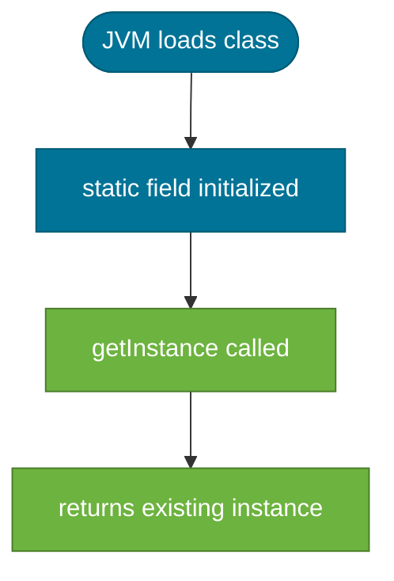
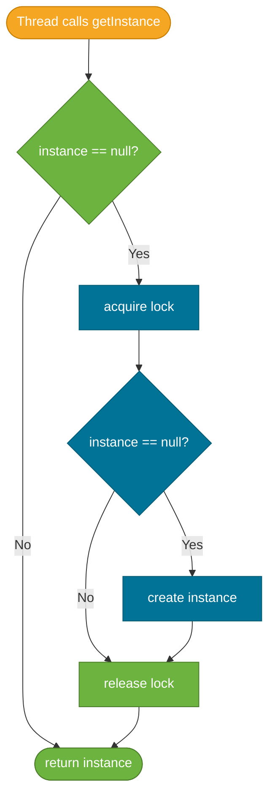

# Singleton Pattern

> A creational design pattern that restricts instantiation of a class to a single object, with a global access point to that instance.

## What Problem Does It Solve?

Some resources in an application must exist as exactly one object — a database connection pool, an application configuration holder, a logging service, or a thread pool. If you allow multiple instances of these classes to be created, you risk:

- **Inconsistent state**: Two configuration objects with different values, each used by different parts of the app.
- **Resource waste**: Spawning hundreds of connection pool instances instead of one shared one.
- **Race conditions**: Multiple threads writing to different instances of what should be one shared registry.

The Singleton pattern solves this by making the class itself responsible for ensuring only one instance is ever created.

## What Is It?

The Singleton pattern is a **creational design pattern** with two rules:

1. **One instance** — the class controls its own instantiation and prevents external code from creating new instances (private constructor).
2. **Global access** — the class provides a static method that returns the single instance.

```
┌────────────────────────────────┐
│          Singleton             │
│  - instance: Singleton         │  ← static field holds the one instance
│  - Singleton()                 │  ← private constructor
│  + getInstance(): Singleton    │  ← public static accessor
│  + doSomething(): void         │
└────────────────────────────────┘
```

## How It Works

There are four common Java implementations, each with different trade-offs around thread-safety and lazy loading.

### 1. Eager Initialization

The instance is created when the class is loaded by the JVM. Simple and thread-safe because class loading is atomic.


*Eager initialization: the instance is created at class load time — no synchronization needed.*

### 2. Lazy Initialization with Double-Checked Locking

The instance is created only when first requested. Uses `volatile` and `synchronized` to guarantee correctness under concurrent access.


*Double-checked locking: synchronization only happens on first creation, avoiding lock contention on every subsequent call.*

### 3. Initialization-on-Demand Holder (Bill Pugh Idiom)

Uses a private static inner class to hold the instance. The inner class is not loaded until `getInstance()` is called, guaranteeing lazy initialization without synchronization.

### 4. Enum Singleton (Effective Java Item 3)

Leverages the JVM guarantee that enum values are instantiated exactly once. Bullet-proof against reflection and serialization attacks.

## Code Examples

:::tip Practical Demo
See [Singleton Pattern Demo](./demo/singleton-pattern-demo.md) for runnable examples: eager init, holder idiom, enum singleton, thread-safety test, and Spring `@Component` usage.
:::

### Eager Initialization

```java
public final class AppConfig {

    // created when class loads — thread-safe by JVM guarantee
    private static final AppConfig INSTANCE = new AppConfig(); // ← eager

    private final String dbUrl;

    private AppConfig() {  // ← private constructor prevents new AppConfig()
        this.dbUrl = System.getenv("DB_URL");
    }

    public static AppConfig getInstance() {
        return INSTANCE;
    }

    public String getDbUrl() { return dbUrl; }
}
```

### Double-Checked Locking

```java
public final class ConnectionPool {

    private static volatile ConnectionPool instance; // ← volatile is REQUIRED

    private ConnectionPool() {}

    public static ConnectionPool getInstance() {
        if (instance == null) {                       // ← first check (no lock)
            synchronized (ConnectionPool.class) {
                if (instance == null) {               // ← second check (inside lock)
                    instance = new ConnectionPool();  // ← safe publication via volatile
                }
            }
        }
        return instance;
    }
}
```

:::warning
Omitting `volatile` causes a subtle bug: another thread may see a partially constructed object because the JVM may reorder the write to `instance` before the constructor finishes.
:::

### Initialization-on-Demand Holder (Recommended for lazy loading)

```java
public final class Registry {

    private Registry() {}

    // inner class loaded only when getInstance() is first called
    private static final class Holder {
        static final Registry INSTANCE = new Registry(); // ← class load is atomic
    }

    public static Registry getInstance() {
        return Holder.INSTANCE;
    }
}
```

This idiom is lazy, thread-safe, and requires no synchronization in `getInstance()`. It is the preferred approach when lazy loading is needed.

### Enum Singleton (Most Robust)

```java
public enum DatabaseManager {
    INSTANCE;                       // ← JVM guarantees exactly one instance

    private final DataSource ds;

    DatabaseManager() {
        ds = buildDataSource();     // ← constructor runs once
    }

    public Connection getConnection() throws SQLException {
        return ds.getConnection();
    }
}

// Usage
DatabaseManager.INSTANCE.getConnection();
```

:::tip
Josh Bloch's *Effective Java* recommends the **Enum singleton** as the best Singleton implementation because it handles serialization and reflection automatically. Use the **Holder idiom** when you need a traditional class.
:::

## Trade-offs & When To Use / Avoid

| | Pros | Cons |
|--|------|------|
| **Eager** | Simple, thread-safe, fast access | Instance created even if never used; slows startup if heavy |
| **Double-checked locking** | Lazy, thread-safe | Complex, error-prone (`volatile` easy to forget) |
| **Holder idiom** | Lazy, thread-safe, no synchronization overhead | Slightly less obvious to readers unfamiliar with idiom |
| **Enum singleton** | Lazy-ish, reflection-safe, serialization-safe | Can't extend a class; looks unusual to some |

**When to use Singleton:**
- Shared, expensive-to-create resource: connection pools, thread pools, caches.
- Application-wide configuration accessed throughout the codebase.
- A stateless service utility like a metrics recorder or event bus.

**When to avoid:**
- When the "global" instance makes unit testing harder — prefer dependency injection instead.
- When the object holds mutable state shared across threads without synchronization — global mutable state is a design smell.
- In Spring applications: let the IoC container manage singleton scope (`@Bean` or `@Component` are singleton-scoped by default); avoid hand-rolled Singletons inside Spring beans.

## Common Pitfalls

- **Forgetting `volatile`** in double-checked locking — the most common threading bug. Without it, the JVM may publish an incompletely constructed object.
- **Reflection breaks it** — `Constructor.setAccessible(true)` bypasses the private constructor in all implementations except Enum. Add a guard in the constructor:
  ```java
  private AppConfig() {
      if (INSTANCE != null) throw new IllegalStateException("Already instantiated");
  }
  ```
- **Serialization breaks it** — deserializing a Singleton creates a new instance. Add `readResolve()` or use Enum.
- **Multiple ClassLoaders** — each ClassLoader gets its own class representation, so the "one instance" guarantee doesn't hold across ClassLoader boundaries (relevant in Java EE app servers).
- **Global state makes tests brittle** — tests that share a Singleton state can bleed state into each other. Use DI frameworks or reset mechanisms in tests.

## Interview Questions

### Beginner

**Q:** What is the Singleton pattern and when would you use it?
**A:** Singleton ensures a class has exactly one instance with a global access point. You'd use it for shared resources like a database connection pool, application config, or logger — things that should exist once per JVM.

**Q:** How do you implement a thread-safe Singleton in Java?
**A:** The simplest thread-safe approaches are eager initialization (static final field initialized at class load), the Initialization-on-Demand Holder idiom, or an Enum singleton. Double-checked locking also works but requires `volatile` on the instance field.

### Intermediate

**Q:** Why is `volatile` required in double-checked locking?
**A:** Without `volatile`, the JVM's memory model allows instruction reordering: the write to the `instance` reference can be made visible to other threads before the constructor finishes. Another thread then sees a non-null but partially initialized object. `volatile` establishes a *happens-before* relationship that prevents this reordering.

**Q:** Why does the Enum singleton resist reflection attacks?
**A:** The JVM explicitly forbids reflective instantiation of enum types — `java.lang.reflect.Constructor.newInstance()` throws an `IllegalArgumentException` for enums. This is enforced at the JVM level, not in application code.

### Advanced

**Q:** How does the Initialization-on-Demand Holder idiom guarantee lazy, thread-safe initialization without synchronized blocks?
**A:** The holder idiom relies on the JLS guarantee that a class is initialized at most once and that this initialization is atomic. The `Holder` inner class is not loaded until `Holder.INSTANCE` is first accessed (inside `getInstance()`). Class initialization is serialized by the JVM's class-loading lock, so multiple threads racing to call`getInstance()` for the first time will only create one instance. No explicit synchronization is needed in application code.

**Follow-up:** What are the ClassLoader-based limitations of the Singleton pattern?
**A:** In environments with multiple ClassLoaders (OSGi, Java EE application servers, some plugin frameworks), each ClassLoader defines its own class, so the same `Singleton.class` can be loaded multiple times. Each loaded class has its own `static` fields, creating multiple "singletons." The solution is to ensure all components share the same ClassLoader for that class, or use an external registry (like JNDI or Spring's ApplicationContext).

## Further Reading

- [Singleton Pattern — Refactoring Guru](https://refactoring.guru/design-patterns/singleton) — illustrated walkthrough with Java code examples
- [Item 3: Enforce the singleton property with a private constructor or an enum type — Effective Java](https://www.baeldung.com/java-singleton) — Baeldung summary of Effective Java's singleton recommendations
- [JLS §12.4 — Initialization of a class](https://docs.oracle.com/javase/specs/jls/se21/html/jls-12.html#jls-12.4) — the JVM specification that underlies the Holder idiom's correctness

## Related Notes

- [Builder Pattern](./builder-pattern.md) — another creational pattern; often paired with Singleton when building configuration objects.
- [Factory Method Pattern](./factory-method-pattern.md) — creational patterns are often contrasted with Singleton; Factory creates multiple objects while Singleton controls to exactly one.
- [OOP — Classes and Objects](../oops/classes-and-objects.md) — Singleton manipulates Java's instantiation mechanism; a solid understanding of constructors and static members is prerequisite.
